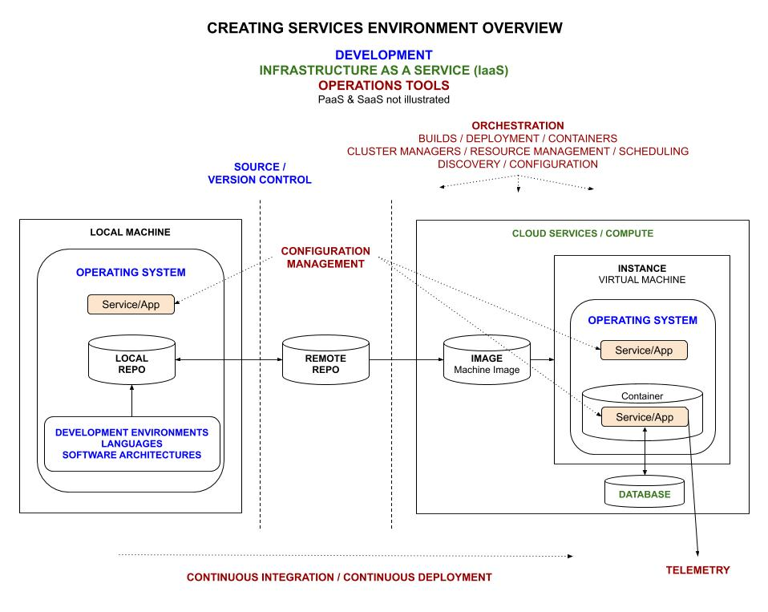
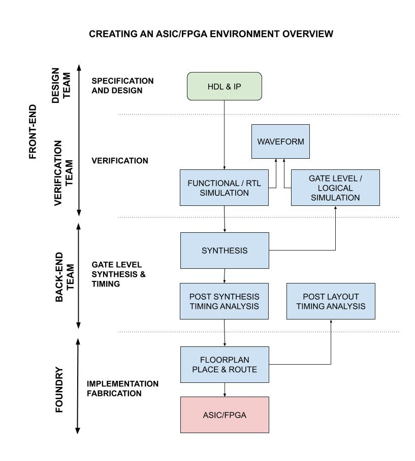

# MY CHEAT SHEETS

_A place to keep all my cheat sheets
for the complete development of
ASIC/FPGA hardware or a software app/service.
These cheat sheets contain info I gathered from other sources and
figured out over time. It's an ongoing process._

Table of Contents,

* **[SOFTWARE CHEAT SHEETS](https://github.com/JeffDeCola/my-cheat-sheets#software-cheat-sheets) -
  _For the goal of creating an App/Service_**
  * [DEVELOPMENT](https://github.com/JeffDeCola/my-cheat-sheets#development)
    * DEVELOPMENT ENVIRONMENTS
    * LANGUAGES
    * OPERATING SYSTEMS
    * SOFTWARE ARCHITECTURES
    * SOURCE / VERSION CONTROL
  * [OPERATIONS TOOLS](https://github.com/JeffDeCola/my-cheat-sheets#operations-tools)
    * CONFIGURATION MANAGEMENT
    * CONTINUOUS INTEGRATION / CONTINUOUS DEPLOYMENT
    * ORCHESTRATION
    * TELEMETRY
  * [SERVICE ARCHITECTURES](https://github.com/JeffDeCola/my-cheat-sheets#service-architectures)
    * OVERVIEW
    * SaaS - SOFTWARE AS A SERVICE
    * FaaS - FUNCTIONS AS A SERVICE
    * PaaS - PLATFORM AS A SERVICE
    * CaaS - CONTAINERS AS A SERVICE
    * IaaS - INFRASTRUCTURE AS A SERVICE
  * [SERVICE PROVIDERS](https://github.com/JeffDeCola/my-cheat-sheets#service-providers)
    * AMAZON AWS
    * GOOGLE GCP
    * MICROSOFT AZURE
* **[HARDWARE CHEAT SHEETS](https://github.com/JeffDeCola/my-cheat-sheets#hardware-cheat-sheets) -
  _For the goal of creating an ASIC/FPGA_**
  * [DEVELOPMENT](https://github.com/JeffDeCola/my-cheat-sheets#development-1)
    * FPGA DEVELOPMENT BOARDS
    * HARDWARE ARCHITECTURES
    * LANGUAGES
  * [TOOLS](https://github.com/JeffDeCola/my-cheat-sheets#tools)
    * SIMULATION
    * SYNTHESIS
    * TIMING
* **[OTHER CHEAT SHEETS](https://github.com/JeffDeCola/my-cheat-sheets#other-cheat-sheets) -
  _Random things I'm interested in_**
* [CONTINUOUS INTEGRATION](https://github.com/JeffDeCola/my-cheat-sheets#continuous-integration)

Documentation and references,

* [Other](https://jeffdecola.github.io/my-cheat-sheets/other-README.md)
  cheat sheets on random things I'm interested in
* my-cheat-sheets
  [github webpage](https://jeffdecola.github.io/my-cheat-sheets/)
  _built with
  [concourse](https://github.com/JeffDeCola/my-cheat-sheets/blob/master/ci-README.md)_

## SOFTWARE CHEAT SHEETS

Various Apps and tools for the goal of creating an App/Service.

### DEVELOPMENT

* DEVELOPMENT ENVIRONMENTS

  * [software install methods](https://github.com/JeffDeCola/my-cheat-sheets/tree/master/software/development/development-environments/software-install-methods-cheat-sheet)
  * [vagrant](https://github.com/JeffDeCola/my-cheat-sheets/tree/master/software/development/development-environments/vagrant-cheat-sheet)
    ([my-vagrant-boxes](https://github.com/JeffDeCola/my-vagrant-boxes))
  * [virtualbox](https://github.com/JeffDeCola/my-cheat-sheets/tree/master/software/development/development-environments/virtualbox-cheat-sheet)
  * [visual studio code](https://github.com/JeffDeCola/my-cheat-sheets/tree/master/software/development/development-environments/visual-studio-code-cheat-sheet)
    * [verilog-HDL extension](https://github.com/JeffDeCola/my-cheat-sheets/tree/master/software/development/development-environments/visual-studio-code-cheat-sheet/verilog-hdl-extension.md)

* LANGUAGES

  * [go](https://github.com/JeffDeCola/my-cheat-sheets/tree/master/software/development/languages/go-cheat-sheet),
    [go tools](https://github.com/JeffDeCola/my-cheat-sheets/tree/master/software/development/languages/go-tools-cheat-sheet)
    ([my-go-examples](https://github.com/JeffDeCola/my-go-examples),
    [my-go-packages](https://github.com/JeffDeCola/my-go-packages),
    [my-go-tools](https://github.com/JeffDeCola/my-go-tools))
  * [LaTeX](https://github.com/JeffDeCola/my-cheat-sheets/tree/master/software/development/languages/latex-cheat-sheet)
    * [LaTeX math mode](https://github.com/JeffDeCola/my-cheat-sheets/tree/master/software/development/languages/latex-cheat-sheet/latex-math-mode.md)
    * [LaTeX graphs](https://github.com/JeffDeCola/my-cheat-sheets/tree/master/software/development/languages/latex-cheat-sheet/latex-graphs.md)
      ([my-latex-graphs](https://github.com/JeffDeCola/my-latex-graphs))
  * [python](https://github.com/JeffDeCola/my-cheat-sheets/tree/master/software/development/languages/python-cheat-sheet)
    ([my-python-examples](https://github.com/JeffDeCola/my-python-examples))
  * [php](https://github.com/JeffDeCola/my-cheat-sheets/tree/master/software/development/languages/php-cheat-sheet)
    ([my-php-containers](https://github.com/JeffDeCola/my-php-containers))

* OPERATING SYSTEMS

  * LINUX
    ([my-linux-shell-scripts](https://github.com/JeffDeCola/my-linux-shell-scripts))

    * [common commands](https://github.com/JeffDeCola/my-cheat-sheets/tree/master/software/development/operating-systems/linux/common-commands-cheat-sheet)
    * [dns](https://github.com/JeffDeCola/my-cheat-sheets/tree/master/software/development/operating-systems/linux/dns-cheat-sheet),
      [create dns server using bind](https://github.com/JeffDeCola/my-cheat-sheets/tree/master/software/development/operating-systems/linux/dns-cheat-sheet/create-dns-server-using-bind.md)
    * [dual-boot-ubuntu-and-windows](https://github.com/JeffDeCola/my-cheat-sheets/tree/master/software/development/operating-systems/linux/dual-boot-ubuntu-and-windows)
    * [fonts](https://github.com/JeffDeCola/my-cheat-sheets/tree/master/software/development/operating-systems/linux/fonts-cheat-sheet)
    * [init SysV script](https://github.com/JeffDeCola/my-cheat-sheets/tree/master/software/development/operating-systems/linux/init-sysv-script-cheat-sheet)
    * [LS_COLORS](https://github.com/JeffDeCola/my-cheat-sheets/tree/master/software/development/operating-systems/linux/ls_colors-cheat-sheet)
    * [network device configuration](https://github.com/JeffDeCola/my-cheat-sheets/tree/master/software/development/operating-systems/linux/network-device-configuration-cheat-sheet)
    * [redirect output](https://github.com/JeffDeCola/my-cheat-sheets/tree/master/software/development/operating-systems/linux/redirect-output-cheat-sheet)
    * [ssh and keys](https://github.com/JeffDeCola/my-cheat-sheets/tree/master/software/development/operating-systems/linux/ssh-and-keys-cheat-sheet)
    * [systemd](https://github.com/JeffDeCola/my-cheat-sheets/tree/master/software/development/operating-systems/linux/systemd-cheat-sheet)

  * LINUX DISTRIBUTIONS

    * _coming soon_

  * MAC OS

    * [launchd](https://github.com/JeffDeCola/my-cheat-sheets/tree/master/software/development/operating-systems/macos/launchd-cheat-sheet)
    * [LSCOLORS](https://github.com/JeffDeCola/my-cheat-sheets/tree/master/software/development/operating-systems/macos/lscolors-cheat-sheet)

  * WINDOWS

    * [wsl (bash on ubuntu on windows)](https://github.com/JeffDeCola/my-cheat-sheets/tree/master/software/development/operating-systems/windows/wsl-bash-on-ubuntu-on-windows-cheat-sheet)

* SOFTWARE ARCHITECTURES

  * API

    * [RESTful](https://github.com/JeffDeCola/my-cheat-sheets/tree/master/software/development/software-architectures/api/RESTful-cheat-sheet)
      ([RESTful-API-test](https://github.com/JeffDeCola/RESTful-API-test))
    * [youtube content id api](https://github.com/JeffDeCola/my-cheat-sheets/tree/master/software/development/software-architectures/api/youtube-content-id-api-cheat-sheet)
    * [youtube data api v3](https://github.com/JeffDeCola/my-cheat-sheets/tree/master/software/development/software-architectures/api/youtube-data-api-v3-cheat-sheet)
    * [youtube player api](https://github.com/JeffDeCola/my-cheat-sheets/tree/master/software/development/software-architectures/api/youtube-player-api-cheat-sheet)

  * AUTHORIZATION

    * [OAuth 2.0 authorization](https://github.com/JeffDeCola/my-cheat-sheets/tree/master/software/development/software-architectures/authorization/OAuth-2.0-authorization-cheat-sheet)
  
  * BLOCKCHAIN

    * [blockchain](https://github.com/JeffDeCola/my-cheat-sheets/tree/master/software/development/software-architectures/blockchain/blockchain-cheat-sheet)

  * CRYPTOGRAPHY

    * [asymmetric-cryptography](https://github.com/JeffDeCola/my-cheat-sheets/tree/master/software/development/software-architectures/cryptography/asymmetric-cryptography-cheat-sheet)
    * [hashing](https://github.com/JeffDeCola/my-cheat-sheets/tree/master/software/development/software-architectures/cryptography/hashing-cheat-sheet)
    * [symmetric-cryptography](https://github.com/JeffDeCola/my-cheat-sheets/tree/master/software/development/software-architectures/cryptography/symmetric-cryptography-cheat-sheet)

  * DATABASE

    * [postgreSQL](https://github.com/JeffDeCola/my-cheat-sheets/tree/master/software/development/software-architectures/database/postgresql-cheat-sheet)
    * [redis](https://github.com/JeffDeCola/my-cheat-sheets/tree/master/software/development/software-architectures/database/redis-cheat-sheet)
    * [relational vs non-relational](https://github.com/JeffDeCola/my-cheat-sheets/tree/master/software/development/software-architectures/database/relational-versus-non-relational-cheat-sheet)

  * MESSAGING

    * [NATS](https://github.com/JeffDeCola/my-cheat-sheets/tree/master/software/development/software-architectures/messaging/NATS-cheat-sheet)
    * [protobuf](https://github.com/JeffDeCola/my-cheat-sheets/tree/master/software/development/software-architectures/messaging/protobuf-cheat-sheet)

  * MICROSERVICES

    * [microservices](https://github.com/JeffDeCola/my-cheat-sheets/tree/master/software/development/software-architectures/microservices/microservices-cheat-sheet)
      ([catch-microservice](https://github.com/JeffDeCola/catch-microservice),
      [data-crunch-engine](https://github.com/JeffDeCola/data-crunch-engine))

* SOURCE / VERSION CONTROL

  * [git](https://github.com/JeffDeCola/my-cheat-sheets/tree/master/software/development/source-version-control/git-cheat-sheet)

### OPERATIONS TOOLS

* CONFIGURATION MANAGEMENT

  * [ansible](https://github.com/JeffDeCola/my-cheat-sheets/tree/master/software/operations-tools/configuration-management/ansible-cheat-sheet)

* CONTINUOUS INTEGRATION / CONTINUOUS DEPLOYMENT

  * [concourse](https://github.com/JeffDeCola/my-cheat-sheets/tree/master/software/operations-tools/continuous-integration-continuous-deployment/concourse-cheat-sheet)
    ([my-concourse-ci-tasks](https://github.com/JeffDeCola/my-concourse-ci-tasks))

* ORCHESTRATION

  * BUILDS / DEPLOYMENT / CONTAINERS

    * [docker](https://github.com/JeffDeCola/my-cheat-sheets/tree/master/software/operations-tools/orchestration/builds-deployment-containers/docker-cheat-sheet)
      ([my-docker-image-builds](https://github.com/JeffDeCola/my-docker-image-builds))
    * [packer](https://github.com/JeffDeCola/my-cheat-sheets/tree/master/software/operations-tools/orchestration/builds-deployment-containers/packer-cheat-sheet)
      ([my-packer-image-builds](https://github.com/JeffDeCola/my-packer-image-builds))
    * [terraform](https://github.com/JeffDeCola/my-cheat-sheets/tree/master/software/operations-tools/orchestration/builds-deployment-containers/terraform-cheat-sheet)

  * CLUSTER MANAGERS / RESOURCE MANAGEMENT / SCHEDULING

    * [kubernetes](https://github.com/JeffDeCola/my-cheat-sheets/tree/master/software/operations-tools/orchestration/cluster-managers-resource-management-scheduling/kubernetes-cheat-sheet)
    * [marathon](https://github.com/JeffDeCola/my-cheat-sheets/tree/master/software/operations-tools/orchestration/cluster-managers-resource-management-scheduling/marathon-cheat-sheet)
      ([hello-go-deploy-marathon](https://github.com/JeffDeCola/hello-go-deploy-marathon))
    * [mesos](https://github.com/JeffDeCola/my-cheat-sheets/tree/master/software/operations-tools/orchestration/cluster-managers-resource-management-scheduling/mesos-cheat-sheet)

  * DISCOVERY / CONFIGURATION

    * [consul](https://github.com/JeffDeCola/my-cheat-sheets/tree/master/software/operations-tools/orchestration/discovery-configuration/consul-cheat-sheet)

* TELEMETRY

  * [grafana](https://github.com/JeffDeCola/my-cheat-sheets/tree/master/software/operations-tools/telemetry/grafana-cheat-sheet)
  * [stackdriver](https://github.com/JeffDeCola/my-cheat-sheets/tree/master/software/operations-tools/telemetry/stackdriver-cheat-sheet)

### SERVICE ARCHITECTURES

* OVERVIEW

  * [overview of service architectures](https://github.com/JeffDeCola/my-cheat-sheets/tree/master/software/service-architectures/overview/overview-of-service-architectures-cheat-sheet)

* SaaS - SOFTWARE AS A SERVICE

  * CONTENT MANAGEMENT

    * [multi-vendor marketplace](https://github.com/JeffDeCola/my-cheat-sheets/tree/master/software/service-architectures/software-as-a-service/content-management/multi-vendor-marketplace-cheat-sheet)
    * [multi-vendor multi-store](https://github.com/JeffDeCola/my-cheat-sheets/tree/master/software/service-architectures/software-as-a-service/content-management/multi-vendor-multi-store-cheat-sheet)
    * [single-vendor single-store](https://github.com/JeffDeCola/my-cheat-sheets/tree/master/software/service-architectures/software-as-a-service/content-management/single-vendor-single-store-cheat-sheet)
    * [wordpress](https://github.com/JeffDeCola/my-cheat-sheets/tree/master/software/service-architectures/software-as-a-service/content-management/wordpress-cheat-sheet)

  * COMMUNICATIONS

    * [keybase](https://github.com/JeffDeCola/my-cheat-sheets/tree/master/software/service-architectures/software-as-a-service/communications/keybase-cheat-sheet)
    * [slack](https://github.com/JeffDeCola/my-cheat-sheets/tree/master/software/service-architectures/software-as-a-service/communications/slack-cheat-sheet)

* FaaS - FUNCTION AS A SERVICE

  * [aws lambda](https://github.com/JeffDeCola/my-cheat-sheets/tree/master/software/service-architectures/function-as-a-service/aws-lambda-cheat-sheet)
    (_hello-go-deploy-aws-lambda repo coming soon_)
  * [google cloud functions (gcf)](https://github.com/JeffDeCola/my-cheat-sheets/tree/master/software/service-architectures/function-as-a-service/google-cloud-functions-cheat-sheet)
    (_hello-go-deploy-gcf repo coming soon_)
  * [microsoft azure functions](https://github.com/JeffDeCola/my-cheat-sheets/tree/master/software/service-architectures/function-as-a-service/microsoft-azure-functions-cheat-sheet)
    (_hello-go-deploy-azure-functions repo coming soon_)

* PaaS - PLATFORM AS A SERVICE

  * [aws elastic beanstalk](https://github.com/JeffDeCola/my-cheat-sheets/tree/master/software/service-architectures/platform-as-a-service/aws-elastic-beanstalk-cheat-sheet)
    ([hello-go-deploy-aws-elastic-beanstalk](https://github.com/JeffDeCola/hello-go-deploy-aws-elastic-beanstalk))
  * [google app engine (gae)](https://github.com/JeffDeCola/my-cheat-sheets/tree/master/software/service-architectures/platform-as-a-service/google-app-engine-cheat-sheet)
    ([hello-go-deploy-gae](https://github.com/JeffDeCola/hello-go-deploy-gae))
  * [microsoft azure app service](https://github.com/JeffDeCola/my-cheat-sheets/tree/master/software/service-architectures/platform-as-a-service/microsoft-azure-app-service-cheat-sheet)
    ([hello-go-deploy-azure-app-service](https://github.com/JeffDeCola/hello-go-deploy-azure-app-service))

* CaaS - CONTAINERS AS A SERVICE

  * [amazon elastic container service (ecs)](https://github.com/JeffDeCola/my-cheat-sheets/tree/master/software/service-architectures/containers-as-a-service/amazon-elastic-container-service-cheat-sheet)
    ([hello-go-deploy-amazon-ecs](https://github.com/JeffDeCola/hello-go-deploy-amazon-ecs))
  * [amazon elastic container service for kubernetes (eks)](https://github.com/JeffDeCola/my-cheat-sheets/tree/master/software/service-architectures/containers-as-a-service/amazon-elastic-container-service-for-kubernetes-cheat-sheet)
    ([hello-go-deploy-amazon-eks](https://github.com/JeffDeCola/hello-go-deploy-amazon-eks))
  * [google kubernetes engine (gke)](https://github.com/JeffDeCola/my-cheat-sheets/tree/master/software/service-architectures/containers-as-a-service/google-kubernetes-engine-cheat-sheet)
    ([hello-go-deploy-gke](https://github.com/JeffDeCola/hello-go-deploy-gke))
  * [microsoft azure kubernetes service (aks)](https://github.com/JeffDeCola/my-cheat-sheets/tree/master/software/service-architectures/containers-as-a-service/microsoft-azure-kubernetes-service-cheat-sheet)
    ([hello-go-deploy-aks](https://github.com/JeffDeCola/hello-go-deploy-aks))

* IaaS - INFRASTRUCTURE AS A SERVICE

  * [amazon elastic compute cloud (ec2)](https://github.com/JeffDeCola/my-cheat-sheets/tree/master/software/service-architectures/infrastructure-as-a-service/amazon-elastic-compute-cloud-cheat-sheet)
    ([hello-go-deploy-amazon-ec2](https://github.com/JeffDeCola/hello-go-deploy-amazon-ec2))
  * [google compute engine (gce)](https://github.com/JeffDeCola/my-cheat-sheets/tree/master/software/service-architectures/infrastructure-as-a-service/google-compute-engine-cheat-sheet)
    ([hello-go-deploy-gce](https://github.com/JeffDeCola/hello-go-deploy-gce))
  * [microsoft azure virtual machines (vm)](https://github.com/JeffDeCola/my-cheat-sheets/tree/master/software/service-architectures/infrastructure-as-a-service/microsoft-azure-virtual-machines-cheat-sheet)
    ([hello-go-deploy-azure-vm](https://github.com/JeffDeCola/hello-go-deploy-azure-vm))

### SERVICE PROVIDERS

* [amazon web services (aws)](https://github.com/JeffDeCola/my-cheat-sheets/tree/master/software/service-providers/amazon-web-services-cheat-sheet)
* [google cloud platform (gcp)](https://github.com/JeffDeCola/my-cheat-sheets/tree/master/software/service-providers/google-cloud-platform-cheat-sheet)
  * [google cloud pub/sub](https://github.com/JeffDeCola/my-cheat-sheets/tree/master/software/service-providers/google-cloud-platform-cheat-sheet/google-cloud-pub-sub.md)
  * [google cloud spanner](https://github.com/JeffDeCola/my-cheat-sheets/tree/master/software/service-providers/google-cloud-platform-cheat-sheet/google-cloud-spanner.md)
  * [google cloud storage](https://github.com/JeffDeCola/my-cheat-sheets/tree/master/software/service-providers/google-cloud-platform-cheat-sheet/google-cloud-storage.md)
  * [google source repositories (git)](https://github.com/JeffDeCola/my-cheat-sheets/tree/master/software/service-providers/google-cloud-platform-cheat-sheet/google-source-repositories-git.md)
  * [google stackdriver monitoring](https://github.com/JeffDeCola/my-cheat-sheets/tree/master/software/service-providers/google-cloud-platform-cheat-sheet/google-stackdriver-monitoring.md)
* [microsoft azure](https://github.com/JeffDeCola/my-cheat-sheets/tree/master/software/service-providers/microsoft-azure-cheat-sheet)

## HARDWARE CHEAT SHEETS

Various Apps and tools for the goal of creating an ASIC/FPGA.

### DEVELOPMENT

* FPGA DEVELOPMENT BOARDS
  
  * [Digilent ARTY-S7](https://github.com/JeffDeCola/my-cheat-sheets/tree/master/hardware/development/fpga-development-boards/digilent-arty-s7-cheat-sheet)

* HARDWARE ARCHITECTURES

  * [ARM](https://github.com/JeffDeCola/my-cheat-sheets/tree/master/hardware/development/hardware-architectures/arm-cheat-sheet)

* LANGUAGES

  * [SystemVerilog](https://github.com/JeffDeCola/my-cheat-sheets/tree/master/hardware/development/languages/systemverilog-cheat-sheet),
    [VS Code verilog-HDL extension](https://github.com/JeffDeCola/my-cheat-sheets/tree/master/software/development/development-environments/visual-studio-code-cheat-sheet/verilog-hdl-extension.md)
    ([my-systemverilog-examples](https://github.com/JeffDeCola/my-systemverilog-examples))

### TOOLS

* SIMULATION

  * [GTKWave](https://github.com/JeffDeCola/my-cheat-sheets/tree/master/hardware/tools/simulation/gtkwave-cheat-sheet)
  * [iverilog](https://github.com/JeffDeCola/my-cheat-sheets/tree/master/hardware/tools/simulation/iverilog-cheat-sheet)

* SYNTHESIS

  * [Xilinx Vivado](https://github.com/JeffDeCola/my-cheat-sheets/tree/master/hardware/tools/synthesis/xilinx-vivado-cheat-sheet)

* TIMING

  * _coming soon_

## OTHER CHEAT SHEETS

Links to other cheat sheets I'm interested in,

* [HISTORY](https://github.com/JeffDeCola/my-cheat-sheets/blob/master/other-README.md#history)
  * [AMERICAN](https://github.com/JeffDeCola/my-cheat-sheets/blob/master/other-README.md#american)
* [RANDOM THINGS](https://github.com/JeffDeCola/my-cheat-sheets/blob/master/other-README.md#random-things)
* [STEM](https://github.com/JeffDeCola/my-cheat-sheets/blob/master/other-README.md#stem)
  * [ENGINEERING](https://github.com/JeffDeCola/my-cheat-sheets/blob/master/other-README.md#engineering)
  * [MATH](https://github.com/JeffDeCola/my-cheat-sheets/blob/master/other-README.md#math)
    * APPLIED
    * NOTABLE EQUATIONS
    * PURE
  * [SCIENCE](https://github.com/JeffDeCola/my-cheat-sheets/blob/master/other-README.md#science)
    * BIOLOGICAL / LIFE SCIENCE
    * EARTH & SPACE SCIENCE
    * PHYSICAL SCIENCE
  * [TECHNOLOGY](https://github.com/JeffDeCola/my-cheat-sheets/blob/master/other-README.md#technology)
    * COMPUTER HARDWARE
    * COMPUTERS MANUFACTURERS
    * CRYPTOCURRENCY AND MINING
    * NETWORKS
    * SINGLE BOARD COMPUTERS (SBC)

## CONTINUOUS INTEGRATION

Refer to
[ci-README.md](https://github.com/JeffDeCola/my-cheat-sheets/blob/master/ci-README.md)
on how I automated building this repos
[github webpage](https://jeffdecola.github.io/my-cheat-sheets/).
