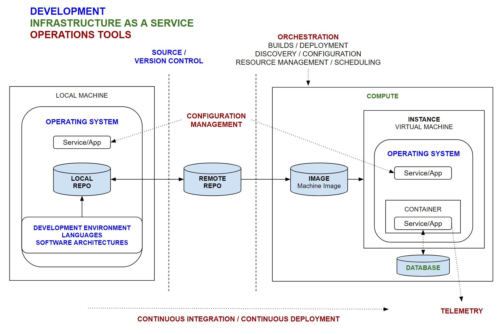
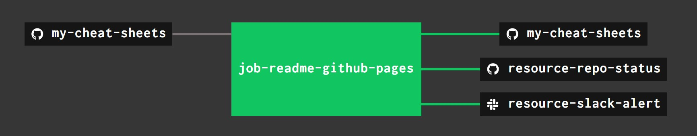

# my-cheat-sheets

`my-cheat-sheets` _is a place to keep all my cheat sheets
on everything you need for the complete development of
ASIC Hardware or a Software service._

The folder structures are organized alphabetically as follows:

* [HARDWARE CHEAT SHEETS](https://github.com/JeffDeCola/my-cheat-sheets#hardware-cheat-sheets)
  for the goal of creating an ASIC.

  * [DEVELOPMENT](https://github.com/JeffDeCola/my-cheat-sheets#development)
  * [TOOLS](https://github.com/JeffDeCola/my-cheat-sheets#tools)

* [SOFTWARE CHEAT SHEETS](https://github.com/JeffDeCola/my-cheat-sheets#software-cheat-sheets)
  for the goal of creating a service.

  * [DEVELOPMENT](https://github.com/JeffDeCola/my-cheat-sheets#development-1)
  * [INFRASTRUCTURE AS A SERVICE (IaaS)](https://github.com/JeffDeCola/my-cheat-sheets#infrastructure-as-a-service-iaas)
  * [OPERATIONS TOOLS](https://github.com/JeffDeCola/my-cheat-sheets#operations-tools)

I also added a new random section for other things I'm interested in:

* [OTHER CHEAT SHEETS](https://github.com/JeffDeCola/my-cheat-sheets#other-cheat-sheets)

  * [COMPUTER HARDWARE](https://github.com/JeffDeCola/my-cheat-sheets#computer-hardware)
  * [NETWORKS](https://github.com/JeffDeCola/my-cheat-sheets#networks)
  * [SINGLE BOARD COMPUTERS (SBC)](https://github.com/JeffDeCola/my-cheat-sheets#single-board-computers-sbc)

These cheat sheets contain info I gathered from other sources and
figured out over time.

View my entire list of cheat sheets on
[my GitHub Webpage](https://jeffdecola.github.io/my-cheat-sheets/).

## HARDWARE CHEAT SHEETS

_Various Apps and tools for the goal of creating an ASIC._

### DEVELOPMENT

* HARDWARE ARCHITECTURES

  * _coming soon_

* LANGUAGES

  * [SystemVerilog](https://github.com/JeffDeCola/my-cheat-sheets/tree/master/hardware/development/languages/systemverilog-cheat-sheet)
    ([my-systemverilog-examples](https://github.com/JeffDeCola/my-systemverilog-examples) Repo)

### TOOLS

* SIMULATION

  * _coming soon_

* SYNTHESIS

  * _coming soon_

* TIMING

  * _coming soon_

## SOFTWARE CHEAT SHEETS

_Various Apps and tools for the goal of creating a service._

### DEVELOPMENT

* DEVELOPMENT ENVIRONMENTS

  * [software install methods](https://github.com/JeffDeCola/my-cheat-sheets/tree/master/software/software/development/development-environments/software-install-methods-cheat-sheet)
  * [vagrant](https://github.com/JeffDeCola/my-cheat-sheets/tree/master/software/development/development-environments/vagrant-cheat-sheet)
  * [virtualbox](https://github.com/JeffDeCola/my-cheat-sheets/tree/master/software/development/development-environments/virtualbox-cheat-sheet)
  * [visual studio code](https://github.com/JeffDeCola/my-cheat-sheets/tree/master/software/development/development-environments/visual-studio-code-cheat-sheet)

* LANGUAGES

  * [go](https://github.com/JeffDeCola/my-cheat-sheets/tree/master/software/development/languages/go-cheat-sheet)
    ([my-go-examples](https://github.com/JeffDeCola/my-go-examples) Repo)
  * [python](https://github.com/JeffDeCola/my-cheat-sheets/tree/master/software/development/languages/python-cheat-sheet)
    ([my-python-example](https://github.com/JeffDeCola/my-python-examples) Repo)
  * ([my-php-examples](https://github.com/JeffDeCola/my-php-containers) Repo)

* OPERATING SYSTEMS

  * LINUX

    * [dns](https://github.com/JeffDeCola/my-cheat-sheets/tree/master/software/development/operating-systems/linux/dns-cheat-sheet)
    * [network device configuration](https://github.com/JeffDeCola/my-cheat-sheets/tree/master/software/development/operating-systems/linux/network-device-configuration-cheat-sheet)
    * [ssh and keys](https://github.com/JeffDeCola/my-cheat-sheets/tree/master/software/development/operating-systems/linux/ssh-and-keys-cheat-sheet)
    * [systemd systemctl](https://github.com/JeffDeCola/my-cheat-sheets/tree/master/software/development/operating-systems/linux/systemd-systemctl-cheat-sheet)

  * WINDOWS

    * [wsl (bash on ubuntu on windows)](https://github.com/JeffDeCola/my-cheat-sheets/tree/master/software/development/operating-systems/windows/wsl-bash-on-ubuntu-on-windows-cheat-sheet)

  * MAC OS

* SOFTWARE ARCHITECTURES

  * API

    * [RESTful](https://github.com/JeffDeCola/my-cheat-sheets/tree/master/software/development/software-architectures/api/RESTful-cheat-sheet)
    * [youtube content id api](https://github.com/JeffDeCola/my-cheat-sheets/tree/master/software/development/software-architectures/api/youtube-content-id-api-cheat-sheet)
    * [youtube data api v3](https://github.com/JeffDeCola/my-cheat-sheets/tree/master/software/development/software-architectures/api/youtube-data-api-v3-cheat-sheet)
    * [youtube player api](https://github.com/JeffDeCola/my-cheat-sheets/tree/master/software/development/software-architectures/api/youtube-player-api-cheat-sheet)

  * AUTHORIZATION

    * [OAuth 2.0 authorization](https://github.com/JeffDeCola/my-cheat-sheets/tree/master/software/development/software-architectures/authorization/OAuth-2.0-authorization-cheat-sheet)

  * MESSAGING

    * [NATS](https://github.com/JeffDeCola/my-cheat-sheets/tree/master/software/development/software-architectures/messaging/NATS-cheat-sheet)

  * MICROSERVICES

    * [microservices](https://github.com/JeffDeCola/my-cheat-sheets/tree/master/software/development/software-architectures/microservices/microservices-cheat-sheet)

* SOURCE / VERSION CONTROL

  * [git](https://github.com/JeffDeCola/my-cheat-sheets/tree/master/software/development/source-version-control/git-cheat-sheet)

### INFRASTRUCTURE AS A SERVICE (IaaS)

* CLOUD SERVICES / COMPUTE

  * [aws (amazon web services)](https://github.com/JeffDeCola/my-cheat-sheets/tree/master/software/infrastructure-as-a-service/cloud-services-compute/amazon-web-services-cheat-sheet)
  * [gce (google compute engine)](https://github.com/JeffDeCola/my-cheat-sheets/tree/master/software/infrastructure-as-a-service/cloud-services-compute/google-compute-engine-cheat-sheet)
  * [microsoft azure](https://github.com/JeffDeCola/my-cheat-sheets/tree/master/software/infrastructure-as-a-service/cloud-services-compute/microsoft-azure-cheat-sheet)

* DATABASE

  * [google cloud spanner](https://github.com/JeffDeCola/my-cheat-sheets/tree/master/software/infrastructure-as-a-service/database/google-cloud-spanner-cheat-sheet)
  * [postgreSQL](https://github.com/JeffDeCola/my-cheat-sheets/tree/master/software/infrastructure-as-a-service/database/postgreSQL-cheat-sheet)

### OPERATIONS TOOLS

* CONFIGURATION MANAGEMENT

  * [ansible](https://github.com/JeffDeCola/my-cheat-sheets/tree/master/software/operations-tools/configuration-management/ansible-cheat-sheet)

* CONTINUOUS INTEGRATION / CONTINUOUS DEPLOYMENT

  * [concourse](https://github.com/JeffDeCola/my-cheat-sheets/tree/master/software/operations-tools/continuous-integration-continuous-deployment/concourse-cheat-sheet)

* ORCHESTRATION

  * BUILDS / DEPLOYMENT / CONTAINERS

    * [docker](https://github.com/JeffDeCola/my-cheat-sheets/tree/master/software/operations-tools/orchestration/builds-deployment-containers/docker-cheat-sheet)
    * [packer](https://github.com/JeffDeCola/my-cheat-sheets/tree/master/software/operations-tools/orchestration/builds-deployment-containers/packer-cheat-sheet)
    * [terraform](https://github.com/JeffDeCola/my-cheat-sheets/tree/master/software/operations-tools/orchestration/builds-deployment-containers/terraform-cheat-sheet)

  * CLUSTER MANAGERS / RESOURCE MANAGEMENT / SCHEDULING

    * [kubernetes](https://github.com/JeffDeCola/my-cheat-sheets/tree/master/software/operations-tools/orchestration/cluster-managers-resource-management-scheduling/kubernetes-cheat-sheet)
    * [marathon](https://github.com/JeffDeCola/my-cheat-sheets/tree/master/software/operations-tools/orchestration/cluster-managers-resource-management-scheduling/marathon-cheat-sheet)
    * [mesos](https://github.com/JeffDeCola/my-cheat-sheets/tree/master/software/operations-tools/orchestration/cluster-managers-resource-management-scheduling/mesos-cheat-sheet)

  * DISCOVERY / CONFIGURATION

    * [consul](https://github.com/JeffDeCola/my-cheat-sheets/tree/master/software/operations-tools/orchestration/discovery-configuration/consul-cheat-sheet)

* TELEMETRY

  * [grafana](https://github.com/JeffDeCola/my-cheat-sheets/tree/master/software/operations-tools/telemetry/grafana-cheat-sheet)
  * [stackdriver](https://github.com/JeffDeCola/my-cheat-sheets/tree/master/software/operations-tools/telemetry/stackdriver-cheat-sheet)

### VISUAL OVERVIEW OF CREATING A SERVICE

Here is my concept on how various Apps and tools fit together
for the goal of creating a service,

## OTHER CHEAT SHEETS

_Random other things I'm interested in._

### COMPUTER HARDWARE

* APPLE

  * [macbook pro models](https://github.com/JeffDeCola/my-cheat-sheets/tree/master/other/computer-hardware/apple/macbook-pro-models-cheat-sheet)

* PC

  * [cpu](https://github.com/JeffDeCola/my-cheat-sheets/tree/master/other/computer-hardware/pc/cpu-cheat-sheet)
  * [ram](https://github.com/JeffDeCola/my-cheat-sheets/tree/master/other/computer-hardware/pc/ram-cheat-sheet)

* TECHNOLOGIES

  * [hard drives](https://github.com/JeffDeCola/my-cheat-sheets/tree/master/other/computer-hardware/technologies/hard-drives-cheat-sheet)
  * [microSD cards](https://github.com/JeffDeCola/my-cheat-sheets/tree/master/other/computer-hardware/technologies/microSD-cards-cheat-sheet)
  * [monitors](https://github.com/JeffDeCola/my-cheat-sheets/tree/master/other/computer-hardware/technologies/monitors-cheat-sheet)
  * [usb](https://github.com/JeffDeCola/my-cheat-sheets/tree/master/other/computer-hardware/technologies/usb-cheat-sheet)

### NETWORKS

* CELLULAR

    * [telecommunication standards](https://github.com/JeffDeCola/my-cheat-sheets/tree/master/other/networks/cellular/telecommunications-standards-cheat-sheet)

* WAN / LAN

    * [ethernet wan / lan](https://github.com/JeffDeCola/my-cheat-sheets/tree/master/other/networks/wan-lan/ethernet-wan-lan-cheat-sheet)
    * [wireless lan](https://github.com/JeffDeCola/my-cheat-sheets/tree/master/other/networks/wan-lan/wireless-lan-cheat-sheet)

### SINGLE BOARD COMPUTERS (SBC)

* HUMMINGBOARD

  * [install and configure OS](https://github.com/JeffDeCola/my-cheat-sheets/tree/master/other/single-board-computers/hummingboard/install-and-configure-os-cheat-sheet)
  * [specifications](https://github.com/JeffDeCola/my-cheat-sheets/tree/master/other/single-board-computers/hummingboard/specifications-cheat-sheet)

* RASPBERRY PI (RasPi)

  * [install and configure OS](https://github.com/JeffDeCola/my-cheat-sheets/tree/master/other/single-board-computers/raspberry-pi/install-and-configure-os-cheat-sheet)
  * [specifications](https://github.com/JeffDeCola/my-cheat-sheets/tree/master/other/single-board-computers/raspberry-pi/specifications-cheat-sheet)

## MY GITHUB WEBPAGE IS UPDATED USING CONCOURSE

For fun, I use concourse to automatically update
[my GitHub Webpage](https://jeffdecola.github.io/my-cheat-sheets/) and alert me of
the changes via repo status and slack.

The update is accomplished this by copying and editing
this `README.md` file to `/docs/_includes/README.md`.
You can see the concourse task (a shell script) that does this
[here](https://github.com/JeffDeCola/my-cheat-sheets/tree/master/ci/scripts/readme-github-pages.sh).

A pipeline file [pipeline.yml](https://github.com/JeffDeCola/my-cheat-sheets/tree/master/ci/pipeline.yml)
shows the entire ci flow. Visually, it looks like,

For more information on using concourse for continuous integration,
refer to my cheat sheet on [concourse](https://github.com/JeffDeCola/my-cheat-sheets/tree/master/software/operations-tools/continuous-integration-continuous-deployment/concourse-cheat-sheet).

