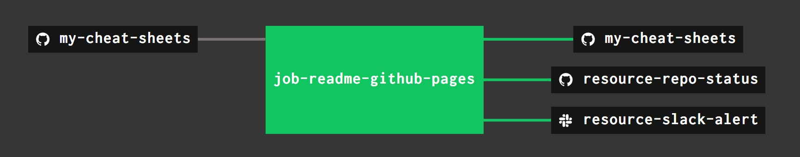

# MY GITHUB WEBPAGE IS UPDATED USING CONCOURSE

For fun, I use concourse to automatically update
[my GitHub Webpage](https://jeffdecola.github.io/my-cheat-sheets/) and alert me of
the changes via repo status and slack.

The update is accomplished this by copying and editing/updating
this `README.md` file to `/docs/_includes/README.md`.

A pipeline file [pipeline.yml](https://github.com/JeffDeCola/my-cheat-sheets/tree/master/ci/scripts/readme-github-pages.sh)
shows the entire ci flow. Visually, it looks like,

The `jobs` and `tasks` are,

* `job-readme-github-pages` runs task
  [readme-github-pages.sh](https://github.com/JeffDeCola/my-cheat-sheets/tree/master/ci/scripts/readme-github-pages.sh).

The concourse `resources types` are,

* `my-cheat-sheets` uses a resource type
  [docker-image](https://hub.docker.com/r/concourse/git-resource/)
  to PULL a repo from github.
* `resource-slack-alert` uses a resource type
  [docker image](https://hub.docker.com/r/cfcommunity/slack-notification-resource)
  that will notify slack on your progress.
* `resource-repo-status` uses a resource type
  [docker image](https://hub.docker.com/r/dpb587/github-status-resource)
  that will update your git status for that particular commit.

For more information on using concourse for continuous integration,
refer to my cheat sheet on [concourse](https://github.com/JeffDeCola/my-cheat-sheets/tree/master/software/operations-tools/continuous-integration-continuous-deployment/concourse-cheat-sheet).
