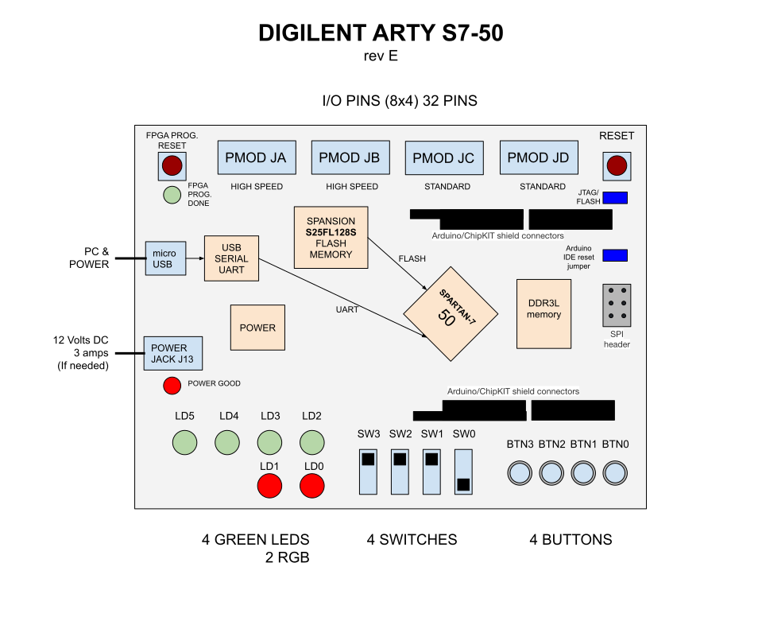
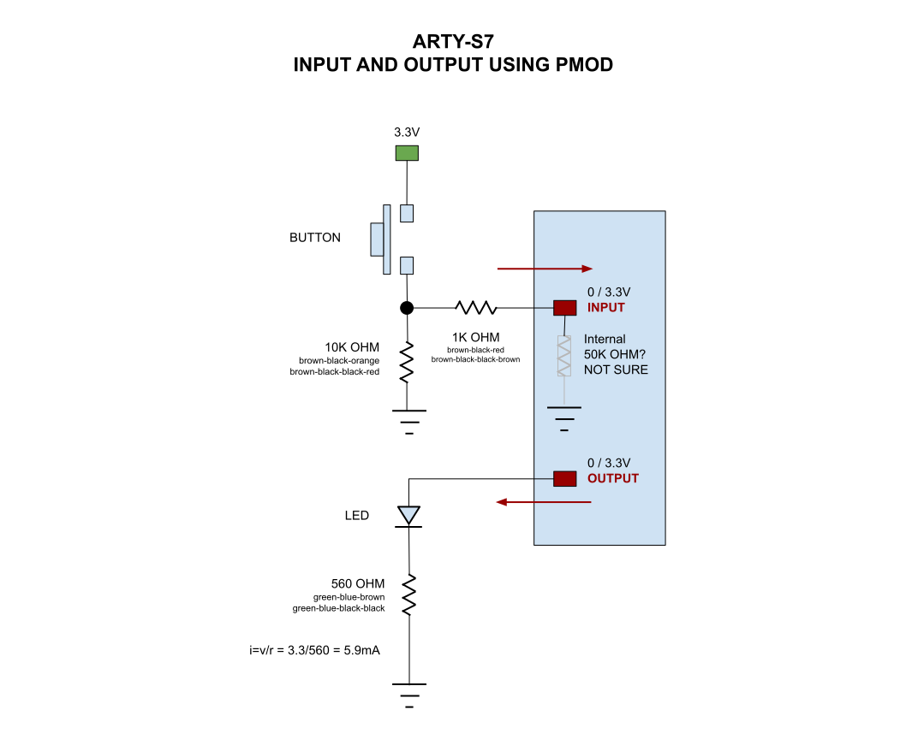

# DIGILENT ARTY-S7 CHEAT SHEET

_Digilent ARTY S7-50 is a FPGA development board._

Table of Contents

* [SOME SPECS](https://github.com/JeffDeCola/my-cheat-sheets/tree/master/hardware/development/fpga-development-boards/digilent-arty-s7-cheat-sheet#some-specs)
* [POWER](https://github.com/JeffDeCola/my-cheat-sheets/tree/master/hardware/development/fpga-development-boards/digilent-arty-s7-cheat-sheet#power)
* [PROGRAM ONBOARD FLASH WITH YOUR DESIGN](https://github.com/JeffDeCola/my-cheat-sheets/tree/master/hardware/development/fpga-development-boards/digilent-arty-s7-cheat-sheet#program-onboard-flash-with-your-design)
* [INPUT & OUTPUT USING PMOD PINS](https://github.com/JeffDeCola/my-cheat-sheets/tree/master/hardware/development/fpga-development-boards/digilent-arty-s7-cheat-sheet#input--output-using-pmod-pins)

Documentation and Reference

* [verilog](https://github.com/JeffDeCola/my-cheat-sheets/tree/master/hardware/development/languages/verilog-cheat-sheet)
  cheat sheet
* [my-verilog-examples](https://github.com/JeffDeCola/my-verilog-examples)
* [iverilog](https://github.com/JeffDeCola/my-cheat-sheets/tree/master/hardware/tools/simulation/iverilog-cheat-sheet)
  is a free tool for simulation and synthesis
* [GTKWave](https://github.com/JeffDeCola/my-cheat-sheets/tree/master/hardware/tools/simulation/gtkwave-cheat-sheet)
  is a free HDL waveform viewer
* [xilinx vivado](https://github.com/JeffDeCola/my-cheat-sheets/tree/master/hardware/tools/synthesis/xilinx-vivado-cheat-sheet)
  is a complete IDE for synthesis and analysis of HDL designs

## SOME SPECS

A very short list of the arty S7-50 specs,

* Xilinx Spartan-7 FPGA (Part Number XC7S50-CSGA324)
* 52,160 logic cells
* 65,200 flip-flops
* Block RAM (kbits) 2,700
* 250 pins
* Internal clock speeds exceeding 450MHz

## POWER

Check your power good led to make sure it's lit.

The USB port can deliver enough power for the vast majority of designs.
However, a few demanding applications might require more power
than the USB port can provide.

An external power supply can be used by plugging into Power Jack J13.

The supply must use a coaxial, center-positive 2.1mm (or 2.5mm)
internal-diameter plug, 12 Volts DC, 3 amps.

## PROGRAM ONBOARD FLASH WITH YOUR DESIGN

Reprogram the onboard flash so it boots with your design.

* Open Xilinx Vivado and create your .bit and .bin file
  * Make sure in project settings you click checkbox to also create .bin file
* In Hardware manager choose `Add Configuration Memory Device`
  * Pick Spansion part number `s25fl128sxxxxxx0`
* Hardware Manager should program your dev board

## INPUT & OUTPUT USING PMOD PINS

Some specs,

* 4 Pmod ports
  * 2 high speed JA, JB Pmod ports
  * 2 Standard JC, JD Pmod ports
  * 8 usable FPGA signals on each Pmod
  * 32 total FPGA I/O (8x24)
* Each 12-pin Pmod connector provides
  * 2 3.3V VCC signals (pins 6 and 12)
  * 2 Ground signals (pins 5 and 11)
  * 8 logic signals (remainder)

To access the pins use
[Xilinx Vivado](https://github.com/JeffDeCola/my-cheat-sheets/tree/master/hardware/tools/synthesis/xilinx-vivado-cheat-sheet).
More specifically, the constraint file.

This is how I set up the led and button on a breadboard,

This is the 12-pin Pmod pin map,

These are the 4 Pmod ports on the ARTY-S7,

|             | Pmod JA    | Pmod JB    | Pmod JC    | Pmod JD    |
|-------------|------------|------------|------------|------------|
| Pmod Type   | High-Speed | High-Speed | Standard   | Standard   |
| Shared pins | -          | -          | IO34-IO41  | IO26-IO33  |
| Pin 1       | L17        | P17        | U15        | V15        |
| Pin 2       | L18        | P18        | V16        | U12        |
| Pin 3       | M14        | R18        | U17        | V13        |
| Pin 4       | N14        | T18        | U18        | T12        |
| Pin 7       | M16        | P14        | U16        | T13        |
| Pin 8       | M17        | P15        | P13        | R11        |
| Pin 9       | M18        | N15        | R13        | T11        |
| Pin 10      | N18        | P16        | V14        | U11        |
