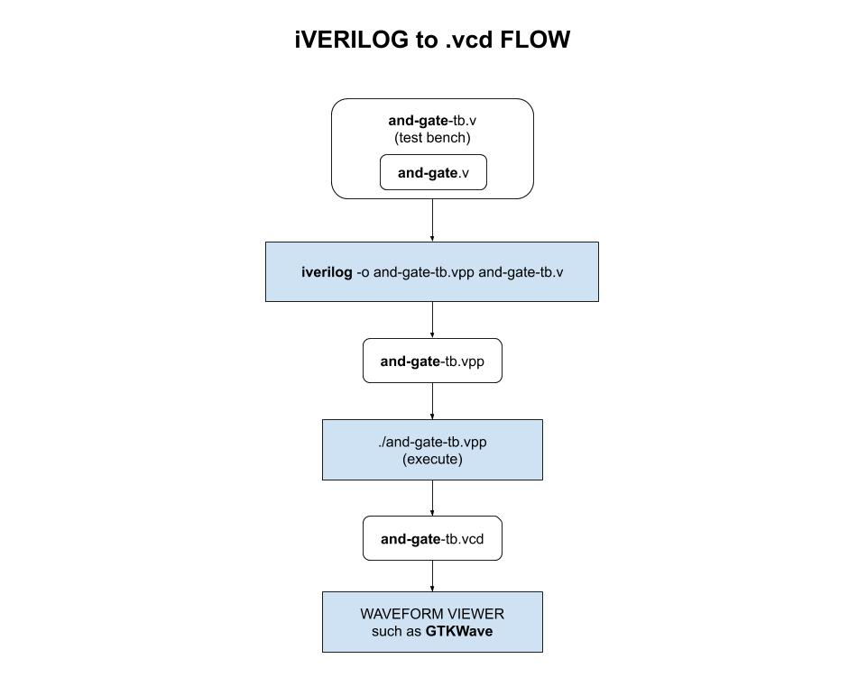

# IVERILOG CHEAT SHEET

_How to install and check `iverilog` (Icaris Verilog), a tool for
simulation and synthesis._

Table of Contents,

* [INSTALL IVERILOG](https://github.com/JeffDeCola/my-cheat-sheets/tree/master/hardware/tools/simulation/iverilog-cheat-sheet#install-iverilog)
  * [INSTALL ON LINUX](https://github.com/JeffDeCola/my-cheat-sheets/tree/master/hardware/tools/simulation/iverilog-cheat-sheet#install-on-linux)
  * [INSTALL ON WINDOWS](https://github.com/JeffDeCola/my-cheat-sheets/tree/master/hardware/tools/simulation/iverilog-cheat-sheet#install-on-windows)
  * [INSTALL ON macOS](https://github.com/JeffDeCola/my-cheat-sheets/tree/master/hardware/tools/simulation/iverilog-cheat-sheet#install-on-macos)
* [CHECK INSTALLATION](https://github.com/JeffDeCola/my-cheat-sheets/tree/master/hardware/tools/simulation/iverilog-cheat-sheet#check-installation)
* [SIMPLE EXAMPLE (NO TEST BENCH OR WAVEFORM FILE)](https://github.com/JeffDeCola/my-cheat-sheets/tree/master/hardware/tools/simulation/iverilog-cheat-sheet#simple-example-no-test-bench-or-waveform-file)
* [SIMPLE EXAMPLE WITH TESTBENCH AND WAVEFORM .VCD FILE](https://github.com/JeffDeCola/my-cheat-sheets/tree/master/hardware/tools/simulation/iverilog-cheat-sheet#simple-example-with-testbench-and-waveform-vcd-file)

Documentation and reference,

* Icarus Verilog
  [Home page](http://iverilog.icarus.com/)
* Icarus Verilog
  [Repo](  https://github.com/steveicarus/iverilog)
* Icarus Verilog
  [Installation guide](https://iverilog.fandom.com/wiki/Installation_Guide)
* My verilog example [my-systemverilog-examples](https://github.com/JeffDeCola/my-systemverilog-examples)
* [GTKWave](https://github.com/JeffDeCola/my-cheat-sheets/tree/master/hardware/tools/simulation/gtkwave-cheat-sheet)
  is a free waveform viewer
  
[GitHub Webpage](https://jeffdecola.github.io/my-cheat-sheets/)

## INSTALL IVERILOG

### INSTALL ON LINUX

You can install it either from a package or build it from source.

#### Install from a package

Gets placed in `/usr/bin`.

This is easier,

```bash
sudo apt-get update
sudo apt-get install verilog
```

#### Install from Source

Gets placed in `/usr/local/bin` (default).

Goto
[github.com/steveicarus/iverilog](https://github.com/steveicarus/iverilog)
for latest information.

I compiled from source to /usr/local (default),

```bash
git clone git@github.com:steveicarus/iverilog.git
```

I needed a few things,

```bash
sudo apt-get install -y autoconf
sudo apt-get install -y gperf
sudo apt-get install -y flex
```

Build configuration files,

```bash
cd steveicarus/iverilog
sh autoconf.sh
```

Now lets compile your source,

```bash
./configure
make
sudo su
make install
```

### INSTALL ON WINDOWS

Pre-built binaries are
[here](http://bleyer.org/icarus/)

### INSTALL ON macOS

The GNU Bison tool (packaged with Xcode) needs to be updated to version 3.

```bash
brew install bison
```

Install iverilog,

```bash
brew install icarus-verilog
```

## CHECK INSTALLATION

Check,

```bash
iverilog -h
```

## SIMPLE EXAMPLE (NO TEST BENCH OR WAVEFORM FILE)

Create a verilog file `hello.v`,

```verilog
module main();

initial
  begin
    $display("Hi there");
    $finish ;
  end

endmodule
```

Compile,

```bash
iverilog -o hello hello.v
```

Execute with linux,

```bash
./hello
```

Execute with Windows,

```bash
vvp hello
```

## SIMPLE EXAMPLE WITH TESTBENCH AND WAVEFORM .VCD FILE

In this example we will create, synthesis and test an AND gate.
The flow is as follows,



First, create your AND gate verilog file `and-gate.v`,

```verilog
module and_gate(
    A,
    B,
    Y
);

    input A, B;
    output Y;

    and(Y, A ,B);

endmodule
```

Next create your testbench verilog file `and-gate-tb.v`,

```verilog
`timescale 1ns / 1ns
`include "and-gate.v"

module and_gate_tb;

reg A, B;
wire Y;

and_gate uut(A, B, Y);

initial begin

    $dumpfile("and-gate-tb.vcd");
    $dumpvars(0, and_gate_tb);

    A = 0;
    B = 0;
    #20;

    A = 1;
    B = 0;
    #20;

    A = 0;
    B = 1;
    #20;

    A = 1;
    B = 1;
    #20;

    $display("test complete");

end

endmodule
```

Now lets compile and simulate,

Compile,

```bash
iverilog -o and-gate-tb.vvp and-gate-tb.v
```

Execute with linux,

```bash
./and-gate-tb.vvp
```

Execute with Windows,

```bash
vvp and-gate-tb.vvp
```

You will now have a `and-gate.vcd` file you can use with a waveform viewer
such as
[GTKWave](https://github.com/JeffDeCola/my-cheat-sheets/tree/master/hardware/tools/simulation/gtkwave-cheat-sheet).
