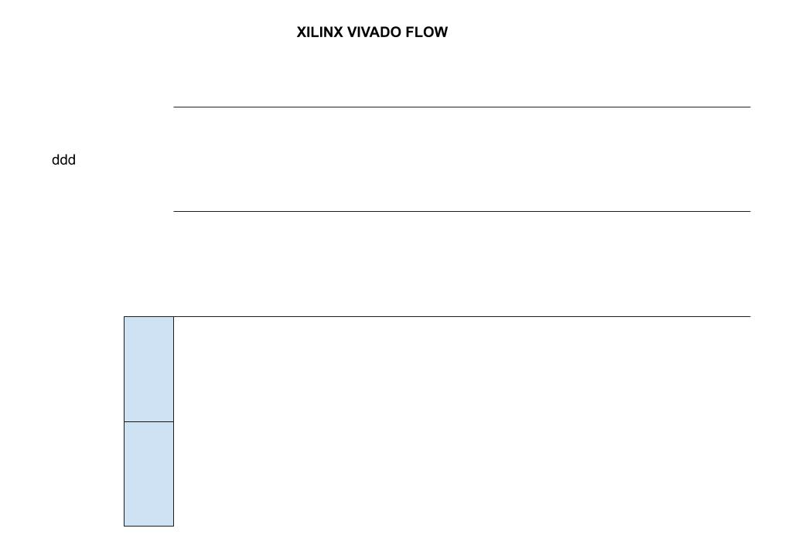

# XILINX VIVADO CHEAT SHEET

_A complete IDE for synthesis and analysis of HDL designs. I use it to
burn an FPGA on a development board_

Documentation and reference,

* [Xilinx Vivado](https://www.xilinx.com/products/design-tools/vivado.html)
  home page
* [Digilent ARTY-S7](https://github.com/JeffDeCola/my-cheat-sheets/tree/master/hardware/development/fpga-development-boards/digilent-arty-s7-cheat-sheet)
  FPGA development board
* My verilog examples repo [my-systemverilog-examples](https://github.com/JeffDeCola/my-systemverilog-examples)

[GitHub Webpage](https://jeffdecola.github.io/my-cheat-sheets/)

## INSTALL

I downloaded and use the free **Vivado HL webPACK Edition**.

## VIVADO FLOW

This is my quick and dirty overview,

