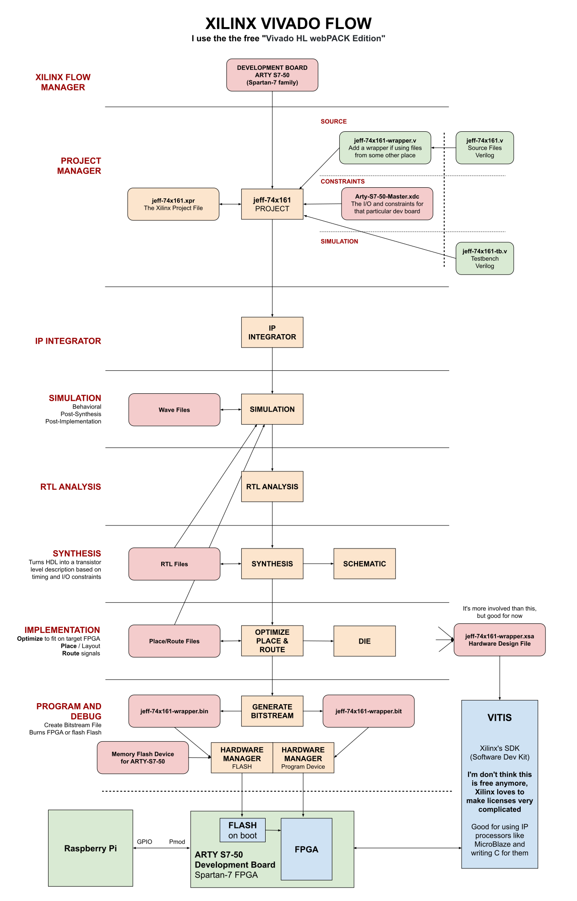

# XILINX VIVADO CHEAT SHEET

_Xilinx Vivado is a complete IDE for synthesis and analysis of HDL designs.
I use it to burn an FPGA on a development board._

Table of Contents

* [INSTALL](https://github.com/JeffDeCola/my-cheat-sheets/tree/master/hardware/tools/synthesis/xilinx-vivado-cheat-sheet#install)
* [CONSTRAINT FILE](https://github.com/JeffDeCola/my-cheat-sheets/tree/master/hardware/tools/synthesis/xilinx-vivado-cheat-sheet#constraint-file)
* [VIVADO FLOW](https://github.com/JeffDeCola/my-cheat-sheets/tree/master/hardware/tools/synthesis/xilinx-vivado-cheat-sheet#vivado-flow)

Documentation and Reference

* xilinx vivado
  [home page](https://www.xilinx.com/products/design-tools/vivado.html)
* [verilog](https://github.com/JeffDeCola/my-cheat-sheets/tree/master/hardware/development/languages/verilog-cheat-sheet)
  cheat sheet
* [my-verilog-examples](https://github.com/JeffDeCola/my-verilog-examples)
* [iverilog](https://github.com/JeffDeCola/my-cheat-sheets/tree/master/hardware/tools/simulation/iverilog-cheat-sheet)
  is a free tool for simulation and synthesis
* [GTKWave](https://github.com/JeffDeCola/my-cheat-sheets/tree/master/hardware/tools/simulation/gtkwave-cheat-sheet)
  is a free HDL waveform viewer
* [digilent ARTY-S7](https://github.com/JeffDeCola/my-cheat-sheets/tree/master/hardware/development/fpga-development-boards/digilent-arty-s7-cheat-sheet)
  is a FPGA development board

## INSTALL

I downloaded and use the free
[Vivado](https://www.xilinx.com/support/download.html).

## CONSTRAINT FILE

The constraint file is a .xdc file that tells Vivado what pins to use
on your FPGA development board.

I use the digilent ARTY-S7 development board and the constraint file is
[arty-s7-50-constraints.xdc](https://github.com/JeffDeCola/my-cheat-sheets/blob/master/hardware/tools/synthesis/xilinx-vivado-cheat-sheet/arty-s7-50-constraints.xdc).

## VIVADO FLOW

This is my quick and dirty overview,

