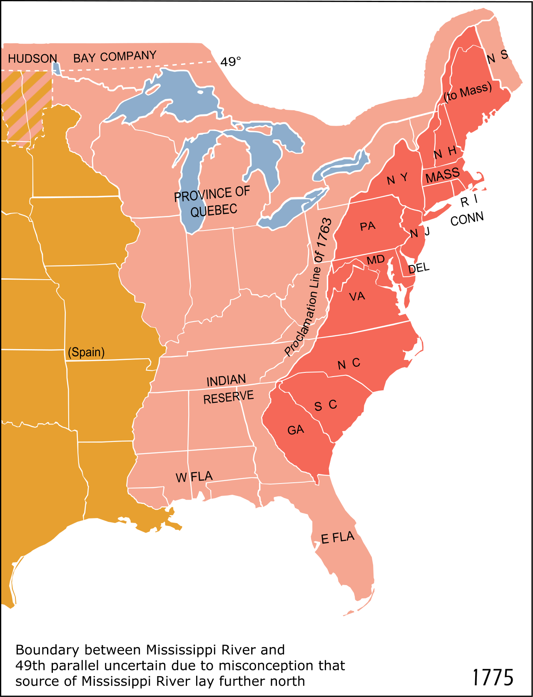
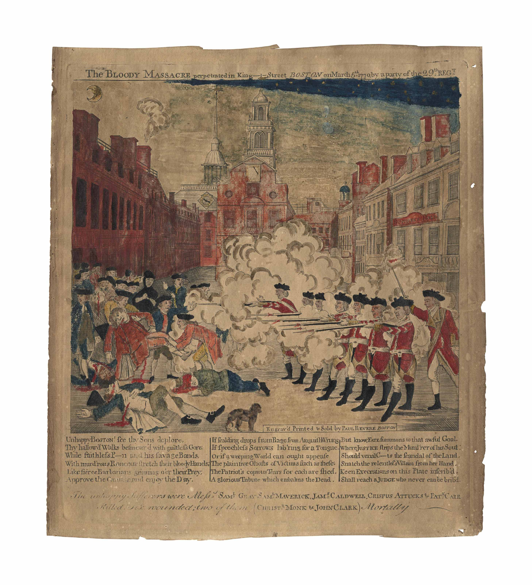
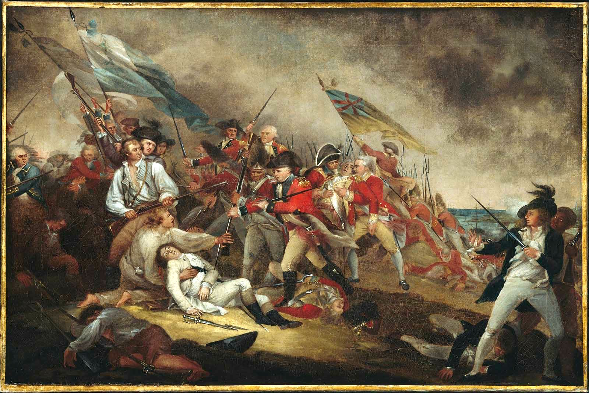
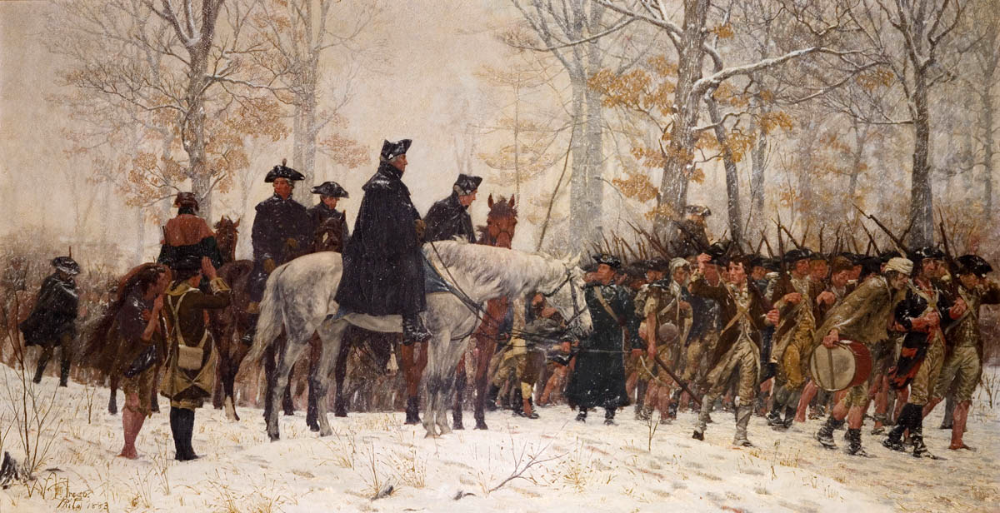

# THE AMERICAN REVOLUTIONARY WAR (1775-1783) CHEAT SHEET

_The American Revolutionary War (aka The War for Independence)
was between the colonies of British
America and the British for America's Independence._

Table of Contents

* [PRE-WAR](https://github.com/JeffDeCola/my-cheat-sheets/tree/master/other/american-history/wars/the-american-revolutionary-war-cheat-sheet#pre-war)

  * [GEORGE WASHINGTON & THE FRENCH AND INDIAN WAR (1754-1763)](https://github.com/JeffDeCola/my-cheat-sheets/tree/master/other/american-history/wars/the-american-revolutionary-war-cheat-sheet#george-washington--the-french-and-indian-war-1754-1763)
  * [THE ROYAL PROCLAMATION OF 1763 (October 7, 1763)](https://github.com/JeffDeCola/my-cheat-sheets/tree/master/other/american-history/wars/the-american-revolutionary-war-cheat-sheet#the-royal-proclamation-of-1763-october-7-1763)
  * [THE SUGAR, STAMP, DECLARATORY & TOWNSHEND ACTS (1764-1767)](https://github.com/JeffDeCola/my-cheat-sheets/tree/master/other/american-history/wars/the-american-revolutionary-war-cheat-sheet#the-sugar-stamp-declaratory--townshend-acts-1764-1767)
  * [THE SONS OF LIBERTY (1765)](https://github.com/JeffDeCola/my-cheat-sheets/tree/master/other/american-history/wars/the-american-revolutionary-war-cheat-sheet#the-sons-of-liberty-1765)
  * [THE BOSTON MASSACRE (March 5, 1770)](https://github.com/JeffDeCola/my-cheat-sheets/tree/master/other/american-history/wars/the-american-revolutionary-war-cheat-sheet#the-boston-massacre-march-5-1770)
  * [THE TEA ACT & THE BOSTON TEA PARTY (December 16, 1773)](https://github.com/JeffDeCola/my-cheat-sheets/tree/master/other/american-history/wars/the-american-revolutionary-war-cheat-sheet#the-tea-act--the-boston-tea-party-december-16-1773)
  * [FIRST CONTINENTAL CONGRESS (Fall 1774)](https://github.com/JeffDeCola/my-cheat-sheets/tree/master/other/american-history/wars/the-american-revolutionary-war-cheat-sheet#first-continental-congress-fall-1774)
  * [PAUL REVERE FAMOUS RIDE (April 18, 1775)](https://github.com/JeffDeCola/my-cheat-sheets/tree/master/other/american-history/wars/the-american-revolutionary-war-cheat-sheet#paul-revere-famous-ride-april-18-1775)

* [THE WAR BEGINS](https://github.com/JeffDeCola/my-cheat-sheets/tree/master/other/american-history/wars/the-american-revolutionary-war-cheat-sheet#the-war-begins)

  * [THE SHOT HEARD ROUND THE WORLD (April 19, 1775)](https://github.com/JeffDeCola/my-cheat-sheets/tree/master/other/american-history/wars/the-american-revolutionary-war-cheat-sheet#the-shot-heard-round-the-world-april-19-1775)
  * [THE GREEN MOUNTAIN BOYS & FORT TICONDEROGA (May 10, 1775)](https://github.com/JeffDeCola/my-cheat-sheets/tree/master/other/american-history/wars/the-american-revolutionary-war-cheat-sheet#the-green-mountain-boys--fort-ticonderoga-may-10-1775)
  * [CONTINENTAL ARMY & GEORGE WASHINGTON (1775)](https://github.com/JeffDeCola/my-cheat-sheets/tree/master/other/american-history/wars/the-american-revolutionary-war-cheat-sheet#continental-army--george-washington-1775)
  * [THE BATTLE OF BUNKER HILL (June 17, 1775)](https://github.com/JeffDeCola/my-cheat-sheets/tree/master/other/american-history/wars/the-american-revolutionary-war-cheat-sheet#the-battle-of-bunker-hill-june-17-1775)
  * [EARLY WAR (1775)](https://github.com/JeffDeCola/my-cheat-sheets/tree/master/other/american-history/wars/the-american-revolutionary-war-cheat-sheet#early-war-1775)
  * [FORTIFICATION OF DORCHESTER HEIGHTS (MARCH 5, 1776)](https://github.com/JeffDeCola/my-cheat-sheets/tree/master/other/american-history/wars/the-american-revolutionary-war-cheat-sheet#fortification-of-dorchester-heights-march-5-1776)
  * [COMMON SENSE BY THOMAS PAINE (1776)](https://github.com/JeffDeCola/my-cheat-sheets/tree/master/other/american-history/wars/the-american-revolutionary-war-cheat-sheet#common-sense-by-thomas-paine-1776)
  * [DECLARATION OF INDEPENDENCE BY THOMAS JEFFERSON (JULY 4, 1776)](https://github.com/JeffDeCola/my-cheat-sheets/tree/master/other/american-history/wars/the-american-revolutionary-war-cheat-sheet#declaration-of-independence-by-thomas-jefferson-july-4-1776)

* [THE WAR MOVES SOUTH](https://github.com/JeffDeCola/my-cheat-sheets/tree/master/other/american-history/wars/the-american-revolutionary-war-cheat-sheet#the-war-moves-south)

  * [THE NEW YORK AND NEW JERSEY CAMPAIGNS (1776-1777)](https://github.com/JeffDeCola/my-cheat-sheets/tree/master/other/american-history/wars/the-american-revolutionary-war-cheat-sheet#the-new-york-and-new-jersey-campaigns-1776-1777)
  * [WASHINGTON CROSSING THE DELAWARE RIVER (December 25, 1776)](https://github.com/JeffDeCola/my-cheat-sheets/tree/master/other/american-history/wars/the-american-revolutionary-war-cheat-sheet#washington-crossing-the-delaware-river-december-25-1776)
  * [BENJAMIN FRANKLIN ASKING FRANCE FOR HELP (DECEMBER 1776)](https://github.com/JeffDeCola/my-cheat-sheets/tree/master/other/american-history/wars/the-american-revolutionary-war-cheat-sheet#benjamin-franklin-asking-france-for-help-december-1776)
  * [THE BATTLE OF BRANDYWINE CREEK (September 11, 1777)](https://github.com/JeffDeCola/my-cheat-sheets/tree/master/other/american-history/wars/the-american-revolutionary-war-cheat-sheet#the-battle-of-brandywine-creek-september-11-1777)
  * [THE BATTLE OF SARATOGA (Oct 7, 1777)](https://github.com/JeffDeCola/my-cheat-sheets/tree/master/other/american-history/wars/the-american-revolutionary-war-cheat-sheet#the-battle-of-saratoga-oct-7-1777)
  * [THE NEW BRITISH GENERAL - HENRY CLINTON (1777)](https://github.com/JeffDeCola/my-cheat-sheets/tree/master/other/american-history/wars/the-american-revolutionary-war-cheat-sheet#the-new-british-general---henry-clinton-1777)
  * [THE BATTLE OF MONMOUTH (June 28, 1778)](https://github.com/JeffDeCola/my-cheat-sheets/tree/master/other/american-history/wars/the-american-revolutionary-war-cheat-sheet#the-battle-of-monmouth-june-28-1778)
  * [FRENCH & SPAIN ENTRY INTO THE WAR (1778-1779)](https://github.com/JeffDeCola/my-cheat-sheets/tree/master/other/american-history/wars/the-american-revolutionary-war-cheat-sheet#french--spain-entry-into-the-war-1778-1779)
  * [AFRICAN AMERICANS](https://github.com/JeffDeCola/my-cheat-sheets/tree/master/other/american-history/wars/the-american-revolutionary-war-cheat-sheet#african-americans)
  * [BENEDICT ARNOLD](https://github.com/JeffDeCola/my-cheat-sheets/tree/master/other/american-history/wars/the-american-revolutionary-war-cheat-sheet#benedict-arnold)

* [THE WAR MOVES MORE SOUTH](https://github.com/JeffDeCola/my-cheat-sheets/tree/master/other/american-history/wars/the-american-revolutionary-war-cheat-sheet#the-war-moves-more-south)

  * [BRITISH TAKING THE SOUTH (1780-1781)](https://github.com/JeffDeCola/my-cheat-sheets/tree/master/other/american-history/wars/the-american-revolutionary-war-cheat-sheet#british-taking-the-south-1780-1781)
  * [THE BATTLE OF GUILFORD COURTHOUSE (March 15, 1781)](https://github.com/JeffDeCola/my-cheat-sheets/tree/master/other/american-history/wars/the-american-revolutionary-war-cheat-sheet#the-battle-of-guilford-courthouse-march-15-1781)
  * [THE BATTLE OF YORKTOWN (October 17, 1781)](https://github.com/JeffDeCola/my-cheat-sheets/tree/master/other/american-history/wars/the-american-revolutionary-war-cheat-sheet#the-battle-of-yorktown-october-17-1781)

* [THE AFTERMATH](https://github.com/JeffDeCola/my-cheat-sheets/tree/master/other/american-history/wars/the-american-revolutionary-war-cheat-sheet#the-aftermath)

  * [TREATY OF PARIS & AFTERMATH (September 3, 1783)](https://github.com/JeffDeCola/my-cheat-sheets/tree/master/other/american-history/wars/the-american-revolutionary-war-cheat-sheet#treaty-of-paris--aftermath-september-3-1783)
  * [SLAVES & NATIVE AMERICANS](https://github.com/JeffDeCola/my-cheat-sheets/tree/master/other/american-history/wars/the-american-revolutionary-war-cheat-sheet#slaves--native-americans)
  * [THE CONSTITUTION (September 17, 1787)](https://github.com/JeffDeCola/my-cheat-sheets/tree/master/other/american-history/wars/the-american-revolutionary-war-cheat-sheet#the-constitution-september-17-1787)
  * [OUR FIRST PRESIDENT (April 30, 1789)](https://github.com/JeffDeCola/my-cheat-sheets/tree/master/other/american-history/wars/the-american-revolutionary-war-cheat-sheet#our-first-president-april-30-1789)

Documentation and Reference

* [The War of 1812 (1812-1815)](https://github.com/JeffDeCola/my-cheat-sheets/tree/master/other/american-history/wars/the-war-of-1812-cheat-sheet)
* [The American Civil War (1861-1865)](https://github.com/JeffDeCola/my-cheat-sheets/tree/master/other/american-history/wars/the-american-civil-war-cheat-sheet)
* [WW1 (1914-1918)](https://github.com/JeffDeCola/my-cheat-sheets/tree/master/other/american-history/wars/ww1-cheat-sheet)
* [WW2 (1939-1945)](https://github.com/JeffDeCola/my-cheat-sheets/tree/master/other/american-history/wars/ww2-cheat-sheet)

## PRE-WAR

### GEORGE WASHINGTON & THE FRENCH AND INDIAN WAR (1754-1763)

Right before the war, there were lots of little wars over the new land in America
between the Native Americans and other countries such as Britain, France and Spain.
The British basically had the east coast, and the French had the midwest with
a lot of disputed area in between.

The English didn't want the French building forts so King George
sent a british Colonel `George Washington` and started the long
7 year `French and Indian War` (1754-1763).

At the `Treaty of Paris`, France gave up all of its territories in
North America.  But Britain needed money since the war was so
expensive. So they wanted to get money from the colonies and
could you really blame them.

### THE ROYAL PROCLAMATION OF 1763 (October 7, 1763)

Even after the treaty
the British government didn't want
American colonists crossing the Appalachians
fueling French and Native American resentment.

The solution seemed simple. The `Royal Proclamation of 1763` was issued,
which declared the boundaries of settlement for inhabitants of the 13 colonies
to be Appalachia. This was not acceptable
to their colonists because they fought and wanted land.

_The 13 colonies are in red, the pink area was claimed by Great Britain
after the French and Indian War, and the orange region was claimed by Spain._

### THE SUGAR, STAMP, DECLARATORY & TOWNSHEND ACTS (1764-1767)

To help pay for the war, Britain needed money and wanted the colonies to
pay them back for the expensive `French and Indian War`.
In 1764 they introduced the `sugar act`.
This forced the colonies to import sugar and molasses from Britain and
pay a duty on them.  Then in 1764 they introduced the `stamp act` which would actually
put stamps on things, really tax anything the colonies did.

They colonists were mad because they didn't have any representation
in parliament and they were being taxed. They protested
and British goods were boycotted so Britain repealed the Stamp
Act.

But they still needed money so in 1766 the british introduced tried again and
introduced the `declaratory act` and the 1767 `Townshend Acts`
that pretty much taxed everything on import duties.

Once again, the colonists got mad and boycotted British goods so the
townshend act was repealed in 1770. But they kept a tea tax and
sent 1,000 troops to Boston to take control.
The merchants of Boston circumvented the act by continuing to receive
tea smuggled in by Dutch traders.

### THE SONS OF LIBERTY (1765)

The Sons of Liberty was a secret organization founded is Boston that was
created in the Thirteen American Colonies to advance
the rights of the colonists and to fight taxation by the
British government. It played a major role in most colonies
in battling the Stamp Act in 1765. The group officially disbanded
after the Stamp Act was repealed.
However, the name was applied to other local separatist.

### THE BOSTON MASSACRE (MARCH 5, 1770)

The Boston Massacre, known to the British as the `Incident on King Street`,
was a confrontation on March 5, 1770 in which British soldiers shot
and killed several people while being harassed by a mob in Boston.
The event was heavily publicized by leading Patriots such as
`Paul Revere` and `Samuel Adams`.

Eight soldiers, one officer, and four civilians were arrested and
charged with murder, and they were defended by future President `John Adams`.

The anger continued to grow over the next few years.

_Paul Revere’s engraving of the Boston Massacre, about 29 known prints._

### THE TEA ACT & THE BOSTON TEA PARTY (December 16, 1773)

In 1773 Parliament passed a `Tea Act` designed to aid the
financially troubled East India Company by granting it a monopoly on
all tea exported to the colonies and an exemption on the export tax.
The company thus could sell the tea at a less-than-usual price in either
America or Britain; it could undersell anyone else.

An incident in which 342 chests of tea belonging to the `British East India
Company` were thrown from ships into Boston Harbor by 60 American
patriots disguised as Mohawk Indians. The Americans were protesting both
a tax on tea (taxation without representation) and the perceived
monopoly of the East India Company.

In retaliation, Parliament passed the series of punitive measures
known in the colonies as the `Intolerable Acts` and sent more troops.
Boston was no under control of britain.

Some of the intolerable acts were,

* The `Massachusetts Government Act` stopped self government there.
* The `Quartering Act` forced colonist to house british soldiers in
  their homes.

### FIRST CONTINENTAL CONGRESS (Fall 1774)

The other colonies seeing that Boston was under
Britain's control, the remaining colonies held
the `First Continental Congress` at Carpenter's Hall in Philadelphia, from
September 5, to October 26, 1774.
It was in response to the British Navy instituted a blockade of
Boston Harbor and the  Intolerable Acts.
56 delegates were there such as Famous people like John Adams,
Samuel Adams, Robert Treat Paine and George Washington.
The colonies were united in a
determination to show a combined authority to Great Britain.

On October 14, the `Declaration and Resolves` established
the course of the congress, as a statement of principles
common to all of the colonies. Congress voted to meet
again the following year if these grievances were not
attended to by England.

But the British would not stop, so the Continental
Congress started to arm the colonists and
these `minutemen` were ready at a moments notice.

### PAUL REVERE FAMOUS RIDE (April 18, 1775)

Britain wanted to shut down the Rebel uprising (lol)
so in 1775 British troops, lead
by British General Thomas Gage, started marching to Concord to
arrest Samuel Adams and John Hancock. They also
wanted to seize weapons and gun powder being stored there.

Around midnight Paul Revere was instructed by the Sons of
Liberty to ride to Lexington, Mass. to warn them so
the minute men could get ready.

## THE WAR BEGINS

This was the start of the American Revolution, but not the war of independence, yet.

### THE SHOT HEARD ROUND THE WORLD (April 19, 1775)

The british marched into the small town of Lexington
around 5:00 am to find, facing them, a militia company of
more 70 men led by Captain John Parker.

At some point a shot rang out; historians still debate who fired
the shot. The nervous British soldiers fired a volley,
killing seven and mortally wounding one of the retreating militiamen.
The British column moved on towards Concord, leaving the dead,
wounded, and dying in their wake. Parker and his men would
have revenge later that afternoon.

Arriving in Concord around 8:00 am, with about 220 troops in all,
the British secured the north bridge across the Concord River.
The Acton Company, commanded by thirty-year old Captain Isaac Davis,
wanted to stop the British. When Davis’s company came within range,
British soldiers opened fire, killing Isaac Davis. The Minute Men replied with
their own volley, killing three British soldiers and
wounding nine others. This volley is the volley considered
`the shot heard round the world`. The rest of the British troops
retreated back to Boston.  This marked the start of the
`War For Independence`.

### THE GREEN MOUNTAIN BOYS & FORT TICONDEROGA (May 10, 1775)

Up north, the Green Mountain boys were a small group of militia
formed by Ethan Allen in 1770.
Ethan Allen received a visit from Benedict Arnold.
Arnold was there to ask for the assistance of the Green Mountain Boys
in capturing Fort Ticonderoga. Allen quickly and enthusiastically agreed.

The Green Mountain Boys, along with Arnold and his small troop,
arrived at Fort Ticonderoga on May 10, 1775 and took it.

King George fired `General Gage` and assigned `General Howe` to put down
the rebellion (lol, I just can't resist).

### CONTINENTAL ARMY & GEORGE WASHINGTON (1775)

Because britain and King George was going to retaliate, the colonist
started the Continental Army lead by the very popular George Washington.

### THE BATTLE OF BUNKER HILL (June 17, 1775)

On June 16, 1775, having learned that the British were planning
to send troops from Boston to occupy the hills surrounding
the city, some 1,000 colonial militiamen under Colonel William
Prescott (1726-95) built earthen fortifications on top of Breed’s Hill,
overlooking Boston and located on the Charlestown Peninsula.

As the British advanced in columns against the Americans, Prescott,
in an effort to conserve the Americans’ limited supply of ammunition,
reportedly told his men, `Don’t fire until you see the whites of their eyes!`
When the Redcoats were within several dozen yards, the Americans
let loose with a lethal barrage of musket fire, throwing the British into retreat.

The British defeated the Americans at the Battle of Bunker
Hill in Massachusetts. Despite their loss, the inexperienced
colonial forces inflicted significant casualties against the enemy,
and the battle provided them with an important confidence boost.
Although commonly referred to as the Battle of Bunker Hill,
most of the fighting occurred on nearby Breed’s Hill.

_The Death of General Warren at the Battle of Bunker's Hill, June 17, 1775 by
artist John Trumbull depicting the death of Joseph Warren at the Battle of
Bunker Hill located at Museum of Fine Arts, Boston, Massachusetts._

### EARLY WAR (1775)

But independence was not exactly on the table so the colonies
sent a letter to King George asking if they could work things out.
King george refused, so there was a lot of fighting among the colonies.
France and Spain sent supplies to the Colonists to help them.

Benedict Arnold also captured british forts in montreal but was
defeated in Quebec City so he headed back to Fort Ticonderoga.

### FORTIFICATION OF DORCHESTER HEIGHTS (MARCH 5, 1776)

Henry Knox traveled for 2 months, from Fort Ticonderoga to Boston
carrying cannons to George Washington in Boston who were
locked up in the Boston struggle.

They set the guns up on Dorchester Heights overlooking Boston pointing at the British.
The `Fortification of Dorchester Heights` was a decisive action that led to
the withdrawal of all 9,000 British troops from Boston.

### COMMON SENSE BY THOMAS PAINE (1776)

Also during this time, `Common Sense` by Thomas Paine, Published in 1776,
challenged the authority of the British government
and the royal monarchy. The plain
language that Paine used spoke to the common people of America and
was the first work to openly ask for independence from Great Britain.
It brought the idea of independence by the main stream.

### DECLARATION OF INDEPENDENCE BY THOMAS JEFFERSON (JULY 4, 1776)

Drafting the Declaration of Independence in 1776 became the defining event in
Thomas Jefferson's life. Despite Jefferson's desire to return to Virginia
to help write that state's constitution, the Continental Congress
appointed him to the five-person committee for drafting this.
The colonies were united and The United states of America was born.
to the british it was treason.

It should be noted in an early draft he wrote about the abolishment of Slavery
but it was removed because the south would not support that.

,_by_John_Trumbull.jpg)

_Declaration of Independence is a 12-by-18-foot (3.7 by 5.5 m) oil-on-canvas
painting by American John Trumbull depicting the presentation
of the draft of the Declaration of Independence to Congress located at
The U.S. Capitol, Washington, D.C.._

## THE WAR MOVES SOUTH

### THE NEW YORK AND NEW JERSEY CAMPAIGNS (1776-1777)

Having fled Boston, Britain sent 25,000 troops to
Staten Island New York to fight the Rebels.

The New York and New Jersey campaign was a series of battles
in 1776 and the winter months of 1777 for control of the Port of New York
between British forces under General Sir William Howe and the
Continental Army under General George Washington.
There were many battles such as the Battle of Kips Bay, the Battle
of Harlem Heights and the Battle of White Plains.

But Washington's army was defeated and Washington
fled to Virginia.  The british were in New Jersey and
settled in for a winter of partying and drinking.  They also
had Hessian mercenaries setup across the Delaware river
in case Washington attacked again.

### WASHINGTON CROSSING THE DELAWARE RIVER (December 25, 1776)

On the night of December 25–26, 1776, in a surprise attack organized
by George Washington against the Hessian forces in Trenton, New Jersey
`The Battle of Trenton`.
With 2,400 men he caught the Hessian forces off guard.

Then Washington traveled to Princeton for `The Battle of Princeton`
was fought near Princeton, New Jersey on January 3, 1777
and ending in a small victory for the Colonials.
General Lord Cornwallis had left 1,400 British troops.
The british, defeated, abandoned southern New Jersey for the Winter.

_Washington Crossing the Delaware is an 1851 oil-on-canvas
painting by the German-American artist Emanuel Leutze
located at The Metropolitan Museum of Art, New York City._

_The Capture of the Hessians at Trenton, December 26, 1776 is the title of
an oil painting by the American artist John Trumbull depicting the capture
of the Hessian soldiers at the Battle of Trenton located Yale University
Art Gallery,Connecticut._

### BENJAMIN FRANKLIN ASKING FRANCE FOR HELP (DECEMBER 1776)

The Continental Congress sent Benjamin Franklin to
France to ask for help.  But he just chilled for a long time.

### THE BATTLE OF BRANDYWINE CREEK (September 11, 1777)

To take over New York to divide the colonies in two.
General Howe would move north while General Burgoyne
would move south. But Howe decided to take philadelphia.
`The Battle of Brandywine Creek` between Howe and
Washington and defeated Washington.
Congress left Philly and escaped to York.

### THE BATTLE OF SARATOGA (Oct 7, 1777)

Up north, spearheaded by Major General Benedict Arnold, in the wooded
area of Bemis Heights south of Saratoga. Known as `The Battle of Bemis Heights`,
or the `Second Battle of Saratoga`, this American victory proved to be a major
turning point in the War. Again, Benedict Arnold was very successful.

British General `John Burgoyne` found himself trapped by superior American
forces with no relief, so he retreated to Saratoga (now Schuylerville)
and surrendered his entire army there on October 17.

This was a great turning point of the war because it won for Americans
the foreign assistance which was the last element needed for victory.

_Surrender of General Burgoyne by John Trumbull, 1822
Depicted at center are General John Burgoyne surrendering
to General Horatio Gates, who refused to take his sword.
The painting hangs in the United States Capitol Rotunda._

### THE NEW BRITISH GENERAL - HENRY CLINTON (1777)

King George was furious loosing this battle so
both Howe and Burgoyne were replaced by General Clinton.
Washington after loosing Philadelphia, had to
chill for the winter around Valley Forge.
But Franklin finally got the French to help train
Washington's men to fight. The came out of the winter of 1778
as a new amd improved force and wanted to take Philadelphia back.
But they didn't have to as the British left Philadelphia to
pool their resources in New York.

_The March to Valley Forge by William B. T. Trego depicts George Washington
and the veterans of his army limping into their winter encampment
in Valley Forge located at The Museum of the American Revolution located._

### THE BATTLE OF MONMOUTH (June 28, 1778)

Washington sent Benedict Arnold to reoccupy Philly as
he pursued the British through New Jersey.

Then on June 28, the Battle of Monmouth took place on a hot summer day.
It was a draw but the British fled to New York.

### FRENCH & SPAIN ENTRY INTO THE WAR (1778-1779)

John Adam went to France to help Benjamin Franklin get
more support from the French. They sent supplies and support
and enlisted Native Americans to help fight the British.

As a side note this would bankrupt them and lead to their
own revolution.

### AFRICAN AMERICANS

Originally Washington would not allow slaves to join the Continental Army,
but after the British promised freedom to any slaves that joined their army,
Washington reversed his decision.  But even after the war many where
returned to slavery and harsh discrimination.

### BENEDICT ARNOLD

Benedict Arnold was in Philly and married one of elites of Philly.
But the people of philly accused Arnold of having pro british sentiments.
To keep the people happy, Washington called Arnold improper and imprudent.
This was the last straw for Arnold having won major battles and feeling he did not
get the recognition he deserved.

Arnold asked Washington to put him in charge of the Fort at West Point,
then he contacted the British offering to hand the plans of the
fort over to them.  But his treasonous plan were discovered on
a captured British officer but Arnold managed to escape before
they could arrest him and fled to New York.
Now Arnold was part of the British and led raids on like the one in
Richmond Virginia in 1781.

## THE WAR MOVES MORE SOUTH

### BRITISH TAKING THE SOUTH (1780-1781)

After the French entered the war on the side of the Americans in 1778,
the British shifted their focus to a campaign in the South
The British took part of Georgia and South Carolina. This was very brutal war.

The Continental Congress sent Horatio Gates to the South
and lost against Cornwallis. Then Washington sent his guy,
Nathanael Greene and there was `The Battle of Cowpens`
January 17, 1781 in South Carolina.

### THE BATTLE OF GUILFORD COURTHOUSE (March 15, 1781)

The British chased Greene up through North Carolina.
Greene led Cornwallis to Virginia far away from his supply line.
Greene picked up reinforcements and had
`The Battle of Guilford Courthouse`.

Although British troops under Lieutenant General Charles Cornwallis
scored a tactical victory at Guilford Courthouse over American forces
under Major General Nathanael Greene, the British suffered
significant troop losses during the battle.

### THE BATTLE OF YORKTOWN (October 17, 1781)

Afterward, Cornwallis abandoned his campaign for the
Carolinas and instead took his army into Virginia to Yorktown.

General George Washington, commanding a force of 17,000 French
and Continental troops, begins the siege known as the Battle of
Yorktown against British General Lord Charles Cornwallis and a
contingent of 9,000 British troops at Yorktown, Virginia,
in the most important battle of the Revolutionary War.
Cornwallis surrendered to Washington in the field at
Yorktown on October 17, 1781, effectively ending the War for Independence.

_The Surrender of Lord Cornwallis is an oil painting by John Trumbull located
at The United States Capitol rotunda, Washington, D. C.._

## THE AFTERMATH

### TREATY OF PARIS & AFTERMATH (September 3, 1783)

They defeated Cornwallis and he surrendered and
parliament realized the war was not worth it.

`The Treaty of Paris` was the official peace treaty
between the United States and Britain that ended the
American Revolutionary War. It was signed on September 3, 1783.
The Congress of the Confederation ratified the treaty on
January 14, 1784.

In the terms of the treaty, France gave up
all its territories in mainland North America,
effectively ending any foreign military threat to
the British colonies there and the colonies agreed
to pay debt to Britain.

I'm not really sure how the French benefited from any of this.

### SLAVES & NATIVE AMERICANS

Most African Americans went back to being slaves.
Indian were killed and not part of the new world.

### THE CONSTITUTION (September 17, 1787)

The independence needed a better charter, hence the Constitution
was written during the Philadelphia Convention, now
known as the Constitutional Convention, which convened from
May 25 to September 17, 1787. It was signed on September 17, 1787.

_We the people of the United States, in order to form a more perfect union,
establish justice, insure domestic tranquility, provide for the common defense,
promote the general welfare, and secure the blessings of liberty to ourselves
and our posterity, do ordain and establish this Constitution for the United
States of America._

### OUR FIRST PRESIDENT (April 30, 1789)

Washington wanted to retire, but others wanted him to be the
first leader of this new land.  Washington became President in
April 30, 1789. He set up a cabinet because no President can
know everything no matter how much of a stable genius they claim to be.
He could of made the President anything he wanted but he made it
like it is today.
