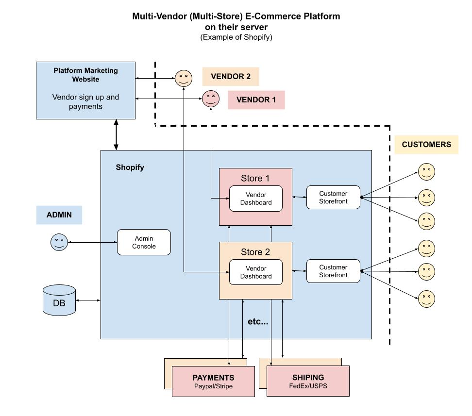

# MULTI-VENDOR MULTI-STORE CHEAT SHEET

_A Multi-Vendor (Multi-Store) E-Commerce Platform.
More simply, an **online store**._

My other repos showing different platforms,

* [multi-vendor marketplace](https://github.com/JeffDeCola/my-cheat-sheets/tree/master/other/e-commerce/multi-vendor/multi-vendor-marketplace-cheat-sheet)
* [multi-vendor multi-store](https://github.com/JeffDeCola/my-cheat-sheets/tree/master/other/e-commerce/multi-vendor/multi-vendor-multi-store-cheat-sheet)
  **(You are Here)**
* [single-vendor single-store](https://github.com/JeffDeCola/my-cheat-sheets/tree/master/other/e-commerce/single-vendor/single-vendor-single-store-cheat-sheet)

Documentation and reference,

* [wordpress](https://github.com/JeffDeCola/my-cheat-sheets/tree/master/software/service-architectures/software-as-a-service/wordpress-cheat-sheet)

[GitHub Webpage](https://jeffdecola.github.io/my-cheat-sheets/)

## OVERVIEW

The following illustration is a high-level view of an
Multi-Vendor (Multi-Store) E-Commerce platform (SaaS)
on a hosted server using,

* Shopify

Or more simply, this illustration shows an **online store** hosted on Shopify's server,

