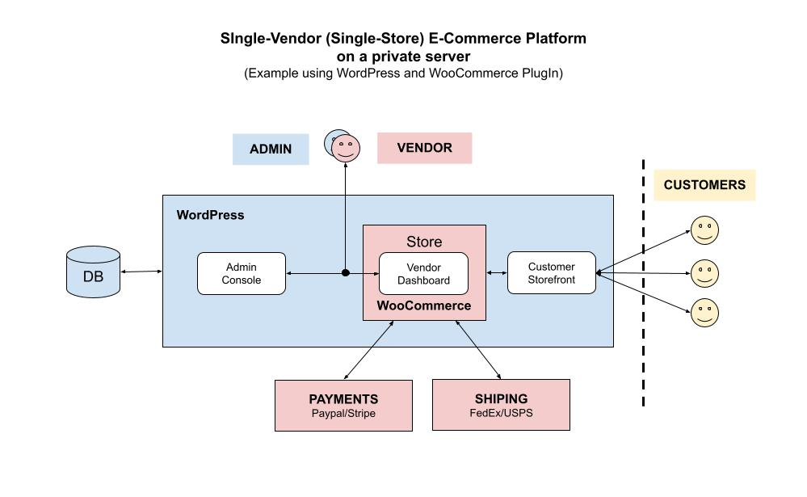

# SINGLE-VENDOR SINGLE-STORE CHEAT SHEET

_A Single-Vendor (Single-Store) E-Commerce Platform._

Other E-Commerce platform configurations,

* **MULTI-VENDOR**
  * [multi-vendor marketplace](https://github.com/JeffDeCola/my-cheat-sheets/tree/master/other/e-commerce/multi-vendor/multi-vendor-marketplace-cheat-sheet)
  * [multi-vendor multi-store](https://github.com/JeffDeCola/my-cheat-sheets/tree/master/other/e-commerce/multi-vendor/multi-vendor-multi-store-cheat-sheet)
* **SINGLE-VENDOR**
  * [single-vendor single-store](https://github.com/JeffDeCola/my-cheat-sheets/tree/master/other/e-commerce/single-vendor/single-vendor-single-store-cheat-sheet)
    **(You are Here)**

Table of Contents,

* tbd

Documentation and reference,

* [wordpress](https://github.com/JeffDeCola/my-cheat-sheets/tree/master/software/service-architectures/software-as-a-service/wordpress-cheat-sheet)

[GitHub Webpage](https://jeffdecola.github.io/my-cheat-sheets/).

## OVERVIEW

This may help,

