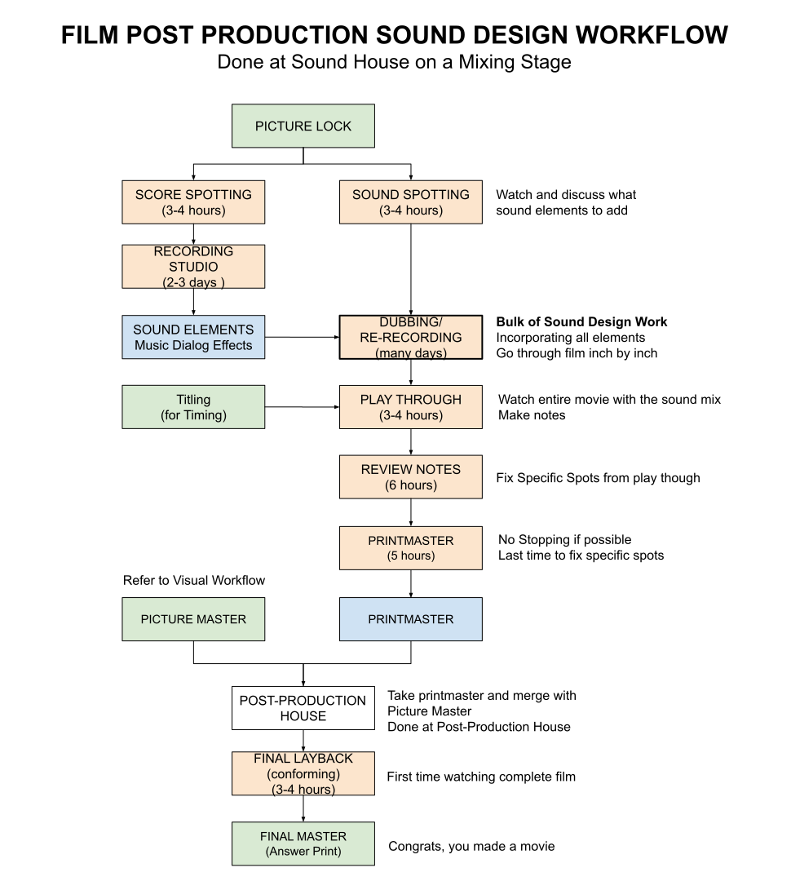

# SOUND DESIGN TEAM, ELEMENTS AND WORKFLOW CHEAT SHEET

_Sound design is part of Post Production,
focusing on the process of specifying, acquiring, manipulating,
and generating sound elements. The bulk of this work is done at a Sound House
or Audio Post Facility._

Table of Contents

* [ELEMENTS](https://github.com/JeffDeCola/my-cheat-sheets/tree/master/other/film-production/post-production/sound-design-team-elements-and-workflow-cheat-sheet#elements)
* [SOUND DESIGN TEAM](https://github.com/JeffDeCola/my-cheat-sheets/tree/master/other/film-production/post-production/sound-design-team-elements-and-workflow-cheat-sheet#sound-design-team)
* [WORKFLOW](https://github.com/JeffDeCola/my-cheat-sheets/tree/master/other/film-production/post-production/sound-design-team-elements-and-workflow-cheat-sheet#workflow)

Documents and References

* watch a movie I produced on [amazon](https://www.amazon.com/gp/video/detail/B00TTB7Q3U)
* [post production schedule](https://github.com/JeffDeCola/my-cheat-sheets/tree/master/other/film-production/post-production/post-production-schedule-cheat-sheet)
* [visual team elements and workflow](https://github.com/JeffDeCola/my-cheat-sheets/tree/master/other/film-production/post-production/visual-team-elements-and-workflow-cheat-sheet)

## ELEMENTS

Sound elements are the building blocks of sound design.

## SOUND DESIGN TEAM

* **Sound Studio Manager** -
    _Manages Sound Studio, makes deals, schedules_
* **Re-Recording Mixer** -
    _Mixes all sounds elements (dialog, effects, music)_
* **Composer** -
    _Creates original music score_
* **Music Editor** -
    _Edits music, syncs to picture_
* **Dialogue Editor** -
    _Edits and cleans production dialog_
* **Dialogue Mixer** -
    _Mixes dialog to provide clarity_
* **ADR Editor** -
    _Edits ADR_
* **ADR Mixer** -
    _Mixes ADR_
* **Sound Designer** -
    _Creates signature sounds and sonic identities_
* **Sound Effects Editor** -
    _Edits sound effects_
* **Foley Artist** -
    _Performs and records human movement sounds_
* **Foley Mixer** -
    _Mixes Foley_

## WORKFLOW

Once the film is picture locked, the sound design team can begin their work.

* **SOUND SPOTTING**
  * The sound design team meets with the director and editor to discuss
    the sound design of the film
* **GATHER/CREATE SOUND ELEMENTS**
  * **MUSIC**
    * This includes score, licensed music, and any additional music
  * **DIALOG**
    * This includes production dialog, ADR, and any additional dialog
  * **EFFECTS**
    * This includes production sound, SFX, Walla, Foley, and any additional
      sound effects
* **DUBBING/RE-RECORDING**
  * This is where everything comes together
  * The bulk of the work, going through the film inch by inch
    adding sound elements
* **PLAY THROUGH**
  * Plays through the film with the director and others
    to make sure everything is in place
  * Makes notes to change anything that needs to be changed
* **REVIEW NOTES**
  * The sound design team reviews notes from the director and editor
    and makes any necessary changes
* **PRINTMASTER**
  * Creating the final mix deliverables
  * Prints the final master of the film

