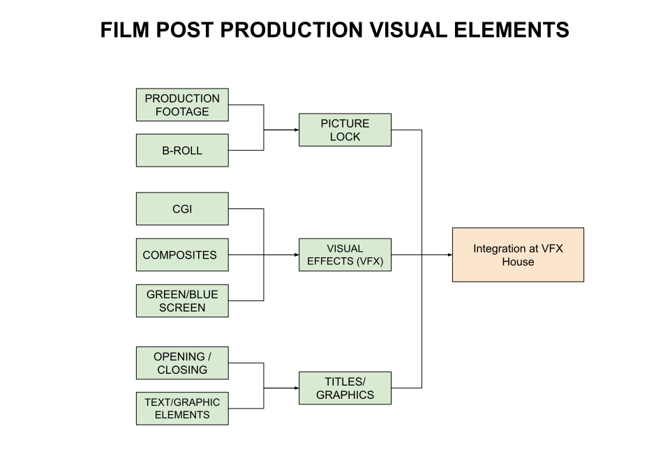
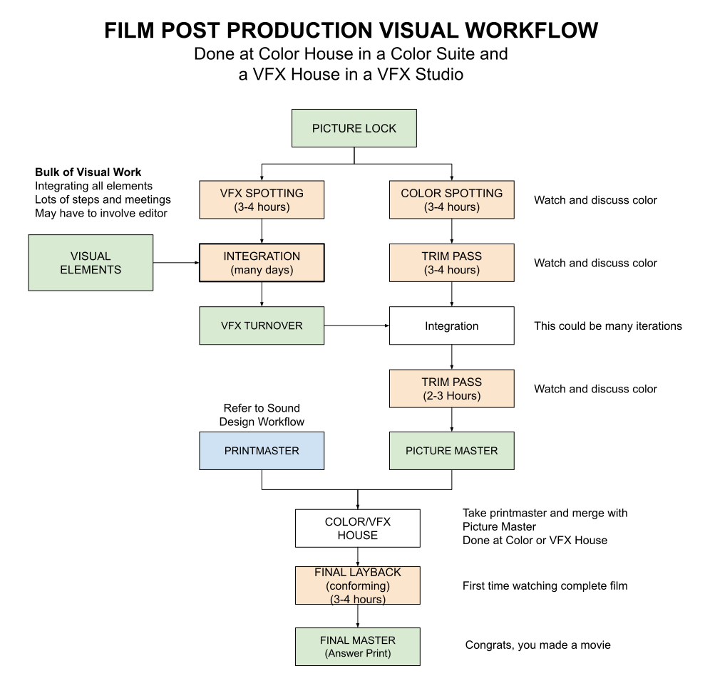

# VISUAL DESIGN TEAM, ELEMENTS AND WORKFLOW CHEAT SHEET

_Visual design is the process of specifying, acquiring, or generating visual elements._

Table of Contents

* [ELEMENTS](https://github.com/JeffDeCola/my-cheat-sheets/tree/master/other/film-production/post-production/visual-team-elements-and-workflow-cheat-sheet#elements)
* [VISUAL TEAM](https://github.com/JeffDeCola/my-cheat-sheets/tree/master/other/film-production/post-production/visual-team-elements-and-workflow-cheat-sheet#visual-team)
* [WORKFLOW](https://github.com/JeffDeCola/my-cheat-sheets/tree/master/other/film-production/post-production/visual-team-elements-and-workflow-cheat-sheet#workflow)

Documents and References

* watch a movie I produced on [amazon](https://www.amazon.com/gp/video/detail/B00TTB7Q3U)
* [sound design team elements and workflow](https://github.com/JeffDeCola/my-cheat-sheets/tree/master/other/film-production/post-production/sound-design-team-elements-and-workflow-cheat-sheet)

## ELEMENTS

Visual elements are the building blocks of the film.

## VISUAL TEAM

* **VFX House Manager/Producer** -
    _Manages Visual Effects Studio, makes deals, schedules team_
* **Visual Effects Supervisor** -
    _Oversees the creative and technical aspects of all visual effects work_
* **Visual Effects Artist(s)** -
    _3D artists, lighting, VFX, etc._
* **Visual Effects Compositor(s)** -
    _Combines all visual effects elements_

## WORKFLOW

Once the film is picture locked, the visual team can begin most of their work.

* **VFX SPOTTING**
  * The visual team meets with the director and editor to discuss
    the visual effects of the film
* **COLOR SPOTTING**
  * Colorist meets with director and DP to discuss the color grading approach
    and look development
* **COLOR TRIM PASS**
  * First round of color grading before VFX integration (often called "offline color")
* **GATHER/CREATE VISUAL ELEMENTS**
  * **PICTURE LOCK**
    * The film is picture locked and used as a reference for the visual team
  * **VISUAL EFFECTS**
    * Bulk of VFX work. This includes cgi, green screen, tracking,
      roto and other visual effects
  * **TITLE/GRAPHICS**
    * This includes the opening and closing credits
* **VFX ELEMENT INTEGRATION**
  * The VFX team composites all elements within each shot
* **VFX REVIEWS**
  * Director/producer reviews VFX shots and provides feedback for revisions
* **VFX TURNOVER**
  * Final approved VFX shots are turned over to the color house/editor
* **VFX INTEGRATION**
  * The editor integrates all final VFX shots into the timeline
* **FINAL COLOR GRADE**
  * Final color grading session with all VFX shots integrated
* **PICTURE MASTER**
  * The final visual master of the film is created
* **FINAL LAYBACK**
  * Integrate the final sound and visual masters together

