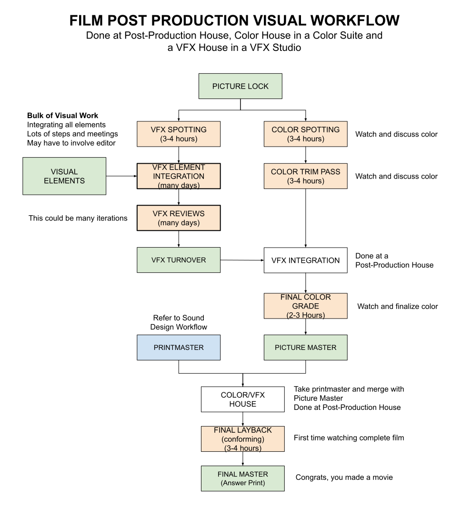

# VISUAL DESIGN TEAM, ELEMENTS AND WORKFLOW CHEAT SHEET

[](https://jeffdecola.com)
[](https://jeffdecola.mit-license.org)

```text
*** THIS CHEAT SHEET IS UNDER CONSTRUCTION - CHECK BACK SOON ***
```

_The three phases of producing a film are pre-production, production, and post-production._

Table of Contents

* [PRE-PRODUCTION](#pre-production)
* [PRODUCTION](#production)
* [POST-PRODUCTION](#post-production)

Documents and References

* watch a movie I produced on [amazon](https://www.amazon.com/gp/video/detail/B00TTB7Q3U)

## ELEMENTS

Visual elements are the building blocks of the film.


## VISUAL TEAM

* **Visual Studio Manager** -
    _Manages Visual Studio, makes deals, schedules_
* **Visual Effects Supervisor** -
    _Supervises all visual effects_
* **Visual Effects Producer** -
    _Manages the visual effects budget_
* **Visual Effects Coordinator** -
    _Coordinates the visual effects_
* **Visual Effects Editor** -
    _Edits the visual effects_
* **Visual Effects Artist** -
    _Creates the visual effects_
* **Visual Effects Compositor** -
    _Combines all visual effects elements_
* **Visual Effects Supervisor** -
    _Supervises the visual effects_
* **Visual Effects Producer** -
    _Manages the visual effects budget_

## WORKFLOW

Once the film is picture locked, the visual team can begin most of their work.

* **VFX SPOTTING**
  * The visual team meets with the director and editor to discuss
    the visual effects of the film
* **COLOR SPOTTING**
  * Colorists meets with director and  to discuss
    the color grading of the film
*  **TRIM PASS**
  * The visual team meets with the director and editor to discuss
    the trim pass of the film    
* **GATHER VISUAL ELEMENTS**
  * PICTURE LOCK
  * VISUAL EFFECTS
  * 
  * The visual team gathers all the visual elements needed for the film
* **CREATE VISUAL ELEMENTS**


