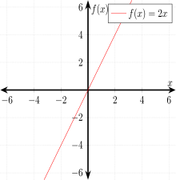

# ALGEBRA CHEAT SHEET

`algebra` _finding out what the unknown is._

As a side note, this cheat sheet was built using,

* LaTex Math Mode equations rendered to images using
  [readme2tex](https://github.com/JeffDeCola/readme2tex)
* I created the graphs in my repo
  [my-latex-pgfplots-graphs](https://github.com/JeffDeCola/my-latex-pgfplots-graphs)
  using LaTeX `pgfplots` package

You can see my
[LaTeX math mode cheat sheet](https://github.com/JeffDeCola/my-cheat-sheets/tree/master/software/development/languages/latex-math-mode-cheat-sheet)
on how to do this.

View my entire list of cheat sheets on
[my GitHub Webpage](https://jeffdecola.github.io/my-cheat-sheets/).

## HISTORY

From Persia around 820 AD, there was a book of algebra for balancing and
completion. We are talking about almost 3,000 years ago.  But even before
that people were balancing equations in 2000 AD.

But a greek gentleman name Diophantus around 200 BC is sometimes known
as the father of algebra.  Al-Khwarizmi is another father back in 600 BC.

## OVERVIEW - THE UNKNOWN

Algebra is a lot like arithmetic.
But algebra introduces the element of unknown values,

or

Where  is a placeholder for a number we don't know yet.
The equation is telling us the known and unknown values.

One of the main goals of algebra is to `solve the equation`.
To find out what the unknown is,

## VARIABLES

If , then .  If , then . Hence  will change depending on .
And visa versa.

## MULTIPLICATION IS IMPLIED

Instead of,

Its easier to do,

Since we do grouping,

We can use that for multiplication on numbers. So instead of,

Its cleaner to do,

## SOLVE SIMPLE EQUATIONS WITH ONE OPERATION (REARRANGEMENT)

Figuring out the unknowns via rearrangement.  Equations
must always by balanced.  Just do the same things to both sides
of the equation.

Addition (_add 5 on each side_),

Subtraction _(subtract 7 from each side)_,

Dealing with , _(add  on each side)_,

 

Division _(divide by 3 on each side)_,

Multiplication with  on the top _(multiply by 2 on each side)_,

Multiplication with  on the bottom _(multiply by x on each side)_,

## SOLVE SIMPLE EQUATIONS WITH TWO OPERATIONS (REARRANGEMENT)

Also called 2-step equations.  When solving multi step operations
use the oder of operations rule in reverse, which is,

*  and Groups
* Exponents and Radicals
*  
*  

Multiplication & Addition _(use subtraction and then division)_,

Division & Subtraction _(use addition and then multiplication)_,

Groups _(Do groups last)_,

Groups are implied both above and below fraction line _(Do groups last)_,

## SOLVE SIMPLE EQUATIONS WITH EXPONENTS & ROOTS (REARRANGEMENT)

As we mentioned before algebra is similar to arithmetic,

As a side note, that will help us later on,  and .

Square Root _(Use exponent of 2)_,

Cube Root _(Use exponent of 3)_,

Exponent 2nd power _(Use square root)_,

Remember, the square root of a number can be both positive and negative.
 because 
But . So it is also .

Exponent 3rd power _(Use cube root)_,

## POLYNOMIALS

First, a `term` is a mathematical expression made up of two parts
(a number part and a variable part).  The number part is called the coefficient.
For example a term can be  or .

A polynomial is a combination of terms linked together by
addition or subtraction.

* One term - monomial
* Two terms - binomial (aka polynomial)
* Three terms - trinomial (aka polynomial)
* Four or more terms - polynomial

Example of a polynomial,

But why does the  not have a number part and the 5 not have a variable part?
Well think of  as  and  as  . Hence,

The `degree` of a polynomial is determined by the power of the
variable part.  would be a forth degree term.

Polynomials are often referred to by the degree of the
highest term. Hence,  would be a 4th degree polynomial.
Arrange the polynomial from highest to lowest terms. As an example,

But what about ?  It would be,

## SIMPLIFYING POLYNOMIALS

Simplify by making polynomial shorter. Combining like terms
(same variable parts),

## DISTRIBUTIVE PROPERTY

Its like the distributive property in arithmetic
 or .

Take a `factor` and `distribute` it to the terms,

As an example with  as a factor,

As another example with  as a factor,

In reverse you can `factor out` something.

## THE COORDINATE PLANE (2D NUMBER PLANE)

A `2D number plane` or `coordinate plane` has an  and 
(horizontal and vertical) axis.
You can plot points on a coordinate system with coordinates
(ordered pairs) .

For example, plot the coordinates  on the coordinate plane,

    

There are four quadrants in a coordinate plane labeled with roman numerals
I, II, III, IV.

## FUNCTIONS

A `function` is just something that relates one `input set` (the domain)
to another `output set` (range) in a particular way.  A `set` is just a
collection of things.  A function can only produce one output
value for each input value.

For a function example,

where,

*  is the set of numbers we can input (the domain)
*  is the set of numbers that we get as output (the range)

I should note some notation,

Or stated `f of x equals y`.

We can graph this function,

    

But what about this equation,

For each input we get 2 outputs (one to many).  Hence `this is not a function`.

As we will see this does not pass the `vertical line test`.  Meaning,
the vertical line can only pass through the graphed line once.

So for , as we can see, the vertical line intercepts
it twice, hence not a function,

    

### LINEAR FUNCTIONS (m is slope)

Form straight lines when you graph.

It has a basic form of,

Where  is the `slope` of the line and  is the `y-intercept`.

We already did one above , where  and ,

Lets do another example,

Where the line would look like,

    

As a side note, what if .  That would look like
a vertical line, but it isn't because it would fail the vertical
line test.

### QUADRATIC EQUATIONS

tbd

### CUBIC FUNCTIONS

tbd

### TRIG FUNCTIONS

tbd