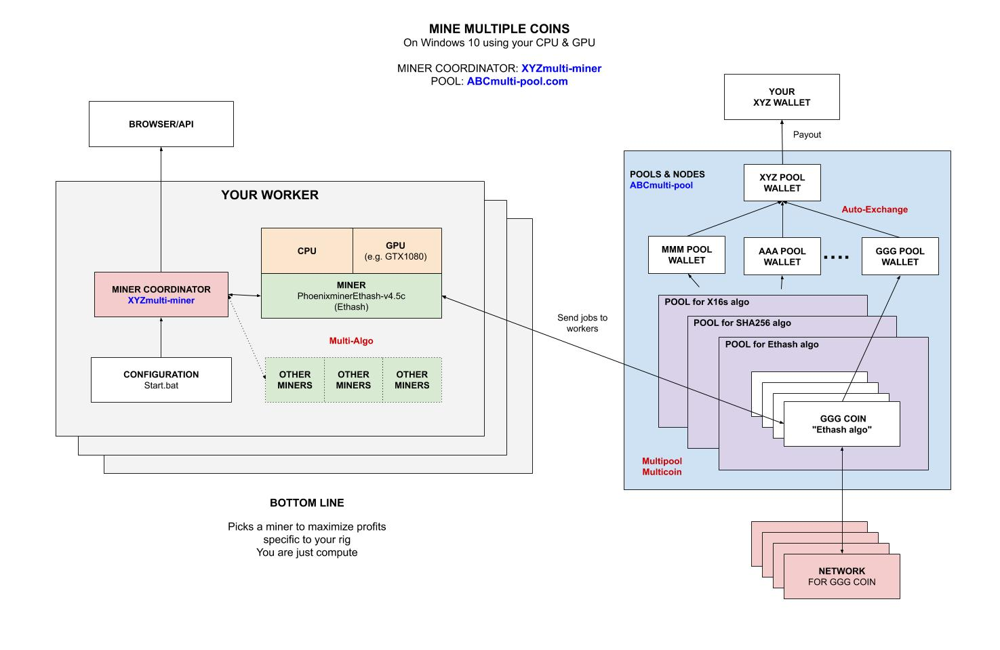

# MINE MULTIPLE COINS WINDOWS GPU USING SNIFFDOGMINER CHEAT SHEET

`mine-MULTI-windows-gpu-sniffdogminer` _will show you
how to mine for multiple coins
on your Windows 10 GPU
using `sniffdogminer` mining software
connected to the `zergpool.com` pool._

My other mining cheatsheets,

* **FULL NODE**
  * [mine-ZEC-macOS-cpu-zcashd](https://github.com/JeffDeCola/my-cheat-sheets/tree/master/other/mining-cryptocurrency/full-node/mine-ZEC-macOS-cpu-zcashd-cheat-sheet)
* **MULTIPLE POOLS**
  * [mine-MULTICOINS-windows-gpu-multipoolminer](https://github.com/JeffDeCola/my-cheat-sheets/tree/master/other/mining-cryptocurrency/multiple-pools/mine-MULTICOINS-windows-gpu-multipoolminer-cheat-sheet)
  * [mine-MULTICOINS-windows-gpu-sniffdogminer](https://github.com/JeffDeCola/my-cheat-sheets/tree/master/other/mining-cryptocurrency/multiple-pools/mine-MULTICOINS-windows-gpu-sniffdogminer-cheat-sheet)
    **YOU ARE HERE**
* **POOLS**
  * [mine-BEAM-windows-gpu-lolMiner](https://github.com/JeffDeCola/my-cheat-sheets/tree/master/other/mining-cryptocurrency/pools/mine-BEAM-windows-gpu-lolMiner-cheat-sheet)
  * [mine-BTG-windows-gpu-gminer](https://github.com/JeffDeCola/my-cheat-sheets/tree/master/other/mining-cryptocurrency/pools/mine-BTG-windows-gpu-gminer-cheat-sheet)
  * [mine-RVN-windows-gpu-t-rex](https://github.com/JeffDeCola/my-cheat-sheets/tree/master/other/mining-cryptocurrency/pools/mine-RVN-windows-gpu-t-rex-cheat-sheet)
  * [mine-ZCL-windows-gpu-lolMiner](https://github.com/JeffDeCola/my-cheat-sheets/tree/master/other/mining-cryptocurrency/pools/mine-ZCL-windows-gpu-lolMiner-cheat-sheet)
  * [mine-ZEC-windows-gpu-funakoshiMiner](https://github.com/JeffDeCola/my-cheat-sheets/tree/master/other/mining-cryptocurrency/pools/mine-ZEC-windows-gpu-funakoshiMiner-cheat-sheet)
  * [mine-ZEL-windows-gpu-gminer](https://github.com/JeffDeCola/my-cheat-sheets/tree/master/other/mining-cryptocurrency/pools/mine-ZEL-windows-gpu-gminer-cheat-sheet)

Table of Contents,

* [OVERVIEW](https://github.com/JeffDeCola/my-cheat-sheets/tree/master/other/mining-cryptocurrency/multiple-pools/mine-MULTI-windows-gpu-sniffdogminer-cheat-sheet#overview)
* [MINER](https://github.com/JeffDeCola/my-cheat-sheets/tree/master/other/mining-cryptocurrency/multiple-pools/mine-MULTI-windows-gpu-sniffdogminer-cheat-sheet#miner)
* [POOL](https://github.com/JeffDeCola/my-cheat-sheets/tree/master/other/mining-cryptocurrency/multiple-pools/mine-MULTI-windows-gpu-sniffdogminer-cheat-sheet#pool)
* [RUN](https://github.com/JeffDeCola/my-cheat-sheets/tree/master/other/mining-cryptocurrency/multiple-pools/mine-MULTI-windows-gpu-sniffdogminer-cheat-sheet#run)
* [MONITOR](https://github.com/JeffDeCola/my-cheat-sheets/tree/master/other/mining-cryptocurrency/multiple-pools/mine-MULTI-windows-gpu-sniffdogminer-cheat-sheet#monitor)

Check out my cheat sheet on all the popular
[cryptocurrency](https://github.com/JeffDeCola/my-cheat-sheets/tree/master/other/mining-cryptocurrency/cryptocurrency/cryptocurrency-cheat-sheet).

## OVERVIEW

Instead of using a one miner and one pool, you will be
using multiple miners and multiple pools.

A "mining coordinator" will be used to determine what pool to mine to
based on your rig in order to maximize profits.
It will pick the best miner to use at the time and switch
between miners and pools as coin prices change, etc...

Since you are mining to multiple pools and will have
little bits of coins everywhere, the pool will automatically
exchange all those coins into one wallet.
I like to put everything into litecoin since its fast.

Here is an illustration of what we're going to do,



## MINER

Grab the latest Windows binary from
[https://github.com/pinpins/Sniffdogminer/releases](https://github.com/pinpins/Sniffdogminer/releases)

Place the folder anywhere on your rig.

## POOL

First, lets pick your pool. I picked
[zergpool.com](https://zergpool.com).

No registration is required, they do payouts in the currency
of you wallet address.  Simple.

## RUN

Create a `star.bat` file,

```bash

```

## MONITOR

You can locally monitor your mining software,

 [???](???)

Thats it, you're mining and wasting electricity.
