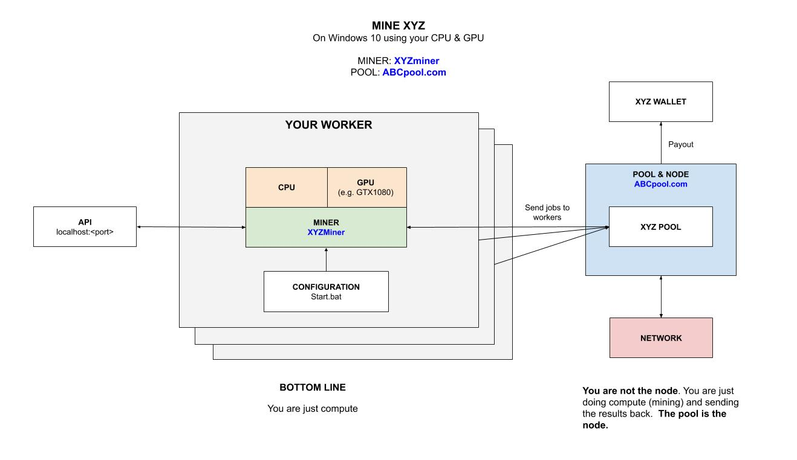

# MINE ZCL (Zclassic) WINDOWS GPU LOLMINER CHEAT SHEET

`mine-ZCL-windows-gpu-lolMiner` _will show you
how to mine for Zclassic (ZCL)
on your Windows 10 GPU
using `lolMiner` mining software
connected to a pool._

My other mining cheat sheets,

* **FULL NODE**
  * [mine-ZEC-macOS-cpu-zcashd](https://github.com/JeffDeCola/my-cheat-sheets/tree/master/other/mining-cryptocurrency/full-node/mine-ZEC-macOS-cpu-zcashd-cheat-sheet)
* **POOLS**
  * [mine-MULTI-windows-gpu-multipoolminer](https://github.com/JeffDeCola/my-cheat-sheets/tree/master/other/mining-cryptocurrency/pools/mine-MULTI-windows-gpu-multipoolminer-cheat-sheet)
  * [mine-ZCL-windows-gpu-lolMiner](https://github.com/JeffDeCola/my-cheat-sheets/tree/master/other/mining-cryptocurrency/pools/mine-ZCL-windows-gpu-lolMiner-cheat-sheet)
  **YOU ARE HERE**
  * [mine-ZEC-windows-gpu-funakoshiMiner](https://github.com/JeffDeCola/my-cheat-sheets/tree/master/other/mining-cryptocurrency/pools/mine-ZEC-windows-gpu-funakoshiMiner-cheat-sheet)

Table of Contents,

* [OVERVIEW](https://github.com/JeffDeCola/my-cheat-sheets/tree/master/other/mining-cryptocurrency/pools/mine-ZCL-windows-gpu-lolMiner-cheat-sheet#overview)
* [MINER](https://github.com/JeffDeCola/my-cheat-sheets/tree/master/other/mining-cryptocurrency/pools/mine-ZCL-windows-gpu-lolMiner-cheat-sheet#miner)
* [RUN](https://github.com/JeffDeCola/my-cheat-sheets/tree/master/other/mining-cryptocurrency/pools/mine-ZCL-windows-gpu-lolMiner-cheat-sheet#run)

Check out my cheat sheet on all the popular
[cryptocurrency](https://github.com/JeffDeCola/my-cheat-sheets/tree/master/other/mining-cryptocurrency/cryptocurrency/cryptocurrency-cheat-sheet).

## OVERVIEW

Here is an illustration of what we're going to do,



## MINER

`lolMiner` is a AUTO192_7 CUDA Miner.

Grab the latest Windows binary from
[github.com/Lolliedieb/lolMiner-releases/releases/](https://github.com/Lolliedieb/lolMiner-releases/releases/)
and place the folder anywhere on your rig.

## RUN

To run on `miningpoolhub.com` create a `start.bat` file,

```bash
setx GPU_FORCE_64BIT_PTR 1
setx GPU_MAX_HEAP_SIZE 100
setx GPU_USE_SYNC_OBJECTS 1
setx GPU_MAX_ALLOC_PERCENT 100
setx GPU_SINGLE_ALLOC_PERCENT 100

lolMiner.exe
--coin AUTO192_7
--pool us-east.equihash-hub.miningpoolhub.com
--port 20574
--user <USER>.<WORKER>
```

Thats it, you're mining and wasting electricity.
