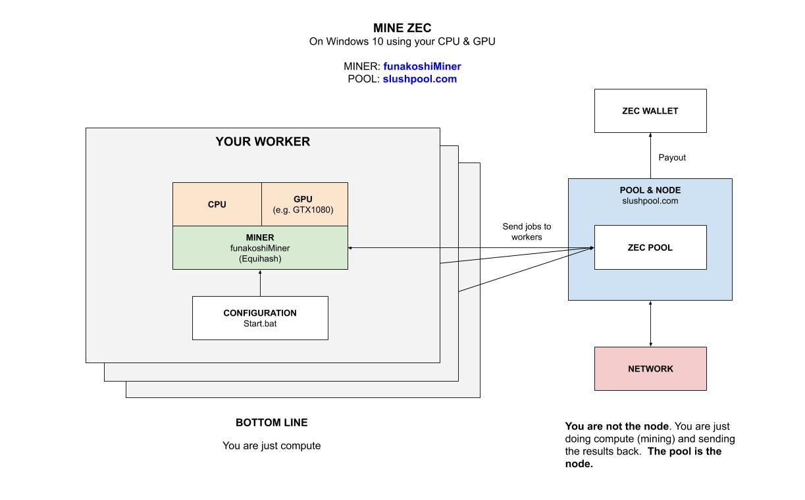

# MINE ZEC WINDOWS GPU FUNAKOSHIMINER CHEAT SHEET

`mine-ZEC-windows-gpu-funakoshiMiner` _will show you
how to mine for Zcash (ZEC)
on your Windows 10 GPU
using `funakoshiMiner` mining software
connected to the `SlushPool.com` pool._

This is **pool based**, meaning the software will not work independently
since you would need a full node.  **The pool keeps the node**.

My other mining cheatsheets,

* FULL NODE
  * [mine-ZEC-macOS-cpu-zcashd](https://github.com/JeffDeCola/my-cheat-sheets/tree/master/other/mining-cryptocurrency/full-node/mine-ZEC-macOS-cpu-zcashd)
* POOLS
  * [mine-MULTI-windows-gpu-multipoolminer](https://github.com/JeffDeCola/my-cheat-sheets/tree/master/other/mining-cryptocurrency/pools/mine-MULTI-windows-gpu-multipoolminer)
  * [mine-ZEC-windows-gpu-funakoshiMiner](https://github.com/JeffDeCola/my-cheat-sheets/tree/master/other/mining-cryptocurrency/pools/mine-ZEC-windows-gpu-funakoshiMiner)
  **YOU ARE HERE**

Table of Contents,

* [OVERVIEW](https://github.com/JeffDeCola/my-cheat-sheets/tree/master/other/mining-cryptocurrency/pools/mine-ZEC-windows-gpu-funakoshiMiner#overview)
* [POOL (slushpool.com)](https://github.com/JeffDeCola/my-cheat-sheets/tree/master/other/mining-cryptocurrency/pools/mine-ZEC-windows-gpu-funakoshiMiner#pool-slushpoolcom)
* [MINER (funakoshiMiner)](https://github.com/JeffDeCola/my-cheat-sheets/tree/master/other/mining-cryptocurrency/pools/mine-ZEC-windows-gpu-funakoshiMiner#miner-funakoshiminer)
  * [INSTALL](https://github.com/JeffDeCola/my-cheat-sheets/tree/master/other/mining-cryptocurrency/pools/mine-ZEC-windows-gpu-funakoshiMiner#install)
* [RUN](https://github.com/JeffDeCola/my-cheat-sheets/tree/master/other/mining-cryptocurrency/pools/mine-ZEC-windows-gpu-funakoshiMiner#run)

Check out my cheat sheet on all the popular
[cryptocurrency](https://github.com/JeffDeCola/my-cheat-sheets/tree/master/other/mining-cryptocurrency/cryptocurrency/cryptocurrency-cheat-sheet).

## OVERVIEW

Here is an illustration of what we're going to do,



## POOL (slushpool.com)

You really can use any pool, but I choose
[slushpool.com](https://slushpool.com).

Provide them a wallet to put your mined coins.
And then created a worker for ZEC coins in your dashboard.

## MINER (funakoshiMiner)

`FunakoshiMiner` is a Equihash CUDA Miner.  So it works with ZEC and ETH
but not bitcoin.

### INSTALL

Grab the latest Windows binary from
[github.com/funakoshi2718/funakoshi-miner](https://github.com/funakoshi2718/funakoshi-miner)

Place the folder anywhere on your rig.

## RUN

In `Start.bat`,

```bash
funakoshiMiner.exe \
--server us-east.zec.slushpool.com \
--port 4444 \
--user <USER>.<WORKER>
```

Thats it, you're mining and wasting electricity.
