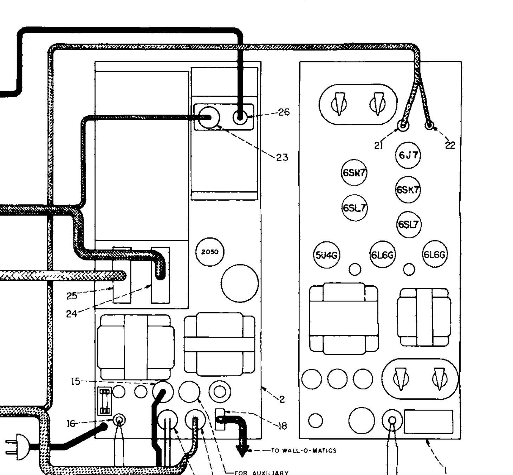
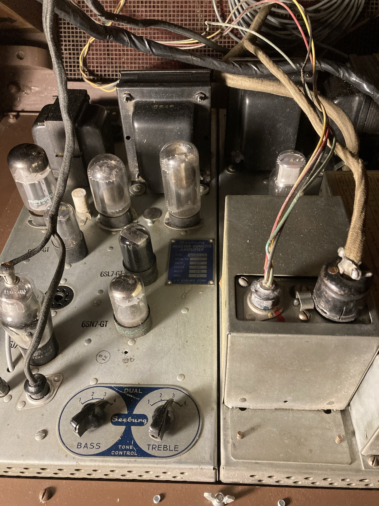

# SEEBURG 1952 M100C JUKEBOX CHEAT SHEET

_Parts and part numbers._

[GitHub Webpage](https://jeffdecola.github.io/my-cheat-sheets/)

## FUSES

* **5 amp 3AG** (1)
* **1 amp 3AG** (1)
* **2 amp 3AG SLO-BLO** (2)
* **3 amp Fustat** (1)

## LIGHTS

* **TOP**
  * **Ballast** 405101 (1) tbd (Discontinued Part)
  * **Starter** 405138 (1) FS-25
  * **Flourescent Tube** 405136 (1)
    * 33", 25-watt, Daylight (5500K-6500K), T12 Bulb Shape
    * GE 10299 - F25T12/D/33 - 25 watt, 6500K, 1600 Lumens
    * Hard to find, Discontinued

* **BOTTOM**
  * **Ballast** 405546 (1) ADVANCE L-220F (Discontinued Part)
  * **Starter** 405138 (2) FS2 or FS-25
  * **Flourescent Tubes** 405547 (2)
    * 24", 20-watt, Daylight (5500K-6500K), T12 Bulb Shape
    * SYLVANIA 22083 - F20T12/D - 20 Watt, 6500K, 1075 Lumens
    * PHILIPS 273284 - F20T12/D ALTO - 20 Watt, 6500K, 1075 Lumens
    * GE 80047 - F20T12/D/ECO - 20 watt, 6500K, 1025 Lumens

## VACUUM TUBES

RCA made the tubes for the seeburg.

* **MRA3-L6 MASTER REMOTE AMPLIFIER**
  * **6J7** (1)
  * **6SN7GT** (1)
  * **6SK7** (1)
  * **6SL7GT** (2)
  * **6L6G** (2)
  * **5U4G** (1)

* **WSR-L6 WIRED SELECTION RECEIVER**
  * **2050** (1) - Get the RCA with Green letters. Seeburg name on it.

