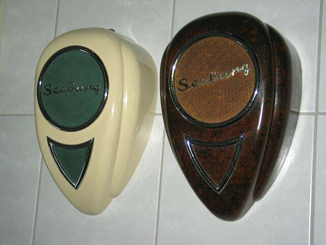

# SEEBURG 1952 M100C JUKEBOX CHEAT SHEET

_M100C parts and part numbers._

Table on Contents,

* [M100C](https://github.com/JeffDeCola/my-cheat-sheets/tree/master/other/random-stuff/seeburg-1952-m100c-jukebox-cheat-sheet#m100c)
  * [FUSES](https://github.com/JeffDeCola/my-cheat-sheets/tree/master/other/random-stuff/seeburg-1952-m100c-jukebox-cheat-sheet#fuses)
  * [LIGHTS](https://github.com/JeffDeCola/my-cheat-sheets/tree/master/other/random-stuff/seeburg-1952-m100c-jukebox-cheat-sheet#lights)
  * [VACUUM TUBES](https://github.com/JeffDeCola/my-cheat-sheets/tree/master/other/random-stuff/seeburg-1952-m100c-jukebox-cheat-sheet#vacuum-tubes)
* [3W1 "WALL-O-MATIC"](https://github.com/JeffDeCola/my-cheat-sheets/tree/master/other/random-stuff/seeburg-1952-m100c-jukebox-cheat-sheet#3w1-wall-o-matic)
* [TEARDROP EXTERNAL SPEAKERS](https://github.com/JeffDeCola/my-cheat-sheets/tree/master/other/random-stuff/seeburg-1952-m100c-jukebox-cheat-sheet#teardrop-external-speakers)

[GitHub Webpage](https://jeffdecola.github.io/my-cheat-sheets/)

## M100C

* Model: M100C
* Third in series M100A, M100B, M100C
* Year: 1952
* Speed: 45 rpm
* Selectors: 100
* Records: 50
* Produced: 38,200
* Dimentions (HxWxD): 54" x 35" x 26"
* Weight: 305 lbs
* Remote Speaker: [Teardrop]()
* Wallbox: [3W1 "WALL-O-MATIC"]()
* Cabinet Key: G245
* Coins: 5, 10, 25 cents

### FUSES

There are a total of 5 fuses. 3AG stands for the 3rd size of “Automobile Glass” fuses.

* 3AG FUSES  (.25" Diameter, 1.25" in length)
  * **5 amp 3AG** (1) - ??FAST BLOW, VOLTAGE??
  * **1 amp 3AG** (1) - ??FAST BLOW, VOLTAGE??
  * **2 amp 3AG SLO-BLO** (2) ??VOLTAGE??
* FUSTAT FUSES  
  * **3 amp Fustat** (1) ??VOLTAGE??

### LIGHTS

There are a total of 3 Flourescent lights.

* TOP
  * **Ballast** 405101 (1)
    * ??FIND THIS PART NUMBER?? (Discontinued)
  * **Starter** 405138 (1)
    * FS-25
  * **Flourescent Tube** 405136 (1)
    * 33", 25-watt, Daylight (5500K-6500K), T12 Bulb Shape
    * GE 10299 - F25T12/D/33 - 25 watt, 6500K, 1600 Lumens (Discontinued)

* BOTTOM
  * **Ballast** 405546 (1)
    * ADVANCE L-220F (Discontinued Part)
    * T12 Magnetic Ballasts
  * **Starter** 405138 (2)
    * FS2 or FS-25
  * **Flourescent Tubes** 405547 (2)
    * 24", 20-watt, Daylight (5500K-6500K), T12 Bulb Shape
    * SYLVANIA 22083 - F20T12/D - 20 Watt, 6500K, 1075 Lumens
    * PHILIPS 273284 - F20T12/D ALTO - 20 Watt, 6500K, 1075 Lumens
    * GE 80047 - F20T12/D/ECO - 20 watt, 6500K, 1025 Lumens

### VACUUM TUBES

There are a total of 8 vacuum tubes.
RCA made the tubes for the seeburg.

* **MRA3-L6** MASTER REMOTE AMPLIFIER
  * **6J7** (1) - Anode cap on top.
  * **6SN7-GT** (1)
  * **6SK7-GT** (1) - Empty, not sure it's needed
  * **6SL7-GT** (2)
  * **6L6-G** (2)
  * **5U4-G** (1)

* **WSR5-L6** WIRED SELECTION RECEIVER
  * **2050** (1) - Get the RCA tube with Green letters. Seeburg name on it.

## 3W1 "WALL-O-MATIC"

* Model: 3W1 "Wall-O-Matic"
* Years: 1949-1958
* Selections: 100
* Produced: 221,000
* Coins: 5, 10, 25 cents
* Dimensions (HxWxD): 13"x12"x6"
* Weight: 20lbs

## TEARDROP EXTERNAL SPEAKERS

* Models
  * CVWS1-8: Bakelite brown finish
  * CVWS2-8: Ivory finish
  * CVS4-8: Ivory finish with smaller Seeburg logo
* CVWS: Constant Voltage Wall Speaker
* Chrome Logo
* Years: 1949-1954
* Produced: tbd
* Dimensions (HxWxD): 17"x11"x5.5"
* Weight: 12 lbs

