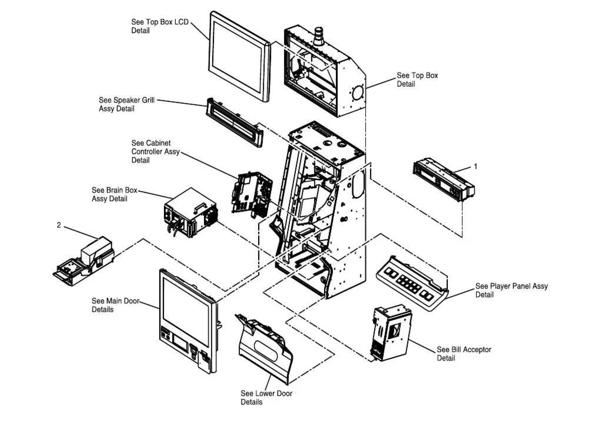
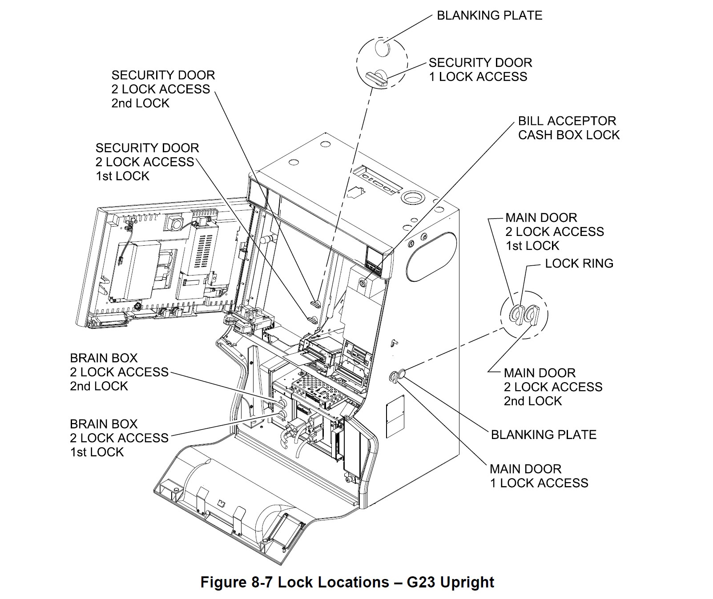
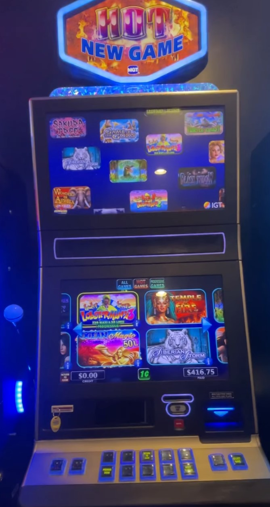
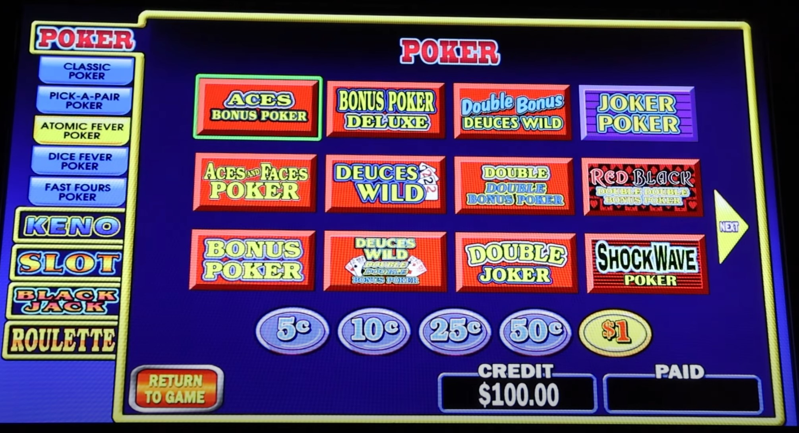

# IGT G23 and G23V2 UPRIGHT VIDEO SLOT MACHINE CHEAT SHEET

_International Game Technology (IGT) G23 and G23v2
Advanced Video Platform (AVP)
Premium Upright
Video Gaming Terminal (VGT)
Video Slot Machine. Or the **IGT G23 UPRIGHT** for short._

Table on Contents

* [TODO](https://github.com/JeffDeCola/my-cheat-sheets/tree/master/other/random-things/igt-g23-and-g23v2-upright-video-slot-machine-cheat-sheet#todo)
* [MANUALS](https://github.com/JeffDeCola/my-cheat-sheets/tree/master/other/random-things/igt-g23-and-g23v2-upright-video-slot-machine-cheat-sheet#manuals)
* [IGT G23 UPRIGHT OVERVIEW](https://github.com/JeffDeCola/my-cheat-sheets/tree/master/other/random-things/igt-g23-and-g23v2-upright-video-slot-machine-cheat-sheet#igt-g23-upright-overview)
* [SPECIFICATIONS](https://github.com/JeffDeCola/my-cheat-sheets/tree/master/other/random-things/igt-g23-and-g23v2-upright-video-slot-machine-cheat-sheet#specifications)
* [LOCK LOCATIONS](https://github.com/JeffDeCola/my-cheat-sheets/tree/master/other/random-things/igt-g23-and-g23v2-upright-video-slot-machine-cheat-sheet#lock-locations)
* [BRAIN BOX](https://github.com/JeffDeCola/my-cheat-sheets/tree/master/other/random-things/igt-g23-and-g23v2-upright-video-slot-machine-cheat-sheet#brain-box)
  * [COMPLETE ASSEMBLY](https://github.com/JeffDeCola/my-cheat-sheets/tree/master/other/random-things/igt-g23-and-g23v2-upright-video-slot-machine-cheat-sheet#complete-assembly)
  * [MOBO](https://github.com/JeffDeCola/my-cheat-sheets/tree/master/other/random-things/igt-g23-and-g23v2-upright-video-slot-machine-cheat-sheet#mobo)
* [KEYS](https://github.com/JeffDeCola/my-cheat-sheets/tree/master/other/random-things/igt-g23-and-g23v2-upright-video-slot-machine-cheat-sheet#keys)
* [IGT BASE OS](https://github.com/JeffDeCola/my-cheat-sheets/tree/master/other/random-things/igt-g23-and-g23v2-upright-video-slot-machine-cheat-sheet#igt-base-os)
* [IGT PLATFORM SOFTWARE](https://github.com/JeffDeCola/my-cheat-sheets/tree/master/other/random-things/igt-g23-and-g23v2-upright-video-slot-machine-cheat-sheet#igt-platform-software)
* [BOOT CHIPS](https://github.com/JeffDeCola/my-cheat-sheets/tree/master/other/random-things/igt-g23-and-g23v2-upright-video-slot-machine-cheat-sheet#boot-chips)
* [MAKE CHANGES ON MACHINE](https://github.com/JeffDeCola/my-cheat-sheets/tree/master/other/random-things/igt-g23-and-g23v2-upright-video-slot-machine-cheat-sheet#make-changes-on-machine)
* [INSTALL NEW GAMES](https://github.com/JeffDeCola/my-cheat-sheets/tree/master/other/random-things/igt-g23-and-g23v2-upright-video-slot-machine-cheat-sheet#install-new-games)
* [AVP GAMES](https://github.com/JeffDeCola/my-cheat-sheets/tree/master/other/random-things/igt-g23-and-g23v2-upright-video-slot-machine-cheat-sheet#avp-games)
  * [FAMILY 20 GAMES](https://github.com/JeffDeCola/my-cheat-sheets/tree/master/other/random-things/igt-g23-and-g23v2-upright-video-slot-machine-cheat-sheet#family-20-games)
  * [FAMILY 14 GAMES](https://github.com/JeffDeCola/my-cheat-sheets/tree/master/other/random-things/igt-g23-and-g23v2-upright-video-slot-machine-cheat-sheet#family-14-games)

## TODO

* Get 821-4XX-0X software manual
* Can you run game king multi-game with other slot games such as wolf run, etc.
* Should I get Family 20 games
* WHEN BUYING
  * Can I do MultiPlay games
  * Can I get some 3d games
  * Want 1TB SSD
  * Want 4GB RAM
  * Is this AVP 4.0, Should i get that for 3d games and for family 20?
  * I want Family 20 - Can I get Deuces wild with this
  * Stand
  * Bill
  * TITO
  * I want the owners manual
  * I want lock assemblies
  * Can I get a show boot?
  * Alaska, Arizona, Arkansas, Kentucky, Maine, Minnesota, Nevada, Ohio,
    Rhode Island, Texas, Utah, Virginia, West Virginia

## MANUALS

* 821-434-00: MECHANICAL PARTS (IGT G23 V2 UPRIGHT)
* 821-287-07: MACHINE INSTALLATION(IGT G23 V2 UPRIGHT)
* 821-423-XX: MACHINE SPECIFICATIONS (IGT G23 V2 UPRIGHT)
* 821-4XX-0X: MACHINE SOFTWARE (FAMILY 014) (IGT G23 V2 UPRIGHT) <- NEED THIS!!!

## IGT G23 UPRIGHT OVERVIEW

International Game Technology (IGT) makes the
**IGT G23 Premium Widescreen Upright Video Gaming Terminal (VGT) Video Slot Machine**
or the **IGT G23 UPRIGHT** for short. The second generation is the **G23V2**.
The G23 uses IGT's Advance Video Platform (AVP) that include electronics, software and games.
There are two families of games, Family 14 and Family 20.
Series 20 or Family 020 is "Ascent" platform with quite a bit changes from AVP Family 014.

Could have 2 SSDs.  One with family 14 and one with family 20.  Just swap them out.
I do think Family 20 games want a AVP 4.0.

## SPECIFICATIONS

|                          |                           | **G23**             | **G23V2**            |
|:-------------------------|:--------------------------|:--------------------|:---------------------|
| **GENERAL**              |                           |                     |                      |
|                          | PART NUMBER               | -                   | ??                   |
|                          | YEAR BUILT                | -                   | 2011                 |
|                          | ELECTRONICS VERSION       | -                   | AVP 3.0 ME           |
| **PHYSICAL**             |                           |                     |                      |
|                          | DIMENSIONS                | -                   | 25"W x 23"D x 54"H   |
|                          | WEIGHT                    | -                   | 266 lbs              |
| **OS**                   |                           |                     |                      |
|                          | FAMILY 20                 | -                   | OI0200200602 (2020)  |
|                          | FAMILY 14 (Same as below) | -                   | AI014-B0C (???)      |
| **PLATFORM SW**          |                           |                     |                      |
|                          | ASCENT (FAMILY 20)        | -                   | AI020000G0004 (2016) |
|                          | FAMILY 14 (Same as above) | -                   | AI014-B0C (???)      |
| **BOOT CHIPS 1+2**       |                           |                     |                      |
|                          | BIOS BOOT CHIPS (FAM14)   | -                   | ??                   |
|                          | BIOS BOOT CHIPS (FAM20)   | -                   | ??                   |
|                          | BIOS SHOW BOOT (FAM14)    | -                   | AVPSB014B3004 (2012) |
|                          | BIOS SHOW BOOT (FAM20)    | -                   | ??                   |
| **BRAIN BOX (MPU)**      |                           |                     |                      |
|                          | AVP 3.0ME ASSEMBLY        | -                   | **660** 50066001W    |
|                          | - MOBO AVP 3.0ME ASSEMBLY | -                   | 75530500W            |
|                          | - - MOTHERBOARD AVP 3.0ME | -                   | 75516000W            |
|                          | DDR2 2GB (GET 4GB)        | -                   | 76829990W            |
|                          | SSD 80GB (GET 1TB)        | -                   | 29132590W            |
|                          | ATI RADEON E4690 512MB    | -                   | 75608090W            |
|                          | SIGNATURE CARD I/O v2.16  | -                   | 75438803W            |
| **CABINET CTRL ASSEMBLY**|                           |                     |                      |
|                          | PCB BOARD 1               | -                   | 75832800W            |
|                          | PCB BOARD 2               | -                   | 75832500W            |
|                          | PCB BOARD 3               | -                   | 75402300W            |
| **ETHERNET**             |                           |                     |                      |
|                          | ETHERNET ASSEMBLY         | -                   | 60869000             |
| **LED LIGHTBAR CONTROL** |                           |                     |                      |
|                          | PCB CONTROL ASSEMBLY      | -                   | 76941401W            |
| **AUDIO**                |                           |                     |                      |
|                          | AUDIOVOX 3.1 SPKR-AMP ASS | -                   | 13805900W            |
| **TICKET IN/OUT (TITO)** |                           |                     |                      |
|                          | TICKET GEN II (NETPLEX)   | -                   | 30921002W            |
|                          | TICKET GEN III (EVOLUTION)| -                   | 30925000             |
| **BILL ACCEPTOR**        |                           |                     |                      |
|                          | MEI 67MM NTPLX V2         | -                   | 62554890             |
|                          | UBA STANDARD              |                     | 62577290             |
|                          | UBA STANDARD (SMART)      |                     | 62577390             |
| **CARD READER**          |                           |                     |                      |
|                          | PLAYERS CARD RDER ASSBLY  | -                   | 608009405W           |
| **TOPPER**               |                           |                     |                      |
|                          | TOPPER/CANDLE             | -                   | 19134791             |
| **FRONT BUTTONS**        |                           |                     |                      |
|                          | BUTTON DYN EDGE-LIT (x14) | -                   | 51841903             |
| **SCREENS**              |                           |                     |                      |
|                          | TOP LCD MONITOR 23" 16:9  | -                   | 69970225W            |
|                          | BOTTOM TOUCH MLD 22" 16:9 | -                   | 69972407W            |
| **POWER**                |                           |                     |                      |
|                          | POWER SUPPLY ASSEMBLY     | -                   | 40814108             |
|                          | AC PWR DIST BOX ASSEMBLY  | -                   | 50062700             |
| **EXTERNAL PARTS**       |                           |                     |                      |
|                          | RESET KEY                 | -                   | Gold Key             |
|                          | EKEY  (USB DONGLE)        | -                   | 000007               |
|                          | DIAG KEY (FAM 20) (USB)   | -                   | DIAGUNV00114 (2019)  |
|                          | DIAG KEY (FAM 14) (USB)   | -                   | DIAGNOSTIC-014-21 (2014) |

## LOCK LOCATIONS

There are 4 main locks,

* MAIN DOOR (1 or 2 LOCKS)
* SECURITY DOOR (1 or 2 LOCKS)
* BRAIN BOX (1 or 2 LOCKS)
* BILL ACCEPTOR

## BRAIN BOX

### COMPLETE ASSEMBLY

Upgrade to 1TB SSD and 4GB RAM.

* **690**
  * 50069000 - AVP 4.0 ASSEMBLY (2014/2015)
* **660**
  * 50066001W - AVP 3.0ME ASSEMBLY
    * Same as below plus NF
  * 50066000W - AVP 3.0ME ASSEMBLY (2013)
    * AMD Turion Dual Core 2.1GHz, 2GB RAM
* **621**
  * 50062100W AVP 3.0ME ASSEMBLY

### MOBO

* 75530400W - MOTHERBOARD ASSEMBLY
  * 75515001W - MOTHERBOARD
* 75530500W - MOTHERBOARD ASSEMBLY
  * 75516000W - MOTHERBOARD

## KEYS

**EKEY 7**

* EKEY 3 - INSTALL KEY (Such as OS or games)
* EKEY 4 - DIAGNOSTIC KEY (With diag key you can access diag menus)
* EKEY 5 - SETUP KEY (Change options for a game)
* EKEY 7 - INCLUDE ALL THREE KEYS (KEY 3, KEY 4, KEY 5) - **GET THIS**

**DIAG KEY**

* FAMILY 20
  * DIAGUNV00122 (2021)
  * DIAGUNV00120 (2020)
  * DIAGUNV00116 (2019)
  * DIAGUNV00114 (2019)
  * DIAGUNV00111 (2017)
* FAMILY 14
  * DIAGNOSTIC-014-21 (2014) - **GET THIS**
  * DIAGNOSTIC-014-20 (2013)
  * DIAGNOSTIC-014-09 (2012)

## IGT BASE OS

Family 20 breaks out OS and platform software.

* FAMILY 20
  * OI0200200602 / OSO200000602 (2020)
  * OI0200200507 / OSO200000507 (2018)
  * OI0200200404 / OSO200000404 (2016)
  * OI0200200302 / OSO200000302 (2014)
* FAMILY 14
  * See below

## IGT PLATFORM SOFTWARE

* FAMILY 20 (ASCENT)
  * AI020000G0004 / ASCENT020000G0004 (2016)
  * AI020000C0006 / ASCENT020000C0006 (2015)
  * AI020000C0002 / ASCENT020000C0002 (2014)
* FAMILY 14
  * AI014-B0D / AVP014-00609 (2018)
  * AI014-B0C / AVP014-00597 (???) - **GET THIS**
  * AI014-B0A / AVP014-00565
  * AI014-B08 / AVP014-00542
  * AI014-B07 / AVP014-00540
  * AI014-B04 / AVP014-00517 (2015)
  * AI014-B03 / AVP014-00510 - At least this for 8.3R
  * AI014-B02 / AVP014-00507
  * AI014-B00 / AVP014-00500
  * AI014-A0B / AVP014-00415
  * AI014-A09 / AVP014-00406 (2013)
  * AI014-AO6 / AVP014-00390 (2012)
  * AIO14-09H / AVP014-00336 (2011)
  * AIO14-045 / AVP014-00235 (2009)
  * AIO14-028 / AVP014-00219 (2008)

## BOOT CHIPS

**BIOS BOOT CHIPS 1+2**

* FAMILY 20
  * APR0000001
  * IBRF300USDM09 (2014)
  * IBRF300USDM07 (??)
* FAMILY 14
  * tbd

**BIOS SHOW BOOT CHIPS 1+2**

Get these. No license required to load games.

* FAMILY 20
  * tbd
* FAMILY 14
  * AVPSHOWL014-13 (2013)
  * AVPSB014B3004 (2012) - **GET THIS**

## MAKE CHANGES ON MACHINE

With zero credits on machine, insert Ekey into brain box.

## INSTALL NEW GAMES

To load software (games) you need,

* INSTALL USB THUMB DRIVE (Has game files on it)
* LICENSE USB THUMB DRIVE

You can also load games using Show boot chips (No license required).

## AVP GAMES

How read game part numbers,

* **GAME14-001JP6-E05**
  * FAMILY: **GAME14** (or GI014 or GC014)
  * FIRMWARE (GAME) ID: **001JP6**
  * VERSION: **E05**

### FAMILY 20 GAMES

| NUMBER                          | GAME                      | DETAILS                                 |
|:--------------------------------|:--------------------------|:----------------------------------------|
| ??                              | Lobstermania 3            | (x-Real, x-Line)                        |

### FAMILY 14 GAMES

| NUMBER                          | GAME                      | DETAILS                                 |
|:--------------------------------|:--------------------------|:----------------------------------------|
|                                 | Game King 8.3R Multi-Game | Poker, Slots, Keno, Blackjack, Roulette |
| GI014-000067-0004               | Cleopatra                 | (5-Real, 20-Line)                       |
| GI014-000039-0005               | Cleopatra II              | (5-Real, 20-Line)                       |
| GI014-001U31-0006               | Cleopatra MultiPlay       | (5-Real, 25-Line)                       |
| GIO14-001FY5-E066               | Lobstermania 2            | (5-Real, 40-Line)                       |
| GI014-001H19-C005               | Kitty Glitter             | (5-Real, 30-Line)                       |
| GI014-001O75-D008               | Wolf Run                  | (5-Real, 40-Line)                       |
| GI014-001X43-C003               | Wolf Run MultiPlay        | UP TO 4 GAMES                           |

