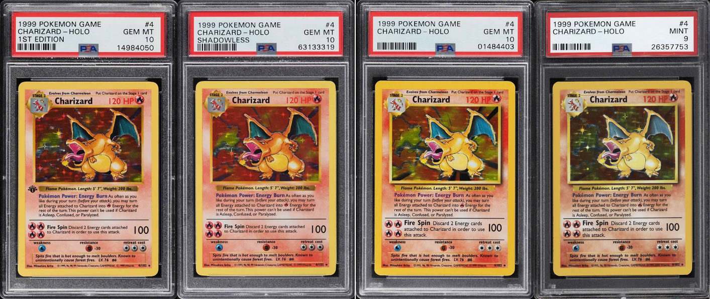

# POKEMON BASE SET 1st EDITION 1999 CHEAT SHEET

_The pokemon base set booster box._

Table of Contents

* [OVERVIEW](https://github.com/JeffDeCola/my-cheat-sheets/tree/master/other/random-things/pokemon-base-set-1st-edition-1999-cheat-sheet#overview)
* [VARIATIONS](https://github.com/JeffDeCola/my-cheat-sheets/tree/master/other/random-things/pokemon-base-set-1st-edition-1999-cheat-sheet#variations)

## OVERVIEW

* Fact Sheet
  * English version
  * 102 cards like the Japanese set released in 1996
  * Wizards of the Coast release
  * Released in 1999
  * 1st edition stamp
  * 1st edition cards are the most valuable
  * The most valuable card is the holographic Charizard

* The Set
  * 16 holographic cards (No. 1-16)
  * 16 rare cards (No. 17-22, 70-79)
  * 32 uncommon cards (No. 23-42, 80-90, 96)
  * 32 common cards (No. 43-69, 91-95)
  * 6 energy cards (No. 97-102)

* Formats
  * Booster box (36 packs of 11 cards each)
  * Theme decks
  * Starter decks

## PRINT VARIATIONS

* **FIRST EDITION (Thin stamp)**
  * Black 1st edition stamp
  * The "1" appears thinner, less bold
  * No drop shadow
  * Thinner typeface in the upper right HP portion of the card
  * Pikachu has red cheeks
* **FIRST EDITION (Thick stamp)**
  * Same as above but the "1" appears bolder and thicker
  * The letters "Edition" in the stamp tend to be thinner
  * Rarest and most desirable version
* **SHADOWLESS**
  * No drop shadow
  * Thinner typeface in the upper right HP portion of the card
  * Pikachu has red cheeks
* **UNLIMITED**
  * Drop shadow and copyright date "1995, 96, 98"
  * Pikachu has red cheeks
* **DATED UNLIMITED**
  * UK print
  * Copyright date 1999-2000
  * Pikachu has red cheeks

The following 4 variations,

