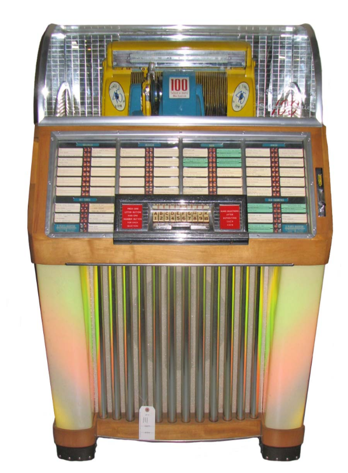
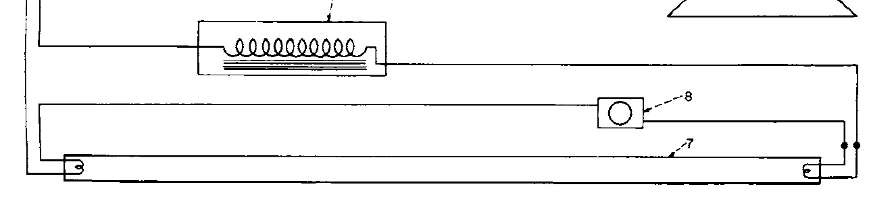
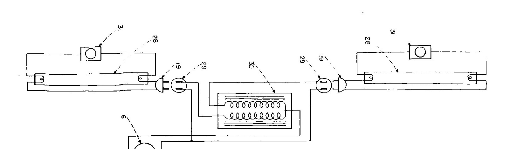
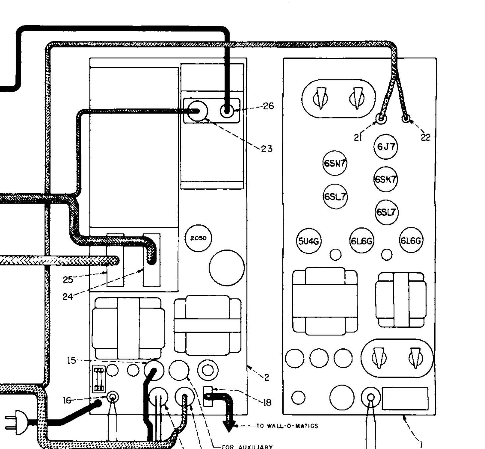
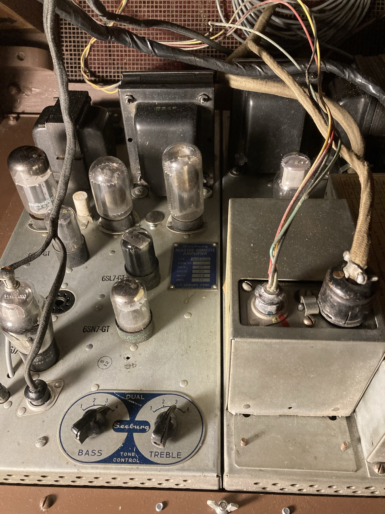
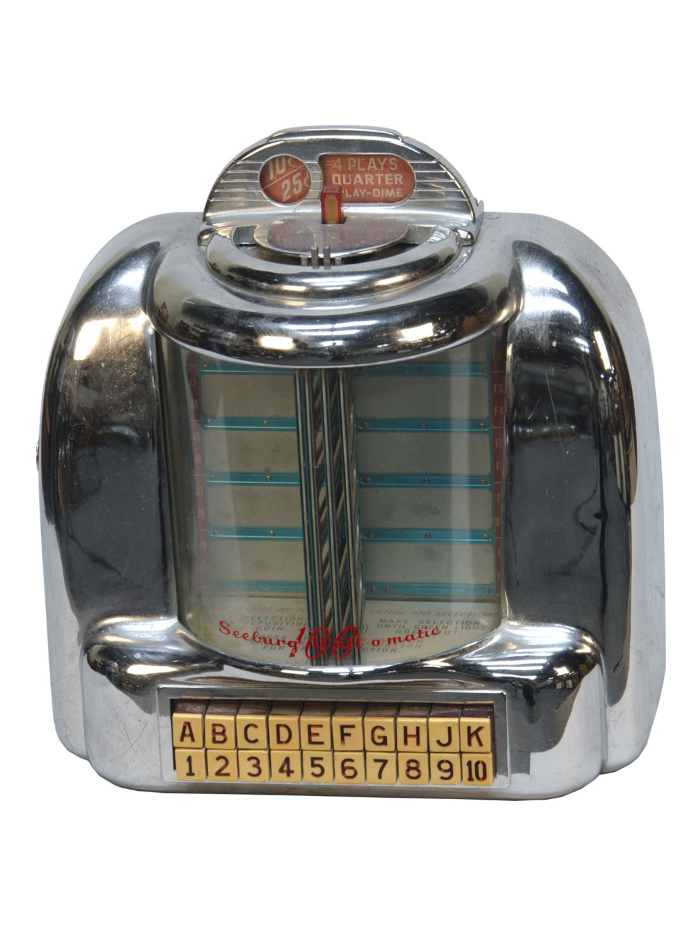
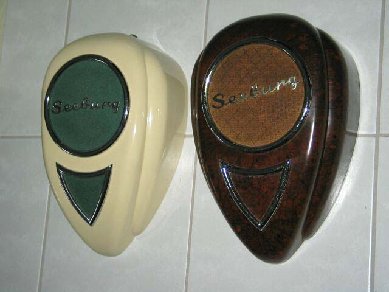
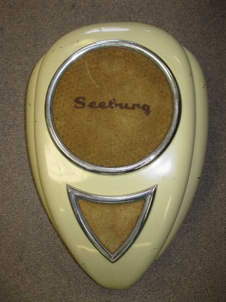
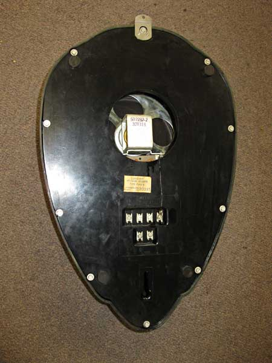

# SEEBURG 1952 M100C JUKEBOX CHEAT SHEET

_M100C parts and part numbers._

Table on Contents

* [M100C](https://github.com/JeffDeCola/my-cheat-sheets/tree/master/other/random-things/seeburg-1952-m100c-jukebox-cheat-sheet#m100c)
  * [FUSES](https://github.com/JeffDeCola/my-cheat-sheets/tree/master/other/random-things/seeburg-1952-m100c-jukebox-cheat-sheet#fuses)
  * [LIGHTS](https://github.com/JeffDeCola/my-cheat-sheets/tree/master/other/random-things/seeburg-1952-m100c-jukebox-cheat-sheet#lights)
  * [VACUUM TUBES](https://github.com/JeffDeCola/my-cheat-sheets/tree/master/other/random-things/seeburg-1952-m100c-jukebox-cheat-sheet#vacuum-tubes)
* [3W1 "WALL-O-MATIC"](https://github.com/JeffDeCola/my-cheat-sheets/tree/master/other/random-things/seeburg-1952-m100c-jukebox-cheat-sheet#3w1-wall-o-matic)
* [TEARDROP EXTERNAL SPEAKERS](https://github.com/JeffDeCola/my-cheat-sheets/tree/master/other/random-things/seeburg-1952-m100c-jukebox-cheat-sheet#teardrop-external-speakers)

## M100C

* Model: M100C
* Third in series M100A, M100B, M100C
* Year: 1952
* Speed: 45 rpm
* Selectors: 100
* Records: 50
* Produced: 38,200
* Dimensions (HxWxD): 54" x 35" x 26"
* Weight: 305 lbs
* Remote Speaker: [Teardrop](https://github.com/JeffDeCola/my-cheat-sheets/tree/master/other/random-things/seeburg-1952-m100c-jukebox-cheat-sheet#teardrop-external-speakers)

* Wallbox: [3W1 "WALL-O-MATIC"](https://github.com/JeffDeCola/my-cheat-sheets/tree/master/other/random-things/seeburg-1952-m100c-jukebox-cheat-sheet#3w1-wall-o-matic)
* Cabinet Key: G245
* Coins: 5, 10, 25 cents

### FUSES

There are a total of 5 fuses. 3AG stands for the 3rd size of “Automobile Glass” fuses.

* 3AG FUSES  (.25" Diameter, 1.25" in length)
  * **5 amp 3AG** (1) - ??FAST BLOW, VOLTAGE??
  * **3 amp 3AG** (1) - ??FAST BLOW, VOLTAGE??
  * **2 amp 3AG SLO-BLO** (2) ??VOLTAGE??
* FUSTAT FUSES
  * **3 amp Fustat** (1) ??VOLTAGE??

### LIGHTS

LAMPS (BULBS)

* SELECT PANEL LAMPS
  * Part #302141 (2) - Ba9s (6.3V 150mA, 1) Lamp #47
* MECHANISM LAMP
  * Part #f7917 (1) - Ba15s (6.5V 1020mA, 6W) #Mini Lamp #81
* RECORD INDICATOR
  * Part #?? (lots) - Ba9s (6.5V 250mA, 1.6) Mini Lamp #44

There are a total of 3 Fluorescent lights.

* TOP
  * **Ballast** 405101 (1)
    * ??FIND THIS PART NUMBER?? (Discontinued)
  * **Starter** 405138 (1)
    * FS-25
  * **Fluorescent Tube** 405136 (1)
    * 33", 25-watt, Daylight (5500K-6500K), T12 Bulb Shape
      * GE 10299 - F25T12/D/33 - 25 watt, 6500K, 1600 Lumens (Discontinued)

* BOTTOM
  * **Ballast** 405546 (1)
    * Manufacturer: ADVANCE
    * Model: L-220F (Discontinued)
    * Type: Magnetic Ballast (Older Technology)
    * Start Method: Preheat
    * Number of Lamps: 2
    * Operates Lamp type: F20T12
  * **Starter** 405138 (2)
    * FS2 or FS-25
  * **Flourescent Tubes** 405547 (2)
    * 24", 20-watt, Daylight (5500K-6500K), T12 Bulb Shape
      * SYLVANIA 22083 - F20T12/D - 20 Watt, 6500K, 1075 Lumens
      * PHILIPS 273284 - F20T12/D ALTO - 20 Watt, 6500K, 1075 Lumens
      * GE 80047 - F20T12/D/ECO - 20 watt, 6500K, 1025 Lumens

### VACUUM TUBES

There are a total of 8 vacuum tubes.
The originals are labeled "**by RCA for Seeburg**".

* **MRA3-L6 MASTER REMOTE AMPLIFIER**
  * NOT SURE
    * **6J7** (1) - Anode cap on top - Have 1 RCA Spare
  * PREAMP TUBES
    * **6SN7-GT** (1) **NEED 1 SPARE!**
    * **6SK7-GT** (1) - Empty Slot
    * **6SL7-GT** (2) - Have 1 Seeburg New Spare and 2 RCA Used Spare
  * POWER TUBES
    * **6L6-G** (2) - Expensive - Get matched pair
  * RECTIFIER TUBES (AC TO DC)
    * **5U4-G** (1) - Have 1 RCA Used Spare
* **WSR5-L6 WIRED SELECTION RECEIVER**
  * **2050** (1) - Have 1 Seeburg Used Spare

NOTES: G stands for its glass.
GT stands for glass tubular.
The 6SK7-GT tube controls the auto-volume control and recommend to leave empty.
Get the 2050 RCA tube with the Seeburg name in green letters.

Places to get tubes,

* [Tube Depot](https://www.tubedepot.com/)
* [Tube World Express](https://tubeworldexpress.com/)
* [Audio Tubes](https://www.audiotubes.com/)
* [The Tube Store](https://www.thetubestore.com/)

## 3W1 "WALL-O-MATIC"

* Model: 3W1 "Wall-O-Matic"
* Years: 1949-1958
* Selections: 100
* Produced: 221,000
* Coins: 5, 10, 25 cents
* Dimensions (HxWxD): 13"x12"x6"
* Weight: 20lbs

## TEARDROP EXTERNAL SPEAKERS

* Models
  * CVWS1-8: Bakelite brown finish
  * CVWS2-8: Ivory finish
  * CVS4-8: Ivory finish with smaller Seeburg logo
* CVWS: Constant Voltage Wall Speaker
* Chrome Logo
* Years: 1949-1954
* Produced: tbd
* Dimensions (HxWxD): 17"x11"x5.5"
* Weight: 12 lbs

