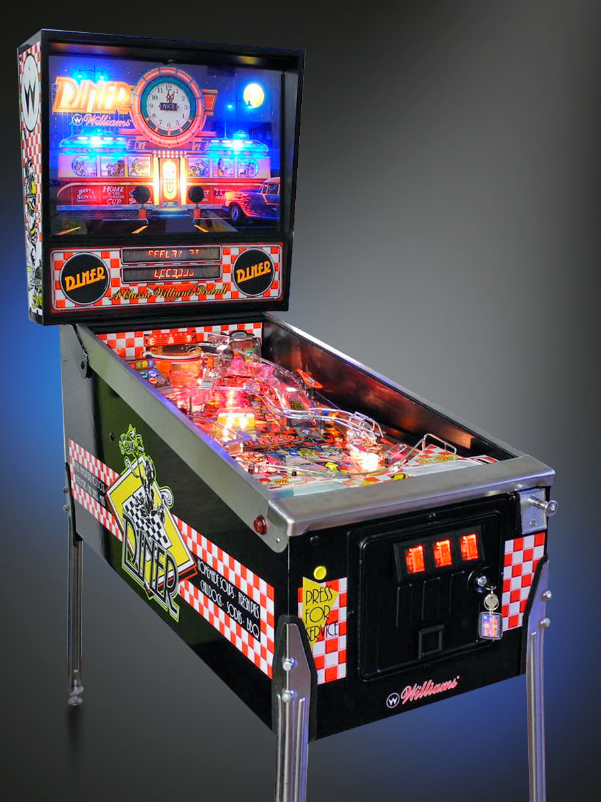
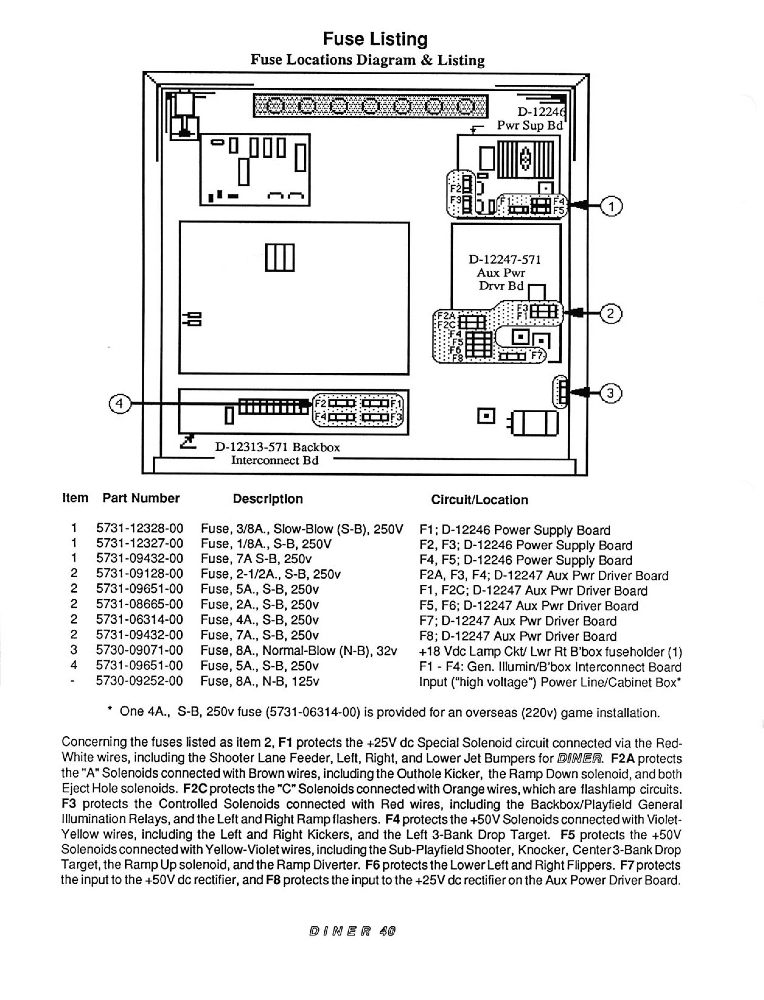

# WILLIAMS 1990 DINER PINBALL MACHINE CHEAT SHEET

_Parts and part numbers._

Table on Contents,

* [DINER OVERVIEW](https://github.com/JeffDeCola/my-cheat-sheets/tree/master/other/random-things/williams-diner-pinball-machine-cheat-sheet#diner-overview)
* [FUSES](https://github.com/JeffDeCola/my-cheat-sheets/tree/master/other/random-things/williams-diner-pinball-machine-cheat-sheet#fuses)
* [LEFT FLIPPER](https://github.com/JeffDeCola/my-cheat-sheets/tree/master/other/random-things/williams-diner-pinball-machine-cheat-sheet#left-flipper)

[GitHub Webpage](https://jeffdecola.github.io/my-cheat-sheets/)

## DINER OVERVIEW

* Model: 571
* Manufactured: Williams Electronic Games, Inc.
* part of ???
* Year: September, 1990
* Produced: 3,552
* Dimensions (WxDxH): 29" x 56" x 75"
* Weight: 250 lbs
* Players: 4
* Flippers: 2
* Ramps: 2
* Bumpers: 3
* Multi-ball: 2
* 3-Bank Drop Targets: 2
* Coins: 25 cents

## FUSES

There are a lot of fuses.

## LEFT FLIPPER

Since I needed to fix the left flipper, here are my notes.

* LEFT FLIPPER ASSEMBLY (C-13174-L)
  * Flipper Coil "Solenoid" (FL11630/50VDC)
  * Coil Stop (A-12111)
  * Lane change Switch Assembly: Not Used
  