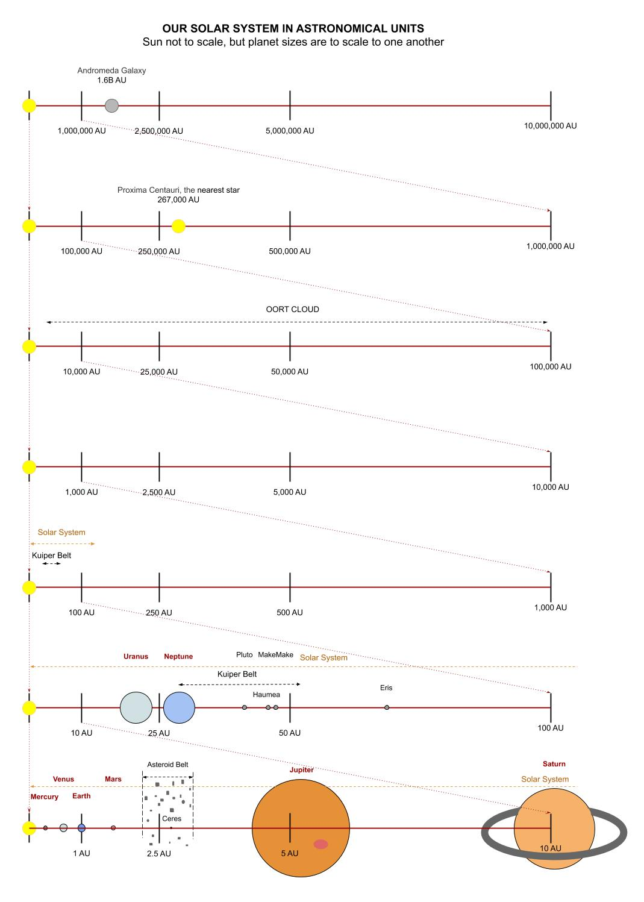

# OUR SOLAR SYSTEM CHEAT SHEET

`astronomy` _goes over the main celestial bodies
in our solar system and beyond._

* [SUN](https://github.com/JeffDeCola/my-cheat-sheets/blob/master/other/science/earth-and-space-science/astronomy-cheat-sheet/solar-system-and-beyond.md#sun)
* [INNER PLANETS](https://github.com/JeffDeCola/my-cheat-sheets/blob/master/other/science/earth-and-space-science/astronomy-cheat-sheet/solar-system-and-beyond.md#inner-planets)
  * [MERCURY](https://github.com/JeffDeCola/my-cheat-sheets/blob/master/other/science/earth-and-space-science/astronomy-cheat-sheet/solar-system-and-beyond.md#mercury)
  * [VENUS](https://github.com/JeffDeCola/my-cheat-sheets/blob/master/other/science/earth-and-space-science/astronomy-cheat-sheet/solar-system-and-beyond.md#venus)
  * [EARTH](https://github.com/JeffDeCola/my-cheat-sheets/blob/master/other/science/earth-and-space-science/astronomy-cheat-sheet/solar-system-and-beyond.md#earth)
    * [THE MOON](https://github.com/JeffDeCola/my-cheat-sheets/blob/master/other/science/earth-and-space-science/astronomy-cheat-sheet/solar-system-and-beyond.md#the-moon)
  * [MARS](https://github.com/JeffDeCola/my-cheat-sheets/blob/master/other/science/earth-and-space-science/astronomy-cheat-sheet/solar-system-and-beyond.md#mars)
* [THE ASTEROID BELT](https://github.com/JeffDeCola/my-cheat-sheets/blob/master/other/science/earth-and-space-science/astronomy-cheat-sheet/solar-system-and-beyond.md#the-asteroid-belt)
  * [CERES](https://github.com/JeffDeCola/my-cheat-sheets/blob/master/other/science/earth-and-space-science/astronomy-cheat-sheet/solar-system-and-beyond.md#ceres)
* [OUTER PLANETS](https://github.com/JeffDeCola/my-cheat-sheets/blob/master/other/science/earth-and-space-science/astronomy-cheat-sheet/solar-system-and-beyond.md#outer-planets)
  * [JUPITER](https://github.com/JeffDeCola/my-cheat-sheets/blob/master/other/science/earth-and-space-science/astronomy-cheat-sheet/solar-system-and-beyond.md#jupiter)
  * [SATURN](https://github.com/JeffDeCola/my-cheat-sheets/blob/master/other/science/earth-and-space-science/astronomy-cheat-sheet/solar-system-and-beyond.md#saturn)
  * [URANUS](https://github.com/JeffDeCola/my-cheat-sheets/blob/master/other/science/earth-and-space-science/astronomy-cheat-sheet/solar-system-and-beyond.md#uranus)
  * [NEPTUNE](https://github.com/JeffDeCola/my-cheat-sheets/blob/master/other/science/earth-and-space-science/astronomy-cheat-sheet/solar-system-and-beyond.md#neptune)
* [KUIPER BELT](https://github.com/JeffDeCola/my-cheat-sheets/blob/master/other/science/earth-and-space-science/astronomy-cheat-sheet/solar-system-and-beyond.md#kuiper-belt)
  * [PLUTO (DWARF PLANET)](https://github.com/JeffDeCola/my-cheat-sheets/blob/master/other/science/earth-and-space-science/astronomy-cheat-sheet/solar-system-and-beyond.md#pluto)
  * [HAUMEA (DWARF PLANET)](https://github.com/JeffDeCola/my-cheat-sheets/blob/master/other/science/earth-and-space-science/astronomy-cheat-sheet/solar-system-and-beyond.md#haumea)
  * [MAKEMAKE (DWARF PLANET)](https://github.com/JeffDeCola/my-cheat-sheets/blob/master/other/science/earth-and-space-science/astronomy-cheat-sheet/solar-system-and-beyond.md#makemake)
* [ERIS (DWARF PLANET)](https://github.com/JeffDeCola/my-cheat-sheets/blob/master/other/science/earth-and-space-science/astronomy-cheat-sheet/solar-system-and-beyond.md#eris)
* [OORT CLOUD](https://github.com/JeffDeCola/my-cheat-sheets/blob/master/other/science/earth-and-space-science/astronomy-cheat-sheet/solar-system-and-beyond.md#oort-cloud)
* [VOYAGER 1](https://github.com/JeffDeCola/my-cheat-sheets/blob/master/other/science/earth-and-space-science/astronomy-cheat-sheet/solar-system-and-beyond.md#voyager-1)
* [STARS (IN OUR MILKY WAY GALAXY)](https://github.com/JeffDeCola/my-cheat-sheets/blob/master/other/science/earth-and-space-science/astronomy-cheat-sheet/solar-system-and-beyond.md#stars-in-our-milky-way-galaxy)
  * [PROXIMA CENTAURI](https://github.com/JeffDeCola/my-cheat-sheets/blob/master/other/science/earth-and-space-science/astronomy-cheat-sheet/solar-system-and-beyond.md#proxima-centauri)
  * [SIRIUS](https://github.com/JeffDeCola/my-cheat-sheets/blob/master/other/science/earth-and-space-science/astronomy-cheat-sheet/solar-system-and-beyond.md#sirius)
  * [BETELGEUSE](https://github.com/JeffDeCola/my-cheat-sheets/blob/master/other/science/earth-and-space-science/astronomy-cheat-sheet/solar-system-and-beyond.md#betegeuse)
  * [RIGEL](https://github.com/JeffDeCola/my-cheat-sheets/blob/master/other/science/earth-and-space-science/astronomy-cheat-sheet/solar-system-and-beyond.md#rigel)
* [GALAXIES](https://github.com/JeffDeCola/my-cheat-sheets/blob/master/other/science/earth-and-space-science/astronomy-cheat-sheet/solar-system-and-beyond.md#galaxies)
  * [CANIS MAJOR DWARF GALAXY](https://github.com/JeffDeCola/my-cheat-sheets/blob/master/other/science/earth-and-space-science/astronomy-cheat-sheet/solar-system-and-beyond.md#canis-major-dwarf-galaxy)
  * [ANDROMEDA GALAXY](https://github.com/JeffDeCola/my-cheat-sheets/blob/master/other/science/earth-and-space-science/astronomy-cheat-sheet/solar-system-and-beyond.md#andromeda-galaxy)
  * [MACS0647-JD (FARTHEST OBJECT SEEN)](https://github.com/JeffDeCola/my-cheat-sheets/blob/master/other/science/earth-and-space-science/astronomy-cheat-sheet/solar-system-and-beyond.md#macs0647-jd-farthest-object-seen)

View my entire list of cheat sheets on
[my GitHub Webpage](https://jeffdecola.github.io/my-cheat-sheets/).

## OVERVIEW

Here is an illustration of our solar system, celestial bodies, and beyond,

## SUN

Our sun, in the grand scheme of things the sun is not very large and
not very hot.

* About 4.5 billions years old
* Yellow dwarf
* Radius is 700,000 KM
* Nuclear fusion of hydrogen to helium
* Cross section,
  * Core 15 Million degrees
  * Radiative Zone
  * Convective Zone
  * Photosphere
  * Chromosphere - Atmosphere    
  * Corona - Upper atmosphere

## INNER PLANETS

* .39-1.52 AU from the sun

The four smaller inner planets, also known as the “terrestrial planets”
(Mercury, Venus, Earth and Mars), are primarily composed of rock and metal.

### MERCURY

* Distance: .39 AU from the sun
* Orbit Period: 87.96 days to orbit the sun
* Rotate Axis: 58.7 days
* Surface Temperature: -173&deg;C to 427&deg;C 
* Diameter: 4,878 km (3,031 miles) 
* Mass: 5.5% of earth
* Moons: None
* Notable facts:
  * Little atmosphere
  * Most eccentric orbit (big eclipse)
  * Your weight on Mercury would be 38% of your weight on Earth
  * Smallest planet
  * Only two spacecraft have ever visited Mercury.

### VENUS

* Distance: .723 AU from the sun
* Orbit Period: 224.68 days to orbit the sun
* Rotate Axis: 243 days
* Surface Temperature: Can reach 471&deg;C
* Diameter: 12,104 km (7,521 miles) About the same size as earth
* Mass: 81.5% of earth
* Notable facts:
  * Co2 is at 96.5%, whereas earth is .04%
  * Pressure is 90 times of earth
  * Aside from sun and moon, brightest object in sky
  * Venus is thought to be made up of a central iron core,
    rocky mantle and silicate crust.
  * Hottest planet in our solar system.

### EARTH

* Distance: 1 AU (93,000,000 miles) from the sun
* Orbit Period: 365.26 days to orbit the sun
* Rotate Axis: 1 day
* Surface Temperature: -88&deg;C to 58&deg;C
* Diameter: 12,756 km (7,926 miles) 
* Mass: 100% of earth
* Moons: Look up
* Notable facts:
  * Powerful magnetic field
  * Only planet not named after a god
  * I live here

#### THE MOON

* Distance: 384,400 km from earth
* Orbit Period: 27.3 days to orbit the sun
* Rotate Axis: 27.3 days
* Surface Temperature: -233&deg;C to 123&deg;C
* Diameter: 3,475 km
* Mass: .01% of earth
* Notable facts
  * Actually made of cheese
  * Synchronous rotation
  * Copernicus and Brahe have craters named after them
  * We think Formed by another planet (thea) hitting the earth
    * To big to be just passing by and caught in orbit
  * Formed 30-50 million after the solar system.

### MARS

* Distance: 1.524 AU from the sun
* Orbit Period: About 2 years (686.98 days) to orbit the sun
* Rotate Axis: 24.6 hours
* Surface Temperature: -153&deg;C to 20&deg;C
* Diameter: 4,879 km (6,787 miles)
* Mass: 10.7% of earth
* Moons: 2
  * Phobos
  * Deimos
* Notable facts:
  * Mars and Earth have approx the same land mass
  * Martian surface gravity is only 37% of the Earth's
  * Thin atmosphere of C02
  * Massive dust storms
  * Tallest mountain in the solar system, at 21KM high
  * Second smallest planet in the solar system

## THE ASTEROID BELT

* 2.2-3.2 AU from the sun (about 1 AU thick)
* Millions of asteroids in this belt
* 200 known asteroids are larger than 100km
* Notable Asteroids
  * Ceres is dwarf planet like Pluto
* Asteroid Belt objects are made of rock and stone. 

### CERES

* Distance: 2.8 AU from the sun
* Orbit Period: 4.6 years to orbit the sun
* Rotate Axis: tbd
* Surface Temperature: -105&deg;C
* Diameter: 950 km (590 miles)
* Mass: tbd
* Notable facts:
  * Ceres accounts for one third of the mass in the asteroid belt.

## OUTER PLANETS

* 5.203-30.06 AU from the sun

The four outer planets, also known as the “gas giants”
(Jupiter, Saturn, Uranus and Neptune), are substantially
larger and more massive than the inner planets.

### JUPITER

* Distance: 5.203 AU from the sun
* Orbit Period: 11.862 years to orbit the sun
* Rotate Axis: 9.84 hours
* Surface Temperature: -148&deg;C to tbd&deg;C
* Diameter: 142,796 km (88,729 miles)
* Mass: 318 earths
* Moons: 67 (Gallileo discovered 4 of them)
  * Ganymede - Largest Moon in solar system (Larger than mercury)
* Notable facts
  * 4th brightest object in solar system
  * Largest Planet
  * The King of Planets
  * The red dot is a storm that has been ragging for over 300 years.
  * Mainly composed mainly of hydrogen and helium

### SATURN

* Distance: 9.539 AU from the sun
* Orbit Period: 29.456 days to orbit the sun
* Rotate Axis: 10.2 hours
* Surface Temperature: -178&deg;C
* Diameter: 120,660 km (74,600 miles) 
* Mass: 95 earths
* Moons: 62
  * Titan
* Rings
  * Saturn’s rings are made up of are billions of particles
    that range in size from tiny dust grains to to objects as large as mountains.
* Notable facts:
  * Furthest planet we can see with naked eye from earth
  * Mainly composed mainly of hydrogen and helium

### URANUS

* Distance: 19.18 AU from the sun
* Orbit Period: 84.07 days to orbit the sun
* Rotate Axis: 17.9 hours
* Surface Temperature: -216&deg;C
* Diameter: 51,118 km (32,600 miles)
* Mass: 15 earths
* Moons: 27 (named after Shakespearean characters)
* Rings: 13
  * Uranus has two sets of very thin dark colored rings
* Notable facts
  * It has a funny name that kids love
  * Can't be seen by naked eye
  * Axis is at 98&deg;, Pole always faces the sun

### NEPTUNE

* Distance: 30.06 AU from the sun
* Orbit Period: 164.81 years to orbit the sun
* Rotate Axis: 19.1 hours
* Surface Temperature: -214&deg;C
* Diameter: 48,600 km (30,200 miles)
* Mass: 17 earths
* Moons: 14
* Rings: 5
  * Neptune has a very thin collection of rings.
* Notable facts
  * Extreme weather
  * Neptune has an incredibly thick atmosphere comprised of
    74% hydrogen, 25% helium and approximately 1% methane.

## KUIPER BELT

* 30-55 AU from the sun (25 AU thick)
* Lots of stuff and its huge
* Chunks of ice
* More dwarf Planets
  * Pluto
  * Haumea
  * Makemake
* Commits
* Stretches across 20 astronomical units (AU) of space
* Area of the outer solar system

### PLUTO

* Distance: 39.53 AU from the sun
* Orbit Period: 247.7 years to orbit the sun
* Rotate Axis: 6.39 days
* Surface Temperature: -229&deg;C
* Diameter: 2,274 km (1,413 miles) 
* Mass: tbd
* Moons: 5
* Notable facts
  * De-classified as planet in 2006
  * Pluto's orbit is off the plane, so it seems Pluto was captured by the sun
  * Pluto is one third water

### HAUMEA

* Distance: 43.13 AU from the sun
* Orbit Period: 283.3 years to orbit the sun
* Rotate Axis: 3.9 hours
* Surface Temperature: -241&deg;C
* Diameter: 1,960 km (1,220 Miles) 
* Mass: tbd
* Moons: 2
  * Hiiaka
  * Namaka
* Notable face:
  * Unique in its elongated shape making it the least
    spherical of the dwarf planets.

### MAKEMAKE

* Distance: 45.79 AU from the sun
* Orbit Period: 309.9 years to orbit the sun
* Rotate Axis: tbd
* Surface Temperature: -239&deg;C
* Diameter: 1,434 km (891 miles) 
* Mass: tbd
* Moons: 1
* Notable facts
  * Third largest dwarf planet in the solar system

## ERIS

* Distance: 68.01 AU from the sun
* Orbit Period: 560.9 years
* Rotate Axis: tbd
* Surface Temperature: -231&deg;C
* Diameter: 2,326 km 
* Mass: tbd
* Moons: 1
  * Dysnomia
* Notable facts:
  * Eris was once considered for the position of tenth planet.

## VOYAGER 1

* Distance: 145.86 AU (20 hours light time) from the sun
* Farthest man made object from earth
* Launched in 1977
* Still sending back data

## OORT CLOUD

The Oort Cloud is a theorized shell of icy objects that lie beyond the Kuiper Belt,
as such the facts detailed on this page are hypothetical.

* 2,000-100,000 AU from the sun
* Bubble around our solar system
* Huge region (Most of our solar system)
* Trillions of objects our there
* Extended shell of icy objects that exist
  in the outermost reaches of the solar system

## STARS (IN OUR MILKY WAY GALAXY)

* 267,000-?? AU from the sun

### PROXIMA CENTAURI

* Distance: 267,000 AU (4.221 light years) from the sun
* The nearest star(sun) to us.
* Red Dwarf

### SIRIUS

* Distance: 543,873 AU (8.6 light years) from the sun
* Brightest star in the sky
* Sirius comes from the Greek word Seirius,
  meaning, "searing" or "scorching.

### BETELGEUSE

* Distance: 27,190,000 AU (430 light years) from the sun
* Brightest star in the night sky.
* Its ready to blow in the next million years.

### RIGEL

* Distance: 54,602,891 AU (864 light years) from the sun
* Blue color. 7th brightest star in the Constellation of orion

## GALAXIES

* 63,000,000+ AU from the sun

###  CANIS MAJOR DWARF GALAXY

* Distance: 63,000,000 AU (996 light years) from the sun
* Closest Galaxy to us

### ANDROMEDA GALAXY

* Distance: 1,600,000,000 AU (25,300 light years) from the sun
* Notable Spiral Galaxy

### MACS0647-JD (FARTHEST OBJECT SEEN)

* Distance: 840,530,619,502,900 AU (13,290,896,649 light years) from the sun
* Most distant object ever seen in the universe
* Discovered by Hubble Space Telescope
