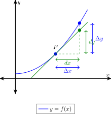
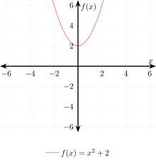
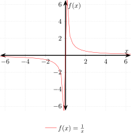
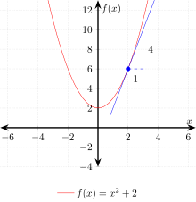
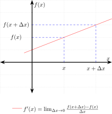
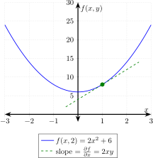
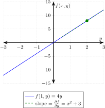
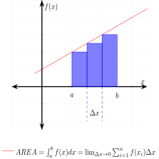
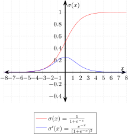
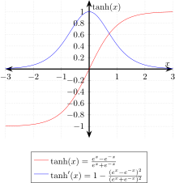

# CALCULUS CHEAT SHEET

_The study of continuous change._

Table of Contents

* [OVERVIEW](https://github.com/JeffDeCola/my-cheat-sheets/tree/master/other/stem/math/pure/changes/calculus-cheat-sheet#overview)
* [LIMITS](https://github.com/JeffDeCola/my-cheat-sheets/tree/master/other/stem/math/pure/changes/calculus-cheat-sheet#limits)
* [FUNDAMENTAL THEOREM OF CALCULUS](https://github.com/JeffDeCola/my-cheat-sheets/tree/master/other/stem/math/pure/changes/calculus-cheat-sheet#fundamental-theorem-of-calculus)
* [DIFFERENTIAL CALCULUS](https://github.com/JeffDeCola/my-cheat-sheets/tree/master/other/stem/math/pure/changes/calculus-cheat-sheet#differential-calculus)
  * [THE DERIVATIVE](https://github.com/JeffDeCola/my-cheat-sheets/tree/master/other/stem/math/pure/changes/calculus-cheat-sheet#the-derivative)
  * [DEFINITION OF A DERIVATIVE](https://github.com/JeffDeCola/my-cheat-sheets/tree/master/other/stem/math/pure/changes/calculus-cheat-sheet#definition-of-a-derivative)
  * [DERIVATIVE NOTATION](https://github.com/JeffDeCola/my-cheat-sheets/tree/master/other/stem/math/pure/changes/calculus-cheat-sheet#derivative-notation)
  * [BASIC DERIVATIVE RULES](https://github.com/JeffDeCola/my-cheat-sheets/tree/master/other/stem/math/pure/changes/calculus-cheat-sheet#basic-derivative-rules)
  * [HIGHER-ORDER DERIVATIVES](https://github.com/JeffDeCola/my-cheat-sheets/tree/master/other/stem/math/pure/changes/calculus-cheat-sheet#higher-order-derivatives)
  * [PARTIAL DERIVATIVES](https://github.com/JeffDeCola/my-cheat-sheets/tree/master/other/stem/math/pure/changes/calculus-cheat-sheet#partial-derivatives)
* [INTEGRAL CALCULUS](https://github.com/JeffDeCola/my-cheat-sheets/tree/master/other/stem/math/pure/changes/calculus-cheat-sheet#integral-calculus)
  * [THE INDEFINITE INTEGRAL](https://github.com/JeffDeCola/my-cheat-sheets/tree/master/other/stem/math/pure/changes/calculus-cheat-sheet#the-indefinite-integral)
  * [THE DEFINITE INTEGRAL](https://github.com/JeffDeCola/my-cheat-sheets/tree/master/other/stem/math/pure/changes/calculus-cheat-sheet#the-definite-integral)
  * [DEFINITION OF AN INTEGRAL](https://github.com/JeffDeCola/my-cheat-sheets/tree/master/other/stem/math/pure/changes/calculus-cheat-sheet#definition-of-an-integral)
  * [BASIC INTEGRAL RULES](https://github.com/JeffDeCola/my-cheat-sheets/tree/master/other/stem/math/pure/changes/calculus-cheat-sheet#basic-integral-rules)
  * [INTEGRATION BY SUBSTITUTION](https://github.com/JeffDeCola/my-cheat-sheets/tree/master/other/stem/math/pure/changes/calculus-cheat-sheet#integration-by-substitution)
  * [INTEGRATION BY PARTS](https://github.com/JeffDeCola/my-cheat-sheets/tree/master/other/stem/math/pure/changes/calculus-cheat-sheet#integration-by-parts)
* [EXAMPLES - DERIVATIVES](https://github.com/JeffDeCola/my-cheat-sheets/tree/master/other/stem/math/pure/changes/calculus-cheat-sheet#examples---derivatives)
  * [FINDING VELOCITY (Using the Power Rule)](https://github.com/JeffDeCola/my-cheat-sheets/tree/master/other/stem/math/pure/changes/calculus-cheat-sheet#finding-velocity-using-the-power-rule)
  * [THE SIGMOID FUNCTION (Using the Quotient Rule)](https://github.com/JeffDeCola/my-cheat-sheets/tree/master/other/stem/math/pure/changes/calculus-cheat-sheet#the-sigmoid-function-using-the-quotient-rule)
  * [THE TANH FUNCTION (Using the Quotient Rule)](https://github.com/JeffDeCola/my-cheat-sheets/tree/master/other/stem/math/pure/changes/calculus-cheat-sheet#the-tanh-function-using-the-quotient-rule)
  * [EXAMPLE (Using the Chain Rule)](https://github.com/JeffDeCola/my-cheat-sheets/tree/master/other/stem/math/pure/changes/calculus-cheat-sheet#example-using-the-chain-rule)
* [EXAMPLES - INTEGRALS](https://github.com/JeffDeCola/my-cheat-sheets/tree/master/other/stem/math/pure/changes/calculus-cheat-sheet#examples---integrals)
  * [FINDING DISTANCE FUNCTION (Using the Power Rule)](https://github.com/JeffDeCola/my-cheat-sheets/tree/master/other/stem/math/pure/changes/calculus-cheat-sheet#finding-distance-function-using-the-power-rule)
  * [FINDING THE DISTANCE TRAVELED (Using a Definite Integral)](https://github.com/JeffDeCola/my-cheat-sheets/tree/master/other/stem/math/pure/changes/calculus-cheat-sheet#finding-the-distance-traveled-using-a-definite-integral)
  * [FINDING AREA OF A CIRCLE (Using a Double Integral)](https://github.com/JeffDeCola/my-cheat-sheets/tree/master/other/stem/math/pure/changes/calculus-cheat-sheet#finding-area-of-a-circle-using-a-double-integral)

Documentation and Reference

* [differential equations](https://github.com/JeffDeCola/my-cheat-sheets/tree/master/other/stem/math/pure/changes/calculus-cheat-sheet/differential-equations-cheat-sheet)
* [latex math mode](https://github.com/JeffDeCola/my-cheat-sheets/blob/master/software/development/languages/latex-cheat-sheet/latex-math-mode.md#latex-math-mode-cheat-sheet)
  ([my-latex-renders](https://github.com/JeffDeCola/my-latex-renders))

## OVERVIEW

* **Calculus** is a broad field of mathematics that includes
differentiation (finding derivatives) and
integration (finding integrals).
It focuses on rates of change and accumulation.

* **Differential Equations** (DiffEQ) are a specific branch of mathematics
that deals with equations involving derivatives.
A differential equation expresses a relationship between a function and its derivatives.
Differential equations are used to model real-world phenomena involving rates of
change and accumulation.

In short: calculus gives you the tools (derivatives and integrals), and differential equations puts those tools to work modeling real systems.

It's important to understand the role of $f(x)$ in both calculus and differential equations.

| CONTEXT                | WHAT f(x) REPRESENTS                                  | WHAT WE WANT TO FIND                      |
|------------------------|-------------------------------------------------------|-------------------------------------------|
| CALCULUS (Derivatives) | $f(x)$ is the original function                       | The derivative $f'(x)=\frac{dy}{dx}$      |
| CALCULUS (Integrals)   | $f(x)$ is function to integrate                       | The antiderivative $F(x)=\int f(x)dx + C$ |
| DIFFERENTIAL EQUATIONS | $f(x)$ is the giving rate of change (right hand side) | Solve for $y(x)$ by integrating           |

> **Why the notation shifts:** In calculus there's only one function in
> the room - $f(x)$ - so it gets the spotlight. In differential
> equations there are two: the **unknown** function you're solving for,
> and the **given** rule describing its rate of change. The convention
> assigns:
>
> * $y(x)$ → the unknown function (the "main" function - what you want to find)
> * $f(x)$ → the given right-hand side (the rate of change)
>
> Think of it like a detective story: in calculus, $f(x)$ is the
> suspect you're investigating. In DiffEQ, $y(x)$ is the suspect
> you're hunting, and $f(x)$ is the clue. The clue and the suspect
> can't share a name - that's why $y$ gets promoted to "main function"
> when you move from calculus to DiffEQ.

It's also important to understand the notation,

* $dx$ means infinitesimal step (small change) in x
* $dy$ means infinitesimal step (small change) in y
* $\frac{dy}{dx}$ means the rate of change of y with respect to x

    

From this diagram, a secant line (not shown) connects the two points
on the curve where the slope is $\frac{\Delta y}{\Delta x}$.
As $\Delta x$ shrinks to zero the secant rotates into the
tangent line (green) and the slope is $\frac{dy}{dx}$, which is the derivative,
the instantaneous rate of change. Formally written as,

<table align="center"><tr><td>

$$\displaystyle \lim_{\Delta x \to 0} \frac{\Delta y}{\Delta x} = \frac{dy}{dx}$$

</td></tr></table>

There are two branches of Calculus,

* Differential Calculus
  * Rate of change and slopes
  * **Derivatives** - One quantity changes with respect to another
  * Example: If you have a function describing the position of a falling object,
    its derivative gives you the object's velocity, and the derivative of
    velocity gives you acceleration

* Integral Calculus
  * Opposite of differential calculus
  * Finding area under curve
  * **Integrals** - Accumulation of a quantity over an interval
  * Example: If you have a function describing the velocity of a falling object,
    its integral gives you the object's position

## LIMITS

Before we get into calculus, we need to understand limits.
Limits are the foundation of calculus. They describe the value a function
approaches as the input approaches a specific value.

It is written as,

$$
\lim_{{x \to a}} f(x) = L
$$

Where `f(x)` is a function of `x`, `a` is the value `x` is approaching,
and `L` is the limit, if it exists.

For example, given the function,

$$
f(x) = x² + 2
$$

    

The limit of `x² + 2` as `x` approaches `3` is 11,

$$
\lim_{x \to 3} (x² + 2) = 11
$$

We use limits because some functions are not defined at certain points.

For example, given the function

$$
f(x) = \frac{1}{x}
$$

    

This is not defined at `x = 0`.

However, we can still find the limit of `f(x)` as `x` approaches `0` from the right.

$$
\lim_{x \to 0^+} \frac{1}{x} = \infty
$$

So how does this apply to calculus?  Well, the derivative of a function is
defined as the limit of the average rate of change of the function as the
interval over which the rate of change is calculated approaches zero.
This will make more sense in the definition of a derivative section below.

## FUNDAMENTAL THEOREM OF CALCULUS

The Fundamental Theorem of Calculus (FTC) connects the two branches
of calculus by showing that **differentiation and integration are
inverse operations**.

**PART 1** — Integration undoes differentiation
If you integrate a function and then differentiate the result, you
get back the original function.

$$
\frac{d}{dx} \int_{a}^{x} f(u) \, du = f(x)
$$

**PART 2** — Computing a definite integral
To find the area under a curve from $a$ to $b$, find the
antiderivative $F(x)$ and evaluate it at the endpoints.

$$
\int_{a}^{b} f(x) \, dx = F(b) - F(a)
$$

where $F(x)$ is any antiderivative of $f(x)$ (i.e., $F'(x) = f(x)$).

## DIFFERENTIAL CALCULUS

Differential calculus is the study of **derivatives** — the rate at which
one quantity changes with respect to another.

### THE DERIVATIVE

The derivative of a function

$$
f(x) = y
$$

is written as

$$
f'(x) = \frac{dy}{dx}
$$

where `dy` is the small change in `y`, `dx` is the small change in `x`, and `f'(x)` is the
derivative of `f(x)`.

For example, given the function,

$$
f(x) = y = x² + 2
$$

The derivative of `x²` is `2x` (see next section on how we did this).

$$
f'(x) = \frac{dy}{dx}  = 2x
$$

So if you're at `x = 2`, the slope of the tangent line is `4`.

    

Hence, the derivative of a function is the slope of the tangent line to the curve
at a given point.

You will see the derivative written in several equivalent ways:

$$
f'(x) = \frac{dy}{dx} = \frac{d}{dx} f(x) = \frac{df(x)}{dx}
$$

### DEFINITION OF A DERIVATIVE

The derivative is defined using limits. It's the slope of the **secant
line** between two points on the curve, as those two points get
infinitely close together — at which point it becomes the slope of
the **tangent line** at that point.

    

You can show this as

$$
f'(x) = \lim_{\Delta x \to 0} \frac{f(x+\Delta x) - f(x)}{\Delta x}
$$

which can also be written as,

<table align="center"><tr><td>

$$\displaystyle \lim_{\Delta x \to 0} \frac{\Delta y}{\Delta x} = \frac{dy}{dx}$$

</td></tr></table>

So giving the example above of $f(x) = x^2 + 2$, the derivative is

$$
\begin{aligned}
f'(x) &= \lim_{{\Delta x \to 0}} \frac{((x+\Delta x)^2 + 2) -
         (x^2 + 2)}{\Delta x} \\
f'(x) &= \lim_{{\Delta x \to 0}} \frac{(x+\Delta x)^2 + 2 - x^2 - 2}{\Delta x} \\
f'(x) &= \lim_{{\Delta x \to 0}} \frac{x^2 + 2x\Delta x + \Delta x^2 + 2 -
         x^2 - 2}{\Delta x} \\
f'(x) &= \lim_{{\Delta x \to 0}} \frac{2x\Delta x + \Delta x^2}{\Delta x} \\
f'(x) &= \lim_{{\Delta x \to 0}} (2x + \Delta x) \\
f'(x) &= 2x
\end{aligned}
$$

### DERIVATIVE NOTATION

You will see the derivative written in several equivalent ways.
They all mean the same thing — they just emphasize different
aspects of what a derivative is.

| NOTATION            | WHAT IT EMPHASIZES                                       | CONVENTION                                      |
|---------------------|----------------------------------------------------------|-------------------------------------------------|
| $\frac{dy}{dx}$     | "How does $y$ change as $x$ changes?"                    | $y$ is the **output value** (Leibniz, 1600s)    |
| $\frac{df}{dx}$     | "How does $f$ change as $x$ changes?"                    | $f$ is the **function itself**                  |
| $f'(x)$             | Same as $\frac{df}{dx}$, just shorter                    | $f$ is the function (Lagrange)                  |
| $\frac{d}{dx} f(x)$ | "Apply the derivative operator $\frac{d}{dx}$ to $f(x)$" | $\frac{d}{dx}$ is an **operator** acting on $f$ |

**Why so many?** Historically, Leibniz wrote relationships between
variables like $y = x^2 + 3$, so the rate of change was naturally
$\frac{dy}{dx}$. Later, when functions became objects in their own
right (with names like $f$, $g$, $h$), notations like $\frac{df}{dx}$
and $f'(x)$ emerged to put the _function name_ on top.

**Why this matters for partial derivatives:** When a function has
more than one variable — like $f(x, y)$ — you can't write
$\frac{dy}{dx}$ anymore, because $y$ is now an _input_, not an
output. You have to name the function explicitly:

$$
\frac{\partial f}{\partial x}
$$

The symbol changes from $d$ to $\partial$ to signal "there are other
variables I'm holding constant." But the structure — _function over
input_ — is the same as $\frac{df}{dx}$.

So the progression makes sense:

| Variables          | Notation                                         |
|--------------------|--------------------------------------------------|
| One variable       | $\frac{df}{dx}$ (or $\frac{dy}{dx}$, or $f'(x)$) |
| Multiple variables | $\frac{\partial f}{\partial x}$                  |

### BASIC DERIVATIVE RULES

#### Power Rule

$$
\begin{aligned}
f(x) &= x^n \\
f'(x) &= nx^{n-1}
\end{aligned}
$$

#### Constant Rule

$$
\begin{aligned}
f(x) &= c \\
f'(x) &= 0
\end{aligned}
$$

#### Sum Rule

$$
\begin{aligned}
f(x) &= g(x) + h(x) \\
f'(x) &= g'(x) + h'(x)
\end{aligned}
$$

#### Product Rule

$$
\begin{aligned}
f(x) &= g(x)h(x) \\
f'(x) &= g'(x)h(x) + g(x)h'(x)
\end{aligned}
$$

#### Quotient Rule

$$
\begin{aligned}
f(x) &= \frac{g(x)}{h(x)} \\
f'(x) &= \frac{g'(x)h(x) - g(x)h'(x)}{h(x)^2}
\end{aligned}
$$

#### Chain Rule

$$
f(x) = g(h(x))
$$

$$
\begin{aligned}
\text{\scriptsize h(x) is the inner function} \\
\text{\scriptsize g(u) is the outer function with u = h(x)}
\end{aligned}
$$

$$
f'(x) = g'(h(x)) \cdot h'(x)
$$

### HIGHER-ORDER DERIVATIVES

You can take the derivative of a derivative. The result is called a
**higher-order derivative**.

* **First derivative** — rate of change of the function
* **Second derivative** — rate of change of the first derivative
* **Third derivative** — rate of change of the second derivative
* ...and so on

Notation,

$$
f'(x), \quad f''(x), \quad f'''(x), \quad f^{(n)}(x)
$$

or equivalently using Leibniz notation,

$$
\frac{dy}{dx}, \quad \frac{d^2y}{dx^2}, \quad \frac{d^3y}{dx^3}, \quad \frac{d^ny}{dx^n}
$$

For example, given the function,

$$
f(x) = x^3
$$

The successive derivatives are,

$$
\begin{aligned}
f'(x) &= 3x^2 \\
f''(x) &= 6x \\
f'''(x) &= 6 \\
f''''(x) &= 0
\end{aligned}
$$

A common physics example,

* Position: $s(t)$
* Velocity: $s'(t)$ — first derivative of position
* Acceleration: $s''(t)$ — second derivative of position

### PARTIAL DERIVATIVES

So far we've taken derivatives of functions with one variable, like
$f(x)$. When a function has **more than one variable**, we use a
**partial derivative** — the derivative with respect to one variable
while treating the others as constants.

Notation uses $\partial$ instead of $d$,

$$
\frac{\partial f}{\partial x}
$$

This means "the partial derivative of $f$ with respect to $x$."

For example, given the function,

$$
f(x, y) = x^2 y + 3y
$$

This function has two inputs, so its graph is a 3D surface. A
partial derivative slices the surface along one direction and
measures the slope of that slice.

**The partial derivative with respect to $x$** treats $y$ as a constant.
Differentiating each term with respect to $x$,

* $x^2 y$ → $y$ is constant, so the derivative is $2xy$
* $3y$ → no $x$, so the derivative is $0$

$$
\frac{\partial f}{\partial x} = 2xy
$$

This is a **function**, not a number — it gives the slope in the
$x$-direction at _any_ point $(x, y)$. To get the slope at a
specific point, plug it in. For example, at $(x, y) = (1, 2)$,

$$
\frac{\partial f}{\partial x}\bigg|_{(1,2)} = 2(1)(2) = 4
$$

    

**The partial derivative with respect to $y$** treats $x$ as a constant.
Differentiating each term with respect to $y$,

* $x^2 y$ → $x^2$ is constant, so the derivative is $x^2$
* $3y$ → derivative is $3$

$$
\frac{\partial f}{\partial y} = x^2 + 3
$$

Again, this is a function. To get the slope at $(x, y) = (1, 2)$,

$$
\frac{\partial f}{\partial y}\bigg|_{(1,2)} = (1)^2 + 3 = 4
$$

    

The bar notation $\big|_{(1,2)}$ means "evaluate at the point $(1, 2)$"
— same idea as the bar notation in the definite integral section.

Partial derivatives are used in differential equations
(see the [differential equations cheat sheet](https://github.com/JeffDeCola/my-cheat-sheets/tree/master/other/stem/math/pure/changes/calculus-cheat-sheet/differential-equations-cheat-sheet#differential-equations-cheat-sheet))
and in machine learning for backpropagation
(see the [neural networks cheat sheet](https://github.com/JeffDeCola/my-cheat-sheets/tree/master/software/development/software-architectures/artificial-intelligence/ai-fundamentals/neural-networks-cheat-sheet#neural-networks-cheat-sheet)).

## INTEGRAL CALCULUS

Integral calculus is the study of **integrals** — the area under a
curve. They describe the accumulation of a quantity over an interval.

### THE INDEFINITE INTEGRAL

The integral of a function

$$
f(x)
$$

is written as

<table align="center"><tr><td>

$$\displaystyle \int f(x) dx = F(x) + C$$

</td></tr></table>

where `F(x)` is the antiderivative of `f(x)` and `C` is the constant of
integration. The reason we use F(x) is to avoid confusion with the original function f(x)
that is being integrated.

> **Reminder:** As shown in the table at the top, the antiderivative
> $F(x)$ is the same thing as $y(x)$ in differential equations —
> just a different letter for the same function:
>
> $$F(x) = y(x)$$
>
> This naming swap is one of the most confusing parts when moving
> between calculus and diffEQ.

For example, given the function,

$$
f(x) = 2x
$$

The integral of `2x` is `x²` (see Power Rule).

$$
\int 2x dx = x² + C
$$

So if you're looking for the area under the curve of $2x$ from $0$
to $x$, you would find the area of a triangle with base $x$ and
height $2x$:

$$
\text{Area} = \frac{1}{2} \cdot x \cdot 2x = x^2
$$

Which matches the integral above.

### THE DEFINITE INTEGRAL

The definite integral of a function

$$
f(x)
$$

is written as

<table align="center"><tr><td>

$$\displaystyle \int_{a}^{b} f(x) dx = F(b) - F(a)$$

</td></tr></table>

where `F(b)` is the antiderivative of `f(x)` evaluated at `b` and
`F(a)` is the antiderivative of `f(x)` evaluated at `a`. This is
Part 2 of the Fundamental Theorem of Calculus from above.

For example, given the function,

$$
f(x) = 2x
$$

The definite integral of `2x` from `0` to `2` is `4`.

$$
\begin{aligned}
\int_{0}^{2} 2x \, dx &= x² \Big|_{0}^{2} \\
                      &= F(2) - F(0) \\
                      &= 2² - 0² \\
                      &= 4
\end{aligned}
$$

The bar notation $\Big|_{0}^{2}$ means "evaluate from $0$ to $2$,"
which is shorthand for $F(2) - F(0)$.

The value $4$ is the area under the curve $y = 2x$ between $x = 0$
and $x = 2$ — a triangle with base $2$ and height $4$:

$$
\text{Area} = \frac{1}{2} \cdot 2 \cdot 4 = 4
$$

Which matches the definite integral above.

### DEFINITION OF AN INTEGRAL

The integral is defined using limits. It's the sum of the areas of
rectangles under the curve, as the width of those rectangles
approaches zero.

    

You can show this as

$$
\text{AREA} = \int_{a}^{b} f(x) \, dx = \lim_{\Delta x \to 0}
       \sum_{i=1}^{n} f(x_i) \, \Delta x
$$

where

$$
\Delta x = \frac{b - a}{n}
$$

As we use more rectangles ($n \to \infty$), each one gets narrower
($\Delta x \to 0$), and the sum becomes exact.

So giving the example above of $f(x) = 2x$, the integral is

$$
\begin{aligned}
\int 2x \, dx &= \lim_{\Delta x \to 0} \sum_{i=1}^{n} 2x_i \, \Delta x \\
\int 2x \, dx &= \lim_{\Delta x \to 0} 2 \sum_{i=1}^{n} x_i \, \Delta x \\
\int 2x \, dx &= 2 \lim_{\Delta x \to 0} \sum_{i=1}^{n} x_i \, \Delta x \\
\int 2x \, dx &= 2 \int x \, dx \\
\int 2x \, dx &= 2 \cdot \frac{x^2}{2} + C \\
\int 2x \, dx &= x^2 + C
\end{aligned}
$$

### BASIC INTEGRAL RULES

#### The Power Rule

$$
\int x^n dx = \frac{x^{n+1}}{n+1} + C
$$

#### The Constant Rule

$$
\int c dx = cx + C
$$

#### The Sum Rule

$$
\int (f(x) + g(x)) dx = \int f(x) dx + \int g(x) dx
$$

### INTEGRATION BY SUBSTITUTION

Integration by substitution (also called **u-substitution**) is used
to integrate composite functions. It's the integral counterpart to
the Chain Rule for derivatives.

The idea is to substitute part of the integrand with a new variable
$u$ to turn a complicated integral into a simpler one.

The formula,

$$
\int f(g(x)) \cdot g'(x) \, dx = \int f(u) \, du
$$

where $u = g(x)$ and $du = g'(x) \, dx$.

**Steps:**

1. Choose $u$ — usually the inner function
2. Compute $du = g'(x) \, dx$
3. Rewrite the integral in terms of $u$ and $du$
4. Integrate with respect to $u$
5. Substitute $g(x)$ back in for $u$

For example, given the integral,

$$
\int 2x \cos(x^2) \, dx
$$

Let $u = x^2$, then $du = 2x \, dx$. Substitute,

$$
\int \cos(u) \, du = \sin(u) + C
$$

Substitute back $u = x^2$,

$$
\int 2x \cos(x^2) \, dx = \sin(x^2) + C
$$

### INTEGRATION BY PARTS

Integration by parts is used to integrate the product of two
functions. It's the integral counterpart to the [Product Rule](#product-rule)
for derivatives.

The formula,

$$
\int u \, dv = uv - \int v \, du
$$

where you split the integrand into two pieces: $u$ (which you'll
differentiate) and $dv$ (which you'll integrate).

**Steps:**

1. Choose $u$ and $dv$ from the integrand
2. Compute $du$ by differentiating $u$
3. Compute $v$ by integrating $dv$
4. Plug into the formula $\int u \, dv = uv - \int v \, du$
5. Solve the new (simpler) integral on the right

For example, given the integral,

$$
\int x \cos(x) \, dx
$$

Let $u = x$ and $dv = \cos(x) \, dx$. Then,

$$
\begin{aligned}
du &= dx \\
v  &= \sin(x)
\end{aligned}
$$

Plug into the formula,

$$
\int x \cos(x) \, dx = x \sin(x) - \int \sin(x) \, dx
$$

The remaining integral is straightforward,

$$
\int x \cos(x) \, dx = x \sin(x) + \cos(x) + C
$$

## EXAMPLES - DERIVATIVES

Some derivative examples.

### FINDING VELOCITY (Using the Power Rule)

Lets say a car travels 50 miles every hour.
Instead of $x,y$ we will use $t,s$ for time and distance.
We can write the distance function as

$$
f(t) = s = 50t
$$

where `t` is time in hours and `s` is distance in miles.

Let's find the derivative of the distance function using the Power Rule,

$$
\begin{aligned}
f(x) &= x^n \\
f'(x) &= nx^{n-1}
\end{aligned}
$$

For the distance function,

$$
n = 1
$$

Hence the derivative of the distance function is,

$$
\begin{aligned}
f'(t) &= 1 \cdot 50t^{1-1} \\
f'(t) &= 50t^0 \\
f'(t) &= 50
\end{aligned}
$$

Therefore the velocity of the car is the **derivative** of the distance function.

$$
f'(t) = \frac{ds}{dt} =  50
$$

So the velocity of the car is 50 mph.

### THE SIGMOID FUNCTION (Using the Quotient Rule)

The sigmoid function is a mathematical function having an "S" shaped curve
(also called a sigmoid curve).

    

The sigmoid function is defined as,

$$
\sigma(x) = \frac{1}{1 + e^{-x}}
$$

The range of the sigmoid function is between 0 and 1.

$$
0 \lt \sigma(x) \lt 1
$$

And the derivative of the sigmoid function is (see solution below),

$$
\sigma'(x) = \sigma(x) \cdot (1 - \sigma(x))
$$

Which is interesting. The derivative of the sigmoid function is the sigmoid
function times 1 minus the sigmoid function.
This is a very important property of the sigmoid function and is used in
neural networks. Because it makes it easy to compute the derivative of
the sigmoid function during backpropagation.

Let's find the derivative of the sigmoid function using the Quotient Rule,

$$
\sigma(x) = \frac{g(x)}{h(x)}
$$

$$
\sigma'(x) = \frac{g'(x)h(x) - g(x)h'(x)}{h(x)^2}
$$

For the sigmoid function,

$$
\begin{aligned}
g(x) &= 1 \\
g'(x) &= 0 \\
h(x) &= 1 + e^{-x} \\
h'(x) &= -e^{-x}
\end{aligned}
$$

Hence the derivative of the sigmoid function is,

$$
\begin{aligned}
\sigma'(x) &= \frac{0 \cdot (1 + e^{-x}) - 1 \cdot (-e^{-x})}{(1 + e^{-x})^2} \\
\sigma'(x) &= \frac{e^{-x}}{(1 + e^{-x})^2}
\end{aligned}
$$

Now, let's simplify this,

$$
\begin{aligned}
\sigma'(x) &= \frac{1}{1 + e^{-x}} \cdot \frac{e^{-x}}{1 + e^{-x}} \\
\sigma'(x) &= \frac{1}{1 + e^{-x}} \cdot \frac{1 + e^{-x} - 1}{1 + e^{-x}} \\
\sigma'(x) &= \frac{1}{1 + e^{-x}} \cdot \left( 1 - \frac{1}{1 + e^{-x}} \right)
\end{aligned}
$$

Hence,

$$
\sigma'(x) = \sigma(x) \cdot (1 - \sigma(x))
$$

### THE TANH FUNCTION (Using the Quotient Rule)

The tanh function is a mathematical function having an "S" shaped curve
(also called a sigmoid curve).

    

The tanh function is defined as,

$$
\tanh(x) = \frac{e^x - e^{-x}}{e^x + e^{-x}}
$$

The range of the tanh function is between -1 and 1.

$$
-1 \lt \tanh(x) \lt 1
$$

And the derivative of the tanh function is (see solution below),

$$
\tanh'(x) = 1 - \tanh^2(x)
$$

Which is interesting. The derivative of the tanh function is 1 minus the tanh function squared.
This is a very important property of the tanh function and is used in
neural networks. Because it makes it easy to compute the derivative of
the tanh function during backpropagation.

Let's find the derivative of the tanh function using the Quotient Rule,

$$
\tanh(x) = \frac{g(x)}{h(x)}
$$

$$
\tanh'(x) = \frac{g'(x)h(x) - g(x)h'(x)}{h(x)^2}
$$

For the tanh function,

$$
\begin{aligned}
g(x) &= e^x - e^{-x} \\
g'(x) &= e^x + e^{-x} \\
h(x) &= e^x + e^{-x} \\
h'(x) &= e^x - e^{-x}
\end{aligned}
$$

Hence the derivative of the tanh function is,

$$
\begin{aligned}
\tanh'(x) &= \frac{(e^x + e^{-x})(e^x + e^{-x}) - (e^x - e^{-x})(e^x - e^{-x})}{(e^x + e^{-x})^2} \\
\tanh'(x) &= \frac{(e^x + e^{-x})^2 - (e^x - e^{-x})^2}{(e^x + e^{-x})^2} \\
\end{aligned}
$$

We know that,

$$
\begin{aligned}
(a + b)^2 &= a^2 + 2ab + b^2 \\
(a - b)^2 &= a^2 - 2ab + b^2
\end{aligned}
$$

So

$$
\begin{aligned}
(e^x + e^{-x})^2 &= e^{2x} + 2e^x e^{-x} + e^{-2x} = e^{2x} + 2 + e^{-2x} \\
(e^x - e^{-x})^2 &= e^{2x} - 2e^x e^{-x} + e^{-2x} = e^{2x} - 2 + e^{-2x}
\end{aligned}
$$

Plug this back in, we simplify to,

$$
\begin{aligned}
\tanh'(x) &= \frac{e^{2x} + 2 + e^{-2x} - e^{2x} + 2 - e^{-2x}}{(e^x + e^{-x})^2} \\
\tanh'(x) &= \frac{4}{(e^x + e^{-x})^2} \\
\end{aligned}
$$

Now, with a little leap of faith, 4 can be written as,

$$
\begin{aligned}
4 = (e^x + e^{-x})^2 -(e^x - e^{-x})^2
\end{aligned}
$$

So now the derivative looks like,

$$
\begin{aligned}
\tanh'(x) &= \frac{(e^x + e^{-x})^2 - (e^x - e^{-x})^2}{(e^x + e^{-x})^2} \\
\end{aligned}
$$

We can then split the fraction,

$$
\begin{aligned}
\tanh'(x) &= \frac{(e^x + e^{-x})^2}{(e^x + e^{-x})^2} - \frac{(e^x - e^{-x})^2}{(e^x + e^{-x})^2} \\
\tanh'(x) &= 1 - \frac{(e^x - e^{-x})^2}{(e^x + e^{-x})^2} \\
\end{aligned}
$$

Now if we recognize that the original function,

$$
\begin{aligned}
\tanh(x) &= \frac{e^x - e^{-x}}{e^x + e^{-x}} \\
\end{aligned}
$$

Than squaring the original function would be,

$$
\begin{aligned}
\tanh^2(x) &= \left( \frac{e^x - e^{-x}}{e^x + e^{-x}} \right)^2 \\
\tanh^2(x) &= \frac{(e^x - e^{-x})^2}{(e^x + e^{-x})^2} \\
\end{aligned}
$$

Plug this into the derivative to get,

$$
\begin{aligned}
\tanh'(x) &= 1 - \tanh^2(x)
\end{aligned}
$$

Whew, that was a lot of work.

### EXAMPLE (Using the Chain Rule)

Giving the function,

$$
f(x)=(3x^2 + 5x − 2)^4
$$

Let's find the derivative of the function using the
Chain Rule,

$$
f(x) = g(h(x))
$$

$$
\begin{aligned}
\text{\scriptsize h(x) is the inner function} \\
\text{\scriptsize g(u) is the outer function with u = h(x)}
\end{aligned}
$$

$$
f'(x) = g'(h(x)) \cdot h'(x)
$$

For our function, we take the inner and outer functions as

$$
\begin{aligned}
h(x) &= 3x^2 + 5x − 2 \\
g(u) &= u^4
\end{aligned}
$$

Where those derivatives are,

$$
\begin{aligned}
g'(u) &= 4u^3 \\
h'(x) &= 6x + 5
\end{aligned}
$$

Hence the derivative of the function is,

$$
f'(x) = 4(3x^2 + 5x − 2)^3 \cdot (6x + 5)
$$

## EXAMPLES - INTEGRALS

Some integrals examples.

### FINDING DISTANCE FUNCTION (Using the Power Rule)

Lets say we know the velocity of a car is 50 mph.
We can write the velocity function as

$$
f'(t) = \frac{ds}{dt} = 50
$$

The distance function is the **integral** of the velocity function.

Let's find the distance function using the Constant Rule,

$$
\begin{aligned}
\int c dx &= cx + C
\end{aligned}
$$

Hence,

$$
f(t) = \int 50 dt = 50t + C
$$

### FINDING DISTANCE TRAVELED (Using a Definite Integral)

Lets say a car travels at a velocity of $50$ mph.
We can write the velocity function as

$$
f'(t) = \frac{ds}{dt} = 50
$$

To find the distance traveled between time $t = 1$ and $t = 3$ hours,
we use the **definite integral**,

$$
\begin{aligned}
\int_{1}^{3} 50 \, dt &= 50t \Big|_{1}^{3} \\
                      &= 50(3) - 50(1) \\
                      &= 150 - 50 \\
                      &= 100
\end{aligned}
$$

So the car travels $100$ miles between hour $1$ and hour $3$.

### FINDING AREA OF A CIRCLE (Using a Double Integral)

We can derive the famous formula for the area of a circle,
$A = \pi R^2$, using a **double integral**.

A double integral is the 2D version of an integral. Where a single
integral sums up rectangles of width $dx$ along a line, a double
integral sums up tiny patches of area $dA$ over a 2D region,

$$
A = \iint_R dA
$$

where $R$ is the region (in our case, the disk of radius $R$) and
$dA$ is an infinitesimal patch of area.

**Switching to polar coordinates.** Circles are awkward in $(x, y)$
coordinates because the boundary $x^2 + y^2 = R^2$ is curved. But
in **polar coordinates** $(r, \theta)$, a circle is just $r = R$
— much easier. Polar coordinates use,

* $r$ — distance from the origin
* $\theta$ — angle from the positive $x$-axis

In polar coordinates, the area patch becomes,

$$
dA = r \, dr \, d\theta
$$

The extra $r$ shows up because patches near the edge of the disk
are wider than patches near the center (a "pie slice" gets fatter
as you move outward).

**Setting up the integral.** To sweep out the entire disk of radius
$R$, $r$ ranges from $0$ to $R$ and $\theta$ ranges from $0$ to
$2\pi$ (a full revolution),

$$
A = \int_0^{2\pi} \int_0^R r \, dr \, d\theta
$$

**Inner integral** (integrate over $r$, treating $\theta$ as constant),

$$
\int_0^R r \, dr = \left[ \frac{r^2}{2} \right]_0^R = \frac{R^2}{2}
$$

**Outer integral** (integrate the result over $\theta$),

$$
A = \int_0^{2\pi} \frac{R^2}{2} \, d\theta = \frac{R^2}{2} \cdot 2\pi
$$

Therefore, the area of a circle of radius $R$ is,

<table align="center"><tr><td>

$$\displaystyle A = \pi R^2$$

</td></tr></table>
