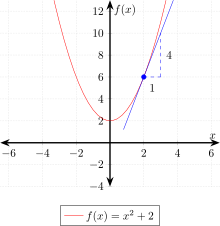

# CALCULUS CHEAT SHEET

_The study of continuous change._

Table of Contents

* [OVERVIEW](https://github.com/JeffDeCola/my-cheat-sheets/tree/master/other/stem/math/pure/changes/calculus-cheat-sheet#overview)
* [LIMITS](https://github.com/JeffDeCola/my-cheat-sheets/tree/master/other/stem/math/pure/changes/calculus-cheat-sheet#limits)
* [DIFFERENTIAL CALCULUS](https://github.com/JeffDeCola/my-cheat-sheets/tree/master/other/stem/math/pure/changes/calculus-cheat-sheet#differential-calculus)
  * [THE DERIVATIVE](https://github.com/JeffDeCola/my-cheat-sheets/tree/master/other/stem/math/pure/changes/calculus-cheat-sheet#the-derivative)
  * [DEFINITION OF A DERIVATIVE](https://github.com/JeffDeCola/my-cheat-sheets/tree/master/other/stem/math/pure/changes/calculus-cheat-sheet#definition-of-a-derivative)
  * [BASIC DERIVATIVE RULES](https://github.com/JeffDeCola/my-cheat-sheets/tree/master/other/stem/math/pure/changes/calculus-cheat-sheet#basic-derivative-rules)
* [INTEGRAL CALCULUS](https://github.com/JeffDeCola/my-cheat-sheets/tree/master/other/stem/math/pure/changes/calculus-cheat-sheet#integral-calculus)
  * [THE INDEFINITE INTEGRAL](https://github.com/JeffDeCola/my-cheat-sheets/tree/master/other/stem/math/pure/changes/calculus-cheat-sheet#the-indefinite-integral)
  * [THE DEFINITE INTEGRAL](https://github.com/JeffDeCola/my-cheat-sheets/tree/master/other/stem/math/pure/changes/calculus-cheat-sheet#the-definite-integral)
  * [DEFINITION OF AN INTEGRAL](https://github.com/JeffDeCola/my-cheat-sheets/tree/master/other/stem/math/pure/changes/calculus-cheat-sheet#definition-of-an-integral)
  * [BASIC INTEGRAL RULES](https://github.com/JeffDeCola/my-cheat-sheets/tree/master/other/stem/math/pure/changes/calculus-cheat-sheet#basic-integral-rules)
* [EXAMPLES](https://github.com/JeffDeCola/my-cheat-sheets/tree/master/other/stem/math/pure/changes/calculus-cheat-sheet#examples)
  * [FINDING VELOCITY (Using a Derivative)](https://github.com/JeffDeCola/my-cheat-sheets/tree/master/other/stem/math/pure/changes/calculus-cheat-sheet#finding-velocity-using-a-derivative)
  * [FINDING DISTANCE FUNCTION (Using an Integral)](https://github.com/JeffDeCola/my-cheat-sheets/tree/master/other/stem/math/pure/changes/calculus-cheat-sheet#finding-distance-function-using-an-integral)
  * [THE SIGMOID FUNCTION](https://github.com/JeffDeCola/my-cheat-sheets/tree/master/other/stem/math/pure/changes/calculus-cheat-sheet#the-sigmoid-function)

Documentation and Reference

* [differential equations](https://github.com/JeffDeCola/my-cheat-sheets/tree/master/other/stem/math/pure/changes/calculus-cheat-sheet/differential-equations-cheat-sheet)
  cheat sheet
* [my-latex-renders](https://github.com/JeffDeCola/my-latex-renders)

## OVERVIEW

* **Calculus** is a broad field of mathematics that includes
differentiation (finding derivatives) and
integration (finding integrals).
It focuses on rates of change and accumulation.

* **Differential Equations** (DiffEQ) are a specific branch of mathematics
that deals with equations involving derivatives.
A differential equation expresses a relationship between a function and its derivatives.
Differential equations are used to
model real-world phenomena involving rates of
change and accumulation.

It's important to understand the role of $f(x)$ in both calculus and differential equations.

| CONTEXT                | WHAT f(x) REPRESENTS               | WHAT WE WANT TO FIND                 |
|------------------------|------------------------------------|--------------------------------------|
| CALCULUS (Derivatives) | $f(x)$ is the original function    | The derivative $f'(x)=\frac{dy}{dx}$ |
| CALCULUS (Integrals)   | $f(x)$ is function to integrate    | Function $F(x)=\int f(x)dx + C$      |
| DIFFERENTIAL EQUATIONS | $f(x)$ is the derivative of $y(x)$ | Solve for $y(x)$ by integrating      |

It's also important to understand the notation,

* $dx$ means a small change in x
* $dy$ means a small change in y
* $\frac{dy}{dx}$ means the rate of change of y with respect to x

There are two branches of Calculus,

* Differential Calculus
  * Rate of change and slopes
  * **Derivatives** - One quantity changes with respect to another
  * Example: If you have a function describing the position of a falling object,
    its derivative gives you the object's velocity, and the derivative of
    velocity gives you acceleration

* Integral Calculus
  * Opposite of differential calculus
  * Finding area under curve
  * **Integrals** - Accumulation of a quantity over an interval
  * Example: If you have a function describing the velocity of a falling object,
    its integral gives you the object's position

## LIMITS

Before we get into calculus, we need to understand limits.
Limits are the foundation of calculus. They describe the value a function
approaches as the input approaches a certain value.

It is written as,

$$
\lim_{{x \to a}} f(x) = L
$$

Where `f(x)` is a function of `x`, `a` is the value `x` is approaching,
and `L` is the limit.

For example, given the function,

$$
f(x) = x² + 2
$$

<p align="center">
    

The limit of `x² + 2` as `x` approaches `3` is 11,

$$
\lim_{x \to 3} (x² + 2) = 11
$$

We use limits because some functions are not defined at certain points.

For example, given the function

$$
f(x) = \frac{1}{x}
$$

<p align="center">
    

This is not defined at `x = 0`.

However, we can still find the limit of `f(x)` as `x` approaches `0`.

$$
\lim_{x \to 0} \frac{1}{x} = \infty
$$

So how does this apply to calculus?  Well, the derivative of a function is
defined as the limit of the average rate of change of the function as the
interval over which the rate of change is calculated approaches zero.
This will make more sense in the next section.

## DIFFERENTIAL CALCULUS

Derivatives are the rate of change of a function.
They describe how one quantity changes with respect to another.

## THE DERIVATIVE

The derivative of a function

$$
y = f(x)
$$

is written as

$$
\frac{dy}{dx} = f'(x)
$$

where `dy` is the change in `y`, `dx` is the change in `x`, and `f'(x)` is the
derivative of `f(x)`.

For example, given the function,

$$
y = f(x) = x² + 2
$$

The derivative of `x²` is `2x` (see next section on how we did this).

$$
\frac{dy}{dx} = f'(x) = 2x
$$

So if you're at `x = 2`, the slope (change) of the tangent line is `4`.

<p align="center">
    

Hence, the derivative of a function is the slope of the tangent line to the curve
at a given point.

### DEFINITION OF A DERIVATIVE

We learned about limits because the derivative of a function is
defined as the limit of the average rate of change of the function as the
interval over which the rate of change is calculated approaches zero.

<p align="center">
    

You can show this as

$$
f'(x) = \lim_{{\Delta x \to 0}} \frac{f(x+\Delta x) - f(x)}{\Delta x}
$$

So giving the example above of $f(x) = x^2 + 2$, the derivative is

$$
\begin{aligned}
f'(x) &= \lim_{{\Delta x \to 0}} \frac{((x+\Delta x)^2 + 2) -
         (x^2 + 2)}{\Delta x} \\
f'(x) &= \lim_{{\Delta x \to 0}} \frac{(x+\Delta x)^2 + 2 - x^2 - 2}{\Delta x} \\
f'(x) &= \lim_{{\Delta x \to 0}} \frac{x^2 + 2x\Delta x + \Delta x^2 + 2 -
         x^2 - 2}{\Delta x} \\
f'(x) &= \lim_{{\Delta x \to 0}} \frac{2x\Delta x + \Delta x^2}{\Delta x} \\
f'(x) &= \lim_{{\Delta x \to 0}} 2x + \Delta x \\
f'(x) &= 2x
\end{aligned}
$$

### BASIC DERIVATIVE RULES

**Power Rule**

$$
\begin{aligned}
f(x) &= x^n \\
f'(x) &= nx^{n-1}
\end{aligned}
$$

**Constant Rule**

$$
\begin{aligned}
f(x) &= c \\
f'(x) &= 0
\end{aligned}
$$

**Sum Rule**

$$
\begin{aligned}
f(x) &= g(x) + h(x) \\
f'(x) &= g'(x) + h'(x)
\end{aligned}
$$

**Product Rule**

$$
\begin{aligned}
f(x) &= g(x)h(x) \\
f'(x) &= g'(x)h(x) + g(x)h'(x)
\end{aligned}
$$

**Quotient Rule**

$$
\begin{aligned}
f(x) &= \frac{g(x)}{h(x)} \\
f'(x) &= \frac{g'(x)h(x) - g(x)h'(x)}{h(x)^2}
\end{aligned}
$$

**Chain Rule**

$$
\begin{aligned}
f(x) &= g(h(x)) \\
f'(x) &= g'(h(x))h'(x)
\end{aligned}
$$

## INTEGRAL CALCULUS

Integrals are the area under a curve. They describe the accumulation of a
quantity over an interval.

### THE INDEFINITE INTEGRAL

The integral of a function

$$
f(x)
$$

is written as

$$
\int f(x) dx = F(x) + C
$$

where `F(x)` is the antiderivative of `f(x)` and `C` is the constant of
integration.

```text
The reason we use F(x) is to avoid confusion with the original function f(x)
that is being integrated. F(x) is also written as y(x).
```

For example, given the function,

$$
f(x) = 2x
$$

The integral of `2x` is `x²` (see next section on how we did this).

$$
\int 2x dx = x² + C
$$

So if you're looking for the area under the curve of `2x`, you would find the
area of a triangle with base `x` and height `2x`.

### THE DEFINITE INTEGRAL

The definite integral of a function

$$
f(x)
$$

is written as

$$
\int_{a}^{b} f(x) dx = F(b) - F(a)
$$

where `F(b)` is the antiderivative of `f(x)` evaluated at `b` and
`F(a)` is the antiderivative of `f(x)` evaluated at `a`.

For example, given the function,

$$
f(x) = 2x
$$

The definite integral of `2x` from `0` to `2` is `4`.

$$
\begin{aligned}
\int_{0}^{2} 2x dx &= x² \Big|_{0}^{2} \\
                   &= F(2) - F(0) \\
                   &= 2² - 0² \\
                   &= 4
\end{aligned}
$$

### DEFINITION OF AN INTEGRAL

Because the integral of a function is
defined as the limit of the sum of the areas of
rectangles under the curve as the width of the
rectangles approaches zero.

<p align="center">
    

You can show this as

$$
AREA = \int_{a}^{b} f(x) dx = \lim_{{\Delta x \to 0}}
       \sum_{i=1}^{n} f(x_i) \Delta x
$$

where

$$
\Delta x = \frac{b - a}{n}
$$

and

$$
n \to \infty \; and \; \Delta x \to 0
$$

So giving the example above of $f'(x) = 2x$, the integral is

$$
\begin{aligned}
\int 2x dx &= \lim_{{\Delta x \to 0}} \sum_{i=1}^{n} 2x_i \Delta x \\
\int 2x dx &= \lim_{{\Delta x \to 0}} \sum_{i=1}^{n} 2x_i \Delta x \\
\int 2x dx &= \lim_{{\Delta x \to 0}} 2 \sum_{i=1}^{n} x_i \Delta x \\
\int 2x dx &= 2 \lim_{{\Delta x \to 0}} \sum_{i=1}^{n} x_i \Delta x \\
\int 2x dx &= 2 \int x dx \\
\int 2x dx &= 2 \frac{x^2}{2} + C \\
\int 2x dx &= x^2 + C
\end{aligned}
$$

### BASIC INTEGRAL RULES

**Power Rule**

$$
\begin{aligned}
\int x^n dx &= \frac{x^{n+1}}{n+1} + C
\end{aligned}
$$

**Constant Rule**

$$
\begin{aligned}
\int c dx &= cx + C
\end{aligned}
$$

**Sum Rule**

$$
\begin{aligned}
\int (f(x) + g(x)) dx &= \int f(x) dx + \int g(x) dx
\end{aligned}
$$

## EXAMPLES

Lets take everything we learned and use an example of a car driving.

### FINDING VELOCITY (Using a Derivative)

Lets say a car travels 50 miles every hour.
Instead of $x,y$ we will use $t,s$ for time and distance.
We can write the distance function as

$$
s = f(t) = 50t
$$

where `t` is time in hours and `s` is distance in miles.

The velocity of the car is the **derivative** of the distance function.

$$
\frac{ds}{dt} = f'(t) = 50
$$

So the velocity of the car is 50 mph.

### FINDING DISTANCE FUNCTION (Using an Integral)

Lets say we know the velocity of a car is 50 mph.
We can write the velocity function as

$$
\frac{ds}{dt} = f'(t) = 50
$$

The distance function is the **integral** of the velocity function.

$$
\int 50 dt = f(t) = 50t + C
$$

### THE SIGMOID FUNCTION

The sigmoid function is a mathematical function having an "S" shaped curve
(also called a sigmoid curve).

<p align="center">
    

The sigmoid function is defined as,

$$
\sigma(x) = \frac{1}{1 + e^{-x}}
$$

The range of the sigmoid function is between 0 and 1.

$$
0 \lt \sigma(x) \lt 1
$$

An the derivative of the sigmoid function is as we will find below,

$$
\sigma'(x) = \sigma(x) \cdot (1 - \sigma(x))
$$

Which is interesting. The derivative of the sigmoid function is the sigmoid
function times 1 minus the sigmoid function.
This is a very important property of the sigmoid function and is used in
neural networks. Because it makes it easy to compute the derivative of
the sigmoid function during backpropagation.

**Finding the Derivative of the Sigmoid Function**

Let's find the derivative of the sigmoid function using the quotient rule,

$$
\sigma'(x) = \frac{g'(x)h(x) - g(x)h'(x)}{h(x)^2}
$$

where

$$
\begin{aligned}
g(x) &= 1 \\
g'(x) &= 0 \\
h(x) &= 1 + e^{-x} \\
h'(x) &= -e^{-x}
\end{aligned}
$$

Hence, the derivative of the sigmoid function is,

$$
\begin{aligned}
\sigma'(x) &= \frac{0 \cdot (1 + e^{-x}) - 1 \cdot (-e^{-x})}{(1 + e^{-x})^2} \\
\sigma'(x) &= \frac{e^{-x}}{(1 + e^{-x})^2}
\end{aligned}
$$

Now, let's simplify this.

$$
\begin{aligned}
\sigma'(x) &= \frac{1}{1 + e^{-x}} \cdot \frac{e^{-x}}{1 + e^{-x}} \\
\sigma'(x) &= \frac{1}{1 + e^{-x}} \cdot \frac{1 + e^{-x} - 1}{1 + e^{-x}} \\
\sigma'(x) &= \frac{1}{1 + e^{-x}} \cdot \left( 1 - \frac{1}{1 + e^{-x}} \right)
\end{aligned}
$$

Hence,

$$
\sigma'(x) = \sigma(x) \cdot (1 - \sigma(x))
$$
