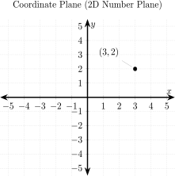
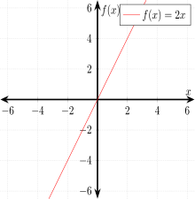
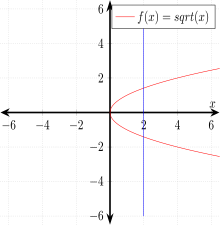
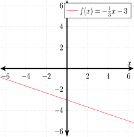

# ALGEBRA CHEAT SHEET

`algebra` _is finding out what the unknown is._

Table of Contents

* [HISTORY](https://github.com/JeffDeCola/my-cheat-sheets/tree/master/other/stem/math/pure/structures/algebra-cheat-sheet#history)
* [OVERVIEW - THE UNKNOWN](https://github.com/JeffDeCola/my-cheat-sheets/tree/master/other/stem/math/pure/structures/algebra-cheat-sheet#overview---the-unknown)
* [VARIABLES](https://github.com/JeffDeCola/my-cheat-sheets/tree/master/other/stem/math/pure/structures/algebra-cheat-sheet#variables)
* [MULTIPLICATION IS IMPLIED](https://github.com/JeffDeCola/my-cheat-sheets/tree/master/other/stem/math/pure/structures/algebra-cheat-sheet#multiplication-is-implied)
* [SOLVE SIMPLE EQUATIONS WITH ONE OPERATION (REARRANGEMENT)](https://github.com/JeffDeCola/my-cheat-sheets/tree/master/other/stem/math/pure/structures/algebra-cheat-sheet#solve-simple-equations-with-one-operation-rearrangement)
* [SOLVE SIMPLE EQUATIONS WITH TWO OPERATIONS (REARRANGEMENT)](https://github.com/JeffDeCola/my-cheat-sheets/tree/master/other/stem/math/pure/structures/algebra-cheat-sheet#solve-simple-equations-with-two-operations-rearrangement)
* [SOLVE SIMPLE EQUATIONS WITH EXPONENTS & ROOTS (REARRANGEMENT)](https://github.com/JeffDeCola/my-cheat-sheets/tree/master/other/stem/math/pure/structures/algebra-cheat-sheet#solve-simple-equations-with-exponents--roots-rearrangement)
* [POLYNOMIALS](https://github.com/JeffDeCola/my-cheat-sheets/tree/master/other/stem/math/pure/structures/algebra-cheat-sheet#polynomials)
* [SIMPLIFYING POLYNOMIALS](https://github.com/JeffDeCola/my-cheat-sheets/tree/master/other/stem/math/pure/structures/algebra-cheat-sheet#simplifying-polynomials)
* [DISTRIBUTIVE PROPERTY](https://github.com/JeffDeCola/my-cheat-sheets/tree/master/other/stem/math/pure/structures/algebra-cheat-sheet#distributive-property)
* [THE COORDINATE PLANE (2D NUMBER PLANE)](https://github.com/JeffDeCola/my-cheat-sheets/tree/master/other/stem/math/pure/structures/algebra-cheat-sheet#the-coordinate-plane-2d-number-plane)
* [FUNCTIONS](https://github.com/JeffDeCola/my-cheat-sheets/tree/master/other/stem/math/pure/structures/algebra-cheat-sheet#functions)
  * [LINEAR FUNCTIONS (m is slope)](https://github.com/JeffDeCola/my-cheat-sheets/tree/master/other/stem/math/pure/structures/algebra-cheat-sheet#linear-functions-m-is-slope)
  * [QUADRATIC EQUATIONS](https://github.com/JeffDeCola/my-cheat-sheets/tree/master/other/stem/math/pure/structures/algebra-cheat-sheet#quadratic-equations)
  * [CUBIC FUNCTIONS](https://github.com/JeffDeCola/my-cheat-sheets/tree/master/other/stem/math/pure/structures/algebra-cheat-sheet#cubic-functions)
  * [TRIG FUNCTIONS](https://github.com/JeffDeCola/my-cheat-sheets/tree/master/other/stem/math/pure/structures/algebra-cheat-sheet#trig-functions)

Documentation and Reference

* [make-README.sh](https://github.com/JeffDeCola/my-cheat-sheets/blob/master/other/stem/math/pure/structures/algebra-cheat-sheet/make-README.sh)
  uses
  [LaTex](https://github.com/JeffDeCola/my-cheat-sheets/tree/master/software/development/languages/latex-cheat-sheet)
  to render equations and make this readme
* This repos
  [github webpage](https://jeffdecola.github.io/my-cheat-sheets/)

## HISTORY

From Persia around 820 AD, there was a book of algebra for balancing and
completion. We are talking about almost 3,000 years ago.  But even before
that people were balancing equations in 2000 AD.

But a greek gentleman name Diophantus around 200 BC is sometimes known
as the father of algebra.  Al-Khwarizmi is another father back in 600 BC.

## OVERVIEW - THE UNKNOWN

Algebra is a lot like arithmetic.
But algebra introduces the element of unknown values,

$$
1 + 2 = unknown
$$

or

$$
1 + 2 = x
$$

Where $x$ is a placeholder for a number we don't know yet.
The equation is telling us the known and unknown values.

One of the main goals of algebra is to `solve the equation`.
To find out what the unknown is,

$$
\begin{aligned}
1 + 2 =& x \\
3 =& x \\
x =& 3
\end{aligned}
$$

## VARIABLES

$$
a + b = 2
$$

If $a = 2$, then $b = 0$.  If $a = 1$, then $b = 1$. Hence $b$ will change depending on $a$.
And visa versa.

## MULTIPLICATION IS IMPLIED

Instead of,

$$
a \times b + c\times d=10
$$

Its easier to do,

$$
ab + cd = 10
$$

Since we do grouping,

$$
(a+b)(c+d)=10
$$

We can use that for multiplication on numbers. So instead of,

$$
2 \times 5 = 10
$$

Its cleaner to do,

$$
2(5) = 10
$$

## SOLVE SIMPLE EQUATIONS WITH ONE OPERATION (REARRANGEMENT)

Figuring out the unknowns via rearrangement.  Equations
must always by balanced.  Just do the same things to both sides
of the equation.

Addition (_add 5 on each side_),

$$
\begin{aligned}
x-5 =& 16 \\
(5)+x-5 =& 16+(5) \\
x =& 21
\end{aligned}
$$

Subtraction _(subtract 7 from each side)_,

$$
\begin{aligned}
x+7 =& 15 \\
(-7)+x+7 =& 15+(-7) \\
x =& 8
\end{aligned}
$$

Dealing with $-x$, _(add $x$ on each side)_,

$$
\begin{aligned}
12-x =& 5 \\
(x) + 12-x =& 5 + (x)  \\
12 =& 5+x \\
(-5)+12 =& 5+x+(-5) \\
7 =& x \\
x =& 7
\end{aligned}
$$ 

Division _(divide by 3 on each side)_,

$$
\begin{aligned}
3x =& 15 \\
\frac{3x}{(3)} =& \frac{15}{(3)} \\
x =& 5 \\
\end{aligned}
$$

Multiplication with $x$ on the top _(multiply by 2 on each side)_,

$$
\begin{aligned}
\frac{x}{2} =& 3 \\
(2)\frac{x}{2} =& 3(2) \\
x =& 6
\end{aligned}
$$

Multiplication with $x$ on the bottom _(multiply by x on each side)_,

$$
\begin{aligned}
\frac{4}{x} =& 2 \\
(x)\frac{4}{x} =& 2(x) \\
4 =& 2x \\
\frac{4}{(2)} =& \frac{2x}{(2)} \\
2 =& x \\
x =& 2
\end{aligned}
$$

## SOLVE SIMPLE EQUATIONS WITH TWO OPERATIONS (REARRANGEMENT)

Also called 2-step equations.  When solving multi step operations
use the oder of operations rule in reverse, which is,

* $()$ and Groups
* Exponents and Radicals
* $\div$ $\times$
* $+$ $-$

Multiplication & Addition _(use subtraction and then division)_,

$$
\begin{aligned}
2x + 2 =& 8 \\
(-2) + 2x + 2 =& 8 + (-2) \\
2x =& 6 \\
\frac{2x}{(2)} =& \frac{6}{(2)} \\
x =& 3
\end{aligned}
$$

Division & Subtraction _(use addition and then multiplication)_,

$$
\begin{aligned}
\frac{x}{2}-1 =& 4 \\
(1)+\frac{x}{2}-1 =& 4+(1) \\
\frac{x}{2} =& 5 \\
(2)\frac{x}{2} =& 5(2) \\
x =& 10
\end{aligned}
$$

Groups _(Do groups last)_,

$$
\begin{aligned}
2(x+2) =& 8 \\
\frac{2(x+2)}{(2)} =& \frac{8}{(2)} \\
(x+2) =& 4\\
x+2 =& 4\\
(-2)+x+2 =& 4 +(-2)\\
x =& 2
\end{aligned}
$$

Groups are implied both above and below fraction line _(Do groups last)_,

$$
\begin{aligned}
\frac{x-1}{2} =& 4 \\
(2)\frac{x-1}{2} =& 4(2) \\
x-1 =& 8 \\
(1)+x-1 =& 8+(1) \\
x =& 9
\end{aligned}
$$

## SOLVE SIMPLE EQUATIONS WITH EXPONENTS & ROOTS (REARRANGEMENT)

As we mentioned before algebra is similar to arithmetic,

$$
\begin{gathered}
4^2 \quad in \; algebra \quad x^2 \\
\sqrt{16} \quad in \; algebra \quad \sqrt{x}
\end{gathered}
$$

As a side note, that will help us later on, $x^0 = 1$ and $x^1 = x$.

Square Root _(Use exponent of 2)_,

$$
\begin{aligned}
\sqrt{x} =& 3 \\
(\sqrt{x})^2 =& (3)^2 \\
x =& 9
\end{aligned}
$$

Cube Root _(Use exponent of 3)_,

$$
\begin{aligned}
\sqrt[3]{x} =& 5 \\
(\sqrt[3]{x})^3 =& (5)^3 \\
x =& 125
\end{aligned}
$$

Exponent 2nd power _(Use square root)_,

$$
\begin{aligned}
x^2 =& 36 \\
\sqrt{x^2} =& \sqrt{36} \\
x =& \pm6
\end{aligned}
$$

Remember, the square root of a number can be both positive and negative.
$\sqrt{36} = 6$ because $6\times6 = 36$
But $(-6)*(-6)=36$. So it is also $\sqrt{36}=-6$.

Exponent 3rd power _(Use cube root)_,

$$
\begin{aligned}
x^3 =& 27 \\
\sqrt[3]{x^3} =& \sqrt[3]{27} \\
x =& 3
\end{aligned}
$$

## POLYNOMIALS

First, a `term` is a mathematical expression made up of two parts
(a number part and a variable part).  The number part is called the coefficient.
For example a term can be $6y$ or $6y^2$.

A polynomial is a combination of terms linked together by
addition or subtraction.

* One term - monomial
* Two terms - binomial (aka polynomial)
* Three terms - trinomial (aka polynomial)
* Four or more terms - polynomial

Example of a polynomial,

$$
3x^2 + x - 5
$$

But why does the $x$ not have a number part and the 5 not have a variable part?
Well think of $x$ as $1x$ and $5$ as  $5x^0$. Hence,

$$
\boxed{3x^2 + 1x - 5x^0}
$$

The `degree` of a polynomial is determined by the power of the
variable part. $5x^4$ would be a forth degree term.

Polynomials are often referred to by the degree of the
highest term. Hence, $7x^4 + 3y^2$ would be a 4th degree polynomial.
Arrange the polynomial from highest to lowest terms. As an example,

$$
7x^4 + 3y^2 + x + 5
$$

But what about $3 + 7x - 5x^2$?  It would be,

$$
-5x^2 + 7x + 3
$$

## SIMPLIFYING POLYNOMIALS

Simplify by making polynomial shorter. Combining like terms
(same variable parts),

$$
\begin{aligned}
&2x^3 + 4x^2 + 3x^2 + 5x \\
&2x^3 + (4+3)x^2 + 5x \\
&2x^3 + 7x^2 + 5x
\end{aligned}
$$

## DISTRIBUTIVE PROPERTY

Its like the distributive property in arithmetic
$a(b+c) = ab+ac$ or $a(b-c) = ab-ac$.

Take a `factor` and `distribute` it to the terms,

As an example with $3$ as a factor,

$$
\begin{aligned}
& 3(x+6) \\
& 3x +18
\end{aligned}
$$

As another example with $x$ as a factor,

$$
\begin{aligned}
& x(x^2-8x+2) \\
& x^3-8x^2+2x
\end{aligned}
$$

In reverse you can `factor out` something.

## THE COORDINATE PLANE (2D NUMBER PLANE)

A `2D number plane` or `coordinate plane` has an $x$ and $y$
(horizontal and vertical) axis.
You can plot points on a coordinate system with coordinates
(ordered pairs) $(x,y)$.

For example, plot the coordinates $(3,2)$ on the coordinate plane,

    

There are four quadrants in a coordinate plane labeled with roman numerals
I, II, III, IV.

## FUNCTIONS

A `function` is just something that relates one `input set` (the domain)
to another `output set` (range) in a particular way.  A `set` is just a
collection of things.  A function can only produce one output
value for each input value.

For a function example,

$$
y = 2x
$$

where,

* $x$ is the set of numbers we can input (the domain)
* $y$ is the set of numbers that we get as output (the range)

I should note some notation,

$$
f(x) = y = 2x
$$

Or stated `f of x equals y`.

We can graph this function,

    

But what about this equation,

$$
\begin{gathered}
y^2 = x \\
y = \sqrt{x}
\end{gathered}
$$

For each input we get 2 outputs (one to many).  Hence `this is not a function`.

As we will see this does not pass the `vertical line test`.  Meaning,
the vertical line can only pass through the graphed line once.

So for $y = \sqrt{x}$, as we can see, the vertical line intercepts
it twice, hence not a function,

    

### LINEAR FUNCTIONS (m is slope)

Form straight lines when you graph.

It has a basic form of,

$$
\boxed{y = mx + b}
$$

Where $m$ is the `slope` of the line and $b$ is the `y-intercept`.

We already did one above $y = 2x$, where $m = 2$ and $b = 0$,

$$
y = 2x + 0
$$

Lets do another example,

$$
\begin{aligned}
y &= -\frac{1}{3}x - 3 \\
f(x) &= -\frac{1}{3}x - 3
\end{aligned}
$$

Where the line would look like,

    

As a side note, what if $m=1000000$.  That would look like
a vertical line, but it isn't because it would fail the vertical
line test.

### QUADRATIC EQUATIONS

tbd

### CUBIC FUNCTIONS

tbd

### TRIG FUNCTIONS

tbd