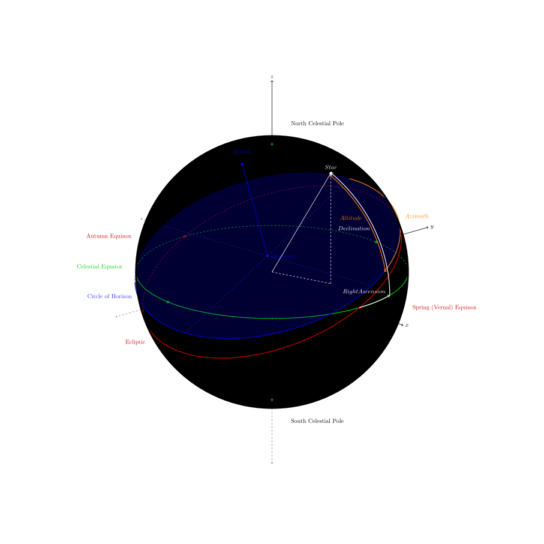

# ASTRONOMY CHEAT SHEET

Astronomy is the branch of science which deals with celestial objects,
space, and the physical universe as a whole._

Table of Contents

* [A BRIEF HISTORY OF ASTRONOMY](https://github.com/JeffDeCola/my-cheat-sheets/tree/master/other/stem/science/earth-and-space-science/astronomy-cheat-sheet#a-brief-history-of-astronomy)
  * [NICOLAUS COPERNICUS (1473-1543) POLISH](https://github.com/JeffDeCola/my-cheat-sheets/tree/master/other/stem/science/earth-and-space-science/astronomy-cheat-sheet#nicolaus-copernicus-1473-1543-polish)
  * [TYCHO BRAHE (1546-1601) DANISH](https://github.com/JeffDeCola/my-cheat-sheets/tree/master/other/stem/science/earth-and-space-science/astronomy-cheat-sheet#tycho-brahe-1546-1601-danish)
  * [JOHANNES KEPLER (1571-1630) GERMAN](https://github.com/JeffDeCola/my-cheat-sheets/tree/master/other/stem/science/earth-and-space-science/astronomy-cheat-sheet#johannes-kepler-1571-1630-german)
  * [GALILEO GALILEI (1564-1642) ITALY](https://github.com/JeffDeCola/my-cheat-sheets/tree/master/other/stem/science/earth-and-space-science/astronomy-cheat-sheet#galileo-galilei-1564-1642--italy)
  * [SIR ISSAC NEWTON (1642-1727) ENGLISH](https://github.com/JeffDeCola/my-cheat-sheets/tree/master/other/stem/science/earth-and-space-science/astronomy-cheat-sheet#sir-issac-newton-1642-1727-english)
* [THE CELESTIAL SPHERE](https://github.com/JeffDeCola/my-cheat-sheets/tree/master/other/stem/science/earth-and-space-science/astronomy-cheat-sheet#the-celestial-sphere)
  * [MAPPING STAR ON CELESTIAL SPHERE (DECLINATION & RIGHT ASCENSION)](https://github.com/JeffDeCola/my-cheat-sheets/tree/master/other/stem/science/earth-and-space-science/astronomy-cheat-sheet#mapping-star-on-celestial-sphere-declination--right-ascension)
  * [OBSERVER ON EARTH FINDING A STAR (ALTITUDE & AZIMUTH)](https://github.com/JeffDeCola/my-cheat-sheets/tree/master/other/stem/science/earth-and-space-science/astronomy-cheat-sheet#observer-on-earth-finding-a-star-altitude--azimuth)
* [OUR SOLAR SYSTEM & BEYOND](https://github.com/JeffDeCola/my-cheat-sheets/tree/master/other/stem/science/earth-and-space-science/astronomy-cheat-sheet#our-solar-system--beyond)
* [ASTRONOMICAL UNITS AND SCALE](https://github.com/JeffDeCola/my-cheat-sheets/tree/master/other/stem/science/earth-and-space-science/astronomy-cheat-sheet#astronomical-units-and-scale)
* [CELESTIAL BODIES](https://github.com/JeffDeCola/my-cheat-sheets/tree/master/other/stem/science/earth-and-space-science/astronomy-cheat-sheet#celestial-bodies)
  * [STARS](https://github.com/JeffDeCola/my-cheat-sheets/tree/master/other/stem/science/earth-and-space-science/astronomy-cheat-sheet#stars)
    * [STAR MAGNITUDE](https://github.com/JeffDeCola/my-cheat-sheets/tree/master/other/stem/science/earth-and-space-science/astronomy-cheat-sheet#star-magnitude)
    * [NOTABLE STARS](https://github.com/JeffDeCola/my-cheat-sheets/tree/master/other/stem/science/earth-and-space-science/astronomy-cheat-sheet#notable-stars)
  * [CONSTELLATIONS](https://github.com/JeffDeCola/my-cheat-sheets/tree/master/other/stem/science/earth-and-space-science/astronomy-cheat-sheet#constellations)
  * [PLANETS](https://github.com/JeffDeCola/my-cheat-sheets/tree/master/other/stem/science/earth-and-space-science/astronomy-cheat-sheet#planets)
  * [DWARF PLANETS](https://github.com/JeffDeCola/my-cheat-sheets/tree/master/other/stem/science/earth-and-space-science/astronomy-cheat-sheet#dwarf-planets)
  * [MOONS](https://github.com/JeffDeCola/my-cheat-sheets/tree/master/other/stem/science/earth-and-space-science/astronomy-cheat-sheet#moons)
  * [ASTEROIDS](https://github.com/JeffDeCola/my-cheat-sheets/tree/master/other/stem/science/earth-and-space-science/astronomy-cheat-sheet#asteroids)
  * [METEORITES](https://github.com/JeffDeCola/my-cheat-sheets/tree/master/other/stem/science/earth-and-space-science/astronomy-cheat-sheet#meteorites)
* [MESSIER & NEW GENERAL CATALOGUE](https://github.com/JeffDeCola/my-cheat-sheets/tree/master/other/stem/science/earth-and-space-science/astronomy-cheat-sheet#messier--new-general-catalogue)
  * [GALAXIES](https://github.com/JeffDeCola/my-cheat-sheets/tree/master/other/stem/science/earth-and-space-science/astronomy-cheat-sheet#galaxies)
  * [STAR CLUSTERS](https://github.com/JeffDeCola/my-cheat-sheets/tree/master/other/stem/science/earth-and-space-science/astronomy-cheat-sheet#star-clusters)
  * [NEBULAE](https://github.com/JeffDeCola/my-cheat-sheets/tree/master/other/stem/science/earth-and-space-science/astronomy-cheat-sheet#nebulae)
* [WHAT OBJECTS HAVE WE LANDED ON](https://github.com/JeffDeCola/my-cheat-sheets/tree/master/other/stem/science/earth-and-space-science/astronomy-cheat-sheet#what-objects-have-we-landed-on)
* [SCALE](https://github.com/JeffDeCola/my-cheat-sheets/tree/master/other/stem/science/earth-and-space-science/astronomy-cheat-sheet#scale)
  * [SUN & EARTH](https://github.com/JeffDeCola/my-cheat-sheets/tree/master/other/stem/science/earth-and-space-science/astronomy-cheat-sheet#sun--earth)
  * [EARTH & MOON](https://github.com/JeffDeCola/my-cheat-sheets/tree/master/other/stem/science/earth-and-space-science/astronomy-cheat-sheet#earth--moon)
  * [EARTH & MARS](https://github.com/JeffDeCola/my-cheat-sheets/tree/master/other/stem/science/earth-and-space-science/astronomy-cheat-sheet#earth--mars)
  * [TYPES OF STARS](https://github.com/JeffDeCola/my-cheat-sheets/tree/master/other/stem/science/earth-and-space-science/astronomy-cheat-sheet#types-of-stars)
* [FOR FUN - DEBUNKING THE FLAT EARTH MODEL](https://github.com/JeffDeCola/my-cheat-sheets/tree/master/other/stem/science/earth-and-space-science/astronomy-cheat-sheet#for-fun---debunking-the-flat-earth-model)

Documentation and Reference

* Check out whats in [our solar system & beyond](https://github.com/JeffDeCola/my-cheat-sheets/tree/master/other/stem/science/earth-and-space-science/astronomy-cheat-sheet/solar-system-and-beyond.md)

## A BRIEF HISTORY OF ASTRONOMY

This is a brief history of the major players that started
modern science.  And sadly, the church fought them
and arrested some along the way.  But
knowledge and truth will always win, you just need to always fight.

### NICOLAUS COPERNICUS (1473-1543) POLISH

He was really the first guy to determine the earth is not the
center of the universe.  But he did everything in secret
his entire life because he worked for the church.
Using just his eyes he watched the sky and determined
the sun was the center (heliocentric) of the universe of the time.
His book `On the Revolutions of the Celestial Spheres` was published
just before his death in 1543.  The book/work was denounced
by the church in 1616.

His major contributions are,

* All sphere revolve around sun
* Distance earth sun small comparison to stars
* Earth moves where sky remains unchanged
* What appears as the sun moving, is actually the earth

### TYCHO BRAHE (1546-1601) DANISH

Wanted to record the accurate planetary positions.
Like Copernicus no telescopes, just eyes. Worked with Kepler.

* Most accurate observations of tracking planetary bodies

But he still believed earth revolved around sun.  He was very
tied to the church.

### JOHANNES KEPLER (1571-1630) GERMAN

Sick a frail child. Math teacher. Very religious.
Wanted to find gods work. Worked for Brahe to
actually predict where Mars would be in the sky at
any giving time.  Wrote his masterpiece `Astronomia Nova`
on his work.

* Continued work by Copernicus
* Work on planetary bodies
* Model of universe based on geometric shapes
 (wrong) but great guess
* Mathematically predicted position of mars in sky
* He did not like Brahe's model and rejected it

Had three main contributions,

* Planets travel elliptical
* Closer you are to sun move faster
* The square of the orbital period of a planet
  is proportional to distance of the sun cubed

### GALILEO GALILEI (1564-1642)  ITALY

Father of observational astronomy and physics
and father of scientific method and modern science.
He was arrogant. His book
`Dialog Concerning the Two Chief World Systems` got him arrested.
Banned until 1718.

* Used and built primitive telescope
* Found Jupiter moons. Observational evidence.
* Not everything orbited around the earth
* Did not like Kepler or his laws

### SIR ISSAC NEWTON (1642-1727) ENGLISH

His book `Mathematical Principles of Natural Philosophy`,
published in 1687 laid foundation of classical mechanics.
Apple falling from tree is a fairy tail he made up.

* Newtons 3 Laws of Motion
* Universal Gravitation (Superseded by Theory of relativity)
* Built a new type of telescope
* Helped pave the way for calculus
* Worked with Halley studying a comet (Halley's comet) and
  predicted when it would come back

## THE CELESTIAL SPHERE

The `Celestial Sphere` is a sphere around the earth that make the
stars appear to occupy fixed positions relative to each other.
The earth spins inside the celestial sphere.

The sphere is inline with the earth's equator and poles.
The earth's north pole is the `North Celestial Pole`
and the earth's south pole is the
`South Celestial Pole`. The `Celestial Equator` is a plane that
extends out from our earth's equator.

The `Ecliptic` is the Apparent path of suns motion on the `Celestial Sphere`.
The plane of our solar system.  The `Ecliptic` obviously passed through the
`Autumn Equinox` and the `Spring (Vernal) Equinox`.

### MAPPING STAR ON CELESTIAL SPHERE (DECLINATION & RIGHT ASCENSION)

You need two coordinated to find where a star is on the celestial sphere,

* `Right Ascension` is like longitude on earth.
* `Declination` is like latitude on earth.

`Right ascension` is counter-clockwise from the `Spring (Vernal) Equinox`.
The units are,

* `Hours` (0h-24h)
* `Minutes` (0m-60m)
* `Seconds`  (0m-60s)

The granularity (pixels) would be 24 x 60 x 60 = `86,400 points`.

It would be written like,

`5h 41m 28s`

`Declination` runs pole to pole, the `North Celestial Pole`
would be 90&deg; and the `South Celestial Pole`
would be -90&deg; The Equator would be 0&deg;.
The units are,

* `Degrees` (-90&deg;-90&deg;)
* `Arc Minutes` (0'-60')
* `Arc Seconds` (0"-60")

The granularity (pixels) would be 180 x 60 x 60 = `648,000 points`.

It would be written like,

`-2`&deg; `49' 11"`

The north pole would be written like `90`&deg; `0' 0"`.

The total number of `pixels` on a `Celestial Sphere` would be,
648,000 * 86,400 points = 55,987,200,000 or roughly ~55
billion points.

### OBSERVER ON EARTH FINDING A STAR (ALTITUDE & AZIMUTH)

How does an observer on earth find a star?
The point directly above the observer is called the
`zenith`. The `zenith` is 90&deg; from any point on horizon.

The star at a giving time simply has an

* `altitude` Degree from horizon where 0&deg is horizon and 90&deg; is zenith
* `azimuth` Angle from north (clockwise)

The `Meridian` passes through the `Zenith` and both the north and
south `Celestial Sphere` poles. Which is perpendicular to
the `Celestial Equator`.

This figure may help,

## OUR SOLAR SYSTEM & BEYOND

* 0-122 AU from the sun.
* 99.86% of the system’s mass is found in the Sun and the majority of the
  remaining 0.14% is contained within the solar system’s eight planets.
* The four smaller inner planets,
  also known as the “terrestrial planets”
  (Mercury, Venus, Earth and Mars), are primarily composed of rock and metal.
* The four outer planets,
  also known as the “gas giants”
  (Jupiter, Saturn, Uranus and Neptune), are substantially
  larger and more massive than the inner planets.
* Other objects of note in the Solar System are the dwarf planets
  (Ceres, Pluto, Haumea, Makemake & Eris), moons, asteroids,
  the asteroid belt, comets and the Kuiper belt.

For a complete rundown of our solar system, check out my
[our solar system & beyond cheat sheet](https://github.com/JeffDeCola/my-cheat-sheets/blob/master/other/stem/science/earth-and-space-science/astronomy-cheat-sheet/solar-system-and-beyond.md)

## ASTRONOMICAL UNITS AND SCALE

An astronomical unit (AU) represents the mean distance between
the Earth and our sun. An AU is approximately 93 million miles (150 million km).
It's approximately 8 light-minutes. More exactly,

* 1 AU = 92,955,807 miles (149,597,871 km).
* 1 Light Year = 63,241.1 AU

A `parsec` is defined as the distance at which one astronomical
unit subtends an angle of one arcsecond, which corresponds to 648000*pi
astronomical units.

## CELESTIAL BODIES

A natural object which is located outside of Earth's atmosphere.

### STARS

tbd

#### STAR MAGNITUDE

When viewing stars lets talk about magnitude.
The relative brightness of a star as seen from earth.

* APPARENT - How luminous the star looks on earth. Intrinsic.
* ABSOLUTE - How luminous a start is from a standard distance.

The lower the number, the brighter the star is.

* Jupiter is -2.7 (Brighter then any star).
* Sirius (brightest star in sky) is -1.46.
* Polaris is 1.97

#### NOTABLE STARS

For the northern hemisphere Polaris is currently the north star and is
at is end of little dipper.

But the southern hemisphere doesn't really have a south pole star.

Here are some other notable stars,

* [Betelgeuse](https://github.com/JeffDeCola/my-cheat-sheets/blob/master/other/stem/science/earth-and-space-science/astronomy-cheat-sheet/solar-system-and-beyond.md#betelgeuse)
  The brightest star in the night sky. Its
  ready to blow in the next million years. 430 light years away.
* [Sirius](https://github.com/JeffDeCola/my-cheat-sheets/blob/master/other/stem/science/earth-and-space-science/astronomy-cheat-sheet/solar-system-and-beyond.md#sirius)
  is the brightest star in the sky and only 8.6
  light years away. Sirius comes from the Greek word Sirius,
  meaning, "searing" or "scorching.
* [Rigel](https://github.com/JeffDeCola/my-cheat-sheets/blob/master/other/stem/science/earth-and-space-science/astronomy-cheat-sheet/solar-system-and-beyond.md#rigel)
  has a blue color. 7th brightest star in the Constellation of orion.
  864 lights years away.

### CONSTELLATIONS

Constellations are good for orienting yourself with the night sky.

* Ursa Major - great bear. Bigger dipper.
* Ursa Minor - Little bear. Little dipper.

### PLANETS

What is a planet?

* Orbits the sun
* Has sufficient mass to be round
* Is not a satellite of another object
* Can clear the area around its orbit

The problem with Pluto could not clear the area around its orbit.

### DWARF PLANETS

A celestial body resembling a small planet
but lacking certain technical criteria that
are required for it to be classed as such

### MOONS

tbd

### ASTEROIDS

tbd

### METEORITES

tbd

## MESSIER & NEW GENERAL CATALOGUE

Objects in the sky.  There are about 100 objects in the messier catalogue and
about 7000 objects in the new General Catalogue.

### GALAXIES

Its more that these are in different stages of their lives.
The older they get the become like spiral galaxies.

* BARRED SPIRAL
* SPIRAL
* ELLIPTICAL
* IRREGULAR
* LENTICULAR

### STAR CLUSTERS

* GLOBULAR - Clump of stars
* OPEN - Spread out, no real center

### NEBULAE

Looks like big plums of gas.

* STAR BIRTH
* STAR DEATH

## WHAT OBJECTS HAVE WE LANDED ON

List of landings on extraterrestrial bodies,

* Planets
  * Mercury
  * Venus
  * Mars
  * Jupiter
  * Saturn
* Moons
  * Earth
  * Mars
    * Phobos
  * Saturn
    * Titan
* Asteroids
  * Eros
  * Itokawa
  * Ryugu
* Comets
  * Comet 9P/Tempel 1
  * Comet 67P/Churyumov–Gerasimenko

## SCALE

Its hard to comprehend scale, so this may help a bit.

### SUN & EARTH

### EARTH & MOON

### EARTH & MARS

### TYPES OF STARS

## FOR FUN - DEBUNKING THE FLAT EARTH MODEL

There are always people who pretend/think they know a lot about something, but
actually know very little to nothing.  In the field of psychology,
this is referred to as the `Dunning–Kruger effect`. In which people mistakenly
assess their cognitive ability as greater than it is.

Anyway, here is my simple example out of thousands I use to
debunk the flat earth model. In the flat earth model, how do you drive west
to east without turning left the entire time?  Enjoy.

