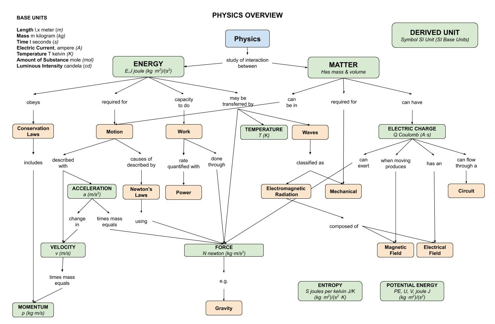

# PHYSICS CHEAT SHEET

```txt
*** THIS CHEAT SHEET IS UNDER CONSTRUCTION - CHECK BACK SOON ***
```

_Physics helps describe everything around us._

* [OVERVIEW](https://github.com/JeffDeCola/my-cheat-sheets/tree/master/other/stem/science/physical-science/physics-cheat-sheet#overview)
  * [MAIN BRANCHES OF PHYSICS](https://github.com/JeffDeCola/my-cheat-sheets/tree/master/other/stem/science/physical-science/physics-cheat-sheet#main-branches-of-physics)
  * [IMPORTANT DISCOVERIES IN PHYSICS](https://github.com/JeffDeCola/my-cheat-sheets/tree/master/other/stem/science/physical-science/physics-cheat-sheet#important-discoveries-in-physics)
* [PHYSICAL QUANTITIES & UNITS](https://github.com/JeffDeCola/my-cheat-sheets/tree/master/other/stem/science/physical-science/physics-cheat-sheet#physical-quantities--units)
  * [FUNDAMENTAL UNITS](https://github.com/JeffDeCola/my-cheat-sheets/tree/master/other/stem/science/physical-science/physics-cheat-sheet#fundamental-units)
  * [NOTABLE DERIVED UNITS](https://github.com/JeffDeCola/my-cheat-sheets/tree/master/other/stem/science/physical-science/physics-cheat-sheet#notable-derived-units)
* [A QUICK DISCUSSION ON OBJECTS, MASS & MATTER](https://github.com/JeffDeCola/my-cheat-sheets/tree/master/other/stem/science/physical-science/physics-cheat-sheet#a-quick-discussion-on-objects-mass--matter)

These cheat sheets explore the principle concepts of physics as follows,

* [MOTION](https://github.com/JeffDeCola/my-cheat-sheets/blob/master/other/stem/science/physical-science/physics-cheat-sheet/motion.md)
  * Scalars & Vectors
  * Speed, Velocity & Acceleration
  * Forces
* [ENERGY](https://github.com/JeffDeCola/my-cheat-sheets/blob/master/other/stem/science/physical-science/physics-cheat-sheet/energy.md)
  * Work & Power
  * Momentum
  * Thermodynamics
  * Potential Energy
  * Kinetic Energy
* [WAVES](https://github.com/JeffDeCola/my-cheat-sheets/blob/master/other/stem/science/physical-science/physics-cheat-sheet/waves.md)
* [ELECTRICITY AND MAGNETISM](https://github.com/JeffDeCola/my-cheat-sheets/blob/master/other/stem/science/physical-science/physics-cheat-sheet/electricity-and-magnetism.md)
  * General electricity
  * Static electricity
  * Direct current (DC) electricity
  * Alternating current (AC) electricity
  * Magnetism
  * Electromagnetism
* [LIGHT AND OPTICS](https://github.com/JeffDeCola/my-cheat-sheets/blob/master/other/stem/science/physical-science/physics-cheat-sheet/light-and-optics.md)
  * Light as a wave
  * Light as a particle

Documentation and Reference

* [make-README.sh](https://github.com/JeffDeCola/my-cheat-sheets/blob/master/other/stem/science/physical-science/physics-cheat-sheet/make-README.sh)
  uses
  [LaTex](https://github.com/JeffDeCola/my-cheat-sheets/tree/master/software/development/languages/latex-cheat-sheet)
  to render equations and make this readme
* This repos
  [github webpage](https://jeffdecola.github.io/my-cheat-sheets/)

## OVERVIEW

Physics tries to understand your world.
It helps explain why are things the way they are?
It is the study of the properties of matter and their relationship with energy
and forces. There are many branches of physics including electricity,
astronomy, motion, waves, sound, and light.

### MAIN BRANCHES OF PHYSICS

Physics can be subdivided into the following,

* `CLASSICAL PHYSICS` (**This cheat sheet**)
  * Isaac Newton is credited with many classical physics theories
* `RELATIVITY`
  * Concerns what happens to matter, space, and time at extremely high speeds
    or velocities
* `QUANTUM MECHANICS`
  * Concerns extremely small sizes and distances
* `ELECTROMAGNETISM AND ELECTRONICS`
* `THERMODYNAMICS AND STATISTICAL MECHANICS`

### IMPORTANT DISCOVERIES IN PHYSICS

* [Nicholas Copernicus](https://github.com/JeffDeCola/my-cheat-sheets/tree/master/other/stem/science/earth-and-space-science/astronomy-cheat-sheet#nicolaus-copernicus-1473-1543-polish)
  (1473-1543)
  Discovered that the Earth rotates around the Sun.
* [Galileo Galilei](https://github.com/JeffDeCola/my-cheat-sheets/tree/master/other/stem/science/earth-and-space-science/astronomy-cheat-sheet#galileo-galilei-1564-1642--italy)
  (1564-1642)
  Demonstrated that heavy objects do not fall faster than lighter
  ones in his famous Leaning Tower of Pisa experiment.
* [Sir Isaac Newton](https://github.com/JeffDeCola/my-cheat-sheets/tree/master/other/stem/science/earth-and-space-science/astronomy-cheat-sheet#sir-issac-newton-1642-1727-english)
  (1642-1727)
  Published the three laws of motion and explained how gravity works.
* `John Dalton`
  (1766-1844)
  Described the atom and the atomic theory of matter.
* `Albert Einstein`
  (1879-1955)
  Published the theory of relativity.
* `Max Planck`
  (1858-1947)
  Described quantum theory.

## PHYSICAL QUANTITIES & UNITS

The measurement of a `physical quantity` is expressed in `units`.

 A physical quantity is either defined by,

* Specifying how it is measured (e.g. distance and time) or
* Stating how it is calculated from other measurements (e.g. speed which
  is distance over time)

### FUNDAMENTAL UNITS

Fundamental units, with their symbols, of a physical quantity,

* `LENGTH`
  * $l$, $L$, $x$, meter ($m$)
* `MASS`
  * $m$, $M$, kilogram ($kg$)
  * mass is not the same as weight
  * Its both a property of a physical body and
  * A measure of its resistance to acceleration (a change in its state of motion)
  when a net force is applied
* `TIME`
  * $t$, $T$, seconds ($s$)
* `ELECTRIC CURRENT`
  * $i$, $I$, ampere ($A$)
* `TEMPERATURE`
  * $T$, $\theta$, kelvin ($K$)
* `AMOUNT OF SUBSTANCE`
  * $n$, $N$, mole ($mol$)
* `LUMINOUS INTENSITY`
  * $J$, candela ($cd$)

### NOTABLE DERIVED UNITS

Some derived units of a physical quantity,

* `ENERGY`
  * $E$, $J$, joule ($kg\cdot m^2/ s^{2}$)
  * Must be transferred to an object in order to perform work on, or to heat,
    the object
  * Concerns the velocity of matter
  * Capacity to do `work`
* `MATTER`
  * Have mass and volume (take up space)
* `VELOCITY`
  * $v$, velocity $(m/s)$
  * The rate of change of its position with respect to a frame of   reference,
    and is a function of time
* `ACCELERATION`
  * $a$, acceleration $(m/s^2)$
  * Rate of change of velocity of an object with respect to time
* `MOMENTUM`
  * $p$, $(kg \cdot m/s)$
  * Product of the mass and `velocity` of an `object`
* `ELECTRIC CHARGE`
  * $Q$, coulomb ($A \cdot s$)
  * Is the physical property of matter that can experience a force
    when placed in an electromagnetic field.
  * Has an `electric field`
  * When moving produces a `magnetic field`
  * Can flow though a `circuit`.
* `FORCE`
  * $N$, newton ($kg \cdot m/s^2$)
  * Is any interaction that, when unopposed, will change the motion of an object
  * Such as `gravity`
* `ENTROPY`
  * $S$, joules per kelvin $J/K$ ($kg\cdot m^2/ s^{2}\cdot K$)
* `POTENTIAL ENERGY`
  * $PE$, $U$, $V$, joule $J$ ($kg\cdot m^2/ s^{2}$)
  * Is the `energy` held by an `object` because of its position relative
    to other `objects`

This illustration may help,



## A QUICK DISCUSSION ON OBJECTS, MASS & MATTER

tbd
