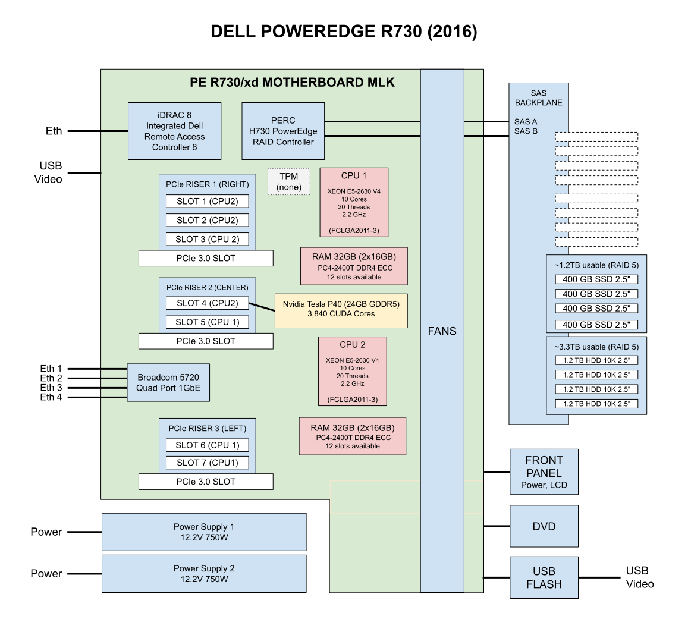

# POWEREDGE R730 CHEAT SHEET

[](https://jeffdecola.com)
[](https://jeffdecola.mit-license.org)

_Configure a Dell PowerEdge R730 with an NVIDIA Tesla P40 for GPU passthrough._

tl;dr

```text
iDRAC (racadm)
    racadm getsysinfo                                            # Server info
    racadm serveraction powerdown                                # Power off
    racadm serveraction powerup                                  # Power on
    racadm serveraction powercycle                               # Hard reboot
    racadm get System.ThermalSettings.ThirdPartyPCIFanResponse   # Verify fan response setting
PROXMOX
    Storage / VM
        pvesm status                                             # Storage status
    Hardware sensors
        ipmitool sdr                                             # All sensors
        ipmitool sdr type Fan                                    # Fan speed
        ipmitool sdr type Temperature                            # Temperatures
    Power chassis
        ipmitool chassis power status                            # Power state
        ipmitool chassis power on                                # Power on
        ipmitool chassis power off                               # Power off
        ipmitool chassis power reset                             # Hard reboot
    GPU verify
        lspci | grep -i nvidia                                   # Confirm P40 visible
        lspci -v | grep -A20 "Tesla P40"                         # Full P40 info
        lspci -nnk | grep -A3 "82:00.0"                          # Verify P40 bound to vfio-pci
        dmesg | grep -e DMAR -e IOMMU                            # Verify IOMMU enabled
    Fan control
        systemctl status fan-control.service                     # Verify fan override service
ON VM WITH P40
    nvidia-smi                                                   # Full P40 overview
    watch -n1 nvidia-smi                                         # Live refresh every second
    nvidia-smi dmon                                              # Live stats (utilization, temp, power)
```

Table of Contents

tbs

Documentation and Reference

* [poweredge r730](https://github.com/JeffDeCola/my-cheat-sheets/tree/master/other/stem/technology/computer-manufacturers/dell-poweredge-rack-servers/poweredge-r730-cheat-sheet#poweredge-r730-cheat-sheet)
* [nvidia tesla p40](https://github.com/JeffDeCola/my-cheat-sheets/tree/master/other/stem/technology/computer-manufacturers/dell-poweredge-rack-servers/nvidia-tesla-p40-cheat-sheet#nvidia-tesla-p40-cheat-sheet)
* [proxmox](https://github.com/JeffDeCola/my-cheat-sheets/tree/master/other/stem/technology/computer-manufacturers/dell-poweredge-rack-servers/proxmox-cheat-sheet#proxmox-cheat-sheet)

## OVERVIEW



## CONFIGURE IDRAC

iDRAC (Integrated Dell Remote Access Controller) is the R730's
out-of-band management processor. It runs independently of the
main system and lets you control the server (power, BIOS, RAID,
virtual console) over the network even when the OS is off or
the server is powered down.

iDRAC has its own dedicated ethernet port on the back of the
R730 (labeled with a wrench icon), its own IP address, and its
own login.
Two ways to access iDRAC, ssh or browser.
Default factory credentials are `root` / `calvin`. **Change
these immediately on first access** via the web UI or
`racadm set iDRAC.Users.2.Password <new-password>`.
SSH'ing into iDRAC drops you into the `racadm` shell,
**not** a Linux shell. Linux commands like `pvesm status` or
`ls` will return `COMMAND NOT RECOGNIZED`. Only `racadm`
commands work.

Useful racadm commands,

```bash
racadm getsysinfo               # Server info (model, service tag, IPs, BIOS)
racadm getniccfg                # iDRAC network config
racadm getsel                   # System event log
racadm racreset                 # Reset iDRAC if it gets wedged
```

Look up your service tag with `racadm getsysinfo` (e.g.
`<SERVICE-TAG>`). You'll need it for Dell support and firmware
downloads.

## CONFIGURE RAID VIRTUAL DRIVES

This R730 uses the embedded **PERC H730 Mini** controller in
RAID mode (not HBA mode) with two virtual disks:

* **SSD-Fast** (800GB raw / ~610 GiB thin pool for VMs)
  * RAID 10, 4x400GB SSD
  * 1x400GB SSD hot spare
  * Hosts Proxmox itself plus the LVM thin pool used for VM disks
* **SAS-Data** (3.6TB raw / 3.3 TiB usable)
  * RAID 5, 4x1.2TB HDD
  * 1x1.2TB HDD hot spare
  * Mounted at `/mnt/sas-data` (XFS) for ISOs, backups, and bulk data

The SSD array is sized for fast VM disk I/O; the SAS array is
the bulk cold-storage tier.

Confirm the controller status first. In iDRAC:

```text
Storage → Controllers → PERC H730 Mini
  * Battery Backup Unit (BBU) — should show Present / Ready
  * Cache Memory — should show 1GB (standard on H730 Mini)
```

The BBU is what makes **Write Back** caching safe — if the
server loses power mid-write, the battery preserves the cache
contents until power returns. If the BBU isn't Ready, the
controller falls back to **Write Through** (slower, but no
data risk). The steps below assume BBU is Ready and use Write
Back.

Create the first virtual disk:

```text
Storage → Virtual Disks → Create Virtual Disk
  * Virtual Disk Name:                    SSD-Fast
  * Controller:                           PERC H730 Mini (embedded)
  * Layout:                               RAID 10
  * Media Type:                           SSD
  * Stripe Element Size:                  64KB (default)
  * Read Policy:                          Adaptive Read Ahead
  * Write Policy:                         Write Back (BBU required)
  * Disk Cache Policy:                    Enabled
  * T10 Protection Information Capability: Disabled
```

Assign the hot spare:

```text
Storage → Virtual Disks → Manage
  * Right-click the 5th SSD (your spare drive)
  * Select Assign Dedicated Hot Spare
  * Assign it to the SSD-Fast virtual disk
```

Verify in **Physical Disks** that the drive is now marked as a
hot spare.

Repeat the process for the second virtual disk with these
changes:

```text
  * Virtual Disk Name:    SAS-Data
  * Layout:               RAID 5
  * Media Type:           HDD
  (all other settings the same)
```

Assign one of the 1.2TB HDDs as a dedicated hot spare for
SAS-Data using the same process.

If you're rebuilding and the drives have a previous RAID
configuration on them, you'll need to clear it first:

```text
Storage → Controllers → PERC H730 Mini → Setup
  * Clear Foreign Configuration (if drives came from another array)
  * Clear Configuration (wipes all RAID config — destructive)
```

After the OS is installed and the host is up, you can verify
the layout from the Proxmox shell:

```bash
lsblk                # See the RAID virtual disks as sda, sdb
pvesm status         # See how Proxmox is using them
vgs                  # Volume group capacity (SSD-Fast → pve VG)
lvs                  # Logical volumes (thin pool, VM disks)
df -h                # Filesystem usage (SAS-Data mount)
```

On this R730, `lsblk` shows `sda` (744 GiB, the SSD-Fast RAID
10) carved into Proxmox root, swap, and a ~610 GiB LVM thin
pool for VM disks. `sdb` (3.3 TiB, the SAS-Data RAID 5) is a
single XFS partition mounted at `/mnt/sas-data`.

## CONFIGURE NVIDIA TESLA P40

The Tesla P40 is a Pascal-architecture compute GPU — 24GB
GDDR5, 3840 CUDA cores, 250W TDP, **passively cooled with no
fans of its own** (it relies on chassis airflow), and **no
display outputs** (compute only, not usable for video). It
slots into a full-height, full-length PCIe x16 slot.

Physical install notes for the R730:

* The P40 needs a **CPU-style power cable** (EPS 8-pin, not a
  standard 6+2 PCIe connector). I bought one separately — it's
  not included with the bare card.
* On this R730 the P40 sits in **PCIe slot 3**.
* The card runs **stock** with no aftermarket cooling shroud,
  relying on the R730's chassis fans for airflow. This is why
  fan noise needs to be managed (see FIX FAN NOISE below).

After installing the P40 and installing Proxmox, confirm the
host sees the card:

```bash
lspci | grep -i nvidia
```

Should return something like:

```text
82:00.0 3D controller: NVIDIA Corporation GP102GL [Tesla P40] (rev a1)
```

For full details on the card:

```bash
lspci -v | grep -A20 "Tesla P40"
```

To make the P40 usable as a CUDA device inside a VM, the host
needs two configuration steps before the VM is created:

1. **IOMMU setup** — enable the Intel IOMMU and load the VFIO
   kernel modules so passthrough is possible.
2. **Bind P40 for CUDA passthrough** — blacklist the nouveau
   driver on the host and bind the P40 directly to vfio-pci so
   the host won't claim it.

### IOMMU SETUP

IOMMU (Input/Output Memory Management Unit) is what allows
Proxmox to hand a physical PCI device (like the P40) directly
to a VM as if the device were plugged straight into that VM's
motherboard. Without IOMMU, the host kernel always owns the
device and the VM can only access it through emulation.

This section turns on the capability — the next section
binds the specific P40 to it.

First, edit grub (the bootloader config the server reads at
power-on):

```bash
nano /etc/default/grub
```

Change the `GRUB_CMDLINE_LINUX_DEFAULT` line to:

```text
GRUB_CMDLINE_LINUX_DEFAULT="quiet intel_iommu=on iommu=pt"
```

* `intel_iommu=on` — activates the Intel CPU's IOMMU hardware.
* `iommu=pt` — passthrough mode (only enables IOMMU for
  devices that need it, leaving everything else alone for
  performance).

Apply the change:

```bash
update-grub
```

Next, add the VFIO kernel modules so they load on every boot:

```bash
nano /etc/modules
```

Append:

```text
vfio
vfio_iommu_type1
vfio_pci
vfio_virqfd
```

* `vfio` — the core framework that makes passthrough possible.
* `vfio_iommu_type1` — creates the memory isolation boundary
  around the VM.
* `vfio_pci` — the module that actually claims a PCI device
  away from the host.
* `vfio_virqfd` — handles interrupt signaling from the device
  (legacy; merged into vfio core on kernel 6.x+, harmless to
  list).

Reboot:

```bash
reboot
```

Verify IOMMU is active after reboot:

```bash
dmesg | grep -e DMAR -e IOMMU
```

Look for:

```text
DMAR: IOMMU enabled
```

Confirm the P40 is in its own IOMMU group (so it can be passed
through cleanly without dragging other devices along):

```bash
find /sys/kernel/iommu_groups/ -type l | grep -i 82:00
```

The P40 (and only the P40) should appear under a single group
number. If other devices share its group, passthrough is still
possible but requires passing the whole group together — or
applying the ACS override patch.

### BIND P40 FOR CUDA PASSTHROUGH

IOMMU is now on, but the host's default NVIDIA driver
(`nouveau`) will still try to grab the P40 at boot. This
section tells the host to ignore the P40 entirely and hand it
to `vfio-pci`, which holds it ready for a VM.

First, find the P40's vendor:device ID:

```bash
lspci -nn | grep -i nvidia
```

You should see something like:

```text
82:00.0 3D controller [0302]: NVIDIA Corporation GP102GL [Tesla P40] [10de:1b38] (rev a1)
```

The `[10de:1b38]` is the ID we need — `10de` is NVIDIA's
vendor ID, `1b38` is the P40 specifically. The `82:00.0` part
is the PCI address (it may differ on your R730 depending on
which slot the card is in).

Blacklist nouveau and bind the P40 to vfio-pci:

```bash
echo "blacklist nouveau" >> /etc/modprobe.d/blacklist.conf
echo "options vfio-pci ids=10de:1b38" >> /etc/modprobe.d/vfio.conf
update-initramfs -u
reboot
```

After reboot, verify the P40 is now bound to vfio-pci (use
your actual PCI address):

```bash
lspci -nnk | grep -A3 "82:00.0"
```

You should see:

```text
82:00.0 3D controller [0302]: NVIDIA Corporation GP102GL [Tesla P40] [10de:1b38]
        Subsystem: NVIDIA Corporation Device [10de:11d9]
        Kernel driver in use: vfio-pci
        Kernel modules: nvidiafb, nouveau
```

The line that matters is `Kernel driver in use: vfio-pci`.
That confirms the P40 is bound correctly and ready for VM
passthrough.

Note: you'll reboot twice across these two sections (once
after IOMMU setup, once after vfio-pci binding). IOMMU has to
be active before vfio-pci can claim the device meaningfully,
so the two-step reboot is intentional.

## FIX FAN NOISE

The iDRAC has no clue what this new hardware is so it ramps up the fans.
But this is unnecessary since the P40 manages it's own temperatures.

Disable third party PCIe fan response

ssh into iDRAC (ssh root@192.168.20.134)

```text
racadm set system.thermalsettings.ThirdPartyPCIFanResponse 0
```

Verify it took effect

```text
racadm get System.ThermalSettings.ThirdPartyPCIFanResponse
```

Also note, you want both power supplies connected to
reduce fan noise.

Also may want to try capping the minimum fan speed at 25%
instead of letting iDRAC decide.

```text
racadm set System.ThermalSettings.ThirdPartyPCIFanResponse 0
racadm set System.ThermalSettings.MinimumFanSpeed 25
```

OK, it didn't really work, so I did a IPMI override, but now
I had to create a script that re-applies the IPMI override on every boot.

```bash
cat << 'EOF' > /usr/local/bin/fan-control.sh
#!/bin/bash
# Disable automatic fan control
ipmitool raw 0x30 0x30 0x01 0x00
# Set fans to 25%
ipmitool raw 0x30 0x30 0x02 0xff 0x19
EOF
```

```bash
chmod +x /usr/local/bin/fan-control.sh
```

```bash
cat << 'EOF' > /etc/systemd/system/fan-control.service
[Unit]
Description=Dell Fan Control Override
After=multi-user.target

[Service]
Type=oneshot
ExecStart=/usr/local/bin/fan-control.sh

[Install]
WantedBy=multi-user.target
EOF
```

```bash
systemctl daemon-reload
systemctl enable fan-control.service
systemctl status fan-control.service
```

## CREATE VM WITH GPU PASSTHROUGH

Create a vm but do not power it on yet. In Proxmox UI, go to.

VM 102 → Hardware → Add → PCI Device

```bash
Device: 0000:82:00.0    ← your P40
All Functions: checked
ROM-Bar: checked
PCI-Express: checked
Primary GPU: leave unchecked
```

Now we need to add a serial port

VM 102 → Hardware → Add → Serial Port

```text
Serial Port: 0
```

Edit the VM Config on Proxmox Host

```bash
nano /etc/pve/qemu-server/102.conf
```

Add this line at the very top:

```text
args: -cpu host,kvm=off
```

Then find the `hostpci` line (the P40 entry) and make sure it looks like this:

```text
hostpci0: 0000:82:00.0,pcie=1,rombar=1
```

Then add this line anywhere in the file:

```bash
vga: std
```

Start VM and when finished that come back and install the drivers.


### CONFIGURE PROXMOX TO USE CUDA CORES

 We need to configure proxmox so a VM will be able to run
 Nvidia drivers and use the P40 for CUDA.

```bash
echo "blacklist nouveau" >> /etc/modprobe.d/blacklist.conf
echo "options vfio-pci ids=10de:1b38" >> /etc/modprobe.d/vfio.conf
update-initramfs -u
reboot
```

Check that it worked

```bash
lspci -nnk | grep -A3 "82:00.0"
```

You're looking for Kernel driver in use: vfio-pci.
That confirms the P40 is bound correctly and ready for
passthrough.


### ADD PCI DEVICE TO VM

tbd

### EDIT VM CONFIG FILE

tbd

## ADD NVIDIA DRIVERS TO VM

```bash
sudo apt install -y nvidia-driver-550 nvidia-utils-550
sudo reboot
```

If there are issues, you may have to get rid of secure boot.

Check if your p40 is alive on you vm

```bash
nvidia-smi
```

