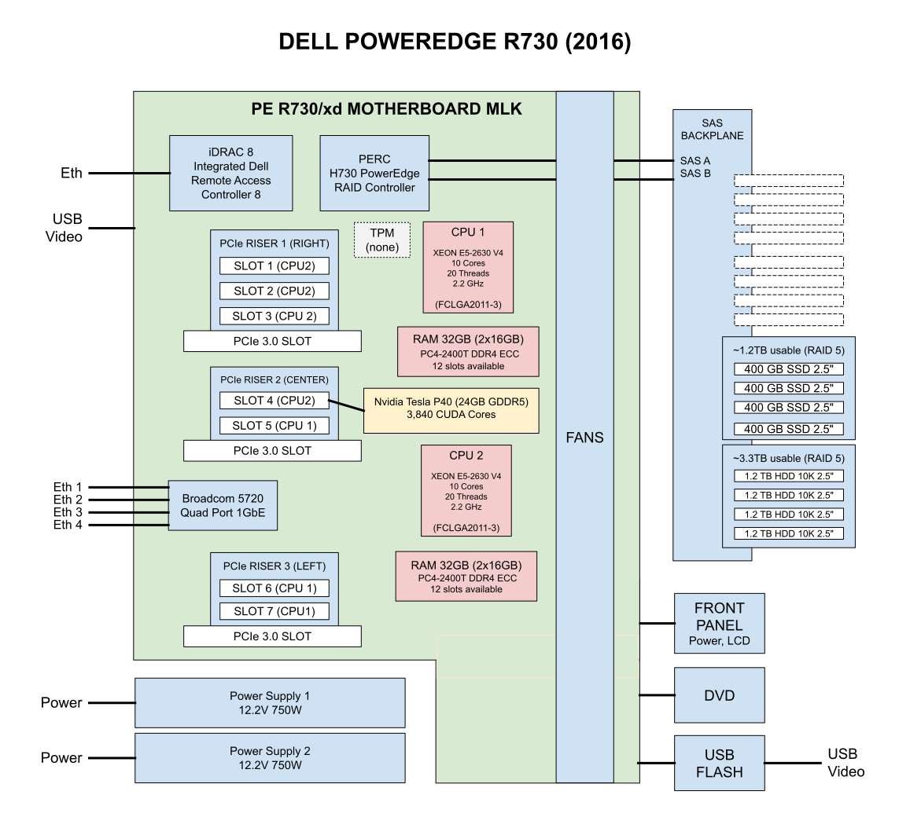

# POWEREDGE R730 NVIDIA P40 CONFIGURE CHEAT SHEET

[](https://jeffdecola.com)
[](https://jeffdecola.mit-license.org)

_Configure a dell rack server._

Table of Contents

* [OVERVIEW](https://github.com/JeffDeCola/my-cheat-sheets/tree/master/other/stem/technology/computer-manufacturers/dell-poweredge-rack-servers/poweredge-r730-nvidia-p40-configure-cheat-sheet#overview)
* [CONFIGURE RAID VIRTUAL DRIVES](https://github.com/JeffDeCola/my-cheat-sheets/tree/master/other/stem/technology/computer-manufacturers/dell-poweredge-rack-servers/poweredge-r730-nvidia-p40-configure-cheat-sheet#configure-raid-virtual-drives)
* [CONFIGURE NVIDIA TESLA P40](https://github.com/JeffDeCola/my-cheat-sheets/tree/master/other/stem/technology/computer-manufacturers/dell-poweredge-rack-servers/poweredge-r730-nvidia-p40-configure-cheat-sheet#configure-nvidia-tesla-p40)
  * [IOMMU SETUP](https://github.com/JeffDeCola/my-cheat-sheets/tree/master/other/stem/technology/computer-manufacturers/dell-poweredge-rack-servers/poweredge-r730-nvidia-p40-configure-cheat-sheet#iommu-setup)
  * [FIX FAN NOISE](https://github.com/JeffDeCola/my-cheat-sheets/tree/master/other/stem/technology/computer-manufacturers/dell-poweredge-rack-servers/poweredge-r730-nvidia-p40-configure-cheat-sheet#fix-fan-noise)
  * [CONFIGURE PROXMOX TO USE CUDA CORES](https://github.com/JeffDeCola/my-cheat-sheets/tree/master/other/stem/technology/computer-manufacturers/dell-poweredge-rack-servers/poweredge-r730-nvidia-p40-configure-cheat-sheet#configure-proxmox-to-use-cuda-cores)
  * [CREATE VM - ADD PASSTHROUGH FOR THIS VM](https://github.com/JeffDeCola/my-cheat-sheets/tree/master/other/stem/technology/computer-manufacturers/dell-poweredge-rack-servers/poweredge-r730-nvidia-p40-configure-cheat-sheet#create-vm---add-passthrough-for-this-vm)
  * [ADD NVIDIA DRIVERS TO VM](https://github.com/JeffDeCola/my-cheat-sheets/tree/master/other/stem/technology/computer-manufacturers/dell-poweredge-rack-servers/poweredge-r730-nvidia-p40-configure-cheat-sheet#add-nvidia-drivers-to-vm)

## OVERVIEW



## CONFIGURE RAID VIRTUAL DRIVES

I'm going to create two virtual disk raid drives.

* "SSD-Fast-1.6TB" (800GB Useable)
  * RAID 10 4x400GB SSD
  * 1 400GB SSDs hot swap
* "HDD-Bulk-4.8TB" (3.3TB Useable)
  * RAID 5 4x1.2TB HDD
  * 1 1.2TB HDD hot swap

In iDRAC

```text
Storage → Controllers
* Click on your H730 Mini and you should see
  * Battery Backup Unit (BBU) — shows Present / Ready / Charging
  * Cache Memory — shows the amount (usually 1GB on H730 Mini)
```

If BBU field is ready we used Write Back to create virtual disk

```text
Storage → Virtual Disk -> Click Create Virtual Disk
* Virtual Disk Name: "SSD-Fast-1.6TB"
* Controller: PERC H730 Mini (embedded)
* Layout: RAID 10
* Media Type: SSD
* Stripe Element Size: 64KB (default is fine)
* Capacity: N/A
* Read Policy: Adaptive Read Ahead
* Write Policy: Write Back (if battery/cache present)
* Disk Cache Policy: Enabled
* T10 Protection Information Capacity: Disabled
* Span Count: N/A
```

Assign the Hot Spare Disk

```text
Storage → Virtual Disks -> Manage
  * Right-click the 5th WGP72 (your spare)
  * Select Assign Dedicated Hot Spare
  * Assign it to the SSD-Fast-1.6TB virtual disk
```

Check that it's a hot spare in physical disks.

If you want to do another one, do the same process as above but
may need to remove and old RAID configuration in
Storage -> Controllers.

## CONFIGURE NVIDIA TESLA P40

After installing the P40 and install proxmox, you can check
that it is installed via proxmox

```bash
lspci | grep -i nvidia
```

### IOMMU SETUP

IOMMU is what allows Proxmox to hand a physical piece of hardware (e.g. P40)
directly to a VM as if it were plugged straight into that VM's motherboard.

First we edit grub (what the server sees when it turns on).

```bash
nano /etc/default/grub
```

Change to

```text
GRUB_CMDLINE_LINUX_DEFAULT="quiet intel_iommu=on iommu=pt"
```

* intel_iommu=on — tells the Intel CPU to activate it's IOMMU hardware
* iommu=pt — passthrough mode

```bash
update-grub
```

Add 4 VFIO kernel modules to give this GPU passthrough capability

```bash
nano /etc/modules
```

Add

```bash
vfio
vfio_iommu_type1
vfio_pci
vfio_virqfd
```

* vfio — the core framework that makes passthrough possible
* vfio_iommu_type1 — creates a memory fence around the VM
* vfio_pci — the piece that actually grabs the P40 away from the host
* vfio_virqfd — handles the signals the GPU sends when it needs attention

```bash
reboot
```

Verify

```bash
dmesg | grep -e DMAR -e IOMMU
```

We want to see

```text
DMAR: IOMMU enabled
```

Now when we build our first VM, we can finish the P40 passthrough

* Tell VFIO to grab the P40 away from the host
* Assign it to the Ollama VM in Proxmox

### FIX FAN NOISE

The iDRAC has no clue what this new hardware is so it ramps up the fans.
But this is unnecessary since the P40 manages it's own temperatures.

Disable third party PCIe fan response

ssh into iDRAC (ssh root@192.168.20.134)

```text
racadm set system.thermalsettings.ThirdPartyPCIFanResponse 0
```

Verify it took effect

```text
racadm get System.ThermalSettings.ThirdPartyPCIFanResponse
```

Also note, you want both power supplies connected to
reduce fan noise.

Also may want to try capping the minimum fan speed at 25%
instead of letting iDRAC decide.

```text
racadm set System.ThermalSettings.ThirdPartyPCIFanResponse 0
racadm set System.ThermalSettings.MinimumFanSpeed 25
```

OK, it didn't really work, so I did a IPMI override, but now
I had to create a script that re-applies the IPMI override on every boot.

```bash
cat << 'EOF' > /usr/local/bin/fan-control.sh
#!/bin/bash
# Disable automatic fan control
ipmitool raw 0x30 0x30 0x01 0x00
# Set fans to 25%
ipmitool raw 0x30 0x30 0x02 0xff 0x19
EOF
```

```bash
chmod +x /usr/local/bin/fan-control.sh
```

```bash
cat << 'EOF' > /etc/systemd/system/fan-control.service
[Unit]
Description=Dell Fan Control Override
After=multi-user.target

[Service]
Type=oneshot
ExecStart=/usr/local/bin/fan-control.sh

[Install]
WantedBy=multi-user.target
EOF
```

```bash
systemctl daemon-reload
systemctl enable fan-control.service
systemctl status fan-control.service
```

### CONFIGURE PROXMOX TO USE CUDA CORES

 We need to configure proxmox so a VM will be able to run
 Nvidia drivers and use the P40 for CUDA.

```bash
echo "blacklist nouveau" >> /etc/modprobe.d/blacklist.conf
echo "options vfio-pci ids=10de:1b38" >> /etc/modprobe.d/vfio.conf
update-initramfs -u
reboot
```

Check that it worked

```bash
lspci -nnk | grep -A3 "82:00.0"
```

You're looking for Kernel driver in use: vfio-pci.
That confirms the P40 is bound correctly and ready for
passthrough.

### CREATE VM - ADD PASSTHROUGH FOR THIS VM

Create a vm but do not power it on yet. In Proxmox UI, go to.

VM 102 → Hardware → Add → PCI Device

```bash
Device: 0000:82:00.0    ← your P40
All Functions: checked
ROM-Bar: checked
PCI-Express: checked
Primary GPU: leave unchecked
```

Now we need to add a serial port

VM 102 → Hardware → Add → Serial Port

```text
Serial Port: 0
```

Edit the VM Config on Proxmox Host

```bash
nano /etc/pve/qemu-server/102.conf
```

Add this line at the very top:

```text
args: -cpu host,kvm=off
```

Then find the `hostpci` line (the P40 entry) and make sure it looks like this:

```text
hostpci0: 0000:82:00.0,pcie=1,rombar=1
```

Then add this line anywhere in the file:

```bash
vga: std
```

Start VM and when finished that come back and install the drivers.

### ADD NVIDIA DRIVERS TO VM

```bash
sudo apt install -y nvidia-driver-550 nvidia-utils-550
sudo reboot
```

If there are issues, you may have to get rid of secure boot.

check if your p40 is alive on you vm

```bash
nvidia-smi
```
