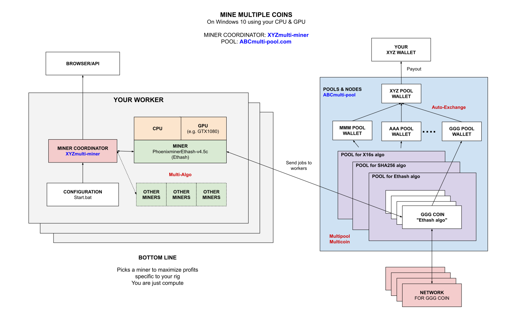

# MINE MULTIPLE COINS WINDOWS GPU USING MULTIPOOLMINER CHEAT SHEET

[](https://jeffdecola.com)
[](https://jeffdecola.mit-license.org)

_How to mine for multiple coins
on your Windows 10 GPU
using `multipoolminer` mining software
connected to the `miningpoolhub.com` pool._

My other mining cheatsheets

* **FULL NODE**
  * [mine-ZEC-macOS-cpu-zcashd](https://github.com/JeffDeCola/my-cheat-sheets/tree/master/other/stem/technology/cryptocurrency-and-mining/full-node/mine-ZEC-macOS-cpu-zcashd-cheat-sheet)
* **MULTIPLE POOLS**
  * [mine-MULTICOINS-windows-gpu-awesome-miner](https://github.com/JeffDeCola/my-cheat-sheets/tree/master/other/stem/technology/cryptocurrency-and-mining/multiple-pools/mine-MULTICOINS-windows-gpu-awesome-miner-cheat-sheet)
  * [mine-MULTICOINS-windows-gpu-multipoolminer](https://github.com/JeffDeCola/my-cheat-sheets/tree/master/other/stem/technology/cryptocurrency-and-mining/multiple-pools/mine-MULTICOINS-windows-gpu-multipoolminer-cheat-sheet)
    **<-YOU ARE HERE**
* **POOLS**
  * [mine-BEAM-windows-gpu-lolMiner](https://github.com/JeffDeCola/my-cheat-sheets/tree/master/other/stem/technology/cryptocurrency-and-mining/pools/mine-BEAM-windows-gpu-lolMiner-cheat-sheet)
  * [mine-BTG-windows-gpu-gminer](https://github.com/JeffDeCola/my-cheat-sheets/tree/master/other/stem/technology/cryptocurrency-and-mining/pools/mine-BTG-windows-gpu-gminer-cheat-sheet)
  * [mine-RVN-windows-gpu-t-rex](https://github.com/JeffDeCola/my-cheat-sheets/tree/master/other/stem/technology/cryptocurrency-and-mining/pools/mine-RVN-windows-gpu-t-rex-cheat-sheet)
  * [mine-ZCL-windows-gpu-lolMiner](https://github.com/JeffDeCola/my-cheat-sheets/tree/master/other/stem/technology/cryptocurrency-and-mining/pools/mine-ZCL-windows-gpu-lolMiner-cheat-sheet)
  * [mine-ZEC-windows-gpu-funakoshiMiner](https://github.com/JeffDeCola/my-cheat-sheets/tree/master/other/stem/technology/cryptocurrency-and-mining/pools/mine-ZEC-windows-gpu-funakoshiMiner-cheat-sheet)
  * [mine-ZEL-windows-gpu-gminer](https://github.com/JeffDeCola/my-cheat-sheets/tree/master/other/stem/technology/cryptocurrency-and-mining/pools/mine-ZEL-windows-gpu-gminer-cheat-sheet)

Table of Contents

* [OVERVIEW](https://github.com/JeffDeCola/my-cheat-sheets/tree/master/other/stem/technology/cryptocurrency-and-mining/multiple-pools/mine-MULTICOINS-windows-gpu-multipoolminer-cheat-sheet#overview)
* [MINER](https://github.com/JeffDeCola/my-cheat-sheets/tree/master/other/stem/technology/cryptocurrency-and-mining/multiple-pools/mine-MULTICOINS-windows-gpu-multipoolminer-cheat-sheet#miner)
* [POOL](https://github.com/JeffDeCola/my-cheat-sheets/tree/master/other/stem/technology/cryptocurrency-and-mining/multiple-pools/mine-MULTICOINS-windows-gpu-multipoolminer-cheat-sheet#pool)
* [RUN](https://github.com/JeffDeCola/my-cheat-sheets/tree/master/other/stem/technology/cryptocurrency-and-mining/multiple-pools/mine-MULTICOINS-windows-gpu-multipoolminer-cheat-sheet#run)
* [MONITOR](https://github.com/JeffDeCola/my-cheat-sheets/tree/master/other/stem/technology/cryptocurrency-and-mining/multiple-pools/mine-MULTICOINS-windows-gpu-multipoolminer-cheat-sheet#monitor)

Documentation and Reference

* [cryptocurrency](https://github.com/JeffDeCola/my-cheat-sheets/tree/master/other/stem/technology/cryptocurrency-and-mining/overview/cryptocurrency/cryptocurrency-cheat-sheet)

## OVERVIEW

Instead of using a one miner and one pool, you will be
using multiple miners and multiple pools.

A "mining coordinator" will be used to determine what pool to mine to
based on your rig in order to maximize profits.
It will pick the best miner to use at the time and switch
between miners and pools as coin prices change, etc...

Since you are mining to multiple pools and will have
little bits of coins everywhere, the pool will automatically
exchange all those coins into one wallet.
I like to put everything into litecoin since its fast.

They like to call these `Multialgo (Multi algorithm), Multicoin, Auto-Exchange Pools`.

Here is an illustration of what we're going to do,



## MINER

Grab the latest Windows binary from
[https://github.com/MultiPoolMiner/MultiPoolMiner/releases](https://github.com/MultiPoolMiner/MultiPoolMiner/releases)

Place the folder anywhere on your rig.

## POOL

First, lets pick you pool. I registered at
[miningpoolhub.com](https://miningpoolhub.com).

Now choose the wallet to put all your coins in aut-exchange.
Add a Worker name and a password 'x' under hub worker.

## RUN

Create a `start.bat` file,

```bash
set "command=& .\multipoolminer.ps1
-API_Key <YOUR_API_KEY>
-APIPort 3999
-UserName <YOUR_USERNAME>
-WorkerName <YOUR_WORKER_NAME>
-Region US
-Currency usd
-DeviceName nvidia
-PoolName miningpoolhub-Algo
-Donate 10
-Watchdog
-MinerStatusURL https://multipoolminer.io/monitor/miner.php
-MinerStatusKey <YOUR_KEY>
-SwitchingPrevention 2"
```

If you want to only use a particular miner (algorithm) use,

```bash
-Algorithm Ethash
```

If you want to mine for a particular coin like `Feathercoin` use,

```bash
-CoinName Feathercoin
```

I wanted to get Ethereum coin to work but can't seem to figure it out.

## MONITOR

You can locally monitor your mining software,

 [localhost:3999]( http://localhost:3999)

Thats it, you're mining and wasting electricity.
