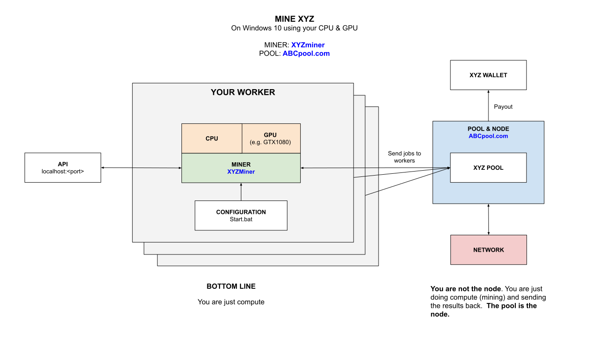

# MINE RVN (Ravencoin) WINDOWS GPU USING T-REX CHEAT SHEET

[](https://jeffdecola.com)
[](https://jeffdecola.mit-license.org)

_How to mine for RVN (Ravencoin)
on your Windows 10 GPU
using `t-rex` mining software
connected to a pool._

My other mining cheat sheets

* **FULL NODE**
  * [mine-ZEC-macOS-cpu-zcashd](https://github.com/JeffDeCola/my-cheat-sheets/tree/master/other/stem/technology/cryptocurrency-and-mining/full-node/mine-ZEC-macOS-cpu-zcashd-cheat-sheet)
* **MULTIPLE POOLS**
  * [mine-MULTICOINS-windows-gpu-awesome-miner](https://github.com/JeffDeCola/my-cheat-sheets/tree/master/other/stem/technology/cryptocurrency-and-mining/multiple-pools/mine-MULTICOINS-windows-gpu-awesome-miner-cheat-sheet)
  * [mine-MULTICOINS-windows-gpu-multipoolminer](https://github.com/JeffDeCola/my-cheat-sheets/tree/master/other/stem/technology/cryptocurrency-and-mining/multiple-pools/mine-MULTICOINS-windows-gpu-multipoolminer-cheat-sheet)
* **POOLS**
  * [mine-BEAM-windows-gpu-lolMiner](https://github.com/JeffDeCola/my-cheat-sheets/tree/master/other/stem/technology/cryptocurrency-and-mining/pools/mine-BEAM-windows-gpu-lolMiner-cheat-sheet)
  * [mine-BTG-windows-gpu-gminer](https://github.com/JeffDeCola/my-cheat-sheets/tree/master/other/stem/technology/cryptocurrency-and-mining/pools/mine-BTG-windows-gpu-gminer-cheat-sheet)
  * [mine-RVN-windows-gpu-t-rex](https://github.com/JeffDeCola/my-cheat-sheets/tree/master/other/stem/technology/cryptocurrency-and-mining/pools/mine-RVN-windows-gpu-t-rex-cheat-sheet)
    **<-YOU ARE HERE**
  * [mine-ZCL-windows-gpu-lolMiner](https://github.com/JeffDeCola/my-cheat-sheets/tree/master/other/stem/technology/cryptocurrency-and-mining/pools/mine-ZCL-windows-gpu-lolMiner-cheat-sheet)
  * [mine-ZEC-windows-gpu-funakoshiMiner](https://github.com/JeffDeCola/my-cheat-sheets/tree/master/other/stem/technology/cryptocurrency-and-mining/pools/mine-ZEC-windows-gpu-funakoshiMiner-cheat-sheet)
  * [mine-ZEL-windows-gpu-gminer](https://github.com/JeffDeCola/my-cheat-sheets/tree/master/other/stem/technology/cryptocurrency-and-mining/pools/mine-ZEL-windows-gpu-gminer-cheat-sheet)

Table of Contents

* [OVERVIEW](https://github.com/JeffDeCola/my-cheat-sheets/tree/master/other/stem/technology/cryptocurrency-and-mining/pools/mine-RVN-windows-gpu-t-rex-cheat-sheet#overview)
* [MINER](https://github.com/JeffDeCola/my-cheat-sheets/tree/master/other/stem/technology/cryptocurrency-and-mining/pools/mine-RVN-windows-gpu-t-rex-cheat-sheet#miner)
* [POOL](https://github.com/JeffDeCola/my-cheat-sheets/tree/master/other/stem/technology/cryptocurrency-and-mining/pools/mine-RVN-windows-gpu-t-rex-cheat-sheet#pool)
* [RUN](https://github.com/JeffDeCola/my-cheat-sheets/tree/master/other/stem/technology/cryptocurrency-and-mining/pools/mine-RVN-windows-gpu-t-rex-cheat-sheet#run)
* [MONITOR](https://github.com/JeffDeCola/my-cheat-sheets/tree/master/other/stem/technology/cryptocurrency-and-mining/pools/mine-RVN-windows-gpu-t-rex-cheat-sheet#monitor)

Documentation and Reference

* [cryptocurrency](https://github.com/JeffDeCola/my-cheat-sheets/tree/master/other/stem/technology/cryptocurrency-and-mining/overview/cryptocurrency/cryptocurrency-cheat-sheet)

## OVERVIEW

Here is an illustration of what we're going to do,



## MINER

`t-rex` can mine quit a bit of different coins.

Grab the latest Windows binary from
[github.com/trexminer/T-Rex/releases](https://github.com/trexminer/T-Rex/releases/)
and place the folder anywhere on your rig.

## POOL

You can use any pool. For this example we're going to use
[2miners.com](https://2miners.com/)
which doesn't require an account.

The only thing you need is a personal wallet address
that you will place in the .bat file below.

## RUN

### SOLO POOL

To run on `2miners.com` SOLO pool create a `start.bat` file,

```bash
t-rex.exe
-a x16r
--fork-at x16rv2=2019-10-01T16:00:00
-o stratum+tcp://solo-rvn.2miners.com:7070
-u <WALLET>.<WORKER>
-p x
```

### NORMAL POOL

To run on `2miners.com` normal pool just change the pool and port,

```bat
-o stratum+tcp://rvn.2miners.com:6060
```

## MONITOR

You can locally monitor your mining software,

[10.141.141.1:4067/trex](http://10.141.141.1:4067/trex)

Thats it, you're mining and wasting electricity.
