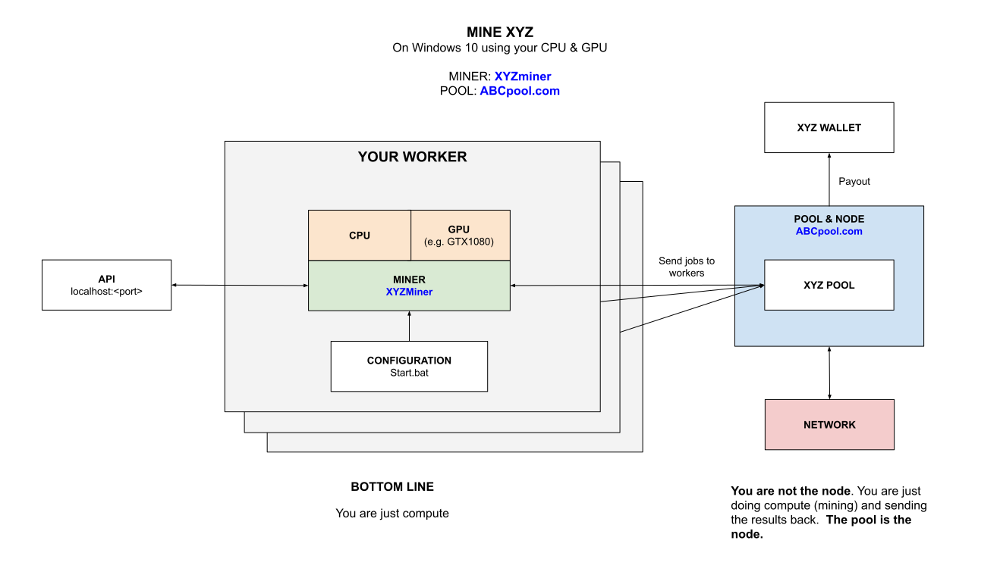

# MINE ZEC (Zcash) WINDOWS GPU USING FUNAKOSHIMINER CHEAT SHEET

[](https://jeffdecola.com)
[](https://jeffdecola.mit-license.org)

_How to mine for Zcash (ZEC)
on your Windows 10 GPU
using `funakoshiMiner` mining software
connected to a pool._

My other mining cheat sheets

* **FULL NODE**
  * [mine-ZEC-macOS-cpu-zcashd](https://github.com/JeffDeCola/my-cheat-sheets/tree/master/other/stem/technology/cryptocurrency-and-mining/full-node/mine-ZEC-macOS-cpu-zcashd-cheat-sheet)
* **MULTIPLE POOLS**
  * [mine-MULTICOINS-windows-gpu-awesome-miner](https://github.com/JeffDeCola/my-cheat-sheets/tree/master/other/stem/technology/cryptocurrency-and-mining/multiple-pools/mine-MULTICOINS-windows-gpu-awesome-miner-cheat-sheet)
  * [mine-MULTICOINS-windows-gpu-multipoolminer](https://github.com/JeffDeCola/my-cheat-sheets/tree/master/other/stem/technology/cryptocurrency-and-mining/multiple-pools/mine-MULTICOINS-windows-gpu-multipoolminer-cheat-sheet)
* **POOLS**
  * [mine-BEAM-windows-gpu-lolMiner](https://github.com/JeffDeCola/my-cheat-sheets/tree/master/other/stem/technology/cryptocurrency-and-mining/pools/mine-BEAM-windows-gpu-lolMiner-cheat-sheet)
  * [mine-BTG-windows-gpu-gminer](https://github.com/JeffDeCola/my-cheat-sheets/tree/master/other/stem/technology/cryptocurrency-and-mining/pools/mine-BTG-windows-gpu-gminer-cheat-sheet)
  * [mine-RVN-windows-gpu-t-rex](https://github.com/JeffDeCola/my-cheat-sheets/tree/master/other/stem/technology/cryptocurrency-and-mining/pools/mine-RVN-windows-gpu-t-rex-cheat-sheet)
  * [mine-ZCL-windows-gpu-lolMiner](https://github.com/JeffDeCola/my-cheat-sheets/tree/master/other/stem/technology/cryptocurrency-and-mining/pools/mine-ZCL-windows-gpu-lolMiner-cheat-sheet)
  * [mine-ZEC-windows-gpu-funakoshiMiner](https://github.com/JeffDeCola/my-cheat-sheets/tree/master/other/stem/technology/cryptocurrency-and-mining/pools/mine-ZEC-windows-gpu-funakoshiMiner-cheat-sheet)
    **<-YOU ARE HERE**
  * [mine-ZEL-windows-gpu-gminer](https://github.com/JeffDeCola/my-cheat-sheets/tree/master/other/stem/technology/cryptocurrency-and-mining/pools/mine-ZEL-windows-gpu-gminer-cheat-sheet)

Table of Contents

* [OVERVIEW](https://github.com/JeffDeCola/my-cheat-sheets/tree/master/other/stem/technology/cryptocurrency-and-mining/pools/mine-ZEC-windows-gpu-funakoshiMiner-cheat-sheet#overview)
* [MINER](https://github.com/JeffDeCola/my-cheat-sheets/tree/master/other/stem/technology/cryptocurrency-and-mining/pools/mine-ZEC-windows-gpu-funakoshiMiner-cheat-sheet#miner)
* [POOL](https://github.com/JeffDeCola/my-cheat-sheets/tree/master/other/stem/technology/cryptocurrency-and-mining/pools/mine-ZEC-windows-gpu-funakoshiMiner-cheat-sheet#pool)
* [RUN](https://github.com/JeffDeCola/my-cheat-sheets/tree/master/other/stem/technology/cryptocurrency-and-mining/pools/mine-ZEC-windows-gpu-funakoshiMiner-cheat-sheet#run)
* [MONITOR](https://github.com/JeffDeCola/my-cheat-sheets/tree/master/other/stem/technology/cryptocurrency-and-mining/pools/mine-ZEC-windows-gpu-funakoshiMiner-cheat-sheet#monitor)

Documentation and Reference

* [cryptocurrency](https://github.com/JeffDeCola/my-cheat-sheets/tree/master/other/stem/technology/cryptocurrency-and-mining/overview/cryptocurrency/cryptocurrency-cheat-sheet)

## OVERVIEW

Here is an illustration of what we're going to do,



## MINER

`FunakoshiMiner` is a Equihash CUDA Miner.  So it works with ZEC and ETH
but not bitcoin.

Grab the latest Windows binary from
[github.com/funakoshi2718/funakoshi-miner](https://github.com/funakoshi2718/funakoshi-miner)
and place the folder anywhere on your rig.

## POOL

You can use any pool. For this example we're going to use
[slushpool.com](https://slushpool.com/).

After you sign up, you will place your username
in the .bat file below.

## RUN

To run on `slushpool.com` create a `start.bat` file,

```bash
setx GPU_FORCE_64BIT_PTR 1
setx GPU_MAX_HEAP_SIZE 100
setx GPU_USE_SYNC_OBJECTS 1
setx GPU_MAX_ALLOC_PERCENT 100
setx GPU_SINGLE_ALLOC_PERCENT 100

funakoshiMiner.exe \
--server us-east.zec.slushpool.com \
--port 4444 \
--user <USERNAME>.<WORKER>
-tele-port 10052
```

## MONITOR

You can locally monitor your mining software,

[localhost:10052](http://localhost:10052)

Thats it, you're mining and wasting electricity.
