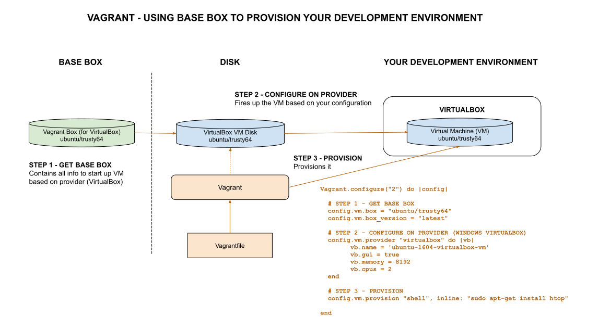
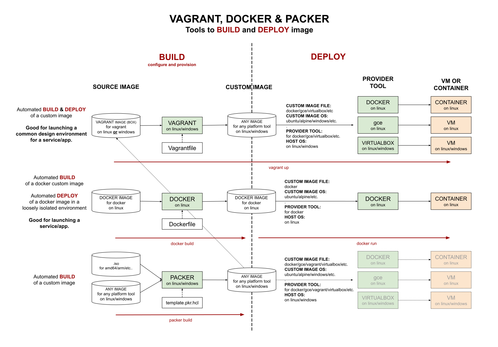

# VAGRANT CHEAT SHEET

[](https://jeffdecola.com)
[](https://jeffdecola.mit-license.org)

_Vagrant is a tool from HashiCorp that builds and deploys
portable development environments._

tl;dr

```bash
docker version

# BUILD & DEPLOY VAGRANT IMAGE (BOX)
vagrant up

# CONNECT
vagrant ssh
vagrant ssh-config
ssh -i ~/.vagrant.d/insecure_private_key -p 2222 vagrant@{IP}

# OTHER COMMANDS
vagrant box list
vagrant box add --name {VAGRANT IMAGE (BOX) NAME} --force ubuntu-box.box
vagrant box add --insecure {VAGRANT IMAGE (BOX) NAME}--insecure
vagrant box remove {VAGRANT IMAGE (BOX) NAME}
```

Table of Contents

* [OVERVIEW](https://github.com/JeffDeCola/my-cheat-sheets/tree/master/software/development/development-environments/vagrant-cheat-sheet#overview)
* [HOW DOES IT WORK](https://github.com/JeffDeCola/my-cheat-sheets/tree/master/software/development/development-environments/vagrant-cheat-sheet#how-does-it-work)
* [WHAT IS A VAGRANT IMAGE (BOX)](https://github.com/JeffDeCola/my-cheat-sheets/tree/master/software/development/development-environments/vagrant-cheat-sheet#what-is-a-vagrant-image-box)
* [INSTALL](https://github.com/JeffDeCola/my-cheat-sheets/tree/master/software/development/development-environments/vagrant-cheat-sheet#install)
* [VAGRANTFILE](https://github.com/JeffDeCola/my-cheat-sheets/tree/master/software/development/development-environments/vagrant-cheat-sheet#vagrantfile)
* [VAGRANT UP](https://github.com/JeffDeCola/my-cheat-sheets/tree/master/software/development/development-environments/vagrant-cheat-sheet#vagrant-up)
* [SSH INTO IT](https://github.com/JeffDeCola/my-cheat-sheets/tree/master/software/development/development-environments/vagrant-cheat-sheet#ssh-into-it)
* [CREATING A VAGRANT BOX](https://github.com/JeffDeCola/my-cheat-sheets/tree/master/software/development/development-environments/vagrant-cheat-sheet#creating-a-vagrant-box)
* [SOME BASIC COMMANDS](https://github.com/JeffDeCola/my-cheat-sheets/tree/master/software/development/development-environments/vagrant-cheat-sheet#some-basic-commands)
* [VAGRANT, DOCKER AND PACKER](https://github.com/JeffDeCola/my-cheat-sheets/tree/master/software/development/development-environments/vagrant-cheat-sheet#vagrant-docker-and-packer)

Documentation and Reference

* [my-vagrant-boxes](https://github.com/JeffDeCola/my-vagrant-boxes)

## OVERVIEW

Vagrant is useful for the automated **BUILD** and **DEPLOY** of a
custom image in an isolated environment.
This is useful for easily launching a common custom
design environment for a project because you only need a Vagrantfile.

Vagrant provides the same production environment (_OS,
packages, users, configuration, etc..._) giving developers the
flexibility to use there own tools (_browsers, IDEs, editors, etc..._).

Vagrant can match the development environment to the
production environment. _"Well it worked on my computer"_
is a statement of the past.

Vagrant can run on providers such as,

* VirtualBox
* KVM
* Hyper-V
* Docker
* VMware
* AWS



## HOW DOES IT WORK

The process is pretty simple,

* STEP 1 - GET VAGRANT BASE IMAGE (BOX)
  * Starts with a box/image (for a particular provider) that contains the
    base operating system.
* STEP 2 - CONFIGURE ON PROVIDER
  * Based on your configuration for your provider, fires up a VM/Container.
* STEP 3 PROVISION IT
  * Provisions it.

All of this information is neatly contained within the Vagrantfile (see below).

## WHAT IS A VAGRANT IMAGE (BOX)

The vagrant box is basically all the info needed to
fire up a VM/container on a provider.  Vagrant packages it as such.

Search for vagrant boxes at
[vagrant box search](https://app.vagrantup.com/boxes/search).

## INSTALL

Visit [vagrant downloads](https://www.vagrantup.com/downloads.html).

Once installed, check version,

```bash
vagrant version
```

## VAGRANTFILE

Vagrants uses a declarative config file which describes your
software requirements, packages, OS configuration, users, etc..

A simple Vagrantfile for firing up a VirtualBox VM on Windows may look like,

```bash
Vagrant.configure("2") do |config|

  # STEP 1 - GET BASE BOX
  config.vm.box = "ubuntu/trusty64"
  config.vm.box_version = "latest"

  # STEP 2 - CONFIGURE ON PROVIDER (WINDOWS VIRTUALBOX)
  config.vm.provider "virtualbox" do |vb|
        vb.name = 'ubuntu-1604-virtualbox-vm'
        vb.gui = true
        vb.memory = 8192
        vb.cpus = 2
  end

  # STEP 3 - PROVISION
  config.vm.provision "shell", inline: "sudo apt-get install htop"

end
```

To see a few example goto my repo
[my-vagrant-boxes](https://github.com/JeffDeCola/my-vagrant-boxes).

## VAGRANT UP

To run,

```bash
vagrant up
```

## SSH INTO YOUR DEPLOYMENT

No matter what provider tool you used, you can ssh into it via,

```bash
vagrant ssh
```

Or you use vagrant insecure keys,

* Your machine - You use the vagrant insecure private key
  located on your machine  `~/.vagrant.d/insecure_private_key`.
* The vagrant box - Uses the default public key in `~/.ssh/authorized_keys`.

This will also add the box fingerprint on your machine in
`~/.ssh/known_host`.

```bash
vagrant ssh-config
ssh -i ~/.vagrant.d/insecure_private_key -p 2222 vagrant@{IP}
```

## CREATING A VAGRANT BOX

Refer to my repo [my-vagrant-boxes](https://github.com/JeffDeCola/my-vagrant-boxes)
that has an example.

## SOME BASIC COMMANDS

List boxes on your machine,

```bash
vagrant box list
```

Add box on your machine,

```bash
vagrant box add --name {VAGRANT IMAGE (BOX) NAME} --force ubuntu-box.box
vagrant box add --insecure {VAGRANT IMAGE (BOX) NAME}--insecure
```

Destroy box on your machine,

```bash
vagrant box remove {VAGRANT IMAGE (BOX) NAME}
```

## VAGRANT, DOCKER AND PACKER

An illustration of vagrant, docker and packer tools,


