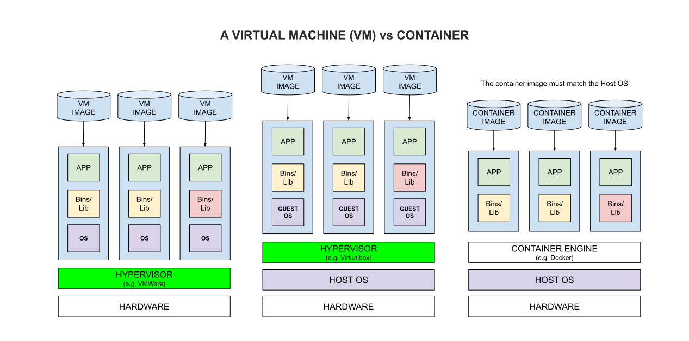

# VIRTUALBOX CHEAT SHEET

[](https://jeffdecola.com)
[](https://jeffdecola.mit-license.org)

_VirtualBox is a "virtualization" product, which allows you to
run an operating system (guest) on top of your existing
operating system (host)._

Table of Contents

* [VIRTUAL MACHINE (VM) vs CONTAINER](https://github.com/JeffDeCola/my-cheat-sheets/tree/master/software/development/development-environments/virtualbox-cheat-sheet#virtual-machine-vm-vs-container)
* [INSTALL VIRTUALBOX ON WINDOWS](https://github.com/JeffDeCola/my-cheat-sheets/tree/master/software/development/development-environments/virtualbox-cheat-sheet#install-virtualbox-on-windows)
* [INSTALL A GUEST OS](https://github.com/JeffDeCola/my-cheat-sheets/tree/master/software/development/development-environments/virtualbox-cheat-sheet#install-a-guest-os)
* [INCREASE YOUR VIDEO MEMORY TO 256MB](https://github.com/JeffDeCola/my-cheat-sheets/tree/master/software/development/development-environments/virtualbox-cheat-sheet#increase-your-video-memory-to-256mb)
* [INCREASE THE SIZE OF YOUR VIRTUAL DISK](https://github.com/JeffDeCola/my-cheat-sheets/tree/master/software/development/development-environments/virtualbox-cheat-sheet#increase-the-size-of-your-virtual-disk)

Documentation and Reference

* [VMWare](https://github.com/JeffDeCola/my-cheat-sheets/tree/master/software/development/development-environments/vmware-cheat-sheet)
* [Docker](https://github.com/JeffDeCola/my-cheat-sheets/tree/master/software/operations/orchestration/builds-deployment-containers/docker-cheat-sheet)
* [Install arch linux mini](https://github.com/JeffDeCola/my-cheat-sheets/blob/master/software/development/development-environments/virtualbox-cheat-sheet/install-arch-linux-mini.md)
* [Install debian mini](https://github.com/JeffDeCola/my-cheat-sheets/blob/master/software/development/development-environments/virtualbox-cheat-sheet/install-debian-mini.md)
* [Install ubuntu with GNOME desktop](https://github.com/JeffDeCola/my-cheat-sheets/blob/master/software/development/development-environments/virtualbox-cheat-sheet/install-ubuntu-with-gnome-desktop.md)
* [Install windows](https://github.com/JeffDeCola/my-cheat-sheets/blob/master/software/development/development-environments/virtualbox-cheat-sheet/install-windows.md)

## VIRTUAL MACHINE (VM) vs CONTAINER

The following diagram shows the difference between Virtual Machines
and Containers,



Virtual Machines

* Must use a Hypervisor emulated Virtual Hardware
* May or may not use a guest OS
* Takes a lot of system resources
* Takes up a lot of memory

Containers

* Uses a shared host OS
* You must use that OS
* Less resources and lightweight

## INSTALL VIRTUALBOX ON WINDOWS

Download and install from [virtualbox](https://www.virtualbox.org/).

## INSTALL A GUEST OS

Follow one of my install cheat sheets,

* [Install arch linux mini](https://github.com/JeffDeCola/my-cheat-sheets/blob/master/software/development/development-environments/virtualbox-cheat-sheet/install-arch-linux-mini.md)
* [Install debian mini](https://github.com/JeffDeCola/my-cheat-sheets/blob/master/software/development/development-environments/virtualbox-cheat-sheet/install-debian-mini.md)
* [Install ubuntu with GNOME desktop](https://github.com/JeffDeCola/my-cheat-sheets/blob/master/software/development/development-environments/virtualbox-cheat-sheet/install-ubuntu-with-gnome-desktop.md)
* [Install windows](https://github.com/JeffDeCola/my-cheat-sheets/blob/master/software/development/development-environments/virtualbox-cheat-sheet/install-windows.md)

## INCREASE YOUR VIDEO MEMORY TO 256MB

_I have not used this is a while, not sure if it's valid._

```bash
VBoxManage modifyvm "Name of VM" --vram 256
"C:\Program Files\Oracle\VirtualBox\VBoxManage.exe"  modifyvm "Name of VM" --vram 256
```

## INCREASE THE SIZE OF YOUR VIRTUAL DISK

_I have not used this is a while, not sure if it's valid._

Let's say you run `df -h` and you're running out of room.

The increase is in MB, so if you want to increase 10GB or ~10,000MB
you pick a number that is a power of 2. 2 to the power of 13 is 8192.
2 to the power of 14 is 16384.  Lets use the latter.

Step 1 - Make a backup (clone)

Step 2 - Create new virtual Machine that is bigger

Step 3 - Find UUID of your old and new VM

```bash
VBoxManage list hdds
"C:\Program Files\Oracle\VirtualBox\VBoxManage.exe" list hdds
```

Step 4 - run VBoxManage clonemedium

```bash
VBoxManage clonemedium <source-guid> <destinatin-guid> --existing
"C:\Program Files\Oracle\VirtualBox\VBoxManage.exe" clonemedium b1e21e90-xxx 391354e8-xxx --existing
```

Step 5 - Download gparted-live*.iso

Insert .iso into the new virtual machine and reboot it.
Grow your partition and save changes.
You may have to delete partitions (swap and /dev/sd2) to grow `/dev/sda1`.
