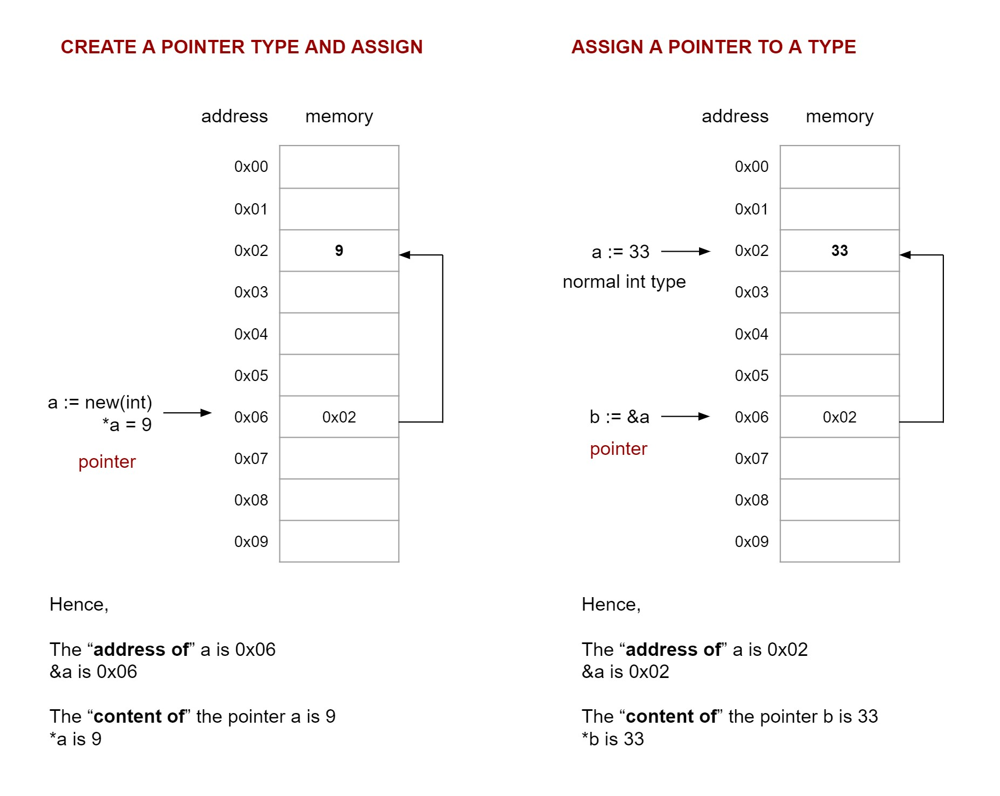

# DERIVED DATA TYPES

I like to think of derived data types as
special variables built on the basic three data types
(Boolean, Numeric and String).

So you still need to declare type and assign values (initialize).

All the data types in go,

* Boolean (See previous [Cheat sheet](https://github.com/JeffDeCola/my-cheat-sheets/tree/master/software/development/languages/go-cheat-sheet/data-types.md))
* Numeric (See previous [Cheat sheet](https://github.com/JeffDeCola/my-cheat-sheets/tree/master/software/development/languages/go-cheat-sheet/data-types.md))
* String (See previous [Cheat sheet](https://github.com/JeffDeCola/my-cheat-sheets/tree/master/software/development/languages/go-cheat-sheet/data-types.md))
* Derived (This Cheat sheet)
  * Array (Data structure) (_new_)
  * Slice (Data Structure) (Reference Type) (_make_)
  * Map (Data Structure) (Reference Type) (_make_)
  * Struct (Data Structure)
  * Pointer 
  * Function (as a Type)
  * Interface 
  * Channel (Reference Type) (_make_)

`Reference types` are slice, map and channel,
meaning they are passed by reference/address.
Reference types are build upon an underlining `data structure`
(stores data). We are passing the address of these underlying
data structures. Also can use use _make_ to initialize reference type
before use.

`Data structures` are arrays, slices, maps and structs.  They
are types that allow us to store data.

## ARRAY - DATA STRUUTRE

Arrays are,

* A data structure (holds data).
* Do not change in size (not dynamic).
* A numbers sequence of elements of a single type.
* A list/collection identified by an index.
* Zero-based indexes.

They are really not used that much.

### BASIC FORMAT

The basic verbose format is,

```
var name = [number]type{value, value...}
```

Here is the syntax,

```go

// DECLARE TYPE
var a [2]float32{}

// ASSIGN VALUE
a[1] = 1.1
a[2] = 2.0

// DECLARE & ASSIGN  (INITIALIZE)
var a = [2]float32{1.1, 2.0}                    // Verbose
a := [2]float32{1.1, 2.0}                       // Array Shorthand Assignment
```

Here is printing an array,

```go
testscores := [3]float64{78.3, 98.9, 85.4}
fmt.Printf("a is %v\n", testscores)             // [78.3 98.9 85.4]
fmt.Printf("a is %v\n", testscores[1])          // 98.9
fmt.Printf("a is %v\n", testscores[1:2])        // [98.9]
fmt.Printf("a is %v\n", testscores[:3])         // [78.3 98.9 85.4]
fmt.Printf("a is %v\n", testscores[2:])         // [85.4]
```

Remember a string is an array of bytes. Here is a good example,

```go
func main() {
    testString := "Happy Birthday Jeff"
    fmt.Printf("The first word of testString is %s\n", firstWord(testString))
}

func firstWord(str string) (word []byte) {
    for i := range str {
        if str[i] == ' ' {
            break
        } else {
            word = append(word, str[i])
        }
    }
    return word
}
```

Find length and capacity. They will be the same in an array,

```go
len(name)
cap(name)
```

## SLICE (BUILT ON ARRAY) - DATA STRUUTRE - REFERENCE TYPE

Slices are for lists,

* A data structure (holds data).
* A reference type (pass by "reference").
* Must use _make_ to initialize reference type.
* Dynamic - Changes in size.
* Has length and capacity.
* Built on an `underlying array`.
  If you add things (append), a performance is hit because
  new arrays will be added (will double the size of the capacity).
* A list/collection identified by an index.
* Value of uninitialized slice is nil.

### BASIC FORMAT

The basic verbose format is,

```
var name = []type{value, value....}
```

The preferred method is as follows (where length and capacity are both at 25),

```go
m := make([]int, 25)
```

Here is the syntax,

```go
// DECLARE TYPE - NO SIZE (must use append)
var a []float64

// ASSIGN VALUE - ADD LENGTH TO SLICE
a = append(a, 5.7)

// DECLARE TYPE - WITH SIZE (make)
// Length and capacity both at 25.
m := make([]string, 25)                         // Preferred way

// ASSIGN VALUE
m[0] = "hello"

// DECLARE & ASSIGN (INITIALIZE)
var a = []float32{1.1, 2.0}                     // Verbose
a := []float32{3.4, 4.5}                        // Array Shortcut Assignment

// ADD TO ANY SLICE
a := append(a, 5.7)                             // Append to a slice
```

### SLICES ARE REFERENCE TYPES

Like maps and channels, slices are reference types, meaning
slices are always passed by "reference/address".

```go
func change(a []string) {
    a[0] = "goodbye"
}
func main() {
    m := []string{"hello"}
    fmt.Println(m) // ["hello"]
    change(m)
    fmt.Println(m) // ["goodbye"]
}
```

### BUILT ON ARRAYS - make

Make makes a slice of length x and capacity (which is the length of the
underlying array) y,

```go
m := make([]string, length, capacity)
```

Both length and capacity are the same (100),

```go
m := make([]string, 100) // same as above
```

You could actually make a slice form an array,

```go
n := make([]int, 10, 18)
n := new([18]int)[0:10]
```

### VARIADIC PARAMETERS

Slices are used with variadic parameters,

```go
func sum(n ...int) int {
    total := 0
    for _, f := range n {
        total += f
    }
    return total
}

func main() {
    data := []int{43, 44, 55, 66}
    fmt.Println(sum(data...))
}
```

### LENGTH AND CAPACITTY

Find length,

```go
len(name)
```

Find capacity of array,

```go
cap(name)
```

Last example, these are all the same. Note capacity of array used for slice
is 16 in second example.  That's so cool.

```go
    var x [10]int
    for i := 0; i < len(x); i++ {
        x[i] = i + 20
    }
    fmt.Println(x, len(x), cap(x)) // [21 22 23 24 25 26 27 28 29 30] 10 10

    var y []int
    for i := 0; i < 10; i++ {
        y = append(y, i+20)
    }
    fmt.Println(y, len(y), cap(y)) // [21 22 23 24 25 26 27 28 29 30] 10 16

    z := make([]int, 10)
    for i := 0; i < 10; i++ {
        z[i] = i + 20
    }
    fmt.Println(z, len(z), cap(z)) // [21 22 23 24 25 26 27 28 29 30] 10 10
}
```

## MAP (key:value) - - DATA STRUUTRE - REFERENCE TYPE

Maps are,

* A data structure (holds data).
* A reference type (pass by "reference").
* Must use _make_ to initialize reference type.
* key/value storage (like a data base) (dictionary).
* Unordered group of elements of the same type.
* Value of uninitialized map is nil.
* Map are build on a hash table.

### BASIC FORMAT

```go
// DECLARE TYPES - THIS IS A NIL MAP - DON'T DO THIS - NO APPEND
var a map[string]int

// DECLARE TYPES (make)
var m1 = make(map[string]int)
m2 := make(map[string]int)
m3 := map[string]int{}

// ASSIGN KEY:VALUE
m1["Jill"] = 23
m1["Bob"] = 34
m1["Mark"] = 28
m2["Jill"], m2["Bob"], m2["Mark"] = 23, 34, 28

// DECLARE & ASSIGN  (INITIALIZE)
var m3 = map[string]int{                        // Verbose
    "Jill": 23,
    "Bob":  34,
    "Mark": 28,
}
m4 := map[string]int{                           // Array Shortcut Assignment
    "Jill": 23,
    "Bob":  34,
    "Mark": 28,
}

fmt.Println(m1, m2, m3, m4)
```

### MAPS ARE REFERENCE TYPES

Like slices and channels, maps are reference types, meaning
maps are always passed by reference/address.

```go
func change(a map[int]string) {
    a[1] = "happy"
    a[2] = "birthday"
}
func main() {
    m := map[int]string{1: "hello", 2: "goodbye"}
    fmt.Println(m) // map[1:hello 2:goodbye]
    change(m)
    fmt.Println(m) // map[1:happy 2:birthday]
}
```

### DELETE A KEY/VALUE

Delete a key/value,

```go
delete(a,1)
```

## STRUCT - DATA STRUUTRE

* A data structure (holds data).
* A reference type (pass by "reference").
* Composite types..

Elements of different types and start with capital letter.
Anything with a capital letter is exported from package.

### BASIC FORMAT

A struct is a data structure.

```go
// CREATE STRUCT TYPE
type Rect struct {
    w, h float32
}

// DECLARE TYPE
var r1 Rect
r2 := new(Rect)                                 // Returns Pointer

// ASSIGN VALUE TO FIELDS
r1.w = 6.1
r1.h = 5.0
r2.w, r2.h = 6.1, 6.0

// DECLARE & ASSIGN (INITIALIZE)
var r3 Rect = Rect{6.1, 5.0}                    // Verbose
var r4 = Rect{6.1, 5.0}                         // Type Inference
r5 := Rect{w: 6.1, h: 5.0}                      // Shortcut Assignment
r6 := Rect{6.1, 5.0}                            // Shortcut Assignment

fmt.Println(r1, *r2, r3, r4, r5, r6)
```

## POINTER

A pointer is just a variable that holds the address (of memory)
of a value.

* `*` is the `"contents of"`
* `&` is `"address of"`

### BASIC FORMAT

Here is an example,

```go
// CREATE A POINTER TYPE AND ASSIGN
a := new(int)                                   // Create int pointer type
*a = 9                                          // "contents of a is 9"

// ASSIGN A POINTER TO A TYPE
a := 5                                          // If we have a var int 5
b := &a                                         // b is the "address of" a
// var b *int = &a                              // Long form way to write this
// a == *b (both are 5)                         // "contents of" b is a

// ASSIGN A POINTER TO A STRUCT
b := &r1                                        // From struct Rect above
r1.w = 6.1                                      // I feel it should be *r1.w
r1.h = 5.0                                      // I feel it should be *r1.h
```



### POINTER USES

Cool uses for pointers are,

* Allocate space for a variable.
* Pass by "reference" to a function to change parameters value outside function.

Another example, 

```go
a := 43
fmt.Println(a)  // 43
fmt.Println(&a) // Ox333333

// b is a pointer
// var b *int = &a
b := &a
fmt.Println(b)  // Ox333333
fmt.Println(*b) // 43

// Make the "contents of" what I'm Pointer to 33
*b = 33
fmt.Println(a) //33
```

## FUNCTION (AS A TYPE) (FUNC EXPRESSION & ANONYMOUS FUNC)

Functions can be a type. So like types, I can use
the variables (the scope) the function lives in.

There is a better explanation of this on the cheat sheet
[closures](https://github.com/JeffDeCola/my-cheat-sheets/blob/master/software/development/languages/go-cheat-sheet/functions.md#closure-func-expression-and-anonymous-func).

But here are two methods that can be used,

### ASSIGN ANONYMOUS FUNCTION (func LITERAL) TO A VARIABLE

```go
a, b := 3, 9

add := func() int {  // anonymous func (no name)
    return a + b
}

fmt.Println(add()) // 12
a = 9
fmt.Println(add()) // 18 <- NOTE THIS
```

The anonymous function (function literal) has use of `a` and `b` because
of the scope.  This assignment of an anonymous function (function literal)
to a variable is called `closure`.

### RETURN A FUNCTION TO A FUNCTION

In this method, the function scope acts just like an assigned variable.
Think of the function like a variable, because that's what is really is,

```go
// Returns a function
func addThis(a, b int) func() int {
    return func() int {
        return a + b
    }
}

func main() {
    a, b := 3, 9

    add := addThis(a, b)  // Think of the func add like a variable

    fmt.Println(add()) // 12
    a = 9
    fmt.Println(add()) // 12 <- NOTE THIS
}
```

## INTERFACE

Syntactic way to have multiple structs do the same thing differently,

### BASIC FORMAT

Basic format,

```go
// CREATE INTERFACE TYPE
type Name interface {
    methodName()
    ...
}
```

See the interface [cheat sheet](https://github.com/JeffDeCola/my-cheat-sheets/tree/master/software/development/languages/go-cheat-sheet/interfaces.md).

## CHANNEL (REFERENCE TYPE)

tbd

### BASIC FORMAT

Basic Format,

```go
tbd
```

Like slices and maps, channels are reference types, meaning
channels are always passed by reference/address.

See channel [cheat sheet](https://github.com/JeffDeCola/my-cheat-sheets/tree/master/software/development/languages/go-cheat-sheet/concurrency-channels.md).
