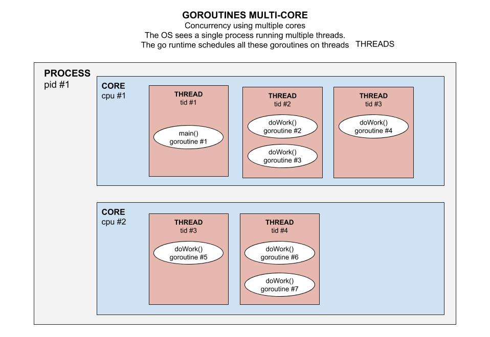

# EXECUTABLE (YOUR CODE & GO RUNTIME)

An executable or binary is your running program.

## GO EXECUTABLE

A Go Executable is made up of,

* Your compiled code
* Go runtime environment

## GO RUNTIME (GOROUTINE SCHEDULER)

The Go Runtime manages scheduling, garbage collection,
and the runtime environment for goroutines among other
things. Since Go provides high level constructs
a runtime infrastructure is required to support these features.

One of the more important aspects of the Go runtime is the
goroutine scheduler. The runtime keeps track
of each goroutine, and will schedule them to run in turn
on a pool of threads belonging to the process.

This illustration may help. Its a diagram of the relationships between the
runtime, OS, and your code.

## GOROUTINES & THREADS

Goroutines are separate from threads but rely upon them to run, and
scheduling goroutines onto threads effectively is crucial for
the efficient performance of Go programs.
The idea behind goroutines is that they are capable of running concurrently,
like threads, but are also extremely lightweight in comparison.
Multiple threads are allowed to run in parallel up
to a programmer defined maximum, which is stored in the
variable GOMAXPROCS.

The OS sees is a single
user level process requesting and running multiple threads.
Goroutines exists only in the virtual space of go runtime
and not in the OS. A goroutine is created with initial only 2KB of stack size.
the Go runtime multiplexes goroutines to operating system (OS) threads.
The cost of creating a Goroutine is tiny when compared to a thread.

Refer to my cheat sheet
[GOROUTINES & CHANNELS](https://github.com/JeffDeCola/my-cheat-sheets/tree/master/software/development/languages/go-cheat-sheet/goroutines-and-channels.md)
for more information.

As an illustration, this picture may help show the relationship between
cores, process, thread and goroutines.

