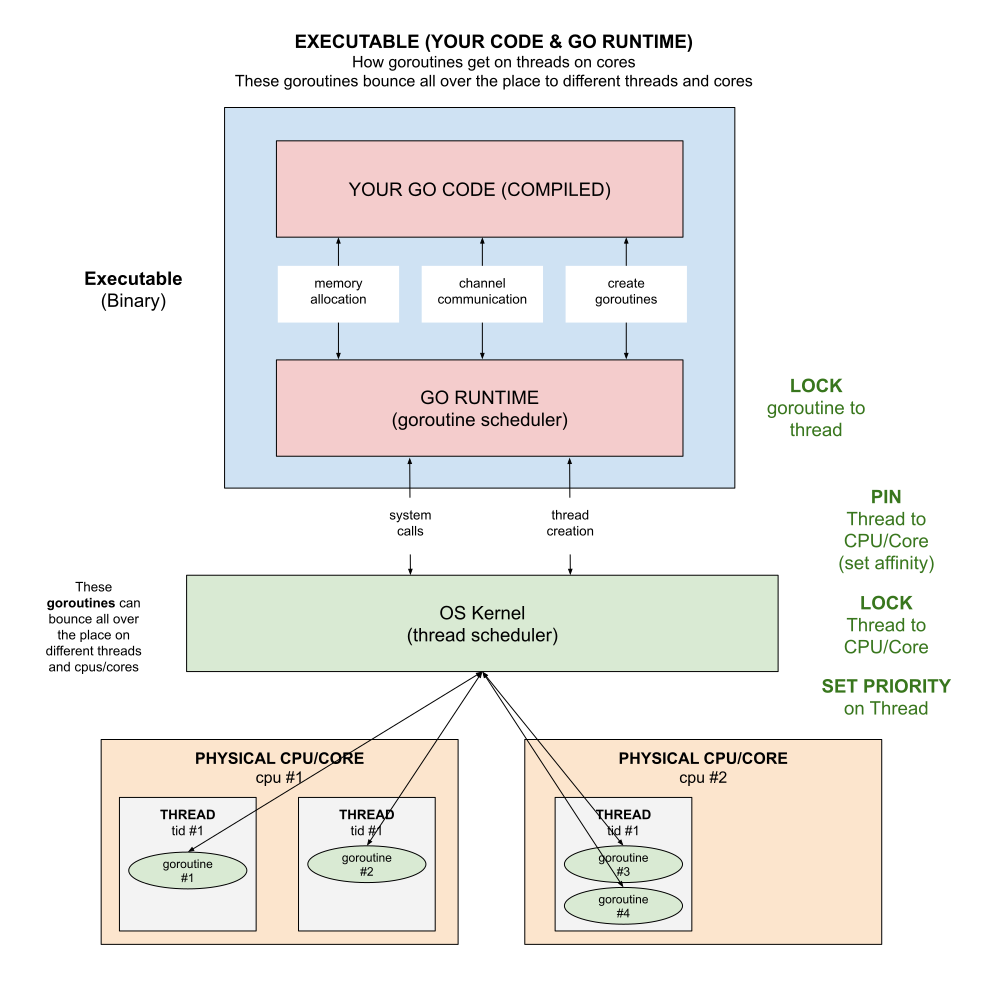

# EXECUTABLE (YOUR CODE & GO RUNTIME)

_An executable or binary is your running program._

Table of Contents

* [GO EXECUTABLE](https://github.com/JeffDeCola/my-cheat-sheets/blob/master/software/development/languages/go-cheat-sheet/executable-your-code-and-go-runtime.md#go-executable)
* [GO RUNTIME (GOROUTINE SCHEDULER)](https://github.com/JeffDeCola/my-cheat-sheets/blob/master/software/development/languages/go-cheat-sheet/executable-your-code-and-go-runtime.md#go-runtime-goroutine-scheduler)
* [GOROUTINES & THREADS](https://github.com/JeffDeCola/my-cheat-sheets/blob/master/software/development/languages/go-cheat-sheet/executable-your-code-and-go-runtime.md#goroutines--threads)

Documentation and Reference

* [go-cheat-sheet](https://github.com/JeffDeCola/my-cheat-sheets/tree/master/software/development/languages/go-cheat-sheet#go-cheat-sheet)
  main page

## GO EXECUTABLE

A go executable is made up of,

* Your compiled code
* Go runtime environment

This diagram shows how everything fits together.
The bottom line, go likes to put goroutines on threads.  And the goroutines
will bounce all over the place as the thread schedulers schedule things.

## GO RUNTIME (GOROUTINE SCHEDULER)

The go runtime manages scheduling, garbage collection,
and the runtime environment for goroutines among other
things. Since go provides high level constructs
a runtime infrastructure is required to support these features.

One of the more important aspects of the go runtime is the
goroutine scheduler. The runtime keeps track
of each goroutine, and will schedule them to run in turn
on a pool of threads belonging to the process.

## GOROUTINES & THREADS

Goroutines are separate from threads but rely upon them to run, and
scheduling goroutines onto threads effectively is crucial for
the efficient performance of Go programs.
The idea behind goroutines is that they are capable of running concurrently,
like threads, but goroutines are also extremely lightweight in comparison.

The OS sees is a single
user level process requesting and running multiple threads.
Goroutines exists only in the virtual space of go runtime
and not in the OS. A goroutine is created with initial only 2KB of stack size.
The go runtime multiplexes goroutines to operating system (OS) threads.
The cost of creating a Goroutine is tiny compared to a thread.

Refer to my cheat sheet
[goroutines & channels](https://github.com/JeffDeCola/my-cheat-sheets/tree/master/software/development/languages/go-cheat-sheet/goroutines-and-channels.md)
for more information.
