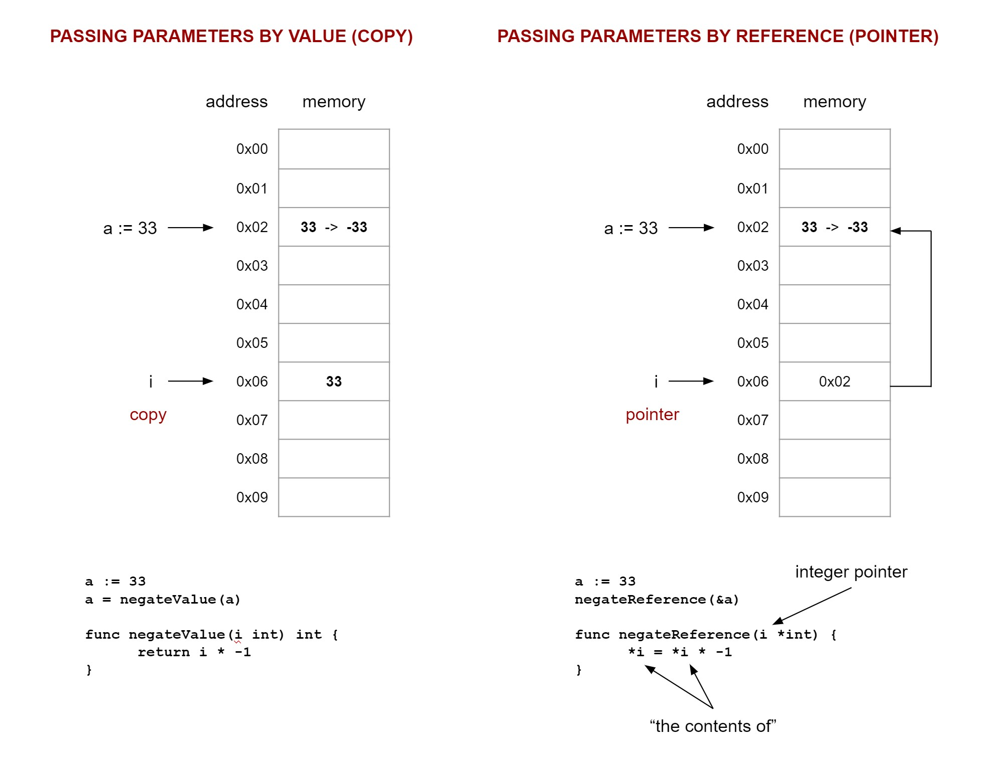

# FUNCTIONS

Functions stand on their own, a black box.

Just a note,

* `Parameters` are where you declare parameters
* `Arguments` are passed to functions

## BASIC FORMATS

The basic format is,

```
func receiver identifier parameters returns
```

or,

```
func receiver name(parameter list) (return type) {
    stuff
}
```

As an example,

```go
func add(a, b int) int {
    return a + b
}
```

Multiple returns,

```go
func swap(a, b int) (int, int) {
    x, y := b, a
    return x, y
}
```

Named returns (not a good coding style),

```go
func swap(a, b int) (x int, y int) {
    x, y = b, a
    return
}
```

## VARIADIC FUCTIONS

Variadic arguments lists when you don't know how many arguments to pass.
Variadic parameter list is when you don't know how many parameters are
being passed.

```go
func average(n ...float64) float64 {
    total := 0.0
    for _, f := range n {
        total += f
    }
    return total / float64(len(n))
}

func main() {
    data := []float64{43, 44, 55, 66, 77, 88}
    fmt.Println("Average of", data, "is", average(data...))
}
```

## CLOSURE (FUNC EXPRESSION & ANONYMOUS FUNCTION)

A closure is a function value that references variables from outside its body.

Helps us limit the scope of variables used by multiple functions.
Without closure, for two or more functions to have access to the same variable,
that variable would need to be at the package scope.

There are two methods as follows.

### ASSIGN ANONYMOUS FUNCTION (func LITERAL) TO A VARIABLE

Here is an example of closure, assigning an anonymous function
(also called func literal) to a variable.

This is called closure because the function captures (enclose)
the surrounding environment and can use it.

```go
// This is also called a func literal.
increment1 := func() int { // Got x = 5
    x++
    return x
}

// When you call function increment1, it uses x, which is outside function.
fmt.Println(increment1()) // 6
fmt.Println(increment1()) // 7
fmt.Println(x)            // 7
fmt.Println(increment1()) // 8
x = 30
fmt.Println(x)            // 30
fmt.Println(increment1()) // 31 <- NOTE THIS
fmt.Println(x)            // 31
```

Just think/treat the function as a variable and closure makes sense.
People try to make this too complicated, like I did above but its just
treating the function `inc(x)` as a variable `increment2`.  Simple.

### RETURN A FUNCTION TO A FUNCTION - CLOSURE

Same program as above, but with function outside main.

But this acts like a variable where once increment2 or increment3
is declared and assigned, x is set.

```go
// CLOSURE METHOD TWO - Return a function to a function
// This is different because now the value is bound to the variable.
// The function captures the scope it is in
// Think of it as an assigned variable, BECAUSE it is.
increment2 := inc(x) // Got x = 31
increment3 := inc(x) // Got x = 31

// When you call function increment2, it uses x, which is outside function.
fmt.Println(increment2()) // 32
fmt.Println(increment2()) // 33
fmt.Println(increment2()) // 34
fmt.Println(x)            // 31

// increment2 has its own value of x
// Treat the function like a variable, because it is.
fmt.Println(increment3()) // 32
fmt.Println(increment3()) // 33
fmt.Println(increment3()) // 34
x = 20
fmt.Println(x) // 20
// Nothing to do with x because we assigned inc() to to increment3
fmt.Println(increment3()) // 35
fmt.Println(increment3()) // 36
```

Some more examples,

```go
// Is the integer even or not
func even() func(int) bool {
    return func(n int) bool {
        return n%2 == 0
    }
}

func main() {

    n := []int{1, 2, 3, 4, 5}

    // r is the returned function
    r := even()

    for _, s := range n {
        fmt.Println(s, r(s))
    }
}
```

It really looks like this (a func expression),

```go
func main() {

    n := []int{1, 2, 3, 4, 5}

    // r is the returned function
    // Is the integer even or not
    // This is a func expression
    returned := func(n int) bool {
        return n%2 == 0
    }

    for _, s := range n {
        fmt.Println(s, returned(s))
    }
}
```

## PASSING A FUNCTION (AS AN ARGUMENT) TO A FUNCTION - CALLBACK

Passing a function (as an argument) to a function.

Callback means call back the function you passed in.
Calling back home.

```go
// Receiving a function
func math(numbers []int, callback func(int)) {
    for _, n := range numbers {
        callback(n)
    }
}

func main() {
    numbers := []int{1, 2, 3, 4, 5, 6, 7}

    // Passing a function (as an argument) to a function - callback
    math(numbers, func(x int) {
        fmt.Println("I've been called", x)
    })
}
```

Another example is in
[my-go-examples](https://github.com/JeffDeCola/my-go-examples/blob/master/basic-programming/callback/callback.go).

Why would you do this? Not very popular in go. You
don't want complexity in go or being too clever.

## PASSING ARGUMENTS - GO PASSES BY VALUE ONLY



### PASSING ARGUMENTS TO FUNCTION BY VALUE (COPY) - PARAMETER NOT CHANGED

Passes a "copy" of the parameter's value and gets something back (return).
Take the word copy with a grain of salt.

Really passing a value (the argument) and assigning it to the function's parameter.

Will not change the value of the argument that was passed.  Because of scope.

```go
a := 33
a = negateValue(a)

func negateValue(i int) int {
    return i * -1
}
```

### PASSING ARGUMENTS TO FUNCTION BY "REFERENCE" (POINTER) - PARAMETER CHANGED

Go only passes by value, hence the quotes on "reference".

Passes the reference (pointer) (the argument) to the function parameter
so we can change the value of the argument itself (return not necessary),

```go
a := 33
negateReference(&a)

func negateReference(i *int) {
    *i = *i * -1
}
```

Again you do this because you want to actually modify whatever you're passing
(“read/write” as opposed to just “read”)

## RECURSION - FUNCTION CALLING ITSELF

This is very straightforward.

Using recursion to get a factorial.

Giving a number x, total = x*x-1*x-2...till x is 1.

```go
func factorial(n int) int {
    if n == 0 {
        return 1
    }
    return n * factorial(n-1)
}

func main() {
    var n int
    fmt.Scanf("%d\n", &n)
    fmt.Println(factorial(n))
}
```

Another example is in
[my-go-examples](https://github.com/JeffDeCola/my-go-examples/blob/master/basic-programming/recursion/recursion.go).

## ANONYMOUS SELF EXECUTING FUNCTION

Simply a function that executes in your code.

```go
func main() {
    func() {
        fmt.Println("hi")
    }()
}
```

## EXAMPLE - SHAPES

This example will be used for function, method,
interface and package sections.

Print the area, volume, circumference, perimeter, surface volume of
shapes such as circles, rectangles, triangles and cylinders.

```go
package main

import (
    "fmt"
    "math"
)

// Circle description
type Circle struct {
    radius float64
}

// Rectangle description
type Rectangle struct {
    width  float64
    height float64
}

// Triangle description
type Triangle struct {
    a float64
    b float64
    c float64
}

// Cylinder description
type Cylinder struct {
    radius float64
    height float64
}

// Circle area
func areaCircle(radius float64) float64 {
    return math.Pi * math.Pow(radius, 2)
}

// Circle circumference
func circCircle(radius float64) float64 {
    return 2 * math.Pi * radius
}

// Rectangle area
func areaRectangle(width, height float64) float64 {
    return width * height
}

// Rectangle perimeter
func perimRectangle(width, height float64) float64 {
    return (width + height) * 2
}

// Triangle area
func areaTriangle(a, b, c float64) float64 {
    // Heron's Formula to get area from 3 sides
    s := ((a + b + c) / 2)
    return math.Sqrt(s * (s - a) * (s - a) * (s - a))
}

// Triangle perimeter
func perimTriangle(a, b, c float64) float64 {
    return a + b + c
}

// Cylinder volume
func volCylinder(radius, height float64) float64 {
    return math.Pi * math.Pow(radius, 2) * height
}

// Cylinder surface area
func surfaceCylinder(radius, height float64) float64 {
    return (2 * math.Pi * radius * height) + (2 * math.Pi * math.Pow(radius, 2))
}

func main() {

    // Declare and assign
    circle1 := Circle{5}
    rectangle1 := Rectangle{5, 3}
    triangle1 := Triangle{4, 5, 6}
    cylinder1 := Cylinder{5, 3}

    // Get shape properties
    areaCircle1 := areaCircle(circle1.radius)
    circCircle1 := circCircle(circle1.radius)
    areaRectangle1 := areaRectangle(rectangle1.width, rectangle1.height)
    perimRectangle1 := perimRectangle(rectangle1.width, rectangle1.height)
    areaTriangle1 := areaTriangle(triangle1.a, triangle1.b, triangle1.c)
    perimTriangle1 := perimTriangle(triangle1.a, triangle1.b, triangle1.c)
    volumeCylinder1 := volCylinder(cylinder1.radius, cylinder1.height)
    surfaceCylinder1 := surfaceCylinder(cylinder1.radius, cylinder1.height)

    fmt.Println(circle1.radius, areaCircle1, circCircle1)
    fmt.Println(rectangle1.width, rectangle1.height, areaRectangle1, perimRectangle1)
    fmt.Println(triangle1.a, triangle1.b, triangle1.c, areaTriangle1, perimTriangle1)
    fmt.Println(cylinder1.radius, cylinder1.height, volumeCylinder1, surfaceCylinder1)

    fmt.Printf("Circle1    (radius %.2f)                 area is %10.3f, circumference is %10.3f\n",
        circle1.radius, areaCircle1, circCircle1)
    fmt.Printf("Rectangle1 (width %.2f, height %.2f)     area is %10.3f, perimeter is     %10.3f\n",
        rectangle1.width, rectangle1.height, areaRectangle1, perimRectangle1)
    fmt.Printf("Triangle1  (a %.2f, b %.2f, c %.2f)      area is %10.3f, perimeter is     %10.3f\n",
        triangle1.a, triangle1.b, triangle1.c, areaTriangle1, perimTriangle1)
    fmt.Printf("Cylinder1  (radius %.2f, height %.2f)    vol  is %10.3f, surface area is  %10.3f\n",
        cylinder1.radius, cylinder1.height, volumeCylinder1, surfaceCylinder1)
}

```
