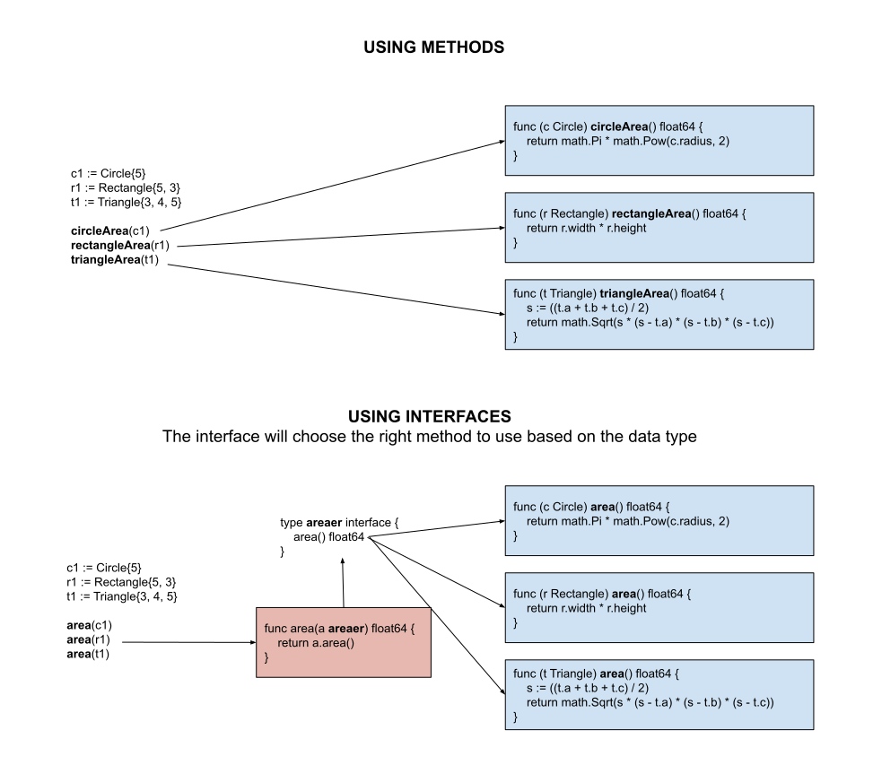

# INTERFACES (SET OF METHOD SIGNATURES)

[](https://jeffdecola.com)
[](https://jeffdecola.mit-license.org)

_Interfaces._

tl;dr

```go
// CREATE INTERFACE TYPE
// STEP 1: Create your data types
    type myStructA struct {
        name string
    }
    type myStructB struct {
        x int
        y int
    }
// STEP 2: Create methods with same name using your data types as receivers
    func (i myStructA) doThis() {
        fmt.Printf("I'm in doThis() method with receiver myStructA - %v\n", i.name)
    }
    func (i myStructB) doThis() {
        fmt.Printf("I'm in doThis() method with receiver myStructB - %v %v\n", i.x, i.y)
    }
// STEP 3: Create your interface type with method
    type myInterfacer interface {
        doThis()
    }
// STEP 4: Create a function that uses this interface as a parameter
    // INTERFACE AS A FUNCTION PARAMETER
    func magic(i myInterfacer) {
        i.doThis()
    }
```

Table of Contents

* [OVERVIEW](https://github.com/JeffDeCola/my-cheat-sheets/blob/master/software/development/languages/go-cheat-sheet/interfaces.md#overview)
* [BASIC FORMAT](https://github.com/JeffDeCola/my-cheat-sheets/blob/master/software/development/languages/go-cheat-sheet/interfaces.md#basic-format)
* [HOW TO MAKE AN INTERFACE](https://github.com/JeffDeCola/my-cheat-sheets/blob/master/software/development/languages/go-cheat-sheet/interfaces.md#how-to-make-an-interface)
  * [STEPS (INTERFACE AS A PARAMETER)](https://github.com/JeffDeCola/my-cheat-sheets/blob/master/software/development/languages/go-cheat-sheet/interfaces.md#steps-interface-as-a-parameter)
  * [USING YOUR NEW FUNCTION](https://github.com/JeffDeCola/my-cheat-sheets/blob/master/software/development/languages/go-cheat-sheet/interfaces.md#using-your-new-function)
* [OOP - POLYMORPHISM](https://github.com/JeffDeCola/my-cheat-sheets/blob/master/software/development/languages/go-cheat-sheet/interfaces.md#oop---polymorphism)
  * [ENCAPSULATION](https://github.com/JeffDeCola/my-cheat-sheets/blob/master/software/development/languages/go-cheat-sheet/interfaces.md#encapsulation)
  * [INHERITANCE](https://github.com/JeffDeCola/my-cheat-sheets/blob/master/software/development/languages/go-cheat-sheet/interfaces.md#inheritance)
  * [POLYMORPHISM](https://github.com/JeffDeCola/my-cheat-sheets/blob/master/software/development/languages/go-cheat-sheet/interfaces.md#polymorphism)
* [EXAMPLE - SHAPES](https://github.com/JeffDeCola/my-cheat-sheets/blob/master/software/development/languages/go-cheat-sheet/interfaces.md#example---shapes)

Documentation and Reference

* [go-cheat-sheet](https://github.com/JeffDeCola/my-cheat-sheets/tree/master/software/development/languages/go-cheat-sheet#go-cheat-sheet)
  main page

## OVERVIEW

Interfaces are verbs, they do something.

Syntactic way to have multiple structs do the same thing differently.
Implementing the same verb in a different way.

Giving a few different data struct types,

```go
c1 := Circle{5}
r1 := Rectangle{5, 3}
t1 := Triangle{3, 4, 5}
```

From using many functions like this,

```go
circleArea(c1)
rectangleArea(r1)
triangleArea(t1)
```

To a lot cleaner code with one function that can accept
many types (e.g. an interface),

```go
area(r1)
area(t1)
area(c1)
```

So the interface is the parameter.  Its great!!

This diagram may help,



## BASIC FORMAT

End interface names with `er`.

```go
// CREATE INTERFACE TYPE
type namer interface {
    methodName1()
    methodName2()
    ...
}
```

## HOW TO MAKE AN INTERFACE

Lets use the above example, The end result, we want to be able to
just use one function with different data types,

```go
area(r1)
area(t1)
area(c1)
```

So the **parameter of the area(I'm an interface) function is an interface**.

### STEPS (INTERFACE AS A PARAMETER)

**Step 1:** Create your data types,

```go
// Circle description
type Circle struct {
    radius float64
}

// Rectangle description
type Rectangle struct {
    width  float64
    height float64
}

// Triangle description
type Triangle struct {
    a float64
    b float64
    c float64
}

```

**Step 2:** Create methods with same name using your data types as receivers,

```go
// Circle area
func (c Circle) area() float64 {
    return math.Pi * math.Pow(c.radius, 2)
}

// Rectangle area
func (r Rectangle) area() float64 {
    return r.width * r.height
}

// Triangle area
func (t Triangle) area() float64 {
    // Heron's Formula to get area from 3 sides
    s := ((t.a + t.b + t.c) / 2)
    return math.Sqrt(s * (s - t.a) * (s - t.b) * (s - t.c))
}
```

**Step 3:** Now create your interface type that will accept any receiver that has
the method name `area()`.  Simple!

```go
type areaer interface {
    area() float64
}
```

**Step 4:** Create a function that uses this interface as a parameter,

```go
// INTERFACE AS A FUNCTION PARAMETER
func area(a areaer) float64 {
    return a.area()
}
```

The interface figures out what method to use based on data type.
Its really cool.

### USING YOUR NEW FUNCTION

Well, now just use it,

```go
// Define some shapes
c1 := Circle{5}
r1 := Rectangle{5, 3}
t1 := Triangle{3, 4, 5}
```

Get the area of the shapes,

```go
c1Area = area(c1)
r1Area = area(r1)
t1Area = area(t1)
```

So easy!!!! Again, the interface figures out what
method to use based on data type.

You can go one step further and use an interface a a return.
Refer to  `my-go-examples`
[here](https://github.com/JeffDeCola/my-go-examples/tree/master/basic-syntax/interfaces/interface)
for an example of this.

## OOP - POLYMORPHISM

Polymorphism is the essence of object-oriented programming.
The ability to treat objects of different types (circle,
rectangle, triangle) uniformly as long as they adhere to
the same interface areaer.

And you get different responses back depending on type.
Seems like it morphing. Polymorphism.

### ENCAPSULATION

Go encapsulates things at the package level. Names that start
with a lowercase letter are only visible within that package.
You can hide anything in a private package and just expose
specific types, interfaces, and functions.

### INHERITANCE

_tbd._

### POLYMORPHISM

_tbd._

## EXAMPLE - SHAPES

This example will calculate the **area** and **perimeter**
of three shapes: **circles**, **rectangles** and **triangles**.

This example is located in `my-go-examples` repo done three different ways,

* [shapes-using-functions](https://github.com/JeffDeCola/my-go-examples/tree/master/functions-methods-interfaces/functions/functions)
* [shapes-using-methods](https://github.com/JeffDeCola/my-go-examples/tree/master/functions-methods-interfaces/methods/methods)
* [shapes-using-interfaces](https://github.com/JeffDeCola/my-go-examples/tree/master/functions-methods-interfaces/interfaces/interfaces)

You will see that using an interface you can go from this,

```go
c1Area := circleArea(c1)
c1Perimeter := circlePerimeter(c1)
r1Area := rectangleArea(r1)
r1Perimeter := rectanglePerimeter(r1)
t1Area := triangleArea(t1)
t1Perimeter := trianglePerimeter(t1)
```

To this,

```go
// This is the power of interfaces.
c1Area = area(c1)
c1Perimeter = perimeter(c1)
r1Area = area(r1)
r1Perimeter = perimeter(r1)
t1Area = area(t1)
t1Perimeter = perimeter(t1)
```
