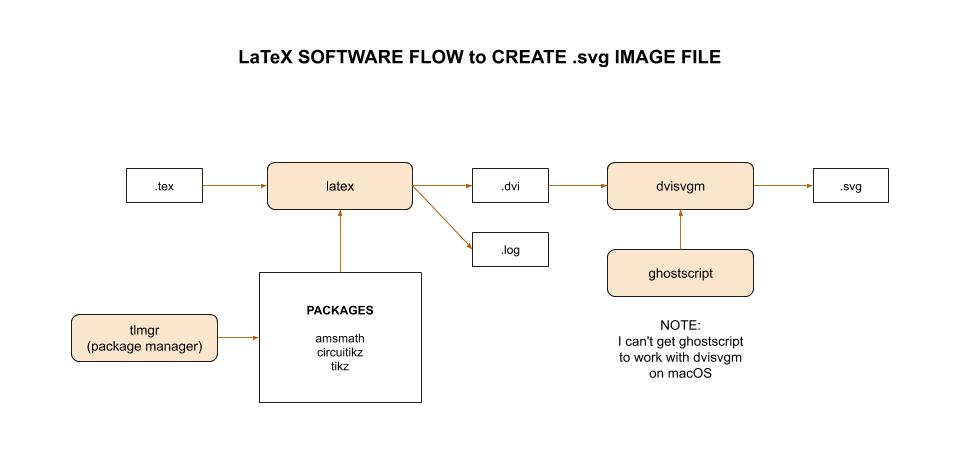
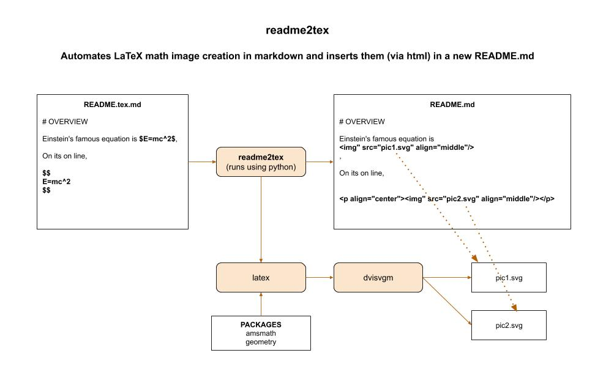

# LaTeX CHEAT SHEET

`LaTeX` _is an advanced markup language used for typesetting._

tl;dr,

```bash
# CREATED README.MD FILE
python -m readme2tex --usepackage "xcolor" --readme README.tex.md --output README.md --nocdn
```

Table of Contents,

* [OVERVIEW](https://github.com/JeffDeCola/my-cheat-sheets/tree/master/software/development/languages/latex-cheat-sheet#overview)
* [LaTeX .tex FILE](https://github.com/JeffDeCola/my-cheat-sheets/tree/master/software/development/languages/latex-cheat-sheet#latex-tex-file)
* [CREATE A .svg IMAGE FILE](https://github.com/JeffDeCola/my-cheat-sheets/tree/master/software/development/languages/latex-cheat-sheet#create-a-svg-image-file)
* [INSTALL LaTeX](https://github.com/JeffDeCola/my-cheat-sheets/tree/master/software/development/languages/latex-cheat-sheet#install-latex)
  * [LINUX](https://github.com/JeffDeCola/my-cheat-sheets/tree/master/software/development/languages/latex-cheat-sheet#linux)
  * [macOS](https://github.com/JeffDeCola/my-cheat-sheets/tree/master/software/development/languages/latex-cheat-sheet#macos)
  * [CHECK INSTALL](https://github.com/JeffDeCola/my-cheat-sheets/tree/master/software/development/languages/latex-cheat-sheet#check-install)
* [INSTALL PACKAGES USING TEXLIVE MANAGER (tlmgr)](https://github.com/JeffDeCola/my-cheat-sheets/tree/master/software/development/languages/latex-cheat-sheet#install-packages-using-texlive-manager-tlmgr)
* [CONVERTING TO OTHER FILE FORMATS](https://github.com/JeffDeCola/my-cheat-sheets/tree/master/software/development/languages/latex-cheat-sheet#converting-to-other-file-formats)
* [POPULAR LaTeX PACKAGES](https://github.com/JeffDeCola/my-cheat-sheets/tree/master/software/development/languages/latex-cheat-sheet#popular-latex-packages)
* [HOW I CREATED THIS README.md](https://github.com/JeffDeCola/my-cheat-sheets/tree/master/software/development/languages/latex-cheat-sheet#how-i-created-this-readmemd)
* [readme2tex INSTALL](https://github.com/JeffDeCola/my-cheat-sheets/tree/master/software/development/languages/latex-cheat-sheet#readme2tex-install)
* [VISUAL STUDIO CODE APP - MARKDOWN + MATH](https://github.com/JeffDeCola/my-cheat-sheets/tree/master/software/development/languages/latex-cheat-sheet#visual-studio-code-app---markdown--math)

[GitHub Webpage](https://jeffdecola.github.io/my-cheat-sheets/).

## OVERVIEW

LateX is is a markup language used for describing a documents.

* [LaTeX math mode](https://github.com/JeffDeCola/my-cheat-sheets/tree/master/software/development/languages/latex-cheat-sheet/latex-math-mode.md)
can display math equations in LaTeX
* [LaTeX graphs](https://github.com/JeffDeCola/my-cheat-sheets/tree/master/software/development/languages/latex-cheat-sheet/latex-graphs.md)
can graph 2D and 3D images via LaTeX packages

It stated with `TeX` which is an advanced typesetting system
developed by Donald Knuth in 1978. It is a markup language
for describing a document.

TeX is designed to describe the content, not the look of the document.

`LaTeX` is a set of macros built on top of TeX. Built back in the 80s.

## LaTeX .tex FILE

The `.tex` syntax can look something like,

```latex
    \documentclass{article}
    \title{Cartesian closed categories and the price of eggs}
    \author{Jane Doe}
    \date{September 1994}
    \usepackage{amsmath}

    \begin{document}

    \begin{equation}
        E=mc^2
    \end{equation}

    \end{document}
```

## CREATE A .svg IMAGE FILE

The flow to create an image file `.svg` from a `.tex` file looks like,



## INSTALL LaTeX

### LINUX

This is to install a full version with all the packages,

```bash
sudo apt-get update
sudo apt-get upgrade -y
sudo apt-get install texlive-full
```

I'm not sure how to install a lighter version.

### macOS

Download and install the full version called `MacTex` from
[here](http://tug.org/mactex/mactex-download.html).

### CHECK INSTALL

Make sure you have the following,

```bash
latex -version
tlmgr -version
dvisvgm -V1
ghostscript -v
```

## INSTALL PACKAGES USING TEXLIVE MANAGER (tlmgr)

After you install, you can update and install other packages located
[here](https://ctan.org/)
using `tlmgr`. For example,

```bash
sudo tlmgr update --self
sudo tlmgr update --self --all
sudo tlmgr install standalone
sudo tlmgr install circuitikz
sudo tlmgr install amsmath
```

## CONVERTING TO OTHER FILE FORMATS

You can created a LaTeX File (.tex) and convert to many formats,

* `pdflatex` .tex -> .pdf
* `latex` .tex -> .dvi
* `dvisvgm` .dvi -> .svg
* `ghostscript` .pdf -> many types

## POPULAR LaTeX PACKAGES

There are hundreds of packages you can use with LateX such as,

* `xcolor` - _Add color_
* `amsmath` & `amsfonts` - _For rendering matrices_
* `tikz` - _Refer to my
  [LaTeX graphs](https://github.com/JeffDeCola/my-cheat-sheets/tree/master/software/development/languages/latex-cheat-sheet/latex-math-mode.md)
  cheat sheet_

## HOW I CREATED THIS README.md

I use a program called [readme2tex](https://github.com/leegao/readme2tex).
I run everything on my local machine using my own
[readme2tex-pgfplots](https://github.com/JeffDeCola/readme2tex-pgfplots).

It works by taking your LaTeX math formula, rendering an image and
referencing that image using HTML.

As a reminder, I installed using,

```bash
sudo pip install readme2tex
```

First, I created and edit in README.tex.md. Second, I run `readme2tex`. This will,

* Create a new README.md file
* Creates *.svg images for each of the LateX math formulas
* Those image are linked automatically in your README.md file using HTML

See the end of this cheat sheet for how I installed readme2tex.

Here is an illustration on how readme2tex works,



I previously used a github app called
[TeXify](https://github.com/apps/texify) which
is a github app (on github) that Renders LateX to images in markdown.
Its built on
[readme2tex](https://github.com/leegao/readme2tex).

You write `README.text.md` and push.
At github, it will convert your LaTeX to `/tex/*.svg` images and
created a `README.md` file with links to those images.

This app is not that stable so I stopped using it.

## readme2tex INSTALL

How to install [readme2tex](https://github.com/leegao/readme2tex).

This cheat sheet is using this app.

You need Python 2.7 or above and pip installed.

Install full latex (I really only wanted latex and
latex geometry package) and dvisvgm,

```bash
sudo apt-get update
sudo apt-get upgrade -y
sudo apt-get install texlive-full
sudo apt install texlive-extra-utils
sudo apt install texlive-publishers
```

Install cairocffi and other dependencies you may need,

```bash
sudo apt-get install libffi6 libffi-dev
pip install --user cairocffi
pip install 'setuptools<36'
```

Now install readme2tex,

```bash
git clone https://github.com/leegao/readme2tex
cd readme2tex
sudo python setup.py develop
```

Again, I do not want to install the full version of latex
(3 gigs), but can't figure out how to install latex
and just the geometry package.

Usage,

```bash
python -m readme2tex --usepackage "xcolor" --readme README.tex.md --output README.md --nocdn
```

## VISUAL STUDIO CODE APP - MARKDOWN + MATH

View LaTeX math formulas in Visual Studio Code preview window via
[MARKDOWN + MATH](https://marketplace.visualstudio.com/items?itemName=goessner.mdmath).
