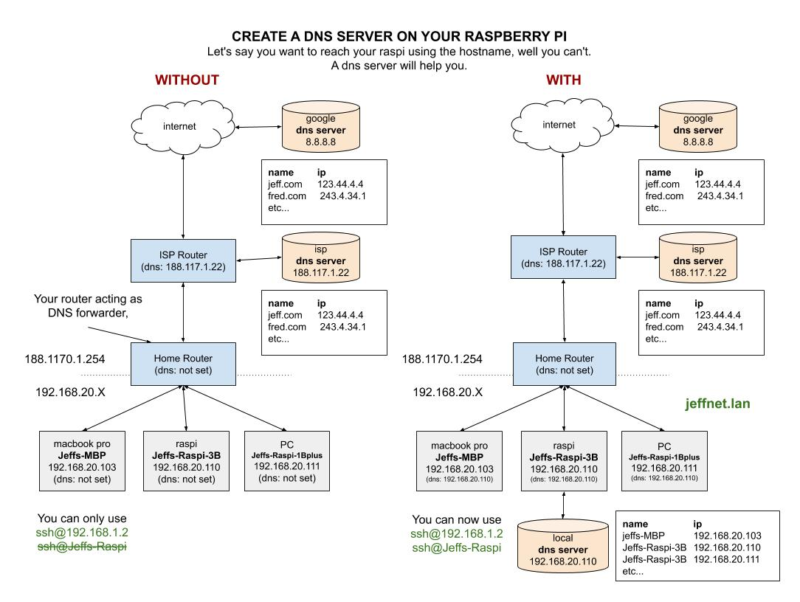

# CREATE DNS SERVER USING BIND

`create-dns-server-using-bind` on linux.


tl;dr,

```bash
# ON DNS SERVER
tail -f /var/log/dns.jeffs-query.log
# ON EACH MACHINE / CLIENT
cat /etc/resolv.conf
# The ultimate goal is to have,
#     search jeffnet.lan
#     nameserver 192.168.20.110
#     nameserver 8.8.8.8
#     nameserver 8.8.4.4
# SOME CHECKS
ping stimpy
ping facebook.com
dig stimpy.jeffnet.lan
dig facebook.com
ssh jeff@stimpy
nslookup stimpy
nslookup facebook.com
```

* [WHY DO WE NEED A LOCAL DNS SERVER](https://github.com/JeffDeCola/my-cheat-sheets/blob/master/software/development/operating-systems/linux/dns-cheat-sheet/create-dns-server-using-bind.md#what-dns-is-your-machine-using)
* [WHAT DNS IS YOUR MACHINE USING](https://github.com/JeffDeCola/my-cheat-sheets/tree/master/software/development/operating-systems/linux/dns-cheat-sheet/create-dns-server-using-bind.md#what-dns-is-your-machine-using)
* [INSTAL BIND (DNS SERVER)](https://github.com/JeffDeCola/my-cheat-sheets/tree/master/software/development/operating-systems/linux/dns-cheat-sheet/create-dns-server-using-bind.md#instal-bind-dns-server)
* [CONFIGURE PRIMARY DNS SERVER](https://github.com/JeffDeCola/my-cheat-sheets/tree/master/software/development/operating-systems/linux/dns-cheat-sheet/create-dns-server-using-bind.md#configure-primary-dns-server)
* [CONFIGURE SECONDARY DNS SERVER](https://github.com/JeffDeCola/my-cheat-sheets/tree/master/software/development/operating-systems/linux/dns-cheat-sheet/create-dns-server-using-bind.md#configure-secondary-dns-server)
* [CONFIGURE YOUR CLIENTS FOR DNS](https://github.com/JeffDeCola/my-cheat-sheets/tree/master/software/development/operating-systems/linux/dns-cheat-sheet/create-dns-server-using-bind.md#configure-your-clients-for-dns)
  * [UBUNTU 18.04](https://github.com/JeffDeCola/my-cheat-sheets/blob/master/software/development/operating-systems/linux/dns-cheat-sheet/create-dns-server-using-bind.md#ubuntu-1804)
  * [UBUNTU 16.04](https://github.com/JeffDeCola/my-cheat-sheets/blob/master/software/development/operating-systems/linux/dns-cheat-sheet/create-dns-server-using-bind.md#ubuntu-1604)
  * [RASPBIAN](https://github.com/JeffDeCola/my-cheat-sheets/blob/master/software/development/operating-systems/linux/dns-cheat-sheet/create-dns-server-using-bind.md#raspbian)
  * [macOS](https://github.com/JeffDeCola/my-cheat-sheets/blob/master/software/development/operating-systems/linux/dns-cheat-sheet/create-dns-server-using-bind.md#macos)
  * [DEBIAN 8](https://github.com/JeffDeCola/my-cheat-sheets/blob/master/software/development/operating-systems/linux/dns-cheat-sheet/create-dns-server-using-bind.md#debian-8)
  * [WINDOWS](https://github.com/JeffDeCola/my-cheat-sheets/blob/master/software/development/operating-systems/linux/dns-cheat-sheet/create-dns-server-using-bind.md#windows)
* [TEST](https://github.com/JeffDeCola/my-cheat-sheets/tree/master/software/development/operating-systems/linux/dns-cheat-sheet/create-dns-server-using-bind.md#test)

I want to credit Dani from
[domoticproject.com](https://domoticproject.com/configuring-dns-server-raspberry-pi/)
for a lot of this information.

View my entire list of cheat sheets on
[my GitHub Webpage](https://jeffdecola.github.io/my-cheat-sheets/).

## WHY DO WE NEED A LOCAL DNS SERVER

Most likely your home router is acting as a DNS forwarder;
You ask your router and your router send its up to the next router.
The ISP router has it set to asks its own ISP DNS server.
You could overide this and set your router to ask google DNS, or
set this request for each machine.
**So the bottom line, the request gets passed upstream till someone figures it out.**

So how do you reach your raspberry pi from another device?  You muse the IP address.
You can't use the hostname.  You must use,

```bash
ssh jeff@192.168.1.2
```

But if you had a home dns server, you could use your hostname,

```bash
ssh jeff@Jeffs-Raspi
```

This illustration may help,



From the above illustration, the benefits are apparent,

* You can now use hostname of your local machines.
* You don't have to set static IPs on your routers (Pain).
* Your local DNS can cache certain website so now you do not always have to ask
  your ISP DNS or google DNS server.  This is faster.
* Security, your local requests won't go outside your home network.

## WHAT DNS IS YOUR MACHINE USING

First let find what dns you are currently using on your clients.

```bash
cat /etc/resolv.conf
```

For Linux,

```bash
sudo apt-get install network-manager
nmcli device show enp1s0
nmcli device show eth0
```

For macos,

```bash
scutil --dns | grep 'nameserver\[[0-9]*\]'
```

## INSTAL BIND (DNS SERVER)

BIND (Berkley Internet Naming Daemon) is the most common program
used for maintaining a name server on Linux.

First make sure you Raspi is not configured with a static IP,

```bash
sudo nano /etc/network/interfaces
```

Now install BIND,

```bash
sudo apt-get install bind9 bind9-doc dnsutils bind9utils
```

Check status,

```bash
service bind9 status
dpkg --list | grep bind
```

Put bind 9 in ipv4 mode,

```bash
sudo nano /etc/default/bind9
```

with,

```txt
OPTIONS="-4 -u bind"
```

## CONFIGURE PRIMARY DNS SERVER

### CONFIGURE named.conf

All DNS configurations for BIND are located under /etc/bind.

* `named.conf` - Primary configuration.
* `named.conf.options` - Port to listen, the forwarders to use, etc.
* `named.conf.local` - This file has the local DNS server configuration.
* `named.conf.default.zones` - It contains the default zones of the server.

Configure,

```bash
sudo nano /etc/bind/named.conf
```

with,

```txt
// This is the primary configuration file for the BIND DNS server named.
//
// Please read /usr/share/doc/bind9/README.Debian.gz for information on the
// structure of BIND configuration files in Debian, *BEFORE* you customize
// this configuration file.
//
// If you are just adding zones, please do that in /etc/bind/named.conf.local

# Access Control List that includes the loopback interface and the local network
acl "jeffs-trusted" {
127.0.0.0/8;            # Trust localhost, not sure if this is needed
192.168.20.0/24;        # Trust all IPs in the subnet
};

include "/etc/bind/named.conf.options";
include "/etc/bind/named.conf.local";
include "/etc/bind/named.conf.default-zones";
```

### CONFIGURE named.conf.options

Configure,

```bash
sudo nano /etc/bind/named.conf.options
```

with,

```txt
options {
        directory "/var/cache/bind";

        recursion yes;              # enables recursive queries
        allow-recursion {           # allows recursive queries from "trusted" clients
                jeffs-trusted;
        };
        listen-on {                 # ns1 private IP address
            192.168.20.110;
        };
        allow-transfer {            # disable zone transfers by default
            none;
        };
        allow-query {
            jeffs-trusted;
        };

        // If there is a firewall between you and nameservers you want
        // to talk to, you may need to fix the firewall to allow multiple
        // ports to talk.  See http://www.kb.cert.org/vuls/id/800113

        // If your ISP provided one or more IP addresses for stable
        // nameservers, you probably want to use them as forwarders.
        // Uncomment the following block, and insert the addresses replacing
        // the all-0's placeholder.

        forwarders {
            8.8.8.8; # Google DNS
            9.9.9.9; # IMB Quad9 DNS
        };

        //========================================================================
        // If BIND logs error messages about the root key being expired,
        // you will need to update your keys.  See https://www.isc.org/bind-keys
        //========================================================================
        dnssec-validation auto;

        auth-nxdomain no;    # conform to RFC1035
        listen-on-v6 { any; };
};

logging {
        channel bind.jeffs-query.log {
            file "/var/log/dns.jeffs-query.log";
            print-time yes;
            severity debug 3;
        };
        category queries { bind.jeffs-query.log; };
};
```

And also create your log file,

```bash
sudo touch /var/log/dns.jeffs-query.log
sudo chown bind:bind /var/log/dns.jeffs-query.log
```

### CONFIGURE named.conf.local

Now set up two zones,

* One for the forward lookup, where the domain’s IP
* address is searched, and a reverse lookup for the inverse query,

Configure,

```bash
sudo nano /etc/bind/named.conf.local
```

with,

```txt
//
// Do any local configuration here
//

// Consider adding the 1918 zones here, if they are not used in your
// organization
//include "/etc/bind/zones.rfc1918";

zone "jeffnet.lan" IN {
        type master;
        file "/etc/bind/jeffnet.lan.db";
        # allow-transfer { 92.168.20.XXX; };          # ns2 private IP address - secondary

};

zone "20.168.192.in-addr.arpa" {                    # 192.168.20.0/24 subnet
        type master;
        file "/etc/bind/reverse.20.168.192.in-addr.arpa.db";
        # allow-transfer { 192.168.20.XXX; };         # ns2 private IP address - secondary

};
```

Create forward lookup zone db,

```bash
sudo nano /etc/bind/jeffnet.lan.db
```

```txt
;
; BIND DATA FOR LOCAL LOOPBACK
$TTL    604800
@                                   IN      SOA     Jeffs-Raspi-3B.jeffnet.lan. admin.jeffnet.lan. (
                  3     ; Serial
             604800     ; Refresh
              86400     ; Retry
            2419200     ; Expire
             604800     ; Negative Cache TTL
)

;
; NAMESERVERS - NS RECORDS
                                    IN      NS      Jeffs-Raspi-3B.jeffnet.lan.     ; NS1
;                                    IN      NS      ns2-hostname.jeffnet.lan.      ; NS2

;
; NAMESERVERS - A RECORDS
Jeffs-Raspi-3B.jeffnet.lan.         IN      A       192.168.20.110                  ; NS1
;ns2-hostname.jeffnet.lan.           IN      A       192.168.20.xxx                 ; NS2

;
; 192.168.20.0/24 - A RECORDS
stimpy.jeffnet.lan.                 IN      A       192.168.20.102
Jeffs-MBP.jeffnet.lan.              IN      A       192.168.20.103
Jeffs-Raspi-1Bplus.jeffnet.lan.     IN      A       192.168.20.111
Jeffs-HBpro-i4X4.jeffnet.lan.       IN      A       192.168.20.120
```

Create reverse lookup zone db,

```bash
sudo nano /etc/bind/reverse.20.168.192.in-addr.arpa.db
```

```txt
;
; BIND REVERSE DATA FOR LOCAL LOOPBACK
$TTL    604800
@                                   IN      SOA     jeffnet.lan. admin.jeffnet.lan. (
                  3     ; Serial
             604800     ; Refresh
              86400     ; Retry
            2419200     ; Expire
             604800     ; Negative Cache TTL
)

;
; NAMESERVERS - NS RECORDS
                                    IN      NS      Jeffs-Raspi-3B.jeffnet.lan.     ; NS1
;                                    IN      NS      ns2-hostname.jeffnet.lan.      ; NS2

;
; PTR RECORDS
110                                 IN      PTR     Jeffs-Raspi-3B.jeffnet.lan.     ; NS1
; XXX                                IN      NS      ns2-hostname.jeffnet.lan.      ; NS2
102                                 IN      PTR     stimpy.jeffnet.lan.
103                                 IN      PTR     Jeffs-MBP.jeffnet.jeffnet.lan.
111                                 IN      PTR     Jeffs-Raspi-1Bplus.jeffnet.lan.
120                                 IN      PTR     Jeffs-HBpro-i4X4.jeffnet.lan.
```

### CONFIGURE named.conf.default.zones

tbd.

### VERIFY NO ERRORS

Verify no error with your configuration files. Should return nothing,

```bash
named-checkconf
named-checkzone jeffnet.lan /etc/bind/jeffnet.lan.db
named-checkzone 20.168.192.in-addr.arpa /etc/bind/reverse.20.168.192.in-addr.arpa.db
```

### START BIND

```bash
service bind9 status
sudo service bind9 restart
sudo service bind9 stop
sudo service bind9 start
```

## CONFIGURE SECONDARY DNS SERVER

Not part of cheat sheet yet.

## CONFIGURE YOUR CLIENTS FOR DNS

There are two ways your machines can find a nameserver,

* Set on your router
* Configure each host

We will do the latter.

You can check your machine that it got the
static ip and the nameserver ip,

We want,

```bash
cat /etc/resolv.conf
```

To have,

```bash
search jeffnet.lan
nameserver 192.168.20.110
nameserver 8.8.8.8
nameserver 8.8.4.4
```

### UBUNTU 18.04

Ubuntu 18.04 uses netplan.

If you have a gui, bring up the manager by

```bash
nm-connection-editor
sudo systemctl restart NetworkManager
sudo systemd-resolve --status
```

If you are not using the gui, then edit this file,

```bash
sudo nano /etc/netplan/00-private-nameservers.yaml
```

This is only for ns1, if you had ns2 you will have to add two addresses.

```bash
network:
  version: 2
  ethernets:
    enp1s0:
      nameservers:
        addresses:
        - 192.168.20.110
        - 8.8.8.8
        - 8.8.4.4
        search:
        - jeffnet.lan
```

Now enable and check,

```bash
sudo netplan try
sudo netplan --debug apply
sudo systemd-resolve --status
```

### UBUNTU 16.04

tbd

### RASPBIAN

```bash
sudo nano /etc/dhcpcd.conf
```

add,

```bash
static domain_name_servers=192.168.20.110 8.8.8.8 8.8.4.4
static domain_search=jeffnet.lan
```

Restart,

```bash
sudo service dhcpcd restart
```

### macOS

Configure your nameserver in
`System Preferences - > Network -> Advanced - > DNS`.

### DEBIAN 8

Edit,

```bash
sudo nano /etc/network/interfaces
```

And add,

```bash
# The loopback network interface
auto lo
iface lo inet loopback

allow-hotplug eth0
iface eth0 inet dhcp
#    dns-nameservers 192.168.20.110 8.8.8.8 8.8.4.4
#    dns-search jeffnet.lan

allow-hotplug wlan0
iface wlan0 inet dhcp
    wpa-conf /etc/wpa_supplicant/wpa_supplicant.conf
```

So I forced it in,

```bash
sudo nano /etc/dhcp/dhclient.conf
```

Added,

```txt
supersede domain-name-servers 192.168.20.110, 8.8.8.8, 8.8.4.4;
supersede domain-search "jeffnet.lan";
```

More info,

```bash
man dhclient.conf
```

restart,

```bash
sudo /etc/init.d/networking restart
```

### WINDOWS

You goto each adapter settings and edit the properties of IPV4.
Click the advanced options to add `jeffnet.lan` under `Append these DNS suffixes`.

Under bash for windows you should see your changes after a reboot in `/etc/resolv.conf`.

Now you need to change the port to 2222. Port 22 does not wor
 because Windows comes with a built in SSH server.

Edit,

```bash
sudo nano /etc/ssh/sshd_config
```

with

```bash
Port 2222
```

Then restart,

```bash
sudo service ssh --full-restart
```

## TEST

On your nameserver you can always check the log,

```bash
tail -f /var/log/dns.jeffs-query.log
```

From any other device on the network you should be able to,

```bash
ping stimpy
ping Jeffs-MBP
ping Jeffs-Raspi-3B
ping Jeffs-Raspi-1Bplus
ping Jeffs-HBpro-i4X4
ping facebook.com

dig stimpy.jeffnet.lan
dig Jeffs-MBP.jeffnet.lan
dig Jeffs-Raspi-3B.jeffnet.lan
dig Jeffs-Raspi-1Bplus.jeffnet.lan
dig Jeffs-HBpro-i4X4.jeffnet.lan
dig facebook.com

ssh jeff@stimpy
ssh jeffdecola@Jeffs-MBP
ssh jeff@Jeffs-Raspi-3B
ssh jeff@Jeffs-Raspi-1Bplus
ssh jeff@Jeffs-HBpro-i4X4

nslookup stimpy
nslookup Jeffs-MBP
nslookup Jeffs-Raspi-3B
nslookup Jeffs-Raspi-1Bplus
nslookup Jeffs-HBpro-i4X4
nslookup facebook.com
```
