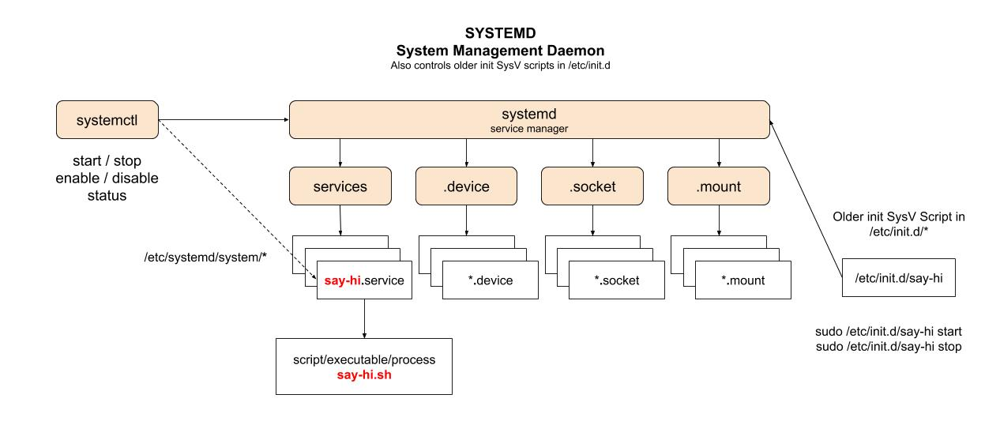

# SYSTEMD SYSTEMCTL CHEAT SHEET

`systemd systemctl` _controls what programs run when linux boots up._

tl;dl,

```bash
# VERSIONS
systemd --version
systemctl --version
# CHECK
ps -eaf | grep [s]ystemd
# SYSTEMCTL
systemctl list-unit-files
systemctl list-unit-files --type=service
systemctl status say-hi
journalctl -f
# START/STOP
sudo systemctl start yourservice
sudo systemctl stop yourservice
# INIT AT BOOT
sudo systemctl enable yourservice
sudo systemctl disable yourservice
```

An older way to start a process at boot (depreciated), but scripts
can still be used,

* [init SysV script](https://github.com/JeffDeCola/my-cheat-sheets/tree/master/software/development/operating-systems/linux/init-sysv-script-cheat-sheet)

Note: Ubuntu 14.04 uses upstart.

View my entire list of cheat sheets on
[my GitHub Webpage](https://jeffdecola.github.io/my-cheat-sheets/).

## SYSTEMD - A BRIEF HISTORY

`init` was a daemon process which starts as soon as the computer boots.
It is pid=1 and the parent of all other processes.

There were alternative developed to replace init.

* init - depreciated (but systemd can still run the SysV scripts).
* Upstart
* Epoch
* Mudar
* systemd 

`systemd` (System Management Daemon) is what used today and
starts processes in parallel. `systemd` initializes user space
components that run after the Linux kernel has booted,
as well as continuously maintaining those components throughout a system’s
lifecycle. These tasks are known as units, and each unit has a corresponding
unit file. Units might concern mounting storage devices (.mount),
configuring hardware (.device), sockets (.socket), or managing services (.service).

`systemd` will still run the older init (SysV) scripts in `/etc/init.d`.
But this is controlled by `systemd`.

Here is an illustration,



## SYSTEMCTL

`systemctl` is a systemd utility which is responsible for
controlling the systemd and the service manager.

Check your versions,

```bash
systemd --version
systemctl --version
```

Check where binaries are,

```bash
whereis systemd
whereis systemctl
```

Check if systemd is running,

```bash
ps -eaf | grep [s]ystemd
```

## UNITS (SERVICES, MOUNT POINTS, SOCKETS AND DEVICES)

Systemctl accepts the following as units,

* services (.service)
* mount point (.mount)
* sockets (.socket)
* devices (.device)

List all units,

```bash
systemctl list-unit-files
```

List all services,

```bash
systemctl list-unit-files --type=service
```

List all services enabled (starts on linux boot),

```bash
systemctl list-unit-files --type=service | grep enabled
```

## CREATE, START & STOP A SERVICE (BY WAY OF AN EXAMPLE)

Lets do this by way of creating a service that runs at boot.
How about something that simply prints `Hi $USER, #`,
when linux boots.

### CREATE A SHELL SCRIPT

Create a shell script,

```bash
nano say-hi.sh
```

with,

```sh
#!/bin/bash

count=1

while true
do
    echo "Hi, I'm using systemd:" $USER $count
    sleep 1
    count=$((count+1))
done
```

Test it,

```bash
sh say-hi.sh
```

May have to add permissions to run `chmod 775`.

### CREATE A SERVICE (whatever.service)

Now create a `say-hi.service` file with your path to `say-hi.sh`,

```bash
sudo nano /etc/systemd/system/say-hi.service
```

with,

```text
[Unit]
Description=say-hi-test

[Service]
ExecStart=your/path/to/say-hi.sh

[Install]
WantedBy=multi-user.target
```

May also have to `chmod 664`  this file,

```bash
sudo chmod 644 /etc/systemd/system/say-hi.service
```

Check your service,

```bash
sudo systemd-analyze verify say-hi
```

Now see if the service is disabled,

```bash
systemctl list-unit-files --type=service | grep say-hi
```

Or check the status,

```bash
systemctl status say-hi
```

### START/STOP YOUR SERVICE

Lets start it,

```bash
sudo systemctl start say-hi
```

Ways to check if it working,

```bash
journalctl -f
systemctl status say-hi
systemctl is-active say-hi
```

Lets stop it,

```bash
sudo systemctl stop say-hi.service
```

Check if its stopped,

```bash
journalctl -f
systemctl status say-hi
systemctl is-active say-hi
```

### ENABLE/DISABLE A SERVICE AT BOOT

Now comes the meat and potatoes; getting the
service to run at boot.

First enable the service to start at boot,

```bash
systemctl enable say-hi
```

Reboot your machine.

Now check the status because it should be running,

```bash
journalctl -f
systemctl status say-hi
systemctl is-active say-hi
```

Disable your service from starting at boot,

```bash
sudo systemctl disable say-hi
```

Now stop it,

```bash
sudo systemctl stop say-hi
```
