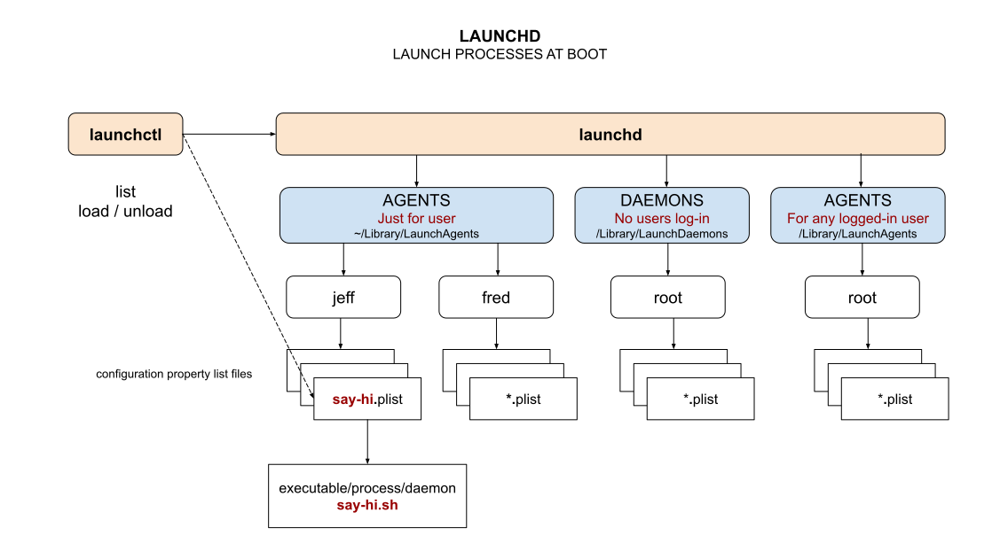

# LAUNCHD CHEAT SHEET

[](https://jeffdecola.com)
[](https://jeffdecola.mit-license.org)

_launchd controls what programs run when macOS boots._

tl;dl

```bash
# VERSIONS
launchctl version
# LAUNCHCTL
launchctl list
launchctl list | grep say-hi
# LOAD/UNLOAD
launchctl load ~/Library/LaunchAgents/local.say-hi.plist
launchctl unload ~/Library/LaunchAgents/local.say-hi.plist
```

Table of Contents

* [OVERVIEW](https://github.com/JeffDeCola/my-cheat-sheets/tree/master/software/development/operating-systems/macos/launchd-cheat-sheet#overview)
* [LAUNCHCTL](https://github.com/JeffDeCola/my-cheat-sheets/tree/master/software/development/operating-systems/macos/launchd-cheat-sheet#launchctl)
* [CREATE, START & STOP AN AGENT/DAEMON (BY WAY OF AN EXAMPLE)](https://github.com/JeffDeCola/my-cheat-sheets/tree/master/software/development/operating-systems/macos/launchd-cheat-sheet#create-start--stop-an-agentdaemon-by-way-of-an-example)
  * [CREATE A SHELL SCRIPT](https://github.com/JeffDeCola/my-cheat-sheets/tree/master/software/development/operating-systems/macos/launchd-cheat-sheet#create-a-shell-script)
  * [CREATE AN AGENT (whatever.plist)](https://github.com/JeffDeCola/my-cheat-sheets/tree/master/software/development/operating-systems/macos/launchd-cheat-sheet#create-an-agent-whateverplist)
  * [LOAD/UNLOAD YOUR AGENT AT BOOT](https://github.com/JeffDeCola/my-cheat-sheets/tree/master/software/development/operating-systems/macos/launchd-cheat-sheet#loadunload-your-agent-at-boot)

Documentation and Reference

* [systemd](https://github.com/JeffDeCola/my-cheat-sheets/tree/master/software/development/operating-systems/linux/services/systemd-cheat-sheet)
  (linux)

## OVERVIEW

`launchd` launches at boot, two types of processes,

* User
  * Agents - “~/Library/LaunchAgents” runs on behalf of the logged-in user
* Root
  * Daemons - “/Library/LaunchDaemons” runs when no users logged in
  * Agents - “/Library/LaunchAgents” when any user logged in

Here is an illustration,



## LAUNCHCTL

`launchctl` controls launchd.

Check your version,

```bash
launchctl version
```

Check that launchd is running (it will be),

```bash
ps -eaf | grep launchd
```

See a list of what running,

```bash
launchctl list
```

## CREATE, START & STOP AN AGENT/DAEMON (BY WAY OF AN EXAMPLE)

Lets do this by way of creating a service that runs at boot.
How about something that simply prints `Hi $USER, #`,
when macOS boots.

### CREATE A SHELL SCRIPT

Create a shell script,

```bash
nano say-hi.sh
```

with,

```sh
#!/bin/bash

count=1

while true
do
    echo "Hi, I'm using launchd:" $USER $count >> /Users/jeffdecola/temp-from-say-hi.txt
    sleep 1
    count=$((count+1))
done
```

Test it,

```bash
sh say-hi.sh
```

May have to add permissions to run `chmod 775`.

### CREATE AN AGENT (whatever.plist)

Create a configuration property list file for your daemon.

Now create a `say-hi.plist` file with your path to `say-hi.sh`,

```bash
nano ~/Library/LaunchAgents/local.say-hi.plist
```

with,

```xml
<?xml version="1.0" encoding="UTF-8"?>
<!DOCTYPE plist PUBLIC "-//Apple//DTD PLIST 1.0//EN" "http://www.apple.com/DTDs/PropertyList-1.0.dtd">
<plist version="1.0">
<dict>
    <key>Label</key>
    <string>local.say-hi</string>
    <key>Program</key>
    <array>
        <string>/Users/jeffdecola/say-hi.sh</string>
    </array>
    <key>ProgramArguments</key>
    <array>
        <string></string>
    </array>
    <key>KeepAlive</key>
    <true/>
    <key>RunAtLoad</key>
    <true/>
    <key>StandardErrorPath</key>
    <string>/Users/jeffdecola/say-hi.log</string>
    <key>StandardOutPath</key>
    <string>/Users/jeffdecola/say-hi.log</string>
</dict>
</plist>
```

### LOAD/UNLOAD YOUR AGENT AT BOOT

Lets load it,

```bash
launchctl load ~/Library/LaunchAgents/local.say-hi.plist
```

Ways to check if it working,

```bash
launchctl list | grep say-hi
```

Lets unload it,

```bash
launchctl unload ~/Library/LaunchAgents/local.say-hi.plist
```

Check if its stopped,

```bash
launchctl list | grep say-hi
```
