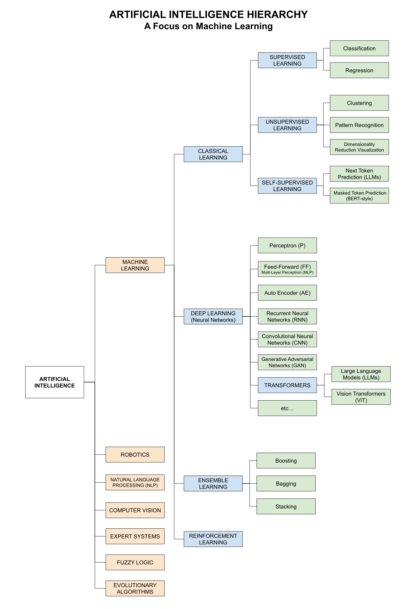

# ARTIFICIAL INTELLIGENCE OVERVIEW CHEAT SHEET

_An high level overview of artificial intelligence (AI)
and a quick dive into machine learning (ML)._

Table of Contents

* [OVERVIEW](https://github.com/JeffDeCola/my-cheat-sheets/tree/master/software/development/software-architectures/artificial-intelligence/ai-fundamentals/artificial-intelligence-overview-cheat-sheet#overview)
* [TYPES OF AI](https://github.com/JeffDeCola/my-cheat-sheets/tree/master/software/development/software-architectures/artificial-intelligence/ai-fundamentals/artificial-intelligence-overview-cheat-sheet#types-of-ai)
  * [CAPABILITY](https://github.com/JeffDeCola/my-cheat-sheets/tree/master/software/development/software-architectures/artificial-intelligence/ai-fundamentals/artificial-intelligence-overview-cheat-sheet#capability)
  * [FUNCTIONALITY](https://github.com/JeffDeCola/my-cheat-sheets/tree/master/software/development/software-architectures/artificial-intelligence/ai-fundamentals/artificial-intelligence-overview-cheat-sheet#functionality)
* [ARTIFICIAL INTELLIGENCE HIERARCHY](https://github.com/JeffDeCola/my-cheat-sheets/tree/master/software/development/software-architectures/artificial-intelligence/ai-fundamentals/artificial-intelligence-overview-cheat-sheet#artificial-intelligence-hierarchy)
* [MACHINE LEARNING](https://github.com/JeffDeCola/my-cheat-sheets/tree/master/software/development/software-architectures/artificial-intelligence/ai-fundamentals/artificial-intelligence-overview-cheat-sheet#machine-learning)
  * [CLASSICAL LEARNING](https://github.com/JeffDeCola/my-cheat-sheets/tree/master/software/development/software-architectures/artificial-intelligence/ai-fundamentals/artificial-intelligence-overview-cheat-sheet#classical-learning)
  * [DEEP LEARNING (NEURAL NETWORKS)](https://github.com/JeffDeCola/my-cheat-sheets/tree/master/software/development/software-architectures/artificial-intelligence/ai-fundamentals/artificial-intelligence-overview-cheat-sheet#deep-learning-neural-networks)
  * [ENSEMBLE LEARNING](https://github.com/JeffDeCola/my-cheat-sheets/tree/master/software/development/software-architectures/artificial-intelligence/ai-fundamentals/artificial-intelligence-overview-cheat-sheet#ensemble-learning)
  * [REINFORCEMENT LEARNING](https://github.com/JeffDeCola/my-cheat-sheets/tree/master/software/development/software-architectures/artificial-intelligence/ai-fundamentals/artificial-intelligence-overview-cheat-sheet#reinforcement-learning)

Documentation and Reference

* AI Fundamentals
  * **[artificial intelligence overview](https://github.com/JeffDeCola/my-cheat-sheets/tree/master/software/development/software-architectures/artificial-intelligence/ai-fundamentals/artificial-intelligence-overview-cheat-sheet#artificial-intelligence-overview-cheat-sheet)**
    **YOU ARE HERE**
  * [neural networks](https://github.com/JeffDeCola/my-cheat-sheets/tree/master/software/development/software-architectures/artificial-intelligence/ai-fundamentals/neural-networks-cheat-sheet#neural-networks-cheat-sheet)
    ([my-neural-networks](https://github.com/JeffDeCola/my-neural-networks?tab=readme-ov-file#my-neural-networks))
  * [math behind training mlp neural networks](https://github.com/JeffDeCola/my-cheat-sheets/tree/master/software/development/software-architectures/artificial-intelligence/ai-fundamentals/math-behind-training-mlp-neural-networks-cheat-sheet#math-behind-training-mlp-neural-networks-cheat-sheet)
* Application/Orchestration Layer
  * [ai stack configurations - from chatbots to agents](https://github.com/JeffDeCola/my-cheat-sheets/tree/master/software/development/software-architectures/artificial-intelligence/application-orchestration-layer/ai-stack-configurations-from-chatbots-to-agents-cheat-sheet#ai-stack-configurations---from-chatbots-to-agents-cheat-sheet)
  * [openclaw ai agent](https://github.com/JeffDeCola/my-cheat-sheets/tree/master/software/development/software-architectures/artificial-intelligence/application-orchestration-layer/openclaw-ai-agent-cheat-sheet#openclaw-ai-agent-cheat-sheet)
  * [open webui chatbot](https://github.com/JeffDeCola/my-cheat-sheets/tree/master/software/development/software-architectures/artificial-intelligence/application-orchestration-layer/open-webui-chatbot-cheat-sheet#open-webui-chatbot-cheat-sheet)
* Inference Layer
  * [ollama](https://github.com/JeffDeCola/my-cheat-sheets/tree/master/software/development/software-architectures/artificial-intelligence/inference-layer/ollama-cheat-sheet#ollama-cheat-sheet)
* LLM Layer
  * [llm](https://github.com/JeffDeCola/my-cheat-sheets/tree/master/software/development/software-architectures/artificial-intelligence/llm-layer/llm-cheat-sheet#llm-cheat-sheet)
  * [llm training](https://github.com/JeffDeCola/my-cheat-sheets/tree/master/software/development/software-architectures/artificial-intelligence/llm-layer/llm-training-cheat-sheet#llm-training-cheat-sheet)

## OVERVIEW

Artificial Intelligence (AI) is the term used to describe the ability
of a machine to perform cognitive processes.

## TYPES OF AI

AI can be looked at in two ways; How good it is (Capability) and what it can
do (Functionality).

### CAPABILITY

* **Machine Learning** (Narrow AI / Weak AI)
  * Designed for a specific task
  * Most modern AI, including ML systems and LLMs, falls here
* **Machine Intelligence** (General AI / Strong AI)
  * Can perform any intellectual task that a human can
* **Machine Consciousness** (Superintelligent AI)
  * AI that surpasses human intelligence

### FUNCTIONALITY

* **Reactive Machines**
  * Can only react to current situations
* **Limited Memory**
  * Can learn from the past
* **Theory of Mind**
  * Can understand human emotions
* **Self Awareness**
  * AI that has consciousness

## ARTIFICIAL INTELLIGENCE HIERARCHY

Artificial Intelligence can be broken down into many subcategories.
I will focus on Machine Learning.

* **Artificial Intelligence (AI)**
  * Machine Learning (ML)
  * Robotics
  * Natural Language Processing (NLP)
  * Computer Vision
  * Expert Systems
  * Fuzzy Logic
  * Evolutionary Algorithms

## MACHINE LEARNING

Machine Learning is a subset of AI that allows a system to learn from data
rather than through explicit programming.

There are many types of Machine Learning such as,

* **Machine Learning (ML)**
  * **Classical Learning**
    * Supervised Learning
      * Classification
      * Regression
    * Unsupervised Learning
      * Clustering
      * Pattern Recognition
      * Dimensionality Reduction Visualization
    * Self-Supervised Learning
      * Next-token prediction (LLMs)
      * Masked token prediction (BERT-style)
  * **Deep Learning** (Neural Networks)
    * [Perceptron (P)](https://github.com/JeffDeCola/my-cheat-sheets/tree/master/software/development/software-architectures/artificial-intelligence/ai-fundamentals/neural-networks-cheat-sheet#perceptron-p)
    * [Multi-Layer Perceptron (MLP)](https://github.com/JeffDeCola/my-cheat-sheets/tree/master/software/development/software-architectures/artificial-intelligence/ai-fundamentals/neural-networks-cheat-sheet#multi-layer-perceptron-mlp)
    * [Auto Encoders (AE)](https://github.com/JeffDeCola/my-cheat-sheets/tree/master/software/development/software-architectures/artificial-intelligence/ai-fundamentals/neural-networks-cheat-sheet#auto-encoder-ae)
    * [Recurrent Neural Networks (RNN)](https://github.com/JeffDeCola/my-cheat-sheets/tree/master/software/development/software-architectures/artificial-intelligence/ai-fundamentals/neural-networks-cheat-sheet#recurrent-neural-networks-rnn)
    * [Convolutional Neural Networks (CNN)](https://github.com/JeffDeCola/my-cheat-sheets/tree/master/software/development/software-architectures/artificial-intelligence/ai-fundamentals/neural-networks-cheat-sheet#convolutional-neural-networks-cnn)
    * [Generative Adversarial Networks (GAN)](https://github.com/JeffDeCola/my-cheat-sheets/tree/master/software/development/software-architectures/artificial-intelligence/ai-fundamentals/neural-networks-cheat-sheet#generative-adversarial-networks-gan)
    * [Transformers](https://github.com/JeffDeCola/my-cheat-sheets/tree/master/software/development/software-architectures/artificial-intelligence/ai-fundamentals/neural-networks-cheat-sheet#transformers)
      * [Large Language Models (LLMs)](https://github.com/JeffDeCola/my-cheat-sheets/tree/master/software/development/software-architectures/artificial-intelligence/llm-layer/llm-cheat-sheet#llm-cheat-sheet)
      * Vision Transformers (ViT)
    * etc...
  * **Ensemble Learning**
    * Boosting
    * Bagging
    * Stacking
  * **Reinforcement Learning**

> **Note:** Large Language Models (LLMs) sit inside Deep Learning as a
> specific application of the Transformer architecture. They span three
> categories in this sheet: Deep Learning (Transformers as architecture),
> Self-Supervised Learning (pretraining), and Reinforcement Learning
> (RLHF alignment).

### CLASSICAL LEARNING

Classical learning is the most common type of machine learning.
It can be broken down into three categories: Supervised, Unsupervised, and Self-Supervised.
These systems learn from mistakes and makes predictions on new data.

#### SUPERVISED LEARNING

In supervised learning, the system is given input data and the correct output
The system learns to predict the output from the input data.

* **Classification**
  * Used for predicting a category
  * Example: Is this email spam or not spam?
* **Regression**
  * Used for predicting a quantity
  * Example: What will the price of a house be?

#### UNSUPERVISED LEARNING

In unsupervised learning, the system is given input data without the correct
output and the system learns to find patterns in the data.

* **Clustering**
  * Used for grouping similar data
  * Example: Grouping customers by purchasing behavior
* **Pattern Recognition**
  * Used for finding patterns in data
  * Example: Finding patterns in stock market data
* **Dimensionality Reduction Visualization**
  * Used for reducing the number of features in data
  * Example: Reducing the number of features in an image

#### SELF-SUPERVISED LEARNING

In self-supervised learning, the system creates its own labels from
unlabeled data by hiding part of the input and learning to predict it.
This is the regime that modern LLMs are pretrained under.

* **Next-token prediction**
  * Predict the next word given previous words
  * Example: GPT-style LLM pretraining
* **Masked token prediction**
  * Predict hidden words given surrounding context
  * Example: BERT pretraining

### DEEP LEARNING (NEURAL NETWORKS)

Deep learning is a subset of machine learning that uses neural networks.
It is a very popular type of machine learning today. A Neural Network is a
working system at the heart of a Deep Learning algorithm that helps it process
raw data.

* **[Neural networks](https://github.com/JeffDeCola/my-cheat-sheets/tree/master/software/development/software-architectures/artificial-intelligence/ai-fundamentals/neural-networks-cheat-sheet#neural-networks-cheat-sheet)**
  * Like a human brain
  * A network of nodes that are interconnected
  * Each node is a neuron that is connected to other neurons
  * The network can learn from data, improve itself and make decisions

There are many types of neural networks such as,

* **[Perceptron (P)](https://github.com/JeffDeCola/my-cheat-sheets/tree/master/software/development/software-architectures/artificial-intelligence/ai-fundamentals/neural-networks-cheat-sheet#perceptron-p)**
  * The simplest form of a neural network
  * Used for simple classification tasks
  * Example: Is this email spam or not spam?
* **[Multi-Layer Perceptron (MLP)](https://github.com/JeffDeCola/my-cheat-sheets/tree/master/software/development/software-architectures/artificial-intelligence/ai-fundamentals/neural-networks-cheat-sheet#multi-layer-perceptron-mlp)**
  * Data moves in one direction
  * No loops in the network
  * Used for simple classification tasks
  * Example: Is this email spam or not spam?
* **[Auto Encoder (AE)](https://github.com/JeffDeCola/my-cheat-sheets/tree/master/software/development/software-architectures/artificial-intelligence/ai-fundamentals/neural-networks-cheat-sheet#auto-encoder-ae)**
  * Used for reducing dimensionality
  * Example: Reducing the number of features in an image
* **[Recurrent Neural Networks (RNN)](https://github.com/JeffDeCola/my-cheat-sheets/tree/master/software/development/software-architectures/artificial-intelligence/ai-fundamentals/neural-networks-cheat-sheet#recurrent-neural-networks-rnn)**
  * Used for sequential data
  * Example: Predicting the next word in a sentence
* **[Convolutional Neural Networks (CNN)](https://github.com/JeffDeCola/my-cheat-sheets/tree/master/software/development/software-architectures/artificial-intelligence/ai-fundamentals/neural-networks-cheat-sheet#convolutional-neural-networks-cnn)**
  * Used for image data
  * Example: Image recognition
* **[Generative Adversarial Networks (GAN)](https://github.com/JeffDeCola/my-cheat-sheets/tree/master/software/development/software-architectures/artificial-intelligence/ai-fundamentals/neural-networks-cheat-sheet#generative-adversarial-networks-gan)**
  * Used for generating new data
  * Example: Generating new images
* **[Transformers](https://github.com/JeffDeCola/my-cheat-sheets/tree/master/software/development/software-architectures/artificial-intelligence/ai-fundamentals/neural-networks-cheat-sheet#transformers)**
  * Architecture using self-attention to process sequences in parallel
  * Largely replaced RNNs for sequence tasks
  * Foundation for most modern LLMs, vision, and multimodal models
  * **[Large Language Models (LLMs)](https://github.com/JeffDeCola/my-cheat-sheets/tree/master/software/development/software-architectures/artificial-intelligence/llm-layer/llm-cheat-sheet#llm-cheat-sheet)**
    * Transformers scaled to billions of parameters
    * Trained via self-supervised learning on massive text corpora
    * Example: ChatGPT, Claude, Llama
  * **Vision Transformers (ViT)**
    * Transformers applied to image data
    * Example: Image classification, object detection

### ENSEMBLE LEARNING

Ensemble learning is when you take multiple machine learning algorithms
and combine them to make a more powerful model. There are three types,

* **Boosting**
  * Used for reducing bias
  * Example: AdaBoost
* **Bagging**
  * Used for reducing variance
  * Example: Random Forest
* **Stacking**
  * Used for reducing bias and variance
  * Example: Stacked Generalization

### REINFORCEMENT LEARNING

Reinforcement learning is a type of machine learning that trains an
agent to make a sequence of decisions by interacting with an environment
and receiving rewards.

Core concepts,

* **Agent** - the learner/decision maker
* **Environment** - what the agent interacts with
* **Reward** - feedback signal the agent tries to maximize
* **Policy** - the agent's strategy for choosing actions

Common approaches,

* **Q-Learning**
  * Learn the value of taking an action in a state
* **Policy Gradient**
  * Directly learn the policy
* **Actor-Critic**
  * Combines value-based and policy-based methods

Applications,

* Game playing (AlphaGo, Atari)
* Robotics
* **RLHF (Reinforcement Learning from Human Feedback)**
  * Used to align LLMs with human preferences
  * Turns a raw pretrained LLM into an instruction-following assistant
