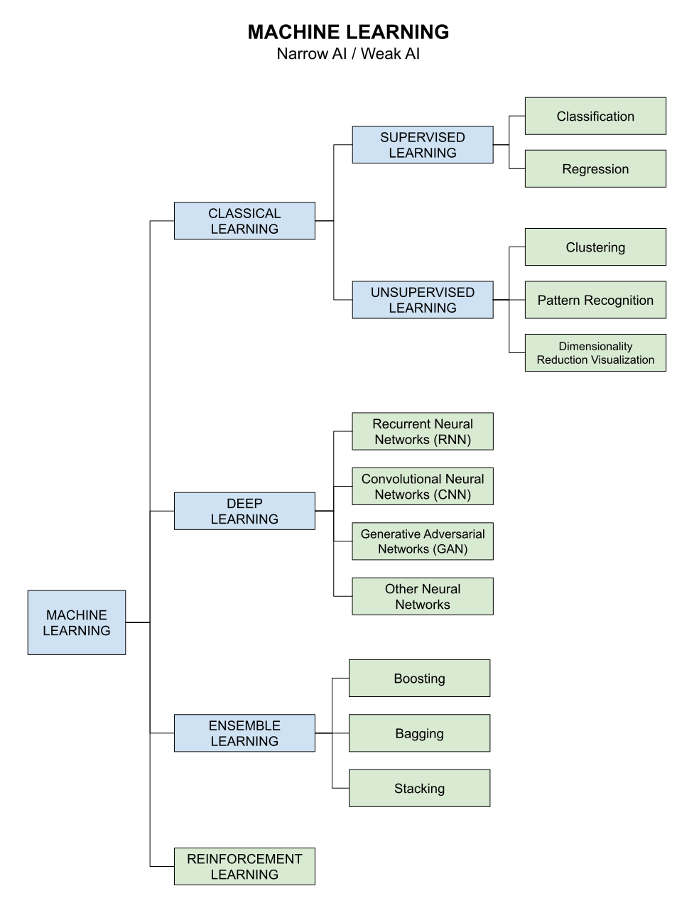

# ARTIFICIAL INTELLIGENCE CHEAT SHEET

_An high level overview of Artificial Intelligence (AI)
and a quick dive into Machine Learning (ML)._

Table of Contents

* [OVERVIEW](https://github.com/JeffDeCola/my-cheat-sheets/tree/master/software/development/software-architectures/artificial-intelligence/artificial-intelligence-cheat-sheet#overview)
* [TYPES OF AI](https://github.com/JeffDeCola/my-cheat-sheets/tree/master/software/development/software-architectures/artificial-intelligence/artificial-intelligence-cheat-sheet#types-of-ai)
  * [CAPABILITY](https://github.com/JeffDeCola/my-cheat-sheets/tree/master/software/development/software-architectures/artificial-intelligence/artificial-intelligence-cheat-sheet#capability)
  * [FUNCTIONALITY](https://github.com/JeffDeCola/my-cheat-sheets/tree/master/software/development/software-architectures/artificial-intelligence/artificial-intelligence-cheat-sheet#functionality)
* [MACHINE LEARNING](https://github.com/JeffDeCola/my-cheat-sheets/tree/master/software/development/software-architectures/artificial-intelligence/artificial-intelligence-cheat-sheet#machine-learning)
  * [CLASSICAL LEARNING](https://github.com/JeffDeCola/my-cheat-sheets/tree/master/software/development/software-architectures/artificial-intelligence/artificial-intelligence-cheat-sheet#classical-learning)
  * [DEEP LEARNING (NEURAL NETWORKS)](https://github.com/JeffDeCola/my-cheat-sheets/tree/master/software/development/software-architectures/artificial-intelligence/artificial-intelligence-cheat-sheet#deep-learning-neural-networks)
  * [ENSEMBLE LEARNING](https://github.com/JeffDeCola/my-cheat-sheets/tree/master/software/development/software-architectures/artificial-intelligence/artificial-intelligence-cheat-sheet#ensemble-learning)
  * [REINFORCEMENT LEARNING](https://github.com/JeffDeCola/my-cheat-sheets/tree/master/software/development/software-architectures/artificial-intelligence/artificial-intelligence-cheat-sheet#reinforcement-learning)

Documentation and Reference

* [neural networks cheat sheet](https://github.com/JeffDeCola/my-cheat-sheets/tree/master/software/development/software-architectures/artificial-intelligence/artificial-intelligence-cheat-sheet/neural-networks.md)
* my repo coming soon

## OVERVIEW

Artificial Intelligence (AI) is the term used to describe the ability of a
machine to perform cognitive processes.

## TYPES OF AI

AI can be looked at in two ways; How good it is (Capabilities) and what it can
do (Functionality).

### CAPABILITY

* **Machine Learning** (Narrow AI / Weak AI)
  * Designed for a specific task
* **Machine Intelligence** (General AI / Strong AI)
  * Can perform any intellectual task that a human can
* **Machine Consciousness** (Superintelligent AI)
  * AI that surpasses human intelligence

### FUNCTIONALITY

* **Reactive Machines**
  * Can only react to current situations
* **Limited Memory**
  * Can learn from the past
* **Theory of Mind**
  * Can understand human emotions
* **Self Awareness**
  * AI that has consciousness

## MACHINE LEARNING

Today, Machine learnings is the most popular subset of AI
that allows a system to learn from data.
Machine learning are used in various functional AI types (above)
such as reactive machines, limited memory and theory of mind (hypothetical).

* **Machine Learning** (ML)
  * **Classical Learning**
    * Supervised Learning
      * Classification
      * Regression
    * Unsupervised Learning
      * Clustering
      * Pattern Recognition
      * Dimensionality Reduction Visualization
  * **Deep Learning** (Neural Networks)
    * [Perceptron (P)](https://github.com/JeffDeCola/my-cheat-sheets/blob/master/software/development/software-architectures/artificial-intelligence/artificial-intelligence-cheat-sheet/neural-networks.md#perceptron-p)
    * [Feed-Forward (FF) / Multi-Layer Perceptron (MLP)](https://github.com/JeffDeCola/my-cheat-sheets/blob/master/software/development/software-architectures/artificial-intelligence/artificial-intelligence-cheat-sheet/neural-networks.md#feed-forward-ff--multi-layer-perceptron-mlp)
    * [Auto Encoders (AE)](https://github.com/JeffDeCola/my-cheat-sheets/blob/master/software/development/software-architectures/artificial-intelligence/artificial-intelligence-cheat-sheet/neural-networks.md#auto-encoder-ae)
    * [Recurrent Neural Networks (RNN)](https://github.com/JeffDeCola/my-cheat-sheets/blob/master/software/development/software-architectures/artificial-intelligence/artificial-intelligence-cheat-sheet/neural-networks.md#recurrent-neural-networks-rnn)
    * [Convolutional Neural Networks (CNN)](https://github.com/JeffDeCola/my-cheat-sheets/blob/master/software/development/software-architectures/artificial-intelligence/artificial-intelligence-cheat-sheet/neural-networks.md#convolutional-neural-networks-cnn)
    * [Generative Adversarial Networks (GAN)](https://github.com/JeffDeCola/my-cheat-sheets/blob/master/software/development/software-architectures/artificial-intelligence/artificial-intelligence-cheat-sheet/neural-networks.md#generative-adversarial-networks-gan)
    * etc...
  * **Ensemble Learning**
    * Boosting
    * Bagging
    * Stacking
  * **Reinforcement Learning**

### CLASSICAL LEARNING

Classical learning is the most common type of machine learning.
It can be broken down into two categories: Supervised and Unsupervised.
Both systems learn from mistakes and makes predictions on new data.

#### SUPERVISED LEARNING

In supervised learning, the system is given input data and the correct output
The system learns to predict the output from the input data.

* **Classification**
  * Used for predicting a category
* **Regression**
  * Used for predicting a quantity

#### UNSUPERVISED LEARNING

In unsupervised learning, the system is given input data without the correct
output and the system learns to find patterns in the data.

* **Clustering**
  * Used for grouping similar data
* **Pattern Recognition**
  * Used for finding patterns in data
* **Dimensionality Reduction Visualization**
  * Used for reducing the number of features in data

### DEEP LEARNING (NEURAL NETWORKS)

Deep learning is a subset of machine learning that uses neural networks.
It is the most popular type of machine learning today. A Neural Network is a
working system at the heart of a Deep Learning algorithm that helps it process
raw data.

* **Neural Networks**
  * Like a human brain
  * A network of nodes that are interconnected
  * Each node is a neuron that is connected to other neurons
  * The network can learn from data, improve itself and make decisions

There are many types of neural networks such as,

* **[Perceptron (P)](https://github.com/JeffDeCola/my-cheat-sheets/blob/master/software/development/software-architectures/artificial-intelligence/artificial-intelligence-cheat-sheet/neural-networks.md#perceptron-p)**
  * The simplest form of a neural network
  * Used for simple classification tasks
* **[Feed-Forward (FF) / MULTI-LAYER PERCEPTRON (MLP)**](https://github.com/JeffDeCola/my-cheat-sheets/blob/master/software/development/software-architectures/artificial-intelligence/artificial-intelligence-cheat-sheet/neural-networks.md#feed-forward-ff--multi-layer-perceptron-mlp)**
  * Data moves in one direction
  * No loops in the network
  * Used for simple classification tasks
* **[Auto Encoder (AE)**](https://github.com/JeffDeCola/my-cheat-sheets/blob/master/software/development/software-architectures/artificial-intelligence/artificial-intelligence-cheat-sheet/neural-networks.md#auto-encoder-ae)**
  * Used for reducing dimensionality
* **[Recurrent Neural Networks (RNN)**](https://github.com/JeffDeCola/my-cheat-sheets/blob/master/software/development/software-architectures/artificial-intelligence/artificial-intelligence-cheat-sheet/neural-networks.md#recurrent-neural-networks-rnn)**
  * Used for sequential data
* **[Convolutional Neural Networks (CNN)**](https://github.com/JeffDeCola/my-cheat-sheets/blob/master/software/development/software-architectures/artificial-intelligence/artificial-intelligence-cheat-sheet/neural-networks.md#convolutional-neural-networks-cnn)**
  * Used for image data
* **[Generative Adversarial Networks (GAN)**](https://github.com/JeffDeCola/my-cheat-sheets/blob/master/software/development/software-architectures/artificial-intelligence/artificial-intelligence-cheat-sheet/neural-networks.md#generative-adversarial-networks-gan)**
  * Used for generating new data

Read more on my
[neural networks cheat sheet](https://github.com/JeffDeCola/my-cheat-sheets/tree/master/software/development/software-architectures/artificial-intelligence/artificial-intelligence-cheat-sheet/neural-networks.md).

### ENSEMBLE LEARNING

Ensemble learning is when you take multiple machine learning algorithms
and combine them to make a more powerful model.
Ensemble Learning

* **Boosting**
  * Used for reducing bias
* **Bagging**
  * Used for reducing variance
* **Stacking**
  * Used for reducing bias and variance

### REINFORCEMENT LEARNING

Reinforcement learning is a type of machine learning that is used to
train an agent to make a sequence of decisions.
