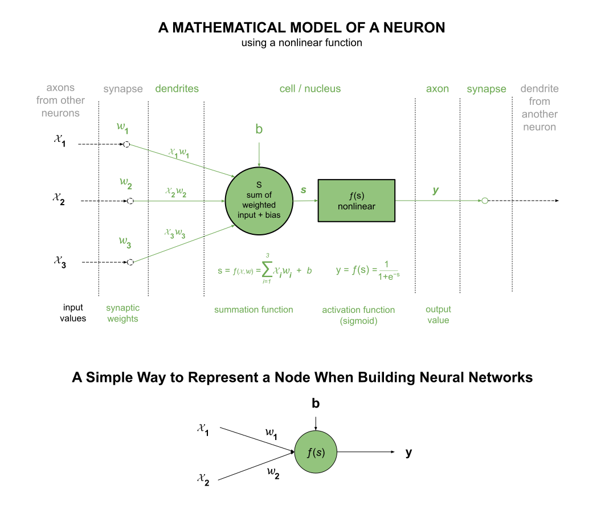
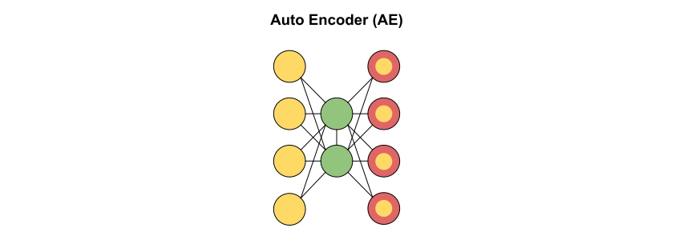

# NEURAL NETWORKS CHEAT SHEET

_This is a high level overview of Neural Networks._

Table of Contents

* [OVERVIEW](https://github.com/JeffDeCola/my-cheat-sheets/tree/master/software/development/software-architectures/artificial-intelligence/artificial-intelligence-cheat-sheet/neural-networks.md#overview)
* [MATHEMATICAL MODEL OF A NEURON](https://github.com/JeffDeCola/my-cheat-sheets/tree/master/software/development/software-architectures/artificial-intelligence/artificial-intelligence-cheat-sheet/neural-networks.md#mathematical-model-of-a-neuron)
  * [THE SUMMATION FUNCTION](https://github.com/JeffDeCola/my-cheat-sheets/tree/master/software/development/software-architectures/artificial-intelligence/artificial-intelligence-cheat-sheet/neural-networks.md#the-summation-function)
  * [THE ACTIVATION FUNCTION](https://github.com/JeffDeCola/my-cheat-sheets/tree/master/software/development/software-architectures/artificial-intelligence/artificial-intelligence-cheat-sheet/neural-networks.md#the-activation-function)
* [NEURAL NETWORKS EXAMPLES](https://github.com/JeffDeCola/my-cheat-sheets/tree/master/software/development/software-architectures/artificial-intelligence/artificial-intelligence-cheat-sheet/neural-networks.md#neural-networks-examples)
  * [PERCEPTRON (P)](https://github.com/JeffDeCola/my-cheat-sheets/tree/master/software/development/software-architectures/artificial-intelligence/artificial-intelligence-cheat-sheet/neural-networks.md#perceptron-p)
  * [FEED-FORWARD (FF) / MULTI-LAYER PERCEPTRON (MLP)](https://github.com/JeffDeCola/my-cheat-sheets/tree/master/software/development/software-architectures/artificial-intelligence/artificial-intelligence-cheat-sheet/neural-networks.md#feed-forward-ff--multi-layer-perceptron-mlp)
  * [AUTO ENCODER (AE)](https://github.com/JeffDeCola/my-cheat-sheets/tree/master/software/development/software-architectures/artificial-intelligence/artificial-intelligence-cheat-sheet/neural-networks.md#auto-encoder-ae)
  * [RECURRENT NEURAL NETWORKS (RNN)](https://github.com/JeffDeCola/my-cheat-sheets/tree/master/software/development/software-architectures/artificial-intelligence/artificial-intelligence-cheat-sheet/neural-networks.md#recurrent-neural-networks-rnn)
  * [CONVOLUTIONAL NEURAL NETWORKS (CNN)](https://github.com/JeffDeCola/my-cheat-sheets/tree/master/software/development/software-architectures/artificial-intelligence/artificial-intelligence-cheat-sheet/neural-networks.md#convolutional-neural-networks-cnn)
  * [GENERATIVE ADVERSARIAL NETWORKS (GAN)](https://github.com/JeffDeCola/my-cheat-sheets/tree/master/software/development/software-architectures/artificial-intelligence/artificial-intelligence-cheat-sheet/neural-networks.md#generative-adversarial-networks-gan)

Documentation and Reference

* [artificial intelligence cheat sheet](https://github.com/JeffDeCola/my-cheat-sheets/tree/master/software/development/software-architectures/artificial-intelligence/artificial-intelligence-cheat-sheet)
* [perceptron neural network]()
  written in go
* [multi-layer perceptron (mlp) neural network]()
  written in go

## OVERVIEW

A neural network is:

* A series of algorithms that endeavors to recognize
underlying relationships in a set of data through a process that mimics the
way the human brain operates.
* The neural network itself is not an algorithm, but rather a framework for many
different machine learning algorithms to work together and process complex data inputs.
* Such systems "learn" to perform tasks by considering examples, generally without
being programmed with any task-specific rules.

## MATHEMATICAL MODEL OF A NEURON

The basic building block of a neural network is the neuron.
Each neuron is composed of two units, a summation unit and an activation unit.

An artificial neuron,

* Takes an input
* Applies a weight to that input
* Passes the weighted input through a **summation function**
  * Sums up the weighted inputs
  * Adds a bias term to the weighted inputs
* Passes the sum through a non-linear **activation function**
* Outputs the result

It’s important to stress that this model of a biological neuron is very coarse.
For example, there are many different types of neurons, each with different
properties. The dendrites in biological neurons perform complex nonlinear
computations. The synapses are not just a single weight, they’re a
complex non-linear dynamical system. The exact timing of the output
spikes in many systems is known to be important, suggesting that
the rate code approximation may not hold.

### THE SUMMATION FUNCTION

The summation function is the first step in the process of a neuron.
It takes the weighted inputs and sums them up.

$$
s = f(x) = x_1 w_1 + x_2 w_2 + \cdots + x_n w_n + b
$$

or

$$
s = f(x) = \sum_{i=1}^{n} x_i w_i + b
$$

Where,

* $x_1, x_2, \ldots, x_n$ are the input values
* $w_1, w_2, \ldots, w_n$ are the weights
* $b$ is the bias

The main function of bias is to provide every node with a trainable
constant value in addition to the normal inputs
that the node receives.

### THE ACTIVATION FUNCTION

The activation function is the second step in the process of a neuron.
The purpose is to introduce non-linearity into the output of a neuron.
This is important because most real-world data is non-linear
and we want our neural network to be able to model and understand this data.
Every activation function (or non-linearity) takes a single number
and performs a certain fixed mathematical operation on it.
The summation of the weighted inputs plus the bias is the input
to the activation function.

There are several activation functions you may encounter in practice
I like to use _**s**_ as the input to the activation function to
represent the weighted sum of the inputs plus bias.

* **Sigmoid Function**
  * Output Range: (0, 1)
  * Usage: Often used in the output layer of neural networks for binary
  classification problems

$$
y = f(s) = \frac{1}{1 + e^{-s}}
$$

* **Tanh (Hyperbolic Tangent) Function**
  * Output Range: (-1, 1)
  * Usage: Often used in hidden layers of neural networks

$$
y = f(s) = \tanh(s) = \frac{e^s - e^{-s}}{e^s + e^{-s}}
$$

* **ReLU (Rectified Linear Unit) Function**
  * Output Range: [0, ∞)
  * Usage: Commonly used in hidden layers of deep neural networks due
    to its simplicity and effectiveness

$$
y = f(s) = \max(0, s)
$$

* **Leaky ReLU Function**
  * Output Range: (-∞, ∞)
  * Addresses the "dying ReLU" problem by allowing a small, non-zero gradient
    when the unit is not active

$$
y = f(s) = \max(\alpha s, s)
$$

* **Softmax Function**
  * Output Range: (0, 1) for each class, and the sum of all outputs is 1
  * Usage: Commonly used in the output layer of neural networks
    for multi-class classification problems

 $$
 y = f(s_i) = \frac{e^{s_i}}{\sum_{j} e^{s_j}}
 $$

## NEURAL NETWORKS EXAMPLES

Nomenclature,

### PERCEPTRON (P)

My
[perceptron neural network]()
written in go.

* DESCRIPTION:
  * The simplest form of a neural network
  * Known as a single-layer neural network
  * Has only 2 layers: An Input Layer and an Output Layer
* FUNCTION:
  * It takes an input and calculates the weighted input for each node
  * Afterward, it uses an activation function (mostly a sigmoid function)
    for classification purposes
* TRAINING:
  * Iteratively feed the network with our training data multiple times
  * Each time the network has seen the full set of training data,
    an epoch has passed.
  * It normally takes many epochs until a weight vector w can be learned
    to linearly separate our two classes of data
* APPLICATION:
  * Basic Classification tasks

### FEED-FORWARD (FF) / MULTI-LAYER PERCEPTRON (MLP)

My
[multi-layer perceptron (mlp) neural network]()
written in go.

* DESCRIPTION:
  * Data moves in one direction
  * No loops in the network
  * Consists of three layers, an Input Layer, Hidden Layers, and an Output Layer
  * The hidden layers have no connection to the outside world
  * Has three layers: An Input Layer, Hidden Layers, and an Output Layer
  * The Input Layer provides the initial data for the network
  * The Output Layer provides the final output of the network
  * The Hidden Layers are where the network learns the patterns in the data
* FUNCTION:
  * It takes an input and calculates the weighted input for each node.
  * Afterward, it uses an activation function (mostly a `sigmoid function`)
    for classification purposes.
* TRAINING:
  * Adjusting the weights of the neurons to minimize the error between
    the predicted output and the actual output
  * This process is typically performed using the `backpropagation algorithm`
  * In backpropagation, the error is propagated back through the network
    to update the weights. The gradient of the loss function with
    respect to each weight is calculated, and the weights are
    adjusted using gradient descent.
  * `Gradient Descent` is an optimization algorithm used to minimize
    some function by iteratively moving in the direction of steepest
    descent as defined by the negative of the gradient
* APPLICATION:
  * Simple Classification tasks
  * Regression tasks
  * Pattern Recognition
  * Speech Recognition

### AUTO ENCODER (AE)

* DESCRIPTION:
  * An unsupervised learning algorithm
  * The number of hidden nodes is less than the number of input nodes
  * The number of input nodes is equal to the number of output nodes
* FUNCTION:
  * The Encoder compresses the input data
  * The Decoder decompresses the compressed data
* TRAINING:
  * The network is trained to minimize the difference between the input and output
  common patterns and generalize the data.
* APPLICATION:
  * AEs to find common patterns and generalize the data
  * Dimensionality Reduction
  * Image Compression

### RECURRENT NEURAL NETWORKS (RNN)

* DESCRIPTION:
  * A variation of a feed-forward neural network
  * A type of neural network where the output from the previous step is fed as input
    to the current step
  * This allows the network to have memory
* FUNCTION:
  * The network can remember important information about the input it received
    a few steps back
  * This is useful for tasks that depend on context
* TRAINING:
  * The network is trained using the backpropagation algorithm
  * The error is propagated back through the network to update the weights
* APPLICATION:
  * Time Series Prediction
  * Speech Recognition
  * Language Translation

### CONVOLUTIONAL NEURAL NETWORKS (CNN)

* DESCRIPTION:
  * A type of neural network that is primarily used for image classification
  * It is a feed-forward neural network
  * It is made up of neurons that have learnable weights and biases
* FUNCTION:
  * The network takes an input image, assigns importance to various aspects
    in the image and be able to differentiate one from the other
  * The network can learn to detect edges, shapes, and textures
* TRAINING:
  * The network is trained using the backpropagation algorithm
  * The error is propagated back through the network to update the weights
* APPLICATION:
  * Image Recognition
  * Image Classification
  * Object Detection
  * Image Segmentation

### GENERATIVE ADVERSARIAL NETWORKS (GAN)

* DESCRIPTION:
  * A type of neural network that is used to generate new data
  * It consists of two networks, a Generator and a Discriminator
  * The Generator generates new data instances
  * The Discriminator evaluates the data instances
* FUNCTION:
  * The Generator tries to generate data that is indistinguishable from real data
  * The Discriminator tries to distinguish between real data and fake data
  * The Generator and Discriminator are trained simultaneously
  * The Generator is trained to fool the Discriminator
  * The Discriminator is trained to detect the fake data
* TRAINING:
  * The Generator and Discriminator are trained simultaneously
  * The Generator is trained to fool the Discriminator
  * The Discriminator is trained to detect the fake data
* APPLICATION:
  * Image Generation
  * Image Enhancement
  * Image-to-Image Translation

