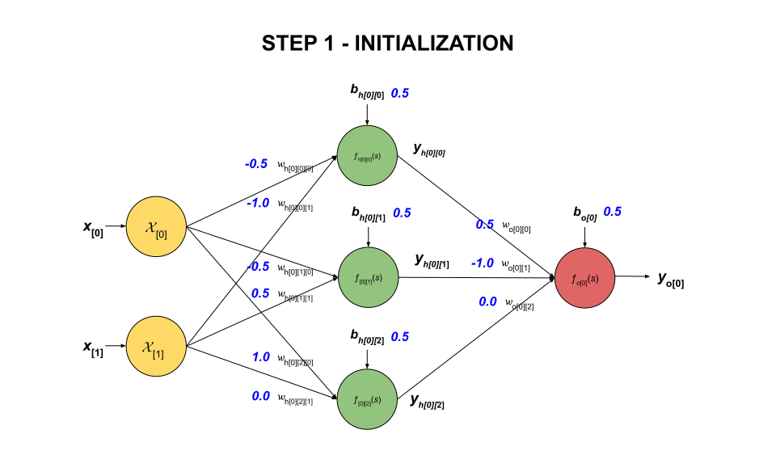
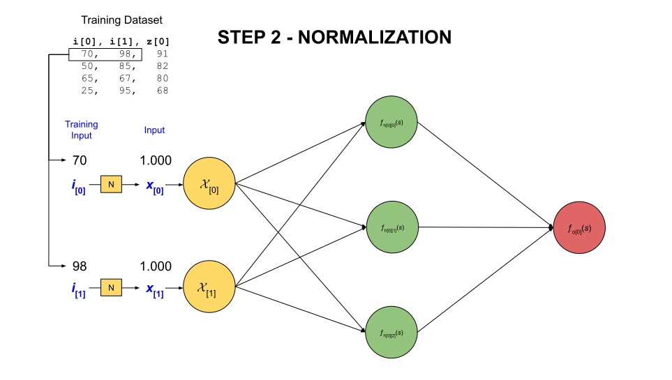
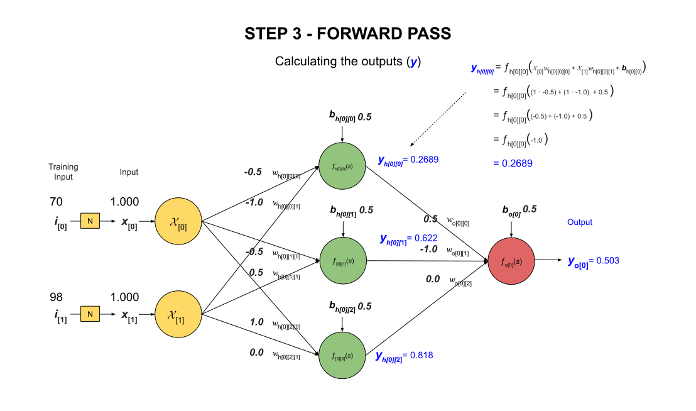
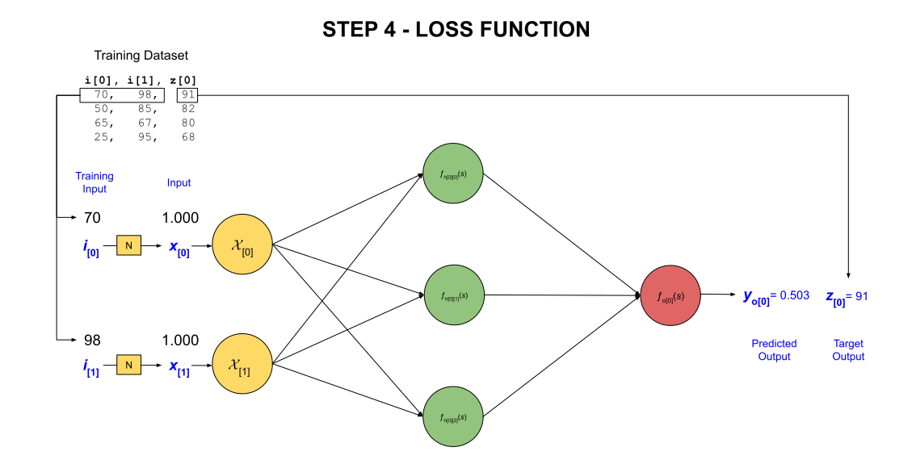

# THE MATH BEHIND TRAINING MLP NEURAL NETWORKS

_The math behind training a multi-layer perceptron (MLP) neural network._

TL;DR

**1 Normalization**

Normalize the input dataset to a range of $[0, 1]$ or $[-1, 1]$.

For $[0, 1]$,

$$
normalized \; data = \frac{data - min(dataset)}{max(dataset) - min(dataset)}
$$

**2 Forward Pass**

Calculate the summation function for the hidden layers and output layer,

$$
s_{h} = f_{h}(w,b) = \sum_{i=1}^{n} x_i w_i + b
$$

$$
s_{o} = f_{o}(w,b) = \sum_{i=1}^{n} a_i w_i + b
$$

Apply the activation function to the hidden layers and output layer,

$$
a_{h} = f_{h}(s_{h})
$$

$$
y_{o} = f_{o}(s_{o})
$$

**2 Backward Pass**

We will be using the mean squared error (mse) loss function,

$$
L = \frac{1}{2} \left(y_{o} - z\right)^2
$$

We want to calculate the gradient of the loss function with respect to the weights and biases for the output layer,

$$
\begin{aligned}
\nabla L(w_{i}) &= \delta_{o} \cdot a_{i} \\
\nabla L(b) &= \delta_{o}
\end{aligned}
$$

First, calculate the error signal for the mse loss function at the output layer,

$$
\begin{aligned}
\delta_{o}
&= f_{o}'(s) \cdot \left(y_{0} - z\right) \\
&= y_{0} \left(1 - y_{0}\right) \cdot \left(y_{0} - z\right)
\end{aligned}
$$

Second, propagate the error signal back to the hidden layers (where j is the next layer),

$$
\begin{aligned}
\delta_{h}
&= f_{h}'(s) \cdot w_{j} \cdot \delta_{j} \\
&= a_{h} \left(1 - a_{h}\right) \cdot w_{j} \cdot \delta_{j}
\end{aligned}
$$

Using the gradient descent formula, adjust the weights and biases at the output layer,

$$
\begin{aligned}
w_{i_{new}}
&= w_{i_{old}} - \eta \nabla L(w_{i}) \\
&= w_{i_{old}} - \eta \delta_{o} \cdot a_{i} \\
b_{new}
&= b_{old} - \eta \nabla L(b) \\
&= b_{old} - \eta \delta_{o}
\end{aligned}
$$

Also, use the gradient descent formula to adjust the weights and biases at the hidden layers,

$$
\begin{aligned}
w_{i_{new}}
&= w_{i_{old}} - \eta \nabla L(w_{i}) \\
&= w_{i_{old}} - \eta \delta_{h} \cdot a_{i} \\
b_{new}
&= b_{old} - \eta \nabla L(b) \\
&= b_{old} - \eta \delta_{h}
\end{aligned}
$$

By getting new values for $w_{i}$ and $b$, we will get the loss function $L(w_{i},b)$ closer to zero.

Table of Contents

* [OVERVIEW](https://github.com/JeffDeCola/my-cheat-sheets/blob/master/software/development/software-architectures/artificial-intelligence/artificial-intelligence-cheat-sheet/the-math-behind-training-mlp-neural-networks.md#overview)
* [MATHEMATICAL MODEL OF NEURAL NETWORK](https://github.com/JeffDeCola/my-cheat-sheets/blob/master/software/development/software-architectures/artificial-intelligence/artificial-intelligence-cheat-sheet/the-math-behind-training-mlp-neural-networks.md#mathematical-model-of-neural-network)
* [MLP ARCHITECTURE USED FOR THIS EXAMPLE](https://github.com/JeffDeCola/my-cheat-sheets/blob/master/software/development/software-architectures/artificial-intelligence/artificial-intelligence-cheat-sheet/the-math-behind-training-mlp-neural-networks.md#mlp-architecture-used-for-this-example)
* [THE TRAINING DATASET](https://github.com/JeffDeCola/my-cheat-sheets/blob/master/software/development/software-architectures/artificial-intelligence/artificial-intelligence-cheat-sheet/the-math-behind-training-mlp-neural-networks.md#the-training-dataset)
* [STEP 1 - INITIALIZATION](https://github.com/JeffDeCola/my-cheat-sheets/blob/master/software/development/software-architectures/artificial-intelligence/artificial-intelligence-cheat-sheet/the-math-behind-training-mlp-neural-networks.md#step-1---initialization)
* [THE TRAINING LOOP](https://github.com/JeffDeCola/my-cheat-sheets/blob/master/software/development/software-architectures/artificial-intelligence/artificial-intelligence-cheat-sheet/the-math-behind-training-mlp-neural-networks.md#the-training-loop)
  * [STEP 2 - NORMALIZATION](https://github.com/JeffDeCola/my-cheat-sheets/blob/master/software/development/software-architectures/artificial-intelligence/artificial-intelligence-cheat-sheet/the-math-behind-training-mlp-neural-networks.md#step-2---normalization)
    * [MIN-MAX SCALING FUNCTION [0, 1]](https://github.com/JeffDeCola/my-cheat-sheets/blob/master/software/development/software-architectures/artificial-intelligence/artificial-intelligence-cheat-sheet/the-math-behind-training-mlp-neural-networks.md#min-max-scaling-function-0-1)
    * [MIN-MAX SCALING FUNCTION [-1, 1]](https://github.com/JeffDeCola/my-cheat-sheets/blob/master/software/development/software-architectures/artificial-intelligence/artificial-intelligence-cheat-sheet/the-math-behind-training-mlp-neural-networks.md#min-max-scaling-function--1-1)
  * [STEP 3 - FORWARD PASS](https://github.com/JeffDeCola/my-cheat-sheets/blob/master/software/development/software-architectures/artificial-intelligence/artificial-intelligence-cheat-sheet/the-math-behind-training-mlp-neural-networks.md#step-3---forward-pass)
    * [THE SUMMATION FUNCTION](https://github.com/JeffDeCola/my-cheat-sheets/blob/master/software/development/software-architectures/artificial-intelligence/artificial-intelligence-cheat-sheet/the-math-behind-training-mlp-neural-networks.md#the-summation-function)
    * [THE ACTIVATION FUNCTION](https://github.com/JeffDeCola/my-cheat-sheets/blob/master/software/development/software-architectures/artificial-intelligence/artificial-intelligence-cheat-sheet/the-math-behind-training-mlp-neural-networks.md#the-activation-function)
      * [The Sigmoid Function](https://github.com/JeffDeCola/my-cheat-sheets/blob/master/software/development/software-architectures/artificial-intelligence/artificial-intelligence-cheat-sheet/the-math-behind-training-mlp-neural-networks.md#the-sigmoid-function)
      * [The Tanh Function](https://github.com/JeffDeCola/my-cheat-sheets/blob/master/software/development/software-architectures/artificial-intelligence/artificial-intelligence-cheat-sheet/the-math-behind-training-mlp-neural-networks.md#the-tanh-function)
    * [THE OUTPUT FUNCTION](https://github.com/JeffDeCola/my-cheat-sheets/blob/master/software/development/software-architectures/artificial-intelligence/artificial-intelligence-cheat-sheet/the-math-behind-training-mlp-neural-networks.md#the-output-function)
    * [OUR EXAMPLE](https://github.com/JeffDeCola/my-cheat-sheets/blob/master/software/development/software-architectures/artificial-intelligence/artificial-intelligence-cheat-sheet/the-math-behind-training-mlp-neural-networks.md#our-example)
  * [STEP 4 - LOSS FUNCTION](https://github.com/JeffDeCola/my-cheat-sheets/blob/master/software/development/software-architectures/artificial-intelligence/artificial-intelligence-cheat-sheet/the-math-behind-training-mlp-neural-networks.md#step-4---loss-function)
    * [MEAN SQUARED ERROR (MSE)](https://github.com/JeffDeCola/my-cheat-sheets/blob/master/software/development/software-architectures/artificial-intelligence/artificial-intelligence-cheat-sheet/the-math-behind-training-mlp-neural-networks.md#mean-squared-error-mse)
  * [STEP 5 - BACKWARD PASS](https://github.com/JeffDeCola/my-cheat-sheets/blob/master/software/development/software-architectures/artificial-intelligence/artificial-intelligence-cheat-sheet/the-math-behind-training-mlp-neural-networks.md#step-5---backward-pass)
    * [THE GRADIENT DESCENT FORMULA](https://github.com/JeffDeCola/my-cheat-sheets/blob/master/software/development/software-architectures/artificial-intelligence/artificial-intelligence-cheat-sheet/the-math-behind-training-mlp-neural-networks.md#the-gradient-descent-formula)
    * [AN EXAMPLE USING THE GRADIENT DESCENT FORMULA](https://github.com/JeffDeCola/my-cheat-sheets/blob/master/software/development/software-architectures/artificial-intelligence/artificial-intelligence-cheat-sheet/the-math-behind-training-mlp-neural-networks.md#an-example-using-the-gradient-descent-formula)
    * [USING THE GRADIENT DESCENT FORMULA ON THE LOSS FUNCTION](https://github.com/JeffDeCola/my-cheat-sheets/blob/master/software/development/software-architectures/artificial-intelligence/artificial-intelligence-cheat-sheet/the-math-behind-training-mlp-neural-networks.md#using-the-gradient-descent-formula-on-the-loss-function)

Documentation and Reference

* [artificial intelligence](https://github.com/JeffDeCola/my-cheat-sheets/tree/master/software/development/software-architectures/artificial-intelligence/artificial-intelligence-cheat-sheet)
cheat sheet
* [neural networks](https://github.com/JeffDeCola/my-cheat-sheets/tree/master/software/development/software-architectures/artificial-intelligence/artificial-intelligence-cheat-sheet/neural-networks.md)
cheat sheet
* [my-neural-networks](https://github.com/JeffDeCola/my-neural-networks/tree/main)
  * [perceptron-simple-example](https://github.com/JeffDeCola/my-neural-networks/tree/main/perceptron-simple-example)
  * [mlp-classification-example](https://github.com/JeffDeCola/my-neural-networks/tree/main/mlp-classification-example)
  * [mlp-image-recognition-example](https://github.com/JeffDeCola/my-neural-networks/tree/main/mlp-regression-example)
  * [mlp-regression-example](https://github.com/JeffDeCola/my-neural-networks/tree/main/mlp-image-recognition-example)

## OVERVIEW

The goal of training a neural network is to adjust the weights and biases
of the neural network so that the predicted output is as close as possible
to the actual output.

A neural networks is trained using a training dataset.
The entire process of training a neural network is shown below,


## MATHEMATICAL MODEL OF NEURAL NETWORK

Since we are dealing with neural networks, let's quicky review our model of a neuron.
Check out a more detailed view in my cheat sheets
[mathematical model of a neuron](https://github.com/JeffDeCola/my-cheat-sheets/blob/master/software/development/software-architectures/artificial-intelligence/artificial-intelligence-cheat-sheet/neural-networks.md#mathematical-model-of-a-neuron).


An artificial neuron consists of the following components,

* **Inputs**
  * $x_{[i]}$
* **Summation Function**
  * Weighted sum of inputs
  * Adds a bias term to the weighted sums $b$
  * $s = f(w,b) = \sum_{i=1}^{n} x_i w_i + b$
* **Activation Function**
  * The activation function determines if the neuron will fire or not
  * Applies a nonlinear activation function $f(s)$ to the sum such
    as sigmoid or tanh
* **Output**
  * The result $y = f(s)$

## MLP ARCHITECTURE USED FOR THIS EXAMPLE

As we go through this cheat sheet,
we will use the following multi-layer perceptron (MLP) neural network as our example.


where

* **Input Layer**
  * Two input values
    * $x[0], x[1]$
* **Hidden Layer**
  * Each node has two inputs, hence two weights
    * $wh[0][0][0], wh[0][0][1], wh[0][1][0], wh[0][1][1], wh[0][2][0], wh[0][2][1]$
    * \[hidden layer]\[hidden node]\[input node]
  * One bias term
    * $bh[0][0], bh[0][1], bh[0][2]$
    * \[hidden layer]\[hidden node]
  * Three activation functions
    * $fh[0][0](s), fh[0][1](s), fh[0][2](s)$
    * \[hidden layer]\[hidden node]
  * Three outputs
    * $ah[0][0], ah[0][1], ah[0][2]$
    * \[hidden layer]\[hidden node]
* **Output Layer**
  * The node has three inputs, hence three weights
    * $wo[0][0], wo[0][1] wo[0][2]$
    * \[output node]\[hidden node]
  * One bias term
    * $bo[0]$
  * Two output values
    * $yo[0], yo[1]$

## THE TRAINING DATASET

The training dataset is the data used to train the neural network.
The dataset consists of input values and the corresponding output values.

In our example, we will use the following training dataset,

```csv
I0,  I1,  Z0
70,  100, 90
50,  85,  80
65,  70,  80
30,  95,  70
```

## STEP 1 - INITIALIZATION

The first step is to initialize the weights and biases of the neural network.
This is usually done randomly. Random numbers between $[-1, 1]$ are usually used.

For our example, we will initialize the weights and biases as follows,

* **HIDDEN LAYER 0**
  * NODE 0
    * hiddenWeight {-0.5 -1.0}
    * hiddenBias {0.5}
  * NODE 1
    * hiddenWeight {-0.5. .5}
    * hiddenBias {0.5}
  * NODE 2
    * hiddenWeight {1.0 0.0}
    * hiddenBias {0.5}
* **OUTPUT LAYER**
  * NODE 0
    * outputWeight {0.5 -1.0 0.0}
    * outputBias {0.5}



## THE TRAINING LOOP

The goal of training is to adjust the weights and biases
to minimize the difference between the actual output $y$
and the actual targets $z$.
The training loop is the process of training the neural network.
There are two loops,

* **Epochs**
  * The number of times the entire dataset is passed forward and backward
* **One Full Dataset**
  * The entire dataset is passed forward and backward to adjust the weights and biases

### STEP 2 - NORMALIZATION

Normalization, also called min-max scaling, changes the values of
input dataset $i$ to occupy a range of $[0, 1]$ or $[-1, 1]$,
reducing the influence of unusual values of out model.



#### MIN-MAX SCALING FUNCTION [0, 1]

The formula to normalize a training dataset using min-max $[0, 1]$ scaling is,

$$
normalized \; data = \frac{data - min(dataset)}{max(dataset) - min(dataset)}
$$

where

* $data$ is the input data
* $min(dataset)$ is the minimum value of the dataset
* $max(dataset)$ is the maximum value of the dataset
* $normalized \; data$ is the output

For example, from our dataset,

```csv
I0,  I1,  Z0
70,  98,  91
50,  85,  82
65,  67,  80
25,  95,  68
```

For $I[0]$, 25 is the minimum value and 70 is the maximum value.
For $I[1]$, 67 is the minimum value and 98 is the maximum value.

Hence, for data input for $I[0]$ of 65 would be normalized to,

$$
\frac{65 - 25}{70 - 25} = 0.8888
$$

Doing all the calculations for [0,1], the input dataset would look like,

```csv
I[0] -> Normalized   I[1] -> Normalized
70   -> 1.0          98   -> 1.0
50   -> 0.5555       85   -> 0.5806
65   -> 0.8888       67   -> 0.0
25   -> 0.0          95   -> 0.9032
```

#### MIN-MAX SCALING FUNCTION [-1, 1]

The formula to normalize a training dataset using min-max $[-1, 1]$ scaling is,
$$

normalized \; data = \frac{data - min(dataset)}{max(dataset) - min(dataset)}
\times 2 - 1
$$

This will normalize the dataset to the range of [-1, 1].

Doing all the calculations, the input dataset would look like,

```csv
I[0] -> Normalized   I[1] -> Normalized
70   -> 1.0          98   -> 1.0
50   -> -0.1111      85   -> 0.1613
65   -> 0.7777       67   -> -1.0
25   -> -1.0         95   -> 0.8064
```

### STEP 3 - FORWARD PASS

Forward propagation is the process of moving the input data through the
neural network to get an output. Each Hidden out output node will
calculate a Summation Function and apply an Activation Function.



#### THE SUMMATION FUNCTION FOR THE HIDDEN LAYER

The summation function takes the weighted inputs and sums them up and
then adds a bias term.

$$
\begin{aligned}
s = f(w,b) &= x_1 w_1 + x_2 w_2 + \cdots + x_n w_n + b \\
&= \sum_{i=1}^{n} x_i w_i + b
\end{aligned}
$$

Where,

* $x_1, x_2, \ldots, x_n$ are the input values
* $w_1, w_2, \ldots, w_n$ are the weights
* $b$ is the bias
* $n$ is the number of inputs

#### THE SUMMATION FUNCTION FOR THE OUTPUT LAYER

The summation function for the output layer is the same as the hidden layer,

$$
\begin{aligned}
s = f(w,b) &= a_1 w_1 + a_2 w_2 + \cdots + a_n w_n + b \\
&= \sum_{i=1}^{n} a_i w_i + b
\end{aligned}
$$

Where,

* $a_1, a_2, \ldots, a_n$ are the hidden layer output values
* $w_1, w_2, \ldots, w_n$ are the weights
* $b$ is the bias
* $n$ is the number of inputs

```text
This equation will be used when writing a computer program
s (hidden) = sum(x[i] * w[i] for i in range(n)) + b
s (output) = sum(a[i] * w[i] for i in range(n)) + b
```

#### THE ACTIVATION FUNCTION

The activation function $f(s)$ is a nonlinear function.
Two common activation functions are,
the sigmoid function and the tanh function.

##### The Sigmoid Function

$$
\begin{aligned}
\sigma(s) &= \frac{1}{1 + e^{-s}} \\
\sigma'(s) &= \sigma(s)(1 - \sigma(s))
\end{aligned}
$$

<p align="center">
    

##### The Tanh Function

$$
\begin{aligned}
\tanh(s) &= \frac{e^s - e^{-s}}{e^s + e^{-s}} \\
\tanh'(s) &= 1 - \tanh^2(s)
\end{aligned}
$$

<p align="center">
    

#### THE OUTPUT FUNCTION FOR THE HIDDEN LAYER

The output of the hidden layer nodes is the output of the activation function,

$$
a = f(s)
$$

#### THE OUTPUT FUNCTION FOR THE OUTPUT LAYER

And the output of the output layer node is the output of the activation function,

$$
y = f(s)
$$

```text
This equation will be used when writing a computer program
a (hidden) = 1 / (1 + math.exp(-s))
y (output) = 1 / (1 + math.exp(-s))
```

#### OUR EXAMPLE

The output functions for the hidden layer nodes in our example would be,

$$
\begin{aligned}
a_{h[0][0]} &= f_{h[0][0]}(s) \\
&= f_{h[0][0]}\left(x_{[0]} w_{h[0][0][0]} +
   x_{[1]} w_{h[0][0][1]} + b_{h[0][0]}\right) \\
&= f_{h[0][0]}\left((1.0 \cdot -0.5) + (1.0 \cdot -1.0) + 0.5\right) \\
&= f_{h[0][0]}\left(-0.5 - 1.0 + 0.5\right) \\
&= f_{h[0][0]}\left(-1.0\right) \\
&= \sigma(-1.0) \\
&= 0.2689
\end{aligned}
$$

$$
\begin{aligned}
a_{h[0][1]} &= f_{h[0][1]}(s) \\
&= f_{h[0][1]}\left(x_{[0]} w_{h[0][1][0]} +
   x_{[1]} w_{h[0][1][1]} + b_{h[0][1]}\right) \\
&= f_{h[0][1]}\left((1.0 \cdot -0.5) + (1.0 \cdot 0.5) + 0.5\right) \\
&= f_{h[0][1]}\left(-0.5 + 0.5 + 0.5\right) \\
&= f_{h[0][1]}\left(0.5\right) \\
&= \sigma(0.5) \\
&= 0.6225
\end{aligned}
$$

$$
\begin{aligned}
a_{h[0][2]} &= f_{h[0][2]}(s) \\
&= f_{h[0][2]}\left(x_{[0]} w_{h[0][2][0]} +
   x_{[1]} w_{h[0][2][1]} + b_{h[0][2]}\right) \\
&= f_{h[0][2]}\left((1.0 \cdot 1.0) + (1.0 \cdot 0.0) + 0.5\right) \\
&= f_{h[0][2]}\left(1.0 + 0.0 + 0.5\right) \\
&= f_{h[0][2]}\left(1.5\right) \\
&= \sigma(1.5) \\
&= 0.8176
\end{aligned}
$$

The output function for the output layer node would be,

$$
\begin{aligned}
y_{o[0]} &= f_{o[0]}(s) \\
&= f_{o[0]}\left(y_{h[0][0]} w_{o[0][0]} + y_{h[0][1]} w_{o[0][1]} +
   y_{h[0][2]} w_{o[0][2]} + b_{o[0]}\right) \\
&= f_{o[0]}\left((0.2689 \cdot 0.5) + (0.6225 \cdot -1.0) +
   (0.8176 \cdot 0.0) + 0.5\right) \\
&= f_{o[0]}\left(0.1345 - 0.6225 + 0.0 + 0.5\right) \\
&= f_{o[0]}\left(0.0120\right) \\
&= \sigma(0.0120) \\
&= 0.5030
\end{aligned}
$$

### STEP 4 - CHOSE LOSS FUNCTIONS

The loss function is the difference between the
predicted output $y$
and the target output $z$.



**The goal is to minimize the loss function**. Ideally we want it to be zero.

#### MEAN SQUARED ERROR (MSE) LOSS FUNCTION

Mean Squared Error (mse) is a common loss function used in regression problems.
It is the average of the squared differences between the
predicted output and target output.

$$
\begin{aligned}
Loss &= \frac{1}{2} \left(predicted - target\right)^2 \\
L&= \frac{1}{2} \left(y-z\right)^2
\end{aligned}
$$

We use mse over a simple linear loss because,

* It is differentiable (which is important for gradient descent below)
* It penalizes errors more due to squaring

### STEP 5 - BACKWARD PASS

We will use stochastic gradient descent (SGD) to adjust the weights and biases.
What does this mean?

1. We will calculate the gradient of the loss function with respect
   to the weights and biases.
2. Then we will adjust the weights and biases in the opposite direction of the gradient

But first, we need to understand the gradient descent formula.

#### THE GRADIENT DESCENT FORMULA

So how do we do minimize the loss function when we have so many weights and biases?
We will use a technique called gradient descent.
Gradient descent is an optimization algorithm used to minimize some function
by iteratively moving in the direction of steepest descent as defined by the
negative of the gradient.

The gradient descent formula is,

$$
\theta_{new} = \theta_{old} - \eta \nabla f(\theta_{old})
$$

Where,

* $\nabla f(\theta_{old})$ is the gradient of the function at $\theta_{old}$
* $\theta_{new}$ is the new value of the parameter
* $\theta_{old}$ is the old value of the parameter
* $\eta$ is the learning rate (a small number)

You can see that the formula is just subtracting the gradient of the function
which is the steepness of the function.

#### AN EXAMPLE USING THE GRADIENT DESCENT FORMULA

As an example, lets say we have a function $f(x,y)$ and we want to
find the minimum value of $f(x,y)$. We have two parameters $x$ and $y$.

$$
\begin{aligned}
f(x,y) &= x^2 + y^2 \\
z &= x^2 + y^2
\end{aligned}
$$

This represents a paraboloid (a bowl-shaped surface)

NOTE: COULD NOT GET THIS PERFECT - IGNORE THE LIP

<p align="center">
    

The gradient of $f(x,y)$ is just the partial derivatives of $f(x,y)$ with
respect to $x$ and $y$.

The partial derivative with respect to $x$,

$$
\begin{aligned}
\nabla f(x) &= \frac{\partial f}{\partial x} \\
&= \frac{\partial}{\partial x} (x^2 + y^2) \\
&= 2x
\end{aligned}
$$

The partial derivative with respect to $y$,

$$
\begin{aligned}
\nabla f(y) &= \frac{\partial f}{\partial y} \\
&= \frac{\partial}{\partial y} (x^2 + y^2) \\
&= 2y
\end{aligned}
$$

If we want, we can write the gradient for $x$ and $y$ as,

$$
{\nabla f(x,y)} = \left[{2x},{2y}\right]
$$

Using the gradient descent formula above for $x$ and $y$,

$$
\theta_{new} = \theta_{old} - \eta \nabla f(\theta_{old})
$$

We use this for each parameter $x$ and $y$,

$$
\begin{aligned}
x_{new} &= x_{old} - \eta \nabla f(x_{old}) \\
&= x_{old} - \eta \frac{\partial f}{\partial x} \\
&= x_{old} - \eta (2x_{old}) \\
&= x_{old}(1 - 2\eta)
\end{aligned}
$$

$$
\begin{aligned}
y_{new} & = y_{old} - \eta \nabla f(y_{old}) \\
&= y_{old} - \eta \frac{\partial f}{\partial y} \\
&= y_{old} - \eta (2y_{old}) \\
&= y_{old}(1 - 2\eta)
\end{aligned}
$$

This formula will move us closer to the minimum of the function $f(x,y)$.

Let's plug in some numbers to see how this works.
Let's start at a random point (3, 4) and try
to find the minimum of the function $f(x,y) = x^2 + y^2$
with a learning rate of $\eta = 0.1$.

First, let's simplify the gradient decent formula a little more
knowing the learning rate of $\eta = 0.1$,

$$
\begin{aligned}
x_{new} &= x_{old}(1 - 2\eta) \\
&= x_{old}(1 - 2 \cdot 0.1) \\
&= x_{old}(1 - 0.2) \\
&= x_{old}(0.8) \\
\end{aligned}
$$

$$
\begin{aligned}
y_{new} &= y_{old}(1 - 2\eta) \\
&= y_{old}(1 - 2 \cdot 0.1) \\
&= y_{old}(1 - 0.2) \\
&= y_{old}(0.8) \\
\end{aligned}
$$

Plug in 3 and 4,

$$
\begin{aligned}
x_{new} &= 3(0.8) \\
&= 2.4000
\end{aligned}
$$

$$
\begin{aligned}
y_{new} &= 4(0.8) \\
&= 3.2000
\end{aligned}
$$

If we keep doing this, we will eventually get to the minimum of the function $f(x,y)$.

| $x_{old}$ | $\nabla f(x)$ | $x_{new}$ | | $y_{old}$ | $\nabla f(y)$ | $y_{new}$  | | $f(x,y)$ |
|-----------|---------------|-----------|-|------------|---------------|-----------|-|----------|
|           |               | 3.0000    | |            |               | 4.0000    | | 25.0000  |
| 3.0000    | 6.0000        | 2.4000    | | 4.0000     | 8.0000        | 3.2000    | | 16.0000  |
| 2.4000    | 4.8000        | 1.9200    | | 3.2000     | 6.4000        | 2.5600    | | 10.2400  |
| 1.9200    | 3.8400        | 1.5360    | | 2.5600     | 5.1200        | 2.0480    | | 6.5536   |
| 1.5360    | 3.0720        | 1.2288    | | 2.0480     | 4.0960        | 1.6384    | | 4.1943   |
| 1.2288    | 2.4576        | 0.9830    | | 1.6384     | 3.2768        | 1.3107    | | 2.6844   |
| 0.9830    | 1.9660        | 0.7864    | | 1.3107     | 2.6214        | 1.0486    | | 1.7179   |
| 0.7864    | 1.5728        | 0.6291    | | 1.0486     | 2.0972        | 0.8389    | | 1.0995   |
| 0.6291    | 1.2582        | 0.5033    | | 0.8389     | 1.6778        | 0.6711    | | 0.7140   |
| 0.5033    | 1.0066        | 0.4027    | | 0.6711     | 1.3422        | 0.5369    | | 0.3579   |
| 0.4027    | 0.8054        | 0.3222    | | 0.5369     | 1.0738        | 0.4295    | | 0.2294   |

You can see the new values of $x$ and $y$ are getting
the function $f(x,y)$ closer to zero.

#### STEP 5.1 CALCULATE THE ERROR SIGNAL FOR THE OUTPUT LAYER

Now that we have a grasp on the gradient descent formula,
we can apply it to the loss function of our neural network.
We will do the exact steps above,
but substitute the loss function $L(w_{i},b)$ for $f(x,y)$.

Like above, the gradient decent formula gets new values
for $x$ and $y$ that will get the function $f(x,y)$ closer to zero,
we will get new values for the weights and biases
that will get the loss function $L(w_{i},b)$ closer to zero.

Let's go through the math for the mean squared error (mse)
loss function at the output layer,

$$
L = \frac{1}{2} \left(y_{o} - z\right)^2
$$

Therefore, we can also write the loss function as,

$$
\begin{aligned}
L(y_{o}) &= \frac{1}{2} \left(y_{o} - z\right)^2 \\
L(s) &= \frac{1}{2} \left(f_{o} (s) - z\right)^2 \\
L(w_{i},b) &= \frac{1}{2} \left(f_{o} (\sum_{i=1}^{n} a_i w_i + b) - z\right)^2
\end{aligned}
$$

Like above, we first want to find the gradient of the loss function with respect to each $w_{i}$ and $b$. But, it is a little more difficult than the above example since we have a function (loss function) of a function (activation function) of a function (summation function).
So we need to use the chain rule of calculus first,

$$
\begin{aligned}
\nabla L(w_{i}) &= \frac{\partial L}{\partial w_{i}} \\
&= \frac{\partial L}{\partial y} \cdot
   \frac{\partial y}{\partial s} \cdot
   \frac{\partial s}{\partial w_{i}} \\
&= \frac{\partial L}{\partial s} \cdot
   \frac{\partial s}{\partial w_{i}} \\
\nabla L(b) &= \frac{\partial L}{\partial b} \\
&= \frac{\partial L}{\partial y} \cdot
   \frac{\partial y}{\partial s} \cdot
   \frac{\partial s}{\partial b} \\
   &= \frac{\partial L}{\partial s} \cdot
   \frac{\partial s}{\partial b} \\
\end{aligned}
$$

So let's find these derivatives.

First we find the **partial derivative of the mse loss function with respect to $s$**.

$$
\begin{aligned}
\frac{\partial L}{\partial s}
&= \frac{\partial}{\partial s} L(s) \\
&= \frac{1}{2} \left(f_{o} (s) - z\right)^2 \\
&= \frac{\partial}{\partial s} \frac{1}{2} \left(f_{o} (s)^2 - 2f_{o} (s)z + z^2\right) \\
&= \frac{1}{2} \frac{\partial}{\partial s} \left(f_{o} (s)^2 - 2f_{o} (s)z + z^2\right) \\
&= \frac{1}{2} \left(2f_{o} (s) \frac{\partial}{\partial s} f_{o} (s) - 2z \frac{\partial}{\partial s} f (s)\right) \\
&= f_{o} (s) f_{o}'(s) - z f_{o}'(s) \\
&= f_{o}'(s) \cdot \left(f_{o} (s) - z\right) \\
&= f_{o}'(s) \cdot \left(y_{o} - z\right)
\end{aligned}
$$

In neural networks, we refer to this as the error signal $\delta_{o}$,

$$
\delta_{o} = f_{o}'(s) \cdot \left(y_{o} - z\right)
$$

With our example, the error signal for the output layer would be,

$$
\begin{aligned}
\delta_{o}
&= f_{o}'(s) \cdot \left(y_{o} - z\right) \\
&= \sigma_{o}'(s) \cdot \left(y_{o} - z\right) \\
&= \sigma_{o}(s)(1 - \sigma_{o}(s)) \cdot \left(y_{o} - z\right) \\
&= y_{o}(1 - y_{o}) \cdot \left(y_{o} - z\right) \\
&= 0.5030(1 - 0.5030) \cdot (0.5030 - 91) \\
&= 0.2494 \cdot -90.4970 \\
&= -22.56
\end{aligned}
$$

```text
This output error signal (delta) will be used when writing a computer program.
d (output) = y * (1 - y) * (y - z)
```

#### STEP 5.2 CALCULATE THE ERROR SIGNAL FOR THE HIDDEN LAYER

Now that we have the error signal for the output layer,
we can calculate the error signal for the hidden layers.

The error signal for the hidden layers is the derivative of the activation function
times the sum of the weights times the error signal of the next layer.

$$
\delta_{h} = f_{h}'(s) \cdot w \cdot \delta_{o}
$$

For our example, the error signal for the hidden layer would be,

$$
\begin{aligned}
\delta_{h[0][0]}
&= f_{h[0][0]}'(s) \cdot w_{o[0][0]} \cdot \delta_{o} \\
&= \sigma_{h[0][0]}'(s) \cdot w_{o[0][0]} \cdot \delta_{o} \\
&= \sigma_{h[0][0]}(s)(1 - \sigma_{h[0][0]}(s)) \cdot w_{o[0][0]} \cdot \delta_{o} \\
&= a_{h[0][0]}(1 - a_{h[0][0]}) \cdot w_{o[0][0]} \cdot \delta_{o} \\
\end{aligned}
$$

```text
This equation will be used when writing a computer program
d (hidden) = a * (1 - a) * w * d (output)
```

#### THE GRADIENT DESCENT FORMULA FOR THE MSE LOSS FUNCTION

First, we can find the **partial derivative of the summation function with respect to each $w_{i}$**.

$$
\begin{aligned}
\frac{\partial s}{\partial w_{i}}
&= \frac{\partial}{\partial w_{i}} \left(\sum_{i=0}^{n} a_i w_i + b\right) \\
&= \frac{\partial}{\partial w_{i}} \left(a_0 w_0 + a_1 w_1 + \cdots + a_n w_n + b\right) \\
&= a_{i}
\end{aligned}
$$

Second, this is the **partial derivative of the summation function with respect to $b$**.

$$
\begin{aligned}
\frac{\partial s}{\partial b} &= \frac{\partial}{\partial b} \left(\sum_{i=1}^{n} x_i w_i + b\right) \\
&= \frac{\partial}{\partial b} \left(a_1 w_1 + a_2 w_2 + \cdots + a_n w_n + b\right) \\
&= 1
\end{aligned}
$$

Pulling it all together, the gradient of the loss function with respect to $w$ is,

$$
\begin{aligned}
\nabla L(w_{i})
&= \frac{\partial L}{\partial w_{i}} \\
&= \frac{\partial L}{\partial s} \cdot \frac{\partial s}{\partial w_{i}} \\
&= \delta_{o} \cdot a_{i} \\
\end{aligned}
$$

And the gradient of the loss function with respect to $b$ is,

$$
\begin{aligned}
\nabla L(b) &= \frac{\partial L}{\partial b} \\
&= \frac{\partial L}{\partial s} \cdot \frac{\partial s}{\partial b} \\
&= \delta_{o} \\
\end{aligned}
$$

If we want, we can write the gradient for $w$ and $b$ as,

$$
{\nabla L(w_{i},b)} = \left[{\delta_{o} \cdot a_{i}},{\delta_{o}}\right]
$$

Now let's use the gradient descent formula above for $w$ and $b$,

$$
\theta_{new} = \theta_{old} - \eta \nabla f(\theta_{old})
$$

We use this for each parameter $w$ and $b$,

$$
\begin{aligned}
w_{i_{new}} &= w_{i_{old}} - \eta \nabla L(w_{i_{old}}) \\
&= w_{i_{old}} - \eta \delta_{o} \cdot a_{i} \\
\end{aligned}
$$

$$
\begin{aligned}
b_{new} &= b_{old} - \eta \nabla L(b_{old}) \\
&= b_{old} - \eta \delta_{o} \\
\end{aligned}
$$

#### STEP 5.3 ADJUST THE WEIGHTS AND BIASES


##### Our example using the gradient descent formula on the loss function


Let's plug in some numbers to see how this works.
Let's start at a random numbers (3, 4) and try
to find the minimum the function $L(w,b)$
with a learning rate of $\eta = 0.1$.

First, let's simplify the gradient decent formula a little more
knowing the learning rate of $\eta = 0.1$,

$$
\begin{aligned}
w_{new} &= w_{old} - 0.1 \left(a_{total} \cdot \sigma(s)(1 - \sigma(s)) \cdot \left(y - z\right)\right)
\end{aligned}
$$

$$
\begin{aligned}
b_{new} &= b_{old} - 0.1 \left(\sigma(s)(1 - \sigma(s)) \cdot \left(y - z\right)\right)
\end{aligned}
$$

Plug in 3 and 4,

$$
\begin{aligned}
x_{new} &= 3(0.8) \\
&= 2.4000
\end{aligned}
$$

$$
\begin{aligned}
y_{new} &= 4(0.8) \\
&= 3.2000
\end{aligned}
$$

If we keep doing this, we will eventually get to the minimum of the function $L(w,b)$.

| $w_{old}$ | $\nabla L(w)$ | $w_{new}$ | | $b_{old}$ | $\nabla L(b)$ | $b_{new}$  | | $L(w,b)$ |
|-----------|---------------|-----------|-|------------|---------------|-----------|-|----------|
|           |               | 3.0000    | |            |               | 4.0000    | | ??.0000  |


You can see the function $L(w,b)$ is getting closer to zero.