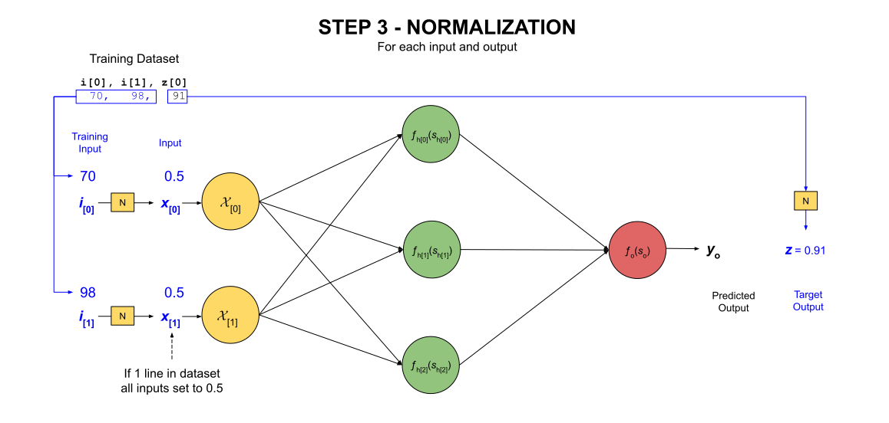
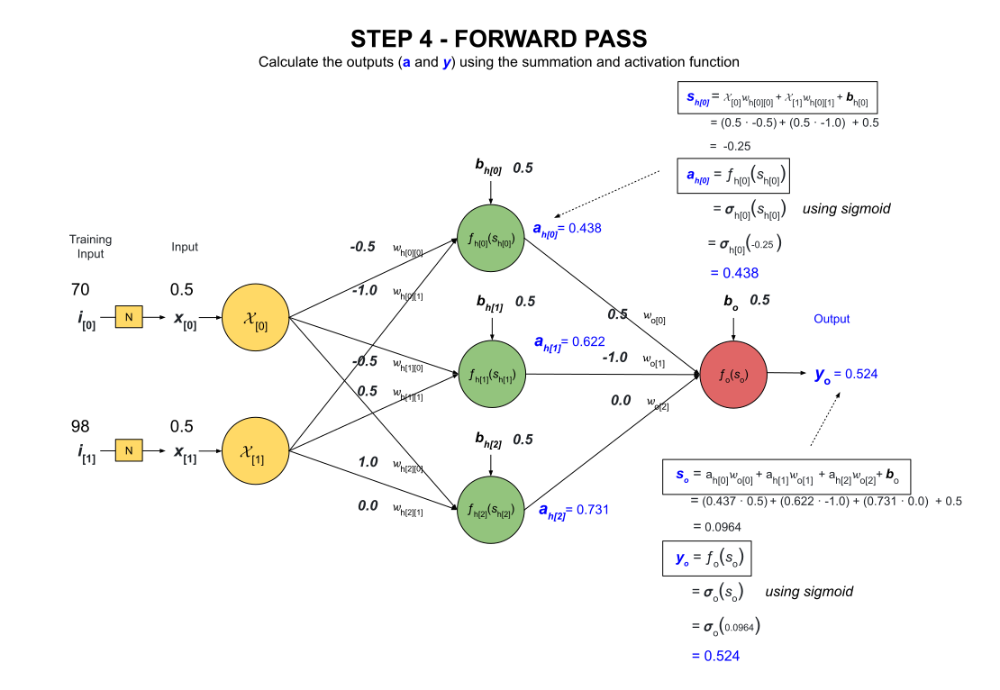
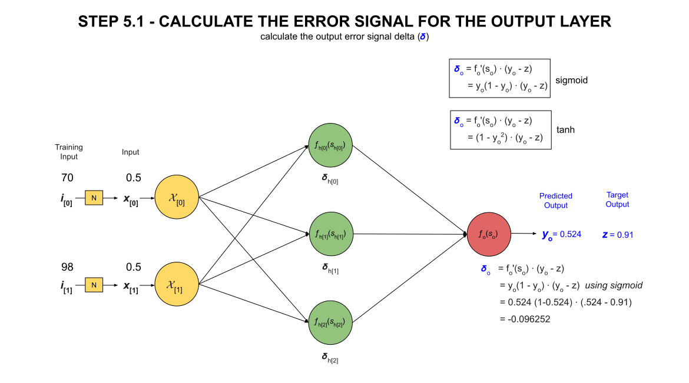
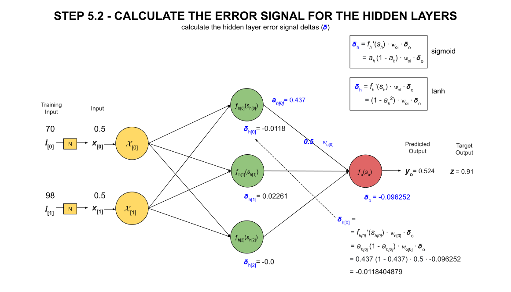
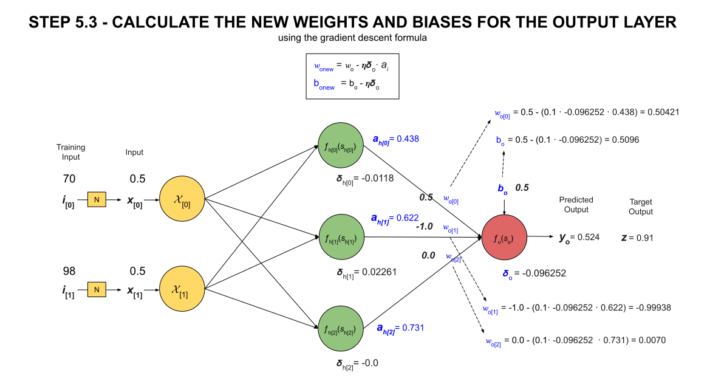

# THE MATH BEHIND TRAINING MLP NEURAL NETWORKS

_The math behind training a multi-layer perceptron (MLP) neural network._

Table of Contents

* [OVERVIEW](https://github.com/JeffDeCola/my-cheat-sheets/blob/master/software/development/software-architectures/artificial-intelligence/artificial-intelligence-cheat-sheet/the-math-behind-training-mlp-neural-networks.md#overview)
* [TL;DR](https://github.com/JeffDeCola/my-cheat-sheets/blob/master/software/development/software-architectures/artificial-intelligence/artificial-intelligence-cheat-sheet/the-math-behind-training-mlp-neural-networks.md#tldr)
* [MATHEMATICAL MODEL OF NEURAL NETWORK](https://github.com/JeffDeCola/my-cheat-sheets/blob/master/software/development/software-architectures/artificial-intelligence/artificial-intelligence-cheat-sheet/the-math-behind-training-mlp-neural-networks.md#mathematical-model-of-neural-network)
* [MLP ARCHITECTURE USED FOR THIS EXAMPLE](https://github.com/JeffDeCola/my-cheat-sheets/blob/master/software/development/software-architectures/artificial-intelligence/artificial-intelligence-cheat-sheet/the-math-behind-training-mlp-neural-networks.md#mlp-architecture-used-for-this-example)
* [THE TRAINING DATASET](https://github.com/JeffDeCola/my-cheat-sheets/blob/master/software/development/software-architectures/artificial-intelligence/artificial-intelligence-cheat-sheet/the-math-behind-training-mlp-neural-networks.md#the-training-dataset)
* [STEP 1 - INITIALIZATION](https://github.com/JeffDeCola/my-cheat-sheets/blob/master/software/development/software-architectures/artificial-intelligence/artificial-intelligence-cheat-sheet/the-math-behind-training-mlp-neural-networks.md#step-1---initialization)
* [STEP 2 - MIN & MAX VALUES](https://github.com/JeffDeCola/my-cheat-sheets/blob/master/software/development/software-architectures/artificial-intelligence/artificial-intelligence-cheat-sheet/the-math-behind-training-mlp-neural-networks.md#step-2---min--max-values)
* [THE TRAINING LOOP](https://github.com/JeffDeCola/my-cheat-sheets/blob/master/software/development/software-architectures/artificial-intelligence/artificial-intelligence-cheat-sheet/the-math-behind-training-mlp-neural-networks.md#the-training-loop)
  * [STEP 3 - NORMALIZATION](https://github.com/JeffDeCola/my-cheat-sheets/blob/master/software/development/software-architectures/artificial-intelligence/artificial-intelligence-cheat-sheet/the-math-behind-training-mlp-neural-networks.md#step-3---normalization)
    * [MIN-MAX SCALING FUNCTION [0, 1]](https://github.com/JeffDeCola/my-cheat-sheets/blob/master/software/development/software-architectures/artificial-intelligence/artificial-intelligence-cheat-sheet/the-math-behind-training-mlp-neural-networks.md#min-max-scaling-function-0-1)
    * [MIN-MAX SCALING FUNCTION [-1, 1]](https://github.com/JeffDeCola/my-cheat-sheets/blob/master/software/development/software-architectures/artificial-intelligence/artificial-intelligence-cheat-sheet/the-math-behind-training-mlp-neural-networks.md#min-max-scaling-function--1-1)
  * [STEP 4 - FORWARD PASS](https://github.com/JeffDeCola/my-cheat-sheets/blob/master/software/development/software-architectures/artificial-intelligence/artificial-intelligence-cheat-sheet/the-math-behind-training-mlp-neural-networks.md#step-4---forward-pass)
    * [THE SUMMATION FUNCTION](https://github.com/JeffDeCola/my-cheat-sheets/blob/master/software/development/software-architectures/artificial-intelligence/artificial-intelligence-cheat-sheet/the-math-behind-training-mlp-neural-networks.md#the-summation-function)
    * [THE ACTIVATION FUNCTION](https://github.com/JeffDeCola/my-cheat-sheets/blob/master/software/development/software-architectures/artificial-intelligence/artificial-intelligence-cheat-sheet/the-math-behind-training-mlp-neural-networks.md#the-activation-function)
    * [STEP 4.1 - THE SUMMATION FUNCTION FOR THE HIDDEN LAYERS](https://github.com/JeffDeCola/my-cheat-sheets/blob/master/software/development/software-architectures/artificial-intelligence/artificial-intelligence-cheat-sheet/the-math-behind-training-mlp-neural-networks.md#step-41---the-summation-function-for-the-hidden-layers)
    * [STEP 4.2 - THE ACTIVATION FUNCTION FOR THE HIDDEN LAYERS](https://github.com/JeffDeCola/my-cheat-sheets/blob/master/software/development/software-architectures/artificial-intelligence/artificial-intelligence-cheat-sheet/the-math-behind-training-mlp-neural-networks.md#step-42---the-activation-function-for-the-hidden-layers)
    * [STEP 4.3 - THE SUMMATION FUNCTION FOR THE OUTPUT LAYER](https://github.com/JeffDeCola/my-cheat-sheets/blob/master/software/development/software-architectures/artificial-intelligence/artificial-intelligence-cheat-sheet/the-math-behind-training-mlp-neural-networks.md#step-43---the-summation-function-for-the-output-layer)
    * [STEP 4.4 - THE ACTIVATION FUNCTION FOR THE OUTPUT LAYER](https://github.com/JeffDeCola/my-cheat-sheets/blob/master/software/development/software-architectures/artificial-intelligence/artificial-intelligence-cheat-sheet/the-math-behind-training-mlp-neural-networks.md#step-44---the-activation-function-for-the-output-layer)
  * [LOSS FUNCTIONS](https://github.com/JeffDeCola/my-cheat-sheets/blob/master/software/development/software-architectures/artificial-intelligence/artificial-intelligence-cheat-sheet/the-math-behind-training-mlp-neural-networks.md#loss-functions)
  * [STEP 5 - BACKWARD PASS](https://github.com/JeffDeCola/my-cheat-sheets/blob/master/software/development/software-architectures/artificial-intelligence/artificial-intelligence-cheat-sheet/the-math-behind-training-mlp-neural-networks.md#step-5---backward-pass)
    * [THE GRADIENT DESCENT FORMULA](https://github.com/JeffDeCola/my-cheat-sheets/blob/master/software/development/software-architectures/artificial-intelligence/artificial-intelligence-cheat-sheet/the-math-behind-training-mlp-neural-networks.md#the-gradient-descent-formula)
    * [AN EXAMPLE USING THE GRADIENT DESCENT FORMULA](https://github.com/JeffDeCola/my-cheat-sheets/blob/master/software/development/software-architectures/artificial-intelligence/artificial-intelligence-cheat-sheet/the-math-behind-training-mlp-neural-networks.md#an-example-using-the-gradient-descent-formula)
    * [STEP 5.1 - THE ERROR SIGNAL FOR THE OUTPUT LAYER](https://github.com/JeffDeCola/my-cheat-sheets/blob/master/software/development/software-architectures/artificial-intelligence/artificial-intelligence-cheat-sheet/the-math-behind-training-mlp-neural-networks.md#step-51---the-error-signal-for-the-output-layer)
    * [STEP 5.2 - THE ERROR SIGNAL FOR THE HIDDEN LAYERS](https://github.com/JeffDeCola/my-cheat-sheets/blob/master/software/development/software-architectures/artificial-intelligence/artificial-intelligence-cheat-sheet/the-math-behind-training-mlp-neural-networks.md#step-52---the-error-signal-for-the-hidden-layers)
    * [STEP 5.3 - THE NEW WEIGHTS & BIASES FOR THE OUTPUT LAYER](https://github.com/JeffDeCola/my-cheat-sheets/blob/master/software/development/software-architectures/artificial-intelligence/artificial-intelligence-cheat-sheet/the-math-behind-training-mlp-neural-networks.md#step-53---the-new-weights--biases-for-the-output-layer)
    * [STEP 5.4 - THE NEW WEIGHTS & BIASES FOR THE HIDDEN LAYERS](https://github.com/JeffDeCola/my-cheat-sheets/blob/master/software/development/software-architectures/artificial-intelligence/artificial-intelligence-cheat-sheet/the-math-behind-training-mlp-neural-networks.md#step-54---the-new-weights--biases-for-the-hidden-layers)
  * [STEP 6 - UPDATE WEIGHTS & BIASES](https://github.com/JeffDeCola/my-cheat-sheets/blob/master/software/development/software-architectures/artificial-intelligence/artificial-intelligence-cheat-sheet/the-math-behind-training-mlp-neural-networks.md#step-6---update-weights--biases)
* [OUR EXAMPLE OVER 10 ITERATIONS](https://github.com/JeffDeCola/my-cheat-sheets/blob/master/software/development/software-architectures/artificial-intelligence/artificial-intelligence-cheat-sheet/the-math-behind-training-mlp-neural-networks.md#our-example-over-10-iterations)
* [STEP 7 - SAVE MIN-MAX TO A FILE](https://github.com/JeffDeCola/my-cheat-sheets/blob/master/software/development/software-architectures/artificial-intelligence/artificial-intelligence-cheat-sheet/the-math-behind-training-mlp-neural-networks.md#step-7---save-min-max-to-a-file)
* [STEP 8 - SAVE WEIGHTS & BIASES TO A FILE](https://github.com/JeffDeCola/my-cheat-sheets/blob/master/software/development/software-architectures/artificial-intelligence/artificial-intelligence-cheat-sheet/the-math-behind-training-mlp-neural-networks.md#step-8---save-weights--biases-to-a-file)
* [TRY IT YOURSELF](https://github.com/JeffDeCola/my-cheat-sheets/blob/master/software/development/software-architectures/artificial-intelligence/artificial-intelligence-cheat-sheet/the-math-behind-training-mlp-neural-networks.md#try-it-yourself)

Documentation and Reference

* [artificial intelligence](https://github.com/JeffDeCola/my-cheat-sheets/tree/master/software/development/software-architectures/artificial-intelligence/artificial-intelligence-cheat-sheet)
* [neural networks](https://github.com/JeffDeCola/my-cheat-sheets/tree/master/software/development/software-architectures/artificial-intelligence/artificial-intelligence-cheat-sheet/neural-networks.md)
* [my-neural-networks](https://github.com/JeffDeCola/my-neural-networks/tree/main)
  * [the-math-behind-training-mlp-neural-networks](https://github.com/JeffDeCola/my-neural-networks/tree/main/math/the-math-behind-training-mlp-neural-networks)
    is an AI model of this cheat sheet
  * [perceptron-simple-example](https://github.com/JeffDeCola/my-neural-networks/tree/main/perceptron/perceptron-simple-example)
  * [mlp-classification-example](https://github.com/JeffDeCola/my-neural-networks/tree/main/mlp/mlp-classification-example)
  * [mlp-image-recognition-example](https://github.com/JeffDeCola/my-neural-networks/tree/main/mlp/mlp-regression-example)
  * [mlp-regression-example](https://github.com/JeffDeCola/my-neural-networks/tree/main/mlp/mlp-image-recognition-example)

## OVERVIEW

The goal of training a neural network is to adjust the weights and biases
so that the output is as close as possible to the target output.

The steps to training a neural network are shown below,


## TL;DR

A very high level overview of the math behind training a multi-layer perceptron (MLP) neural network.

* **STEP 1 - Initialization**
  * Initialize the weights & biases of a mlp neural network by using a
    configuration file or random generation

* **STEP 2 - Min-Max Values**

  * Find the
    [min & max values](https://github.com/JeffDeCola/my-cheat-sheets/blob/master/software/development/software-architectures/artificial-intelligence/artificial-intelligence-cheat-sheet/the-math-behind-training-mlp-neural-networks.md#step-2---min--max-values)
    of each input & output of the dataset

* **STEP 3 - Normalization**

  * Used to normalize input & output of dataset using the
    [min-max scaling function $[0, 1]$](https://github.com/JeffDeCola/my-cheat-sheets/blob/master/software/development/software-architectures/artificial-intelligence/artificial-intelligence-cheat-sheet/the-math-behind-training-mlp-neural-networks.md#min-max-scaling-function-0-1)
    or
  * Used to normalize input & output of dataset using the
    [min-max scaling function $[-1, 1]$](https://github.com/JeffDeCola/my-cheat-sheets/blob/master/software/development/software-architectures/artificial-intelligence/artificial-intelligence-cheat-sheet/the-math-behind-training-mlp-neural-networks.md#min-max-scaling-function--1-1)

$$
normalized \ data = \frac{data - min(dataset)}{max(dataset) - min(dataset)}
$$

$$
normalized \ data = \frac{data - min(dataset)}{max(dataset) - min(dataset)} \times 2 - 1
$$

* **STEP 4 - Forward Pass**

* Step 4.1 - Calculate
  [the summation function for the hidden layers](https://github.com/JeffDeCola/my-cheat-sheets/blob/master/software/development/software-architectures/artificial-intelligence/artificial-intelligence-cheat-sheet/the-math-behind-training-mlp-neural-networks.md#step-41---the-summation-function-for-the-hidden-layers)
  * Normalize the input data using a min-max values above

$$
s_{h}
= f(w_{0}...,b_{h})
= \sum_{i=0}^{n} x_i w_i + b_{h}
$$

* Step 4.2 Calculate
  [the activation function for the hidden layers](https://github.com/JeffDeCola/my-cheat-sheets/blob/master/software/development/software-architectures/artificial-intelligence/artificial-intelligence-cheat-sheet/the-math-behind-training-mlp-neural-networks.md#step-42---the-activation-function-for-the-hidden-layers)
  using
  [the sigmoid function](https://github.com/JeffDeCola/my-cheat-sheets/blob/master/software/development/software-architectures/artificial-intelligence/artificial-intelligence-cheat-sheet/the-math-behind-training-mlp-neural-networks.md#the-sigmoid-function)
  or
  [the tanh function](https://github.com/JeffDeCola/my-cheat-sheets/blob/master/software/development/software-architectures/artificial-intelligence/artificial-intelligence-cheat-sheet/the-math-behind-training-mlp-neural-networks.md#the-tanh-function)

$$
a_{h}
= f_{h}(s_{h}) \\
\sigma_{h}(s_{h})
= \frac{1}{1 + e^{-s_{h}}}
\quad or \quad
\tanh_{h}(s_{h})
= \frac{e^{s_{h}} - e^{-s_{h}}}{e^{s_{h}} + e^{-s_{h}}}
$$

* Step 4.3  - Calculate
  [the summation function for the output layer](https://github.com/JeffDeCola/my-cheat-sheets/blob/master/software/development/software-architectures/artificial-intelligence/artificial-intelligence-cheat-sheet/the-math-behind-training-mlp-neural-networks.md#step-43---the-summation-function-for-the-output-layer)

$$
s_{o}
= f(w_{0}...,b_{o})
= \sum_{i=0}^{n} x_i w_i + b_{o}
$$

* Steps 4.4 - Calculate
  [the activation function for the output layer](https://github.com/JeffDeCola/my-cheat-sheets/blob/master/software/development/software-architectures/artificial-intelligence/artificial-intelligence-cheat-sheet/the-math-behind-training-mlp-neural-networks.md#step-44---the-activation-function-for-the-output-layer)
  using
  [the sigmoid function](https://github.com/JeffDeCola/my-cheat-sheets/blob/master/software/development/software-architectures/artificial-intelligence/artificial-intelligence-cheat-sheet/the-math-behind-training-mlp-neural-networks.md#the-sigmoid-function)
  or
  [the tanh function](https://github.com/JeffDeCola/my-cheat-sheets/blob/master/software/development/software-architectures/artificial-intelligence/artificial-intelligence-cheat-sheet/the-math-behind-training-mlp-neural-networks.md#the-tanh-function)

$$
a_{o}
= f_{o}(s_{o}) \\
\sigma_{o}(s_{o})
= \frac{1}{1 + e^{-s_{o}}}
\quad or \quad
\tanh_{o}(s_{o})
= \frac{e^{s_{o}} - e^{-s_{o}}}{e^{s_{o}} + e^{-s_{o}}}
$$

* **The Loss Function**

  * We will be using the
    [mean squared error (mse) loss function](https://github.com/JeffDeCola/my-cheat-sheets/blob/master/software/development/software-architectures/artificial-intelligence/artificial-intelligence-cheat-sheet/the-math-behind-training-mlp-neural-networks.md#mean-squared-error-mse-loss-function)
    on each output node
  * The goal is to minimize the loss function $L(w_{0}...,b)$ by using
    the gradient descent formula

$$
\begin{aligned}
L
&= \frac{1}{2} \left(y - z\right)^2 \\
L(s_{o})
&= \frac{1}{2} \left(f_{o}(s_{o}) - z\right)^2 \\
L(w_{0}...,b)
&= \frac{1}{2} \left(f_{o} (\sum_{i=0}^{n} a_i w_i + b_{o}) - z\right)^2
\end{aligned}
$$

* **The Gradient of each Weight & Bias**

$$
\begin{aligned}
\nabla L(w_{i}) &= \delta_{o} \cdot a_{i} \\
\nabla L(b_{o}) &= \delta_{o}
\end{aligned}
$$

* **The Gradient Decent Formula to get new weights & biases**

$$
\begin{aligned}
w_{i_{new}}
&= w_{i} - \eta \nabla L(w_{i}) \\
&= w_{i} - \eta \delta_{o} \cdot a_{i} \\
b_{new}
&= b_{o} - \eta \nabla L(b_{o}) \\
&= b_{o} - \eta \delta_{o}
\end{aligned}
$$

* **STEP 5 - Backward Pass**

* Step 5.1 - Calculate
[the error signal for the output layer](https://github.com/JeffDeCola/my-cheat-sheets/blob/master/software/development/software-architectures/artificial-intelligence/artificial-intelligence-cheat-sheet/the-math-behind-training-mlp-neural-networks.md#step-51---the-error-signal-for-the-output-layer) where the target output $z$ is normalized within a pre-defined range
  * Normalize the output target data using a min-max values above

$$
\begin{aligned}
\delta_{o}
&= f_{o}'(s_{o}) \cdot \left(y_{0} - z\right) \\
&= y_{0} \left(1 - y_{0}\right) \cdot \left(y_{0} - z\right) \ for \ sigmoid \\
&= (1 - y_{0}^2) \cdot \left(y_{0} - z\right) \quad \ for \ tanh
\end{aligned}
$$

* Step 5.2 - Calculate
[the error signal for the hidden layers](https://github.com/JeffDeCola/my-cheat-sheets/blob/master/software/development/software-architectures/artificial-intelligence/artificial-intelligence-cheat-sheet/the-math-behind-training-mlp-neural-networks.md#step-52---the-error-signal-for-the-hidden-layers)

$$
\begin{aligned}
\delta_{h}
&= f_{h}'(s_{h}) \cdot w_{oi} \cdot \delta_{o} \\
&= a_{h} \left(1 - a_{h}\right) \cdot w_{oi} \cdot \delta_{o} \ for \ sigmoid \\
&= (1 - a_{h}^2) \cdot w_{oi} \cdot \delta_{o} \quad \ for \ tanh
\end{aligned}
$$

* Step 5.3 - Calculate
[the new weights & biases for the output layer](https://github.com/JeffDeCola/my-cheat-sheets/blob/master/software/development/software-architectures/artificial-intelligence/artificial-intelligence-cheat-sheet/the-math-behind-training-mlp-neural-networks.md#step-53---the-new-weights--biases-for-the-output-layer)
using the gradient descent formula and our error signal

$$
\begin{aligned}
w_{o_{new}}
&= w_{o} - \eta \nabla L(w_{o}) \\
&= w_{o} - \eta \delta_{o} \cdot a_{i} \\
b_{onew}
&= b_{o} - \eta \nabla L(b_{o}) \\
&= b_{o} - \eta \delta_{o}
\end{aligned}
$$

* Step 5.4 - Calculate
[the new weights & biases for the hidden layers](https://github.com/JeffDeCola/my-cheat-sheets/blob/master/software/development/software-architectures/artificial-intelligence/artificial-intelligence-cheat-sheet/the-math-behind-training-mlp-neural-networks.md#step-54---the-new-weights--biases-for-the-hidden-layers)
using the gradient descent formula and our error signal

$$
\begin{aligned}
w_{h_{new}}
&= w_{h} - \eta \nabla L(w_{h}) \\
&= w_{h} - \eta \delta_{h} \cdot x_{i} \\
b_{new}
&= b_{h} - \eta \nabla L(b_{h}) \\
&= b_{h} - \eta \delta_{h}
\end{aligned}
$$

* **STEP 6 - Update Weights & Biases**

  * [update weights & biases](https://github.com/JeffDeCola/my-cheat-sheets/blob/master/software/development/software-architectures/artificial-intelligence/artificial-intelligence-cheat-sheet/the-math-behind-training-mlp-neural-networks.md#step-6---update-weights--biases)
    and loop on dataset and epochs

* **STEP 7 - Save Min-Max**

  * [Save min-max to a file](https://github.com/JeffDeCola/my-cheat-sheets/blob/master/software/development/software-architectures/artificial-intelligence/artificial-intelligence-cheat-sheet/the-math-behind-training-mlp-neural-networks.md#step-7---save-min-max-to-a-file)

* **STEP 8 - Save Weights & Biases**

  * [Save weights & biases to a file](https://github.com/JeffDeCola/my-cheat-sheets/blob/master/software/development/software-architectures/artificial-intelligence/artificial-intelligence-cheat-sheet/the-math-behind-training-mlp-neural-networks.md#step-8---save-weights--biases-to-a-file)

## MATHEMATICAL MODEL OF NEURAL NETWORK

Since we are dealing with neural networks, let's quickly review our model of a neuron.
Check out a more detailed view in my cheat sheets
[mathematical model of a neuron](https://github.com/JeffDeCola/my-cheat-sheets/blob/master/software/development/software-architectures/artificial-intelligence/artificial-intelligence-cheat-sheet/neural-networks.md#mathematical-model-of-a-neuron).


An artificial neuron consists of the following components,

* **Inputs**
  * $x_{[i]}$
* **Summation Function**
  * Weighted sum of inputs
  * Adds a bias term to the weighted sums $b$
  * $s = f(w_{0}...,b_{0}...) = \sum_{i=1}^{n} x_i w_i + b$
* **Activation Function**
  * The activation function determines if the neuron will fire or not
  * Applies a nonlinear activation function $f(s)$ to the sum such
    as sigmoid or tanh
* **Output**
  * The result $y = f(s)$

## MLP ARCHITECTURE USED FOR THIS EXAMPLE

As we go through this cheat sheet,
we will use the following multi-layer perceptron (MLP) neural network as our example.


where

* **Input Layer**
  * Two input values
    * $x[0], x[1]$
* **Hidden Layer**
  * Each node has two inputs, hence two weights
    * $wh[0][0], wh[0][1], wh[1][0], wh[1][1], wh[2][0], wh[2][1]$
    * [hidden node]\[input node]
  * One bias term
    * $bh[0], bh[1], bh[2]$
    * [hidden node]
  * Three activation functions
    * $fh[0](sh[0]), fh[1](sh[1]), fh[2](sh[2])$
    * \[hidden node]
  * Three outputs
    * $ah[0], ah[1], ah[2]$
    * \[hidden node]
* **Output Layer**
  * The node has three inputs, hence three weights
    * $wo[0], wo[1] wo[2]$
    * \[hidden node]
  * One bias term
    * $bo$
  * One output value
    * $yo$

## THE TRAINING DATASET

The training dataset is the data used to train the neural network.
The dataset consists of input values and the corresponding output values.

In our example, we will use the following training dataset,

```csv
i0,  i1,  z0
70,  98,  91
50,  85,  82
65,  67,  80
25,  95,  68
```

## STEP 1 - INITIALIZATION

The first step is to initialize the weights and biases of the neural network.
This can either be done randomly or by using a configuration file.
The values are usually between -1 and 1.

For our example, we will assume the weights and biases were initialized using a configuration file,

* **HIDDEN LAYER**
  * NODE 0
    * hiddenWeight {-0.5 -1.0}
    * hiddenBias {0.5}
  * NODE 1
    * hiddenWeight {-0.5. .5}
    * hiddenBias {0.5}
  * NODE 2
    * hiddenWeight {1.0 0.0}
    * hiddenBias {0.5}
* **OUTPUT LAYER**
  * NODE 0
    * outputWeight {0.5 -1.0 0.0}
    * outputBias {0.5}


## STEP 2 - MIN & MAX VALUES

Before we normalize the input dataset, we need to find the min and max values of each input.
For our example, the min and max values of the input dataset are,

```csv
i0 -> Min: 25, Max: 70
i1 -> Min: 67, Max: 98
```

## THE TRAINING LOOP

The goal of training is to adjust the weights and biases
to minimize the difference between the actual output $y_{o}$
and the actual targets $z_{o}$.
The training loop is the process of training the neural network.
There are two loops,

* **Epochs**
  * The number of times the entire dataset is trained
* **One Full Dataset**
  * The entire dataset is trained once, line by line

### STEP 3 - NORMALIZATION

Normalization, also called min-max scaling, changes the values of
input dataset $i$ to occupy a range of $[0, 1]$ or $[-1, 1]$,
reducing the influence of unusual values of out model.
On a side note, if there is only one line in the dataset,
all values will be set to 0.5.



#### Min-Max Scaling Function [0, 1]

The formula to normalize a training dataset using min-max $[0, 1]$ scaling is,

$$
normalized \ data = \frac{data - min(dataset)}{max(dataset) - min(dataset)}
$$

where

* $data$ is the input data
* $min(dataset)$ is the minimum value of the dataset
* $max(dataset)$ is the maximum value of the dataset
* $normalized \ data$ is the output

```text
This equation and finding the min max values will be used when writing a computer program
```

For example, from our dataset,

```csv
i0,  i1,  z0
70,  98,  91
50,  85,  82
65,  67,  80
25,  95,  68
```

* For $i[0]$, 25 is the minimum value and 70 is the maximum value.
* For $i[1]$, 67 is the minimum value and 98 is the maximum value.
* For $z[0]$, 68 is the minimum value and 91 is the maximum value.

As an example, for data input for $i[0]$ of 65 would be normalized to,

$$
\frac{65 - 25}{70 - 25} = 0.8888
$$

For our example, the dataset would look like,

```text
i0 -> Normalized   i1 -> Normalized   z0 -> Normalized
70 -> 1.0          98 -> 1.0          91 -> 1.0
50 -> 0.556        85 -> 0.581        82 -> 0.609
65 -> 0.889        67 -> 0.0          80 -> 0.522
25 -> 0.0          95 -> 0.903        68 -> 0.0
```

#### Min-Max Scaling Function [-1, 1]

The formula to normalize a training dataset using min-max $[-1, 1]$ scaling is,

$$
normalized \ data = \frac{data - min(dataset)}{max(dataset) - min(dataset)}
\times 2 - 1
$$

```text
This equation and finding the min max values will be used when writing a computer program
```

For our example, the input dataset would look like,

```text
i0 -> Normalized   i1 -> Normalized   z0 -> Normalized
70 -> 1.0          98 -> 1.0          91 -> 1.0
50 -> 0.111        85 -> 0.161        82 -> 0.217
65 -> 0.778        67 -> -1.0         80 -> 0.043
25 -> -1.0         95 -> 0.806        68 -> -1.0
```

### STEP 4 - FORWARD PASS

Forward propagation is the process of moving the input data through the
neural network to get an output. Each Hidden out output node will
calculate a Summation Function and apply an Activation Function.



#### THE SUMMATION FUNCTION

The summation function $s$ is the weighted sum of the inputs plus a bias term.

$$
\begin{aligned}
s
= f(w_{0}...,b) &= x_0 w_0 + x_1 w_1 + \cdots + x_n w_n + b \\
&= \sum_{i=0}^{n} x_i w_i + b
\end{aligned}
$$

Where,

* $x_0, x_1, \ldots, x_n$ are the input values
* $w_0, w_1, \ldots, w_n$ are the weights
* $b$ is the bias
* $n$ is the number of inputs

#### THE ACTIVATION FUNCTION

The activation function $f(s)$ is a nonlinear function.
Two common activation functions are,
the sigmoid function and the tanh function.

##### The Sigmoid Function

$$
\begin{aligned}
\sigma(s) &= \frac{1}{1 + e^{-s}} \\
\sigma'(s) &= \sigma(s)(1 - \sigma(s))
\end{aligned}
$$

<p align="center">
    

##### The Tanh Function

$$
\begin{aligned}
\tanh(s) &= \frac{e^s - e^{-s}}{e^s + e^{-s}} \\
\tanh'(s) &= 1 - \tanh^2(s)
\end{aligned}
$$

<p align="center">
    

#### STEP 4.1 - THE SUMMATION FUNCTION FOR THE HIDDEN LAYERS

The summation function takes the weighted inputs and sums them up and
then adds a bias term.

$$
\begin{aligned}
s_{h}
= f(w_{0}...,b) &= x_0 w_0 + x_1 w_1 + \cdots + x_n w_n + b_{h} \\
&= \sum_{i=0}^{n} x_i w_i + b_{h}
\end{aligned}
$$

```text
This equation will be used when writing a computer program
```

For our example, the summation function for the hidden layer nodes would be,

$$
\begin{aligned}
s_{h[0]}
&= \left(x_{[0]} w_{h[0][0]} + x_{[1]} w_{h[0][1]} + b_{h[0]}\right) \\
&= \left((0.5 \cdot -0.5) + (0.5 \cdot -1.0) + 0.5\right) \\
&= \left(-0.25 - 0.5 + 0.5\right) \\
&= \left(-0.25\right)
\end{aligned}
$$

$$
\begin{aligned}
s_{h[1]}
&= \left(x_{[0]} w_{h[1][0]} + x_{[1]} w_{h[1][1]} + b_{h[1]}\right) \\
&= \left((0.5 \cdot -0.5) + (0.5 \cdot 0.5) + 0.5\right) \\
&= \left(-0.25 + 0.25 + 0.5\right) \\
&= \left(0.5\right)
\end{aligned}
$$

$$
\begin{aligned}
s_{h[2]}
&= \left(x_{[0]} w_{h[2][0]} + x_{[1]} w_{h[2][1]} + b_{h[2]}\right) \\
&= \left((0.5 \cdot 1.0) + (0.5 \cdot 0.0) + 0.5\right) \\
&= \left(0.5 + 0.0 + 0.5\right) \\
&= \left(1.0\right)
\end{aligned}
$$

#### STEP 4.2 - THE ACTIVATION FUNCTION FOR THE HIDDEN LAYERS

The output of the hidden layer nodes is the activation function,

$$
a_{h}
= f_{h}(s_{h}) \\
\sigma_{h}(s_{h})
= \frac{1}{1 + e^{-s_{h}}}
\quad or \quad
\tanh_{h}(s_{h})
= \frac{e^{s_{h}} - e^{-s_{h}}}{e^{s_{h}} + e^{-s_{h}}}
$$

```text
This equation will be used when writing a computer program
```

For our example, the sigmoid activation function for the hidden layer nodes would be,

$$
\begin{aligned}
a_{h[0]}
&= f_{h[0]}(s_{h[0]}) \\
&= \sigma_{h[0]}(-0.25) \\
&= 0.4378
\end{aligned}
$$

$$
\begin{aligned}
a_{h[1]}
&= f_{h[1]}(s_{h[1]}) \\
&= \sigma_{h[1]}(0.5) \\
&= 0.6225
\end{aligned}
$$

$$
\begin{aligned}
a_{h[2]}
&= f_{h[2]}(s_{h[2]}) \\
&= \sigma_{h[2]}(1.0) \\
&= 0.7310
\end{aligned}
$$

For the tanh activation function it would be,

$$
\begin{aligned}
a_{h[0]}
&= -0.2449 \\
a_{h[1]}
&= 0.4621 \\
a_{h[2]}
&= 0.7616
\end{aligned}
$$

#### STEP 4.3 - THE SUMMATION FUNCTION FOR THE OUTPUT LAYER

The summation function for the output layer is the same as the hidden layer,

$$
\begin{aligned}
s_{o}
= f(w_{0}...,b_{o})
&= x_0 w_0 + x_1 w_1 + \cdots + x_n w_n + b_{o} \\
&= \sum_{i=0}^{n} x_i w_i + b_{o}
\end{aligned}
$$

```text
This equation will be used when writing a computer program
```

For our example, the summation function for the output layer node for sigmoid would be,

$$
\begin{aligned}
s_{o}
&= \left(a_{h[0]} w_{o[0]} + a_{h[1]} w_{o[1]} +
   a_{h[2]} w_{o[2]} + b_{o}\right) \\
&= \left(0.4378 \cdot 0.5 + 0.6225 \cdot -1.0 + 0.7310 \cdot 0.0 + 0.5\right) \\
&= \left(0.2189 - 0.6225 + 0.0 + 0.5\right) \\
&= \left(0.0964\right)
\end{aligned}
$$

for tanh it would be,

$$
\begin{aligned}
s_{o}
&= \left(a_{h[0]} w_{o[0]} + a_{h[1]} w_{o[1]} +
   a_{h[2]} w_{o[2]} + b_{o}\right) \\
&= \left(-0.2449 \cdot 0.5 + 0.4621 \cdot -1.0 + 0.7616 \cdot 0.0 + 0.5\right) \\
&= \left(-0.1225 - 0.4621 + 0.0 + 0.5\right) \\
&= \left(-0.0836\right)
\end{aligned}
$$

#### STEP 4.4 - THE ACTIVATION FUNCTION FOR THE OUTPUT LAYER

And the output of the output layer node is the activation function,

$$
a_{o}
= f_{o}(s_{o}) \\
\sigma_{o}(s_{o})
= \frac{1}{1 + e^{-s_{o}}}
\quad or \quad
\tanh_{o}(s_{o})
= \frac{e^{s_{o}} - e^{-s_{o}}}{e^{s_{o}} + e^{-s_{o}}}
$$

```text
This equation will be used when writing a computer program
```

For our example, the sigmoid activation function for the output layer node would be,

$$
\begin{aligned}
y_{o}
&= f_{o}(s_{o}) \\
&= f_{o}(0.0964) \\
&= \sigma_{o}(0.0964) \\
&= 0.5241
\end{aligned}
$$

For the tanh activation function it would be,

$$
\begin{aligned}
y_{o} &= f_{o}(s_{o}) \\
&= f_{o}(-0.0836) \\
&= \tanh_{o}(-0.0836) \\
&= -0.0834
\end{aligned}
$$

### LOSS FUNCTIONS

The loss function is the difference between the
predicted output $y$
and the target output $z$.
**The goal is to minimize the loss function**. Ideally we want it to be zero.

#### Mean Squared Error (MSE) Loss Function

Mean Squared Error (mse) is a common loss function used in regression problems.
It is the average of the squared differences between the
predicted output and target output.

$$
\begin{aligned}
Loss &= \frac{1}{2} \left(predicted - target\right)^2 \\
L&= \frac{1}{2} \left(y-z\right)^2
\end{aligned}
$$

We use mse over a simple linear loss because,

* It is differentiable (which is important for gradient descent below)
* It penalizes errors more due to squaring

### STEP 5 - BACKWARD PASS

We will use stochastic gradient descent (SGD) to adjust the weights and biases.
What does this mean?

1. We will calculate the gradient of the loss function with respect
   to the weights and biases
2. Then we will adjust (get new) weights and biases in the opposite direction of the gradient

But first, we need to understand the gradient descent formula.

#### THE GRADIENT DESCENT FORMULA

So how do we do minimize the loss function when we have so many weights and biases?
We will use a technique called gradient descent.
Gradient descent is an optimization algorithm used to minimize some function
by iteratively moving in the direction of steepest descent as defined by the
negative of the gradient.

The gradient descent formula is,

$$
\theta_{new} = \theta - \eta \nabla f(\theta)
$$

Where,

* $\nabla f(\theta)$ is the gradient of the function at $\theta$
* $\theta_{new}$ is the new value of the parameter
* $\theta$ is the old value of the parameter
* $\eta$ is the learning rate (a small number)

You can see that the formula is just subtracting the gradient of the function
which is the steepness of the function.

#### AN EXAMPLE USING THE GRADIENT DESCENT FORMULA

As an example, lets say we have a function $f(x,y)$ and we want to
find the minimum value of $f(x,y)$. We have two parameters $x$ and $y$.

$$
\begin{aligned}
f(x,y) &= x^2 + y^2 \\
z &= x^2 + y^2
\end{aligned}
$$

This represents a paraboloid (a bowl-shaped surface)

<p align="center">
    

NOTE: COULD NOT GET THIS PERFECT - IGNORE THE LIP

##### Calculate the Gradients of the function

The gradient of $f(x,y)$ is just the partial derivatives of $f(x,y)$ with
respect to $x$ and $y$.

The partial derivative with respect to $x$,

$$
\begin{aligned}
\nabla f(x) &= \frac{\partial f}{\partial x} \\
&= \frac{\partial}{\partial x} (x^2 + y^2) \\
&= 2x
\end{aligned}
$$

The partial derivative with respect to $y$,

$$
\begin{aligned}
\nabla f(y) &= \frac{\partial f}{\partial y} \\
&= \frac{\partial}{\partial y} (x^2 + y^2) \\
&= 2y
\end{aligned}
$$

##### Plug the Gradients into the Gradient Descent Formula

Using the gradient descent formula above for $x$ and $y$,

$$
\theta_{new} = \theta - \eta \nabla f(\theta)
$$

We use this for each parameter $x$ and $y$,

$$
\begin{aligned}
x_{new} &= x - \eta \nabla f(x) \\
&= x - \eta \frac{\partial f}{\partial x} \\
&= x - \eta (2x) \\
&= x(1 - 2\eta)
\end{aligned}
$$

$$
\begin{aligned}
y_{new} & = y - \eta \nabla f(y) \\
&= y - \eta \frac{\partial f}{\partial y} \\
&= y - \eta (2y) \\
&= y(1 - 2\eta)
\end{aligned}
$$

This formula will move us closer to the minimum of the function $f(x,y)$.

##### Let's Test using Some Numbers

Let's plug in some numbers to see how this works.
Let's start at a random point (3, 4) and try
to find the minimum of the function $f(x,y) = x^2 + y^2$
with a learning rate of $\eta = 0.1$.

First, let's simplify the gradient decent formula a little more
knowing the learning rate of $\eta = 0.1$,

$$
\begin{aligned}
x_{new} &= x(1 - 2\eta) \\
&= x(1 - 2 \cdot 0.1) \\
&= x(1 - 0.2) \\
&= x(0.8) \\
\end{aligned}
$$

$$
\begin{aligned}
y_{new} &= y(1 - 2\eta) \\
&= y(1 - 2 \cdot 0.1) \\
&= y(1 - 0.2) \\
&= y(0.8) \\
\end{aligned}
$$

Plug in 3 and 4,

$$
\begin{aligned}
x_{new} &= 3(0.8) \\
&= 2.4000
\end{aligned}
$$

$$
\begin{aligned}
y_{new} &= 4(0.8) \\
&= 3.2000
\end{aligned}
$$

If we keep doing this, we will eventually get to the minimum of the function $f(x,y)$.

| $x$ | $\nabla f(x)$ | $x_{new}$ | | $y$ | $\nabla f(y)$ | $y_{new}$  | | $f(x,y)$ |
|-----------|---------------|-----------|-|------------|---------------|-----------|-|----------|
|           |               | 3.0000    | |            |               | 4.0000    | | 25.0000  |
| 3.0000    | 6.0000        | 2.4000    | | 4.0000     | 8.0000        | 3.2000    | | 16.0000  |
| 2.4000    | 4.8000        | 1.9200    | | 3.2000     | 6.4000        | 2.5600    | | 10.2400  |
| 1.9200    | 3.8400        | 1.5360    | | 2.5600     | 5.1200        | 2.0480    | | 6.5536   |
| 1.5360    | 3.0720        | 1.2288    | | 2.0480     | 4.0960        | 1.6384    | | 4.1943   |
| 1.2288    | 2.4576        | 0.9830    | | 1.6384     | 3.2768        | 1.3107    | | 2.6844   |
| 0.9830    | 1.9660        | 0.7864    | | 1.3107     | 2.6214        | 1.0486    | | 1.7179   |
| 0.7864    | 1.5728        | 0.6291    | | 1.0486     | 2.0972        | 0.8389    | | 1.0995   |
| 0.6291    | 1.2582        | 0.5033    | | 0.8389     | 1.6778        | 0.6711    | | 0.7140   |
| 0.5033    | 1.0066        | 0.4027    | | 0.6711     | 1.3422        | 0.5369    | | 0.3579   |
| 0.4027    | 0.8054        | 0.3222    | | 0.5369     | 1.0738        | 0.4295    | | 0.2294   |

You can see the new values of $x$ and $y$ are getting
the function $f(x,y)$ closer to zero.

#### STEP 5.1 - THE ERROR SIGNAL FOR THE OUTPUT LAYER

Now that we have a grasp on the gradient descent formula,
we can apply it to the loss function of our neural network.
We will do the exact steps above,
but substitute the loss function $L(w_{0}...,b)$ for $f(x,y)$.

Let's go through the math for the mean squared error (mse)
loss function at the output layer,

$$
L = \frac{1}{2} \left(y - z\right)^2
$$

Therefore, we can also write the loss function as,

$$
\begin{aligned}
L(y_{o}) &= \frac{1}{2} \left(y_{o} - z\right)^2 \\
L(s_{o}) &= \frac{1}{2} \left(f_{o} (s_{o}) - z\right)^2 \\
L(w_{0}...,b_{o}) &= \frac{1}{2} \left(f_{o} (\sum_{i=0}^{n} a_i w_i + b_{o}) - z\right)^2
\end{aligned}
$$

Like above, we first want to find the gradient of the loss function with respect to each $w_{i}$ and $b$. But, it is a little more difficult than the above example since we have a function (loss function) of a function (activation function) of a function (summation function).
So we need to use the chain rule of calculus first,

$$
\begin{aligned}
\nabla L(w_{i}) &= \frac{\partial L}{\partial w_{i}} \\
&= \frac{\partial L}{\partial y_{o}} \cdot
   \frac{\partial y_{o}}{\partial s_{o}} \cdot
   \frac{\partial s_{o}}{\partial w_{i}} \\
\end{aligned}
$$

$$
\begin{aligned}
\nabla L(b_{o}) &= \frac{\partial L}{\partial b} \\
&= \frac{\partial L}{\partial y_{o}} \cdot
   \frac{\partial y_{o}}{\partial s_{o}} \cdot
   \frac{\partial s_{o}}{\partial b_{o}} \\
\end{aligned}
$$

So let's find these derivatives.

1 - The **partial derivative of the mse loss function with respect to output $y$**,

$$
\begin{aligned}
\frac{\partial L}{\partial y_{o}}
&= \frac{\partial}{\partial y_{o}} L(y_{o}) \\
&= \frac{\partial}{\partial y_{o}} \frac{1}{2} \left(y_{o} - z\right)^2 \\
&= \left(y_{o} - z\right)
\end{aligned}
$$

2 - The **partial derivative of the output function with respect to the summation function $s_{o}$**,

$$
\begin{aligned}
\frac{\partial y_{o}}{\partial s_{o}}
&= \frac{\partial}{\partial s_{o}} f_{o}(s_{o}) \\
&= \frac{\partial}{\partial s_{o}} f_{o}(s_{o}) \\
&= f_{o}'(s_{o}) \\
\end{aligned}
$$

3- The **partial derivative of the summation function with respect to each $w_{i}$**,

$$
\begin{aligned}
\frac{\partial s_{o}}{\partial w_{i}}
&= \frac{\partial}{\partial w_{i}} \left(\sum_{i=0}^{n} a_i w_i + b_{o}\right) \\
&= \frac{\partial}{\partial w_{i}} \left(a_0 w_0 + a_1 w_1 + \cdots + a_n w_n + b_{o}\right) \\
&= a_{i}
\end{aligned}
$$

4 - The **partial derivative of the summation function with respect to $b_{o}$**,

$$
\begin{aligned}
\frac{\partial s_{o}}{\partial b_{o}} &= \frac{\partial}{\partial b_{o}} \left(\sum_{i=0}^{n} x_i w_i + b_{o}\right) \\
&= \frac{\partial}{\partial b_{o}} \left(a_1 w_1 + a_2 w_2 + \cdots + a_n w_n + b_{o}\right) \\
&= 1
\end{aligned}
$$

Putting it all together,

$$
\begin{aligned}
\nabla L(w_{i})
&= \frac{\partial L}{\partial y_{o}} \cdot
   \frac{\partial y_{o}}{\partial s_{o}} \cdot
   \frac{\partial s_{o}}{\partial w_{i}} \\
&= \left(y_{o} - z\right) \cdot f_{o}'(s_{o}) \cdot a_{i} \\
\end{aligned}
$$

$$
\begin{aligned}
\nabla L(b_{o})
&= \frac{\partial L}{\partial y} \cdot
   \frac{\partial y_{o}}{\partial s_{o}} \cdot
   \frac{\partial s_{o}}{\partial b_{o}} \\
&= \left(y_{o} - z\right) \cdot f_{o}'(s_{o}) \cdot 1 \\
\end{aligned}
$$

In Neural Networks, let's define the error signal as $\delta_{o}$,

$$
\begin{aligned}
\delta_{o}
&= \frac{\partial L}{\partial y_{o}} \cdot \frac{\partial y_{o}}{\partial s_{o}} \\
&= \frac{\partial L}{\partial s_{o}} \\
&= \left(y_{o} - z\right) \cdot f_{o}'(s_{o}) \\
\end{aligned}
$$

Which boils down to

$$
\delta_{o}
= f_{o}'(s_{o}) \cdot \left(y_{0} - z\right)
$$

```text
This equation will be used when writing a computer program
```

For the sigmoid function,

$$
\begin{aligned}
\delta_{o}
&= \sigma_{o}'(s_{o}) \cdot \left(y_{0} - z\right) \\
&= y_{0} \left(1 - y_{0}\right) \cdot \left(y_{0} - z\right) \\
\end{aligned}
$$

For the tanh function,

$$
\begin{aligned}
\delta_{o}
&= \tanh_{o}'(s_{o}) \cdot \left(y_{0} - z\right) \\
&= \left(1 - y_{0}^2\right) \cdot \left(y_{0} - z\right) \\
\end{aligned}
$$

Hence the gradient of the loss function with respect to $w_{i}$ and $b$ is,

$$
\begin{aligned}
\nabla L(w_{i})
= \delta_{o} \cdot a_{i}
\end{aligned}
$$

$$
\begin{aligned}
\nabla L(b_{o})
= \delta_{o}
\end{aligned}
$$

For our example, we're going to normalize the target output $z$ to 0.91, rather than 1.0.



The error signal for the output layer using a sigmoid function would be,

$$
\begin{aligned}
\delta_{o}
&= y_{o}(1 - y_{o}) \cdot \left(y_{o} - z\right) \\
&= 0.524(1 - 0.524) \cdot \left(0.524 - 0.91\right) \\
&= 0.524(0.476) \cdot -0.386 \\
&= -0.096252
\end{aligned}
$$

Using the tanh function would be,

$$
\begin{aligned}
\delta_{o}
&= (1 - y_{o}^2) \cdot \left(y_{o} - z\right) \\
&= (1 - -0.08438^2) \cdot \left(-0.08438 - 0.91\right) \\
&= (0.99288) \cdot -0.99438 \\
&= -0.9873
\end{aligned}
$$

#### STEP 5.2 - THE ERROR SIGNAL FOR THE HIDDEN LAYERS

Now that we have the error signal for the output layer,
we can calculate the error signal for the hidden layers.
Like above, we first want to find the gradient of the loss function
with respect to each $w$ and $b$,

$$
\begin{aligned}
\nabla L(w_{i}) &= \frac{\partial L}{\partial w_{i}} \\
&= \frac{\partial L}{\partial a_{h}} \cdot
   \frac{\partial a_{h}}{\partial s_{h}} \cdot
   \frac{\partial s_{h}}{\partial w_{i}} \\
\end{aligned}
$$

$$
\begin{aligned}
\nabla L(b_{h}) &= \frac{\partial L}{\partial b} \\
&= \frac{\partial L}{\partial a_{h}} \cdot
   \frac{\partial a_{h}}{\partial s_{h}} \cdot
   \frac{\partial s_{h}}{\partial b_{h}} \\
\end{aligned}
$$

So let's find these derivatives,

1- The **partial derivative of the mse loss function with respect to the hidden layer output $a$**.
This is the tricky part. We need to use the chain rule of
calculus to find the derivative of the loss function with respect
to the hidden layer output $y_{o}$.

$$
\begin{aligned}
\frac{\partial L}{\partial a_{h}}
&= \frac{\partial L}{\partial s_{o}} \cdot
   \frac{\partial s_{o}}{\partial a_{h}} \\
\end{aligned}
$$

where,

$$
\begin{aligned}
\frac{\partial L}{\partial s_{o}} = \delta_{o} \\
(from \ above)
\end{aligned}
$$

and

$$
\begin{aligned}
\frac{\partial s_{o}}{\partial a_{h}}
&= \frac{\partial}{\partial a_{h}} \left(\sum_{i=0}^{n} a_i w_i + b_{o}\right) \\
&= w_{oi}
\end{aligned}
$$

I use the notation $w_{oi}$ to mean one of the output weights. Hence,

$$
\begin{aligned}
\frac{\partial L}{\partial a_{h}}
&= \delta_{o} w_{oi}
\end{aligned}
$$

2 - The **partial derivative of the hidden layer output function with respect to the summation function $s$**,

$$
\begin{aligned}
\frac{\partial a_{h}}{\partial s_{h}}
&= \frac{\partial}{\partial s_{h}} f_{h}(s_{h}) \\
&= \frac{\partial}{\partial s_{h}} f_{h}(s_{h}) \\
&= f_{h}'(s_{h})
\end{aligned}
$$

3 - The **partial derivative of the summation function with respect to each $w_{i}$**,

$$
\begin{aligned}
\frac{\partial s_{h}}{\partial w_{i}}
&= \frac{\partial}{\partial w_{i}} \left(\sum_{i=0}^{n} x_i w_i + b_{h}\right) \\
&= \frac{\partial}{\partial w_{i}} \left(x_0 w_0 + x_1 w_1 + \cdots + x_n w_n + b_{h}\right) \\
&= x_{i}
\end{aligned}
$$

4 - The **partial derivative of the summation function with respect to $b$**,

$$
\begin{aligned}
\frac{\partial s_{h}}{\partial b_{h}}
&= \frac{\partial}{\partial b_{h}} \left(\sum_{i=0}^{n} x_i w_i + b_{h}\right) \\
&= \frac{\partial}{\partial b_{h}} \left(x_0 w_0 + x_1 w_1 + \cdots + x_n w_n + b_{h}\right) \\
&= 1
\end{aligned}
$$

Putting it all together,

$$
\begin{aligned}
\nabla L(w_{i})
&= \frac{\partial L}{\partial a_{h}} \cdot
   \frac{\partial a_{h}}{\partial s_{h}} \cdot
   \frac{\partial s_{h}}{\partial w_{oi}} \\
&= \delta_{o} w_{oi} \cdot f_{h}'(s_{h}) \cdot x_{i}
\end{aligned}
$$

$$
\begin{aligned}
\nabla L(b)
&= \frac{\partial L}{\partial a_{h}} \cdot
   \frac{\partial a_{h}}{\partial s_{h}} \cdot
   \frac{\partial s_{h}}{\partial b_{h}} \\
&= \delta_{o} w_{o} \cdot f_{h}'(s_{h}) \cdot 1 \\
\end{aligned}
$$

As above, let's define the hidden layer error signal as $\delta_{h}$,

$$
\begin{aligned}
\delta_{h}
&= \frac{\partial L}{\partial a_{h}} \cdot \frac{\partial a_{h}}{\partial s_{h}} \\
&= \frac{\partial L}{\partial s_{h}} \\
&= \delta_{j} w_{o} \cdot f_{h}'(s_{h})
\end{aligned}
$$

Which boils down to,

$$
\begin{aligned}
\delta_{h}
&= f_{h}'(s_{h}) \cdot w_{oi} \delta_{o} \\
\end{aligned}
$$

```text
This equation will be used when writing a computer program
```

For the sigmoid function,

$$
\begin{aligned}
\delta_{h}
&= \sigma_{h}'(s_{h}) \cdot w_{oi} \delta_{o} \\
\end{aligned}
$$

For the tanh function,

$$
\begin{aligned}
\delta_{h}
&= \tanh_{h}'(s_{h}) \cdot w_{oi} \delta_{o} \\
\end{aligned}
$$

Hence the gradient of the loss function with respect to $w_{i}$ and $b$ is,

$$
\begin{aligned}
\nabla L(w_{i})
&= \delta_{h} \cdot x_{i}
\end{aligned}
$$

$$
\begin{aligned}
\nabla L(b_{h})
&= \delta_{h}
\end{aligned}
$$

For our example,



The error signal for the hidden layer using a sigmoid function would be,

$$
\begin{aligned}
\delta_{h[0]}
&= \sigma_{h[0]}'(s_{h[0]}) \cdot w_{o[0]} \delta_{o} \\
&= 0.4378(1 - 0.4378) \cdot 0.5 \cdot -0.096252 \\
&= -0.01185
\end{aligned}
$$

$$
\begin{aligned}
\delta_{h[1]}
&= \sigma_{h[1]}'(s_{h[1]}) \cdot w_{o[1]} \delta_{o} \\
&= 0.6225(1 - 0.6225) \cdot -1.0 \cdot -0.986252 \\
&= 0.02261
\end{aligned}
$$

$$
\begin{aligned}
\delta_{h[2]}
&= \sigma_{h[2]}'(s_{h[2]}) \cdot w_{o[2]} \delta_{o} \\
&= 0.7310(1 - 0.7310) \cdot 0.0 \cdot -0.096252 \\
&= 0.0000
\end{aligned}
$$

Using the tanh function would be,

$$
\begin{aligned}
\delta_{h[0]}
&= \tanh_{h[0]}'(s_{h[0]}) \cdot w_{o[0]} \delta_{o} \\
&= (1 - 0.2449^2) \cdot 0.5 \cdot -0.9873 \\
&= -0.46404
\end{aligned}
$$

$$
\begin{aligned}
\delta_{h[1]}
&= \tanh_{h[1]}'(s_{h[1]}) \cdot w_{o[1]} \delta_{o} \\
&= (1 - 0.4621^2) \cdot -1.0 \cdot -0.9873 \\
&= 0.77646
\end{aligned}
$$

$$
\begin{aligned}
\delta_{h[2]}
&= \tanh_{h[2]}'(s_{h[2]}) \cdot w_{o[2]} \delta_{o} \\
&= (1 - 0.7616^2) \cdot 0.0 \cdot -0.9873 \\
&= 0.0000
\end{aligned}
$$

#### STEP 5.3 - THE NEW WEIGHTS & BIASES FOR THE OUTPUT LAYER

Now let's use the gradient descent formula above for all the
$w$ and $b$,

$$
\theta_{new} = \theta - \eta \nabla f(\theta)
$$

We use this for each parameter $w$ and $b$ to get the new values,

$$
\begin{aligned}
w_{o_{new}}
&= w_{o} - \eta \nabla L(w_{o}) \\
&= w_{o} - \eta \delta_{o} \cdot a_{i} \\
\end{aligned}
$$

$$
\begin{aligned}
b_{o_{new}}
&= b_{o} - \eta \nabla L(b_{o}) \\
&= b_{o} - \eta \delta_{o}
\end{aligned}
$$

For our example,



The new weights and biases for the output layer using a sigmoid function would be,

$$
\begin{aligned}
w_{o[0]}
&= 0.5 - (0.1 \cdot -0.096252 \cdot 0.4378) \\
&= 0.50421
\end{aligned}
$$

$$
\begin{aligned}
w_{o[1]}
&= -1.0 - (0.1 \cdot -0.096252 \cdot 0.6225) \\
&= -0.99938
\end{aligned}
$$

$$
\begin{aligned}
w_{o[2]}
&= 0.0 - (0.1 \cdot -0.096252 \cdot 0.7310) \\
&= 0.00070
\end{aligned}
$$

$$
\begin{aligned}
b_{o}
&= 0.5 - (0.1 \cdot -0.096252) \\
&= 0.50963
\end{aligned}
$$

#### STEP 5.4 - THE NEW WEIGHTS & BIASES FOR THE HIDDEN LAYERS

Now let's use the gradient descent formula above for all the
$w$ and $b$,

$$
\theta_{new} = \theta - \eta \nabla f(\theta)
$$

We use this for each parameter $w$ and $b$ to get the new values,

$$
\begin{aligned}
w_{h_{new}}
&= w_{h} - \eta \nabla L(w_{h}) \\
&= w_{h} - \eta \delta_{h} \cdot x_{i} \\
\end{aligned}
$$

$$
\begin{aligned}
b_{h_{new}}
&= b_{h} - \eta \nabla L(b_{h}) \\
&= b_{h} - \eta \delta_{h}
\end{aligned}
$$

For our example,


The new weights and biases for the hidden layer using a sigmoid function would be,

$$
\begin{aligned}
w_{h[0][0]}
&= -0.5 - (0.1 \cdot -0.01185 \cdot 0.5) \\
&= -0.49941
\end{aligned}
$$

$$
\begin{aligned}
w_{h[0][1]}
&= -1.0 - (0.1 \cdot -0.01185 \cdot 0.5) \\
&= -0.99941
\end{aligned}
$$

$$
\begin{aligned}
w_{h[1][0]}
&= -0.5 - (0.1 \cdot 0.02261 \cdot 0.5) \\
&= -0.50113
\end{aligned}
$$

$$
\begin{aligned}
w_{h[1][1]}
&= 0.5 - (0.1 \cdot 0.02261 \cdot 0.5) \\
&= 0.4988
\end{aligned}
$$

$$
\begin{aligned}
w_{h[2][0]}
&= 1.0 - (0.1 \cdot 0.0 \cdot 0.5) \\
&= 1.0
\end{aligned}
$$

$$
\begin{aligned}
w_{h[2][1]}
&= -0.0 - (0.1 \cdot 0.0 \cdot 0.5) \\
&= 0.0
\end{aligned}
$$

$$
\begin{aligned}
b_{h[0]}
&= 0.5 - (0.1 \cdot -0.01185) \\
&= 0.50119
\end{aligned}
$$

$$
\begin{aligned}
b_{h[1]}
&= 0.5 - (0.1 \cdot 0.02261) \\
&= 0.49774
\end{aligned}
$$

$$
\begin{aligned}
b_{h[2]}
&= 0.5 - (0.1 \cdot 0.0) \\
&= 0.5
\end{aligned}
$$

### STEP 6 - UPDATE WEIGHTS & BIASES

Simple use the new weights and biases for the next iteration.

## OUR EXAMPLE OVER 10 ITERATIONS

If we keep doing this, we will eventually get to the minimum of the Loss Function.

| Iteration |   Loss   |
|-----------|----------|
| 0         | 0.07446  |
| 1         | 0.07242  |
| 2         | 0.07044  |
| 3         | 0.06852  |
| 4         | 0.06666  |
| 5         | 0.06486  |
| 6         | 0.06312  |
| 7         | 0.06143  |
| 8         | 0.05979  |
| 9         | 0.05820  |
| ...       | ...      |
| 100       | 0.00985  |
| ...       | ...      |
| 1000      | 0.00006  |

## STEP 7 - SAVE MIN-MAX TO A FILE

We you have finished training the neural network, save the
min-max from dataset to a file. Will be used in testing and prediction mode.

## STEP 8 - SAVE WEIGHTS & BIASES TO A FILE

Obviously save the trained weights and biases to a file. That's why we're here.

## TRY IT YOURSELF

I tested this entire cheat sheet in
[my-neural-networks](https://github.com/JeffDeCola/my-neural-networks/tree/main/math/the-math-behind-training-mlp-neural-networks)
repo using my
[mlp](https://github.com/JeffDeCola/my-go-packages/tree/master/neural-networks/mlp)
go package.
